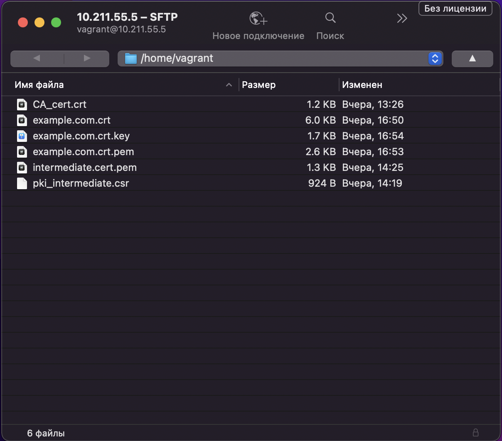
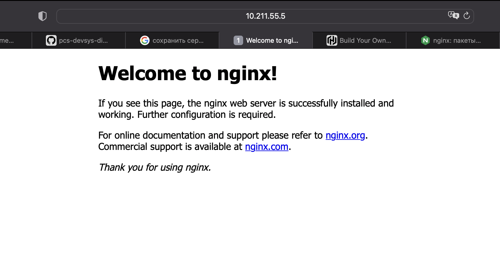

# Курсовая работа по итогам модуля "DevOps и системное администрирование"

Курсовая работа необходима для проверки практических навыков, полученных в ходе прохождения курса "DevOps и системное администрирование".

Мы создадим и настроим виртуальное рабочее место. Позже вы сможете использовать эту систему для выполнения домашних заданий по курсу

## Задание

1. Создайте виртуальную машину Linux.
2. Установите ufw и разрешите к этой машине сессии на порты 22 и 443, при этом трафик на интерфейсе localhost (lo) должен ходить свободно на все порты.
3. Установите hashicorp vault ([инструкция по ссылке](https://learn.hashicorp.com/tutorials/vault/getting-started-install?in=vault/getting-started#install-vault)).
4. Cоздайте центр сертификации по инструкции ([ссылка](https://learn.hashicorp.com/tutorials/vault/pki-engine?in=vault/secrets-management)) и выпустите сертификат для использования его в настройке веб-сервера nginx (срок жизни сертификата - месяц).
5. Установите корневой сертификат созданного центра сертификации в доверенные в хостовой системе.
6. Установите nginx.
7. По инструкции ([ссылка](https://nginx.org/en/docs/http/configuring_https_servers.html)) настройте nginx на https, используя ранее подготовленный сертификат:
  - можно использовать стандартную стартовую страницу nginx для демонстрации работы сервера;
  - можно использовать и другой html файл, сделанный вами;
8. Откройте в браузере на хосте https адрес страницы, которую обслуживает сервер nginx.
9. Создайте скрипт, который будет генерировать новый сертификат в vault:
  - генерируем новый сертификат так, чтобы не переписывать конфиг nginx;
  - перезапускаем nginx для применения нового сертификата.
10. Поместите скрипт в crontab, чтобы сертификат обновлялся какого-то числа каждого месяца в удобное для вас время.

## Результат

Создадим виртуальную машину.

```bash
 addzt@MacBook-Pro-Ivan  ~/vagrant_parallels  vagrant up --provider=parallels
Bringing machine 'default' up with 'parallels' provider...
==> default: Box 'mpasternak/focal64-arm' could not be found. Attempting to find and install...
    default: Box Provider: parallels
    default: Box Version: >= 0
==> default: Loading metadata for box 'mpasternak/focal64-arm'
    default: URL: https://vagrantcloud.com/mpasternak/focal64-arm
==> default: Adding box 'mpasternak/focal64-arm' (v202110.0.0) for provider: parallels
    default: Downloading: https://vagrantcloud.com/mpasternak/boxes/focal64-arm/versions/202110.0.0/providers/parallels.box
==> default: Successfully added box 'mpasternak/focal64-arm' (v202110.0.0) for 'parallels'!
==> default: Registering VM image from the base box 'mpasternak/focal64-arm'...
==> default: Creating new virtual machine as a linked clone of the box image...
==> default: Unregistering the box VM image...
==> default: Setting the default configuration for VM...
==> default: Checking if box 'mpasternak/focal64-arm' version '202110.0.0' is up to date...
==> default: Setting the name of the VM: vagrant_parallels_default_1647978904712_98389
==> default: Fixed port collision for 22 => 2222. Now on port 2201.
==> default: Preparing network interfaces based on configuration...
    default: Adapter 0: shared
==> default: Clearing any previously set network interfaces...
==> default: Booting VM...
==> default: Waiting for machine to boot. This may take a few minutes...
    default: SSH address: :22
    default: SSH username: vagrant
    default: SSH auth method: private key
    default: Warning: Connection refused. Retrying...
    default: 
    default: Vagrant insecure key detected. Vagrant will automatically replace
    default: this with a newly generated keypair for better security.
    default: 
    default: Inserting generated public key within guest...
    default: Removing insecure key from the guest if it's present...
    default: Key inserted! Disconnecting and reconnecting using new SSH key...
==> default: Machine booted and ready!
==> default: Checking for Parallels Tools installed on the VM...
==> default: Mounting shared folders...
    default: /vagrant => /Users/addzt/vagrant_parallels

```

Результатом курсовой работы должны быть снимки экрана или текст:

- Процесс установки и настройки ufw

```bash
vagrant@vagrant:~$ sudo apt install ufw
Reading package lists... Done
Building dependency tree       
Reading state information... Done
The following packages will be upgraded:
  ufw
1 upgraded, 0 newly installed, 0 to remove and 38 not upgraded.
Need to get 147 kB of archives.
After this operation, 3,072 B of additional disk space will be used.
Get:1 http://pl.ports.ubuntu.com/ubuntu-ports focal-updates/main arm64 ufw all 0.36-6ubuntu1 [147 kB]
Fetched 147 kB in 2s (95.5 kB/s)
Preconfiguring packages ...
(Reading database ... 120935 files and directories currently installed.)
Preparing to unpack .../ufw_0.36-6ubuntu1_all.deb ...
Unpacking ufw (0.36-6ubuntu1) over (0.36-6) ...
Setting up ufw (0.36-6ubuntu1) ...
Processing triggers for man-db (2.9.1-1) ...
Processing triggers for rsyslog (8.2001.0-1ubuntu1.1) ...
Processing triggers for systemd (245.4-4ubuntu3.15) ...
```

Проверим текущий статус:

```bash
vagrant@vagrant:~$ sudo ufw status verbose
Status: inactive
```

Включим `ufw`.

```bash
vagrant@vagrant:~$ sudo ufw enable
Command may disrupt existing ssh connections. Proceed with operation (y|n)? y
Firewall is active and enabled on system startup
vagrant@vagrant:~$ sudo ufw status verbose
Status: active
Logging: on (low)
Default: deny (incoming), allow (outgoing), disabled (routed)
New profiles: skip
vagrant@vagrant:~$ sudo ufw default deny incoming
vagrant@vagrant:~$ sudo ufw default allow outgoing
```

Откроем `22` и `443` порт.

```bash
vagrant@vagrant:~$ sudo ufw allow ssh
Rule added
Rule added (v6)
vagrant@vagrant:~$ sudo ufw allow https
Rule added
Rule added (v6)
```

Трафик на интерфейсе localhost (lo) должен ходить свободно на все порты.

```bash
vagrant@vagrant:~$ sudo ufw allow from 127.0.0.1/8
WARN: Rule changed after normalization
Rule added
```

Посмотрим статус.

```bash
vagrant@vagrant:~$ sudo ufw status
Status: active

To                         Action      From
--                         ------      ----
22/tcp                     ALLOW       Anywhere                  
443/tcp                    ALLOW       Anywhere                  
Anywhere                   ALLOW       127.0.0.0/8               
22/tcp (v6)                ALLOW       Anywhere (v6)             
443/tcp (v6)               ALLOW       Anywhere (v6)             
```

- Процесс установки и выпуска сертификата с помощью hashicorp vault
```bash
vagrant@vagrant:~$ curl -fsSL https://apt.releases.hashicorp.com/gpg | sudo apt-key add -
OK
vagrant@vagrant:~$ sudo apt-add-repository "deb [arch=arm64] https://apt.releases.hashicorp.com $(lsb_release -cs) main"
Hit:1 http://pl.ports.ubuntu.com/ubuntu-ports focal InRelease      
Get:2 http://pl.ports.ubuntu.com/ubuntu-ports focal-updates InRelease [114 kB]
Hit:3 http://pl.ports.ubuntu.com/ubuntu-ports focal-backports InRelease       
Hit:4 http://pl.ports.ubuntu.com/ubuntu-ports focal-security InRelease
Get:5 http://pl.ports.ubuntu.com/ubuntu-ports focal-updates/main Translation-en [316 kB]
Get:6 http://pl.ports.ubuntu.com/ubuntu-ports focal-updates/universe arm64 Packages [860 kB]
Get:7 http://pl.ports.ubuntu.com/ubuntu-ports focal-updates/universe Translation-en [203 kB]             
Hit:8 https://apt.releases.hashicorp.com focal InRelease                                                 
Get:9 https://apt.releases.hashicorp.com focal/main arm64 Packages [5,104 B]
Fetched 1,498 kB in 6s (239 kB/s)                                                                                                                                                                                                                   
Reading package lists... Done
W: Target Packages (main/binary-all/Packages) is configured multiple times in /etc/apt/sources.list:50 and /etc/apt/sources.list:52
W: Target Translations (main/i18n/Translation-en_US) is configured multiple times in /etc/apt/sources.list:50 and /etc/apt/sources.list:52
W: Target Translations (main/i18n/Translation-en) is configured multiple times in /etc/apt/sources.list:50 and /etc/apt/sources.list:52
W: Target CNF (main/cnf/Commands-arm64) is configured multiple times in /etc/apt/sources.list:50 and /etc/apt/sources.list:52
W: Target CNF (main/cnf/Commands-all) is configured multiple times in /etc/apt/sources.list:50 and /etc/apt/sources.list:52
W: Target Packages (main/binary-all/Packages) is configured multiple times in /etc/apt/sources.list:50 and /etc/apt/sources.list:52
W: Target Translations (main/i18n/Translation-en_US) is configured multiple times in /etc/apt/sources.list:50 and /etc/apt/sources.list:52
W: Target Translations (main/i18n/Translation-en) is configured multiple times in /etc/apt/sources.list:50 and /etc/apt/sources.list:52
W: Target CNF (main/cnf/Commands-arm64) is configured multiple times in /etc/apt/sources.list:50 and /etc/apt/sources.list:52
W: Target CNF (main/cnf/Commands-all) is configured multiple times in /etc/apt/sources.list:50 and /etc/apt/sources.list:52
vagrant@vagrant:~$ sudo apt-get update && sudo apt-get install vault
Hit:1 http://pl.ports.ubuntu.com/ubuntu-ports focal InRelease
Hit:2 http://pl.ports.ubuntu.com/ubuntu-ports focal-updates InRelease             
Hit:3 https://apt.releases.hashicorp.com focal InRelease                          
Hit:4 http://pl.ports.ubuntu.com/ubuntu-ports focal-backports InRelease
Hit:5 http://pl.ports.ubuntu.com/ubuntu-ports focal-security InRelease
Reading package lists... Done
W: Target Packages (main/binary-all/Packages) is configured multiple times in /etc/apt/sources.list:50 and /etc/apt/sources.list:52
W: Target Translations (main/i18n/Translation-en_US) is configured multiple times in /etc/apt/sources.list:50 and /etc/apt/sources.list:52
W: Target Translations (main/i18n/Translation-en) is configured multiple times in /etc/apt/sources.list:50 and /etc/apt/sources.list:52
W: Target CNF (main/cnf/Commands-arm64) is configured multiple times in /etc/apt/sources.list:50 and /etc/apt/sources.list:52
W: Target CNF (main/cnf/Commands-all) is configured multiple times in /etc/apt/sources.list:50 and /etc/apt/sources.list:52
W: Target Packages (main/binary-all/Packages) is configured multiple times in /etc/apt/sources.list:50 and /etc/apt/sources.list:52
W: Target Translations (main/i18n/Translation-en_US) is configured multiple times in /etc/apt/sources.list:50 and /etc/apt/sources.list:52
W: Target Translations (main/i18n/Translation-en) is configured multiple times in /etc/apt/sources.list:50 and /etc/apt/sources.list:52
W: Target CNF (main/cnf/Commands-arm64) is configured multiple times in /etc/apt/sources.list:50 and /etc/apt/sources.list:52
W: Target CNF (main/cnf/Commands-all) is configured multiple times in /etc/apt/sources.list:50 and /etc/apt/sources.list:52
Reading package lists... Done
Building dependency tree       
Reading state information... Done
The following NEW packages will be installed:
  vault
0 upgraded, 1 newly installed, 0 to remove and 38 not upgraded.
Need to get 64.8 MB of archives.
After this operation, 184 MB of additional disk space will be used.
Get:1 https://apt.releases.hashicorp.com focal/main arm64 vault arm64 1.9.4 [64.8 MB]
Fetched 64.8 MB in 24s (2,754 kB/s)                                                                                                                                                                                                                 
Selecting previously unselected package vault.
(Reading database ... 120935 files and directories currently installed.)
Preparing to unpack .../archives/vault_1.9.4_arm64.deb ...
Unpacking vault (1.9.4) ...
Setting up vault (1.9.4) ...
Generating Vault TLS key and self-signed certificate...
Generating a RSA private key
.............................................................................................++++
............................++++
writing new private key to 'tls.key'
-----
Vault TLS key and self-signed certificate have been generated in '/opt/vault/tls'.
```

Проверим:

```bash
vagrant@vagrant:~$ vault
Usage: vault <command> [args]

Common commands:
    read        Read data and retrieves secrets
    write       Write data, configuration, and secrets
    delete      Delete secrets and configuration
    list        List data or secrets
    login       Authenticate locally
    agent       Start a Vault agent
    server      Start a Vault server
    status      Print seal and HA status
    unwrap      Unwrap a wrapped secret

Other commands:
    audit          Interact with audit devices
    auth           Interact with auth methods
    debug          Runs the debug command
    kv             Interact with Vault's Key-Value storage
    lease          Interact with leases
    monitor        Stream log messages from a Vault server
    namespace      Interact with namespaces
    operator       Perform operator-specific tasks
    path-help      Retrieve API help for paths
    plugin         Interact with Vault plugins and catalog
    policy         Interact with policies
    print          Prints runtime configurations
    secrets        Interact with secrets engines
    ssh            Initiate an SSH session
    token          Interact with tokens
```

Установка `jq`.

```bash
vagrant@vagrant:~$ sudo apt install jq
Reading package lists... Done
Building dependency tree       
Reading state information... Done
The following additional packages will be installed:
  libjq1 libonig5
The following NEW packages will be installed:
  jq libjq1 libonig5
0 upgraded, 3 newly installed, 0 to remove and 38 not upgraded.
Need to get 291 kB of archives.
After this operation, 1,022 kB of additional disk space will be used.
Do you want to continue? [Y/n] y
Get:1 http://pl.ports.ubuntu.com/ubuntu-ports focal/universe arm64 libonig5 arm64 6.9.4-1 [134 kB]
Get:2 http://pl.ports.ubuntu.com/ubuntu-ports focal-updates/universe arm64 libjq1 arm64 1.6-1ubuntu0.20.04.1 [107 kB]
Get:3 http://pl.ports.ubuntu.com/ubuntu-ports focal-updates/universe arm64 jq arm64 1.6-1ubuntu0.20.04.1 [49.6 kB]
Fetched 291 kB in 1s (455 kB/s) 
Selecting previously unselected package libonig5:arm64.
(Reading database ... 120941 files and directories currently installed.)
Preparing to unpack .../libonig5_6.9.4-1_arm64.deb ...
Unpacking libonig5:arm64 (6.9.4-1) ...
Selecting previously unselected package libjq1:arm64.
Preparing to unpack .../libjq1_1.6-1ubuntu0.20.04.1_arm64.deb ...
Unpacking libjq1:arm64 (1.6-1ubuntu0.20.04.1) ...
Selecting previously unselected package jq.
Preparing to unpack .../jq_1.6-1ubuntu0.20.04.1_arm64.deb ...
Unpacking jq (1.6-1ubuntu0.20.04.1) ...
Setting up libonig5:arm64 (6.9.4-1) ...
Setting up libjq1:arm64 (1.6-1ubuntu0.20.04.1) ...
Setting up jq (1.6-1ubuntu0.20.04.1) ...
Processing triggers for man-db (2.9.1-1) ...
Processing triggers for libc-bin (2.31-0ubuntu9.7) ...
```

В другой сессии запустим `vault` с `root` в качестве корневого токена.

```bash
vagrant@vagrant:~$ vault server -dev -dev-root-token-id=root
==> Vault server configuration:

             Api Address: http://127.0.0.1:8200
                     Cgo: disabled
         Cluster Address: https://127.0.0.1:8201
              Go Version: go1.17.7
              Listener 1: tcp (addr: "127.0.0.1:8200", cluster address: "127.0.0.1:8201", max_request_duration: "1m30s", max_request_size: "33554432", tls: "disabled")
               Log Level: info
                   Mlock: supported: true, enabled: false
           Recovery Mode: false
                 Storage: inmem
                 Version: Vault v1.9.4
             Version Sha: fcbe948b2542a13ee8036ad07dd8ebf8554f56cb

==> Vault server started! Log data will stream in below:

2022-03-23T10:05:16.742Z [INFO]  proxy environment: http_proxy="" https_proxy="" no_proxy=""
2022-03-23T10:05:16.742Z [WARN]  no `api_addr` value specified in config or in VAULT_API_ADDR; falling back to detection if possible, but this value should be manually set
2022-03-23T10:05:16.742Z [INFO]  core: Initializing VersionTimestamps for core
2022-03-23T10:05:16.743Z [INFO]  core: security barrier not initialized
2022-03-23T10:05:16.744Z [INFO]  core: security barrier initialized: stored=1 shares=1 threshold=1
2022-03-23T10:05:16.744Z [INFO]  core: post-unseal setup starting
2022-03-23T10:05:16.746Z [INFO]  core: loaded wrapping token key
2022-03-23T10:05:16.746Z [INFO]  core: Recorded vault version: vault version=1.9.4 upgrade time="2022-03-23 10:05:16.746876029 +0000 UTC m=+0.040067744"
2022-03-23T10:05:16.746Z [INFO]  core: successfully setup plugin catalog: plugin-directory=""
2022-03-23T10:05:16.746Z [INFO]  core: no mounts; adding default mount table
2022-03-23T10:05:16.747Z [INFO]  core: successfully mounted backend: type=cubbyhole path=cubbyhole/
2022-03-23T10:05:16.748Z [INFO]  core: successfully mounted backend: type=system path=sys/
2022-03-23T10:05:16.748Z [INFO]  core: successfully mounted backend: type=identity path=identity/
2022-03-23T10:05:16.749Z [INFO]  core: successfully enabled credential backend: type=token path=token/
2022-03-23T10:05:16.750Z [INFO]  rollback: starting rollback manager
2022-03-23T10:05:16.750Z [INFO]  core: restoring leases
2022-03-23T10:05:16.751Z [INFO]  expiration: lease restore complete
2022-03-23T10:05:16.753Z [INFO]  identity: entities restored
2022-03-23T10:05:16.753Z [INFO]  identity: groups restored
2022-03-23T10:05:16.753Z [INFO]  core: post-unseal setup complete
2022-03-23T10:05:16.753Z [INFO]  core: root token generated
2022-03-23T10:05:16.753Z [INFO]  core: pre-seal teardown starting
2022-03-23T10:05:16.753Z [INFO]  rollback: stopping rollback manager
2022-03-23T10:05:16.753Z [INFO]  core: pre-seal teardown complete
2022-03-23T10:05:16.753Z [INFO]  core.cluster-listener.tcp: starting listener: listener_address=127.0.0.1:8201
2022-03-23T10:05:16.753Z [INFO]  core.cluster-listener: serving cluster requests: cluster_listen_address=127.0.0.1:8201
2022-03-23T10:05:16.753Z [INFO]  core: post-unseal setup starting
2022-03-23T10:05:16.753Z [INFO]  core: loaded wrapping token key
2022-03-23T10:05:16.753Z [INFO]  core: successfully setup plugin catalog: plugin-directory=""
2022-03-23T10:05:16.753Z [INFO]  core: successfully mounted backend: type=system path=sys/
2022-03-23T10:05:16.753Z [INFO]  core: successfully mounted backend: type=identity path=identity/
2022-03-23T10:05:16.753Z [INFO]  core: successfully mounted backend: type=cubbyhole path=cubbyhole/
2022-03-23T10:05:16.754Z [INFO]  core: successfully enabled credential backend: type=token path=token/
2022-03-23T10:05:16.754Z [INFO]  rollback: starting rollback manager
2022-03-23T10:05:16.754Z [INFO]  core: restoring leases
2022-03-23T10:05:16.754Z [INFO]  expiration: lease restore complete
2022-03-23T10:05:16.754Z [INFO]  identity: entities restored
2022-03-23T10:05:16.754Z [INFO]  identity: groups restored
2022-03-23T10:05:16.754Z [INFO]  core: post-unseal setup complete
2022-03-23T10:05:16.754Z [INFO]  core: vault is unsealed
2022-03-23T10:05:16.755Z [INFO]  expiration: revoked lease: lease_id=auth/token/root/h96e7c42ec7786d14f840826de15de5747001dd5ba2132d7c6730f1d486f17e9e
2022-03-23T10:05:16.756Z [INFO]  core: successful mount: namespace="" path=secret/ type=kv
2022-03-23T10:05:16.766Z [INFO]  secrets.kv.kv_920a4eee: collecting keys to upgrade
2022-03-23T10:05:16.766Z [INFO]  secrets.kv.kv_920a4eee: done collecting keys: num_keys=1
2022-03-23T10:05:16.766Z [INFO]  secrets.kv.kv_920a4eee: upgrading keys finished
WARNING! dev mode is enabled! In this mode, Vault runs entirely in-memory
and starts unsealed with a single unseal key. The root token is already
authenticated to the CLI, so you can immediately begin using Vault.

You may need to set the following environment variable:

    $ export VAULT_ADDR='http://127.0.0.1:8200'

The unseal key and root token are displayed below in case you want to
seal/unseal the Vault or re-authenticate.

Unseal Key: R7AUWl6ZjUC8slZbVG/OYqoXke0MaOnBYq0WG/0SPJ0=
Root Token: root

Development mode should NOT be used in production installations!
```

Экспортируем переменную среды для vault CLI для обращения к серверу.

```bash
export VAULT_ADDR=http://127.0.0.1:8200
```

Экспортируем переменную среды для vault CLI для аутентификации на сервере.

```bash
vagrant@vagrant:~$ export VAULT_TOKEN=root
```

**Создание корневого центра сертификации (root CA)**

```bash
vagrant@vagrant:~$ vault secrets enable pki
Success! Enabled the pki secrets engine at: pki/
vagrant@vagrant:~$ vault secrets tune -max-lease-ttl=87600h pki
Success! Tuned the secrets engine at: pki/
vagrant@vagrant:~$ vault write -field=certificate pki/root/generate/internal \
>      common_name="example.com" \
>      ttl=87600h > CA_cert.crt
vagrant@vagrant:~$ vault write pki/config/urls \
>      issuing_certificates="$VAULT_ADDR/v1/pki/ca" \
>      crl_distribution_points="$VAULT_ADDR/v1/pki/crl"
Success! Data written to: pki/config/urls
vagrant@vagrant:~$ cat CA_cert.crt
-----BEGIN CERTIFICATE-----
MIIDNTCCAh2gAwIBAgIUO/GJzIV0LxvryOvVC0yMeemHMlMwDQYJKoZIhvcNAQEL
BQAwFjEUMBIGA1UEAxMLZXhhbXBsZS5jb20wHhcNMjIwMzIzMTAyNTM3WhcNMzIw
MzIwMTAyNjA3WjAWMRQwEgYDVQQDEwtleGFtcGxlLmNvbTCCASIwDQYJKoZIhvcN
AQEBBQADggEPADCCAQoCggEBAPhd2kUYJWTwECOItjYP3GyPNLIKUHykNyJiyXwg
R+IaJBmR6oh+2tzNjvL3O0ilzA65vKqfHGO1Eno6b6ljkeOQPT+8sjBA6NuZIF+o
61SNon4dkuI0T2DfNlSrnjFSfCVUix2t7766N37t3raD89PwPzZoHDjaq98DLqEc
Nxrq+mj2SFu9aWoRQnhjSnLIzlstr6lyvuRuw4U0DhGOFRRxlWt5WRV41ZD1Eo5Q
CaUVqT+p64AD5Yr1pizaB6cX3EGGks0JHYVhX9/rgtzRs6jmne/sTwqL0xokR2Jr
+xDL3OQojaWKt8XG3WnoSefA/CzaShYkNTzNCNkkyqXjNWUCAwEAAaN7MHkwDgYD
VR0PAQH/BAQDAgEGMA8GA1UdEwEB/wQFMAMBAf8wHQYDVR0OBBYEFIkAXVvzNfI/
G4qR8l6GBKrz1emBMB8GA1UdIwQYMBaAFIkAXVvzNfI/G4qR8l6GBKrz1emBMBYG
A1UdEQQPMA2CC2V4YW1wbGUuY29tMA0GCSqGSIb3DQEBCwUAA4IBAQDgSmZB5hrm
NLUIoSHmSCI/8F3eQ3QOGg5qG0jNZN50VXgAYkqAnUv6afF3UdH0XsNDHF4QXYu0
LWlRWdn97qjwCTKAaAIV5UjZxY1D/0xO7lj+utfEF6NvTalVCdQZ/gYlLUdH+nRR
hK87vs9L7eVlLRl1JWjYUiOhtLm/yw5N+6vNwBrTENyA0svXbNkWMl07naH3J8fA
j7OWx0fw0qR5xmIhyU5tg0/wF8a0kqBRamhChI81k6PqKkWyPiAU9ZyTKtOmncWd
tINRr3K6MifmGgNkmCTLeAIIQQjGHKyPCgfubh6se6UQK/8Da2KUeI7A0FBb2Gyb
U0PC90EWyXTj
-----END CERTIFICATE-----vagrant@vagrant:~$ 
```

**Создание промежуточного центра сертификации (intermediate CA)** 

```bash
vagrant@vagrant:~$ vault secrets enable -path=pki_int pki
Success! Enabled the pki secrets engine at: pki_int/
vagrant@vagrant:~$ vault secrets tune -max-lease-ttl=43800h pki_int
Success! Tuned the secrets engine at: pki_int/
vagrant@vagrant:~$ vault write -format=json pki_int/intermediate/generate/internal \
>      common_name="example.com Intermediate Authority" \
>      | jq -r '.data.csr' > pki_intermediate.csr
```

Проверим.

```bash
vagrant@vagrant:~$ cat pki_intermediate.csr
-----BEGIN CERTIFICATE REQUEST-----
MIICcjCCAVoCAQAwLTErMCkGA1UEAxMiZXhhbXBsZS5jb20gSW50ZXJtZWRpYXRl
IEF1dGhvcml0eTCCASIwDQYJKoZIhvcNAQEBBQADggEPADCCAQoCggEBALzleGui
oHH1RfGIhdsjrhxnZUsscphq8sKoChBIz1hUXq5vQW6dt2H1nxgJQ2JAmGzeF6xP
WZRTLE1HtHpwzFSv6/Vq8Nh1IJIMxapNNf6hrNbatL4M6JXcCS8V+wbt3y8uDb43
yBgRZ2wM3JbpkYRn/wdR96LP0mCFP+6xerKnQRoVmCvDo+Z1nmYY3zTRU+hiCNL9
6E94TDu4BgI0JCTBf4ALKbXu8hYpoCA/uZ4d9fjai+5MCA3wqYu6VeJZ29yIyu1Q
iQwUQGE185ZkAp26paHZzySCS5ZQVy6LEGkLtursGraKUUU0kBTcP9HgK9mzwI/a
ZJalhIvfVindzJUCAwEAAaAAMA0GCSqGSIb3DQEBCwUAA4IBAQBhlPojNtTghWU4
Vjz/2SB+QPLHWivRCTJvGS5vZHK1aPcqIME/An6+irdR4pmvqgZhvD8JGEHnJI3A
l27uaM4HbvtAx7e+cFotP3hzfa3eEknlfpJ07ZmIcePvOUTiijLVIedcWYVRn6kU
XOOd+HN1Vr9Nk9prS3Ay5I4iFPD7ff/EhGcUVvb9x5SOQkijZD/YNshdYBVd3ljy
HHEfpNI25+ixCC7tmQe0YMWUILjk8a/LqJJM5jS3miCP9vhYEBaKqMUvKomruMHy
TAn/5kdMEelYvlkYKZA2W7td2JC/La7tWbToNyF7zAKAqxCoCFstwr1tCodlezU3
gyzv7TQY
-----END CERTIFICATE REQUEST-----
```

Подпишем.

```bash
vault write -format=json pki/root/sign-intermediate csr=@pki_intermediate.csr \
     format=pem_bundle ttl="43800h" \
     | jq -r '.data.certificate' > intermediate.cert.pem
```

Импортируем обратно в `vault`.

```bash
vagrant@vagrant:~$ vault write pki_int/intermediate/set-signed certificate=@intermediate.cert.pem
Success! Data written to: pki_int/intermediate/set-signed
```

**Создадим роль**

`Роль` — это логическое имя, которое соответствует политике, используемой для создания этих учетных данных. Это позволяет параметрам конфигурации контролировать общие имена сертификатов, альтернативные имена, использование ключей, для которых они действительны, и многое другое.

Параметры:

* `allowed_domains` - Указывает домены роли (используются с опциями `allow_bare_domains` и `allow-subdomains`);  

* `allow_bare_domains` - Указывает, могут ли клиенты запрашивать сертификаты, соответствующие значению самих фактических доменов;

* `allow_subdomains` - Указывает, могут ли клиенты запрашивать сертификаты с CN, которые являются субдоменами CN, разрешенными другими параметрами роли (Сюда входят субдомены с подстановочными знаками);

* `allow_glob_domains` - Позволяет именам, указанным в `allow_domains`, содержать шаблоны подстановок (например, ftp*.example.com) 

```bash
vagrant@vagrant:~$ vault write pki_int/roles/example-dot-com allowed_domains="example.com" allow_bare_domains=true allow_subdomains=true max_ttl="720h"
Success! Data written to: pki_int/roles/example-dot-com
vagrant@vagrant:~$ vault write -format=json pki_int/issue/example-dot-com common_name="example.com" ttl="720h" > /home/vagrant/example.com.crt
```

Запросим новый сертификат.

```bash
vagrant@vagrant:~$ vault write -format=json pki_int/issue/example-dot-com common_name="example.com" ttl="720h" > /home/vagrant/example.com.crt
```

Преобразуем.

```bash
vagrant@vagrant:~$ cat example.com.crt | jq -r .data.certificate > example.com.crt.pem
vagrant@vagrant:~$ cat example.com.crt | jq -r .data.issuing_ca >> example.com.crt.pem
vagrant@vagrant:~$ cat example.com.crt | jq -r .data.private_key > example.com.crt.key
```

Выгрузим сертификаты через `Cyberduck`.



- Процесс установки и настройки сервера nginx

```bash
vagrant@vagrant:~$ sudo apt install nginx
Reading package lists... Done
Building dependency tree       
Reading state information... Done
The following additional packages will be installed:
  fontconfig-config fonts-dejavu-core libfontconfig1 libgd3 libjbig0 libjpeg-turbo8 libjpeg8 libnginx-mod-http-image-filter libnginx-mod-http-xslt-filter libnginx-mod-mail libnginx-mod-stream libtiff5 libwebp6 libxpm4 libxslt1.1 nginx-common
  nginx-core
Suggested packages:
 libgd-tools fcgiwrap nginx-doc ssl-cert
The following NEW packages will be installed:
  fontconfig-config fonts-dejavu-core libfontconfig1 libgd3 libjbig0 libjpeg-turbo8 libjpeg8 libnginx-mod-http-image-filter libnginx-mod-http-xslt-filter libnginx-mod-mail libnginx-mod-stream libtiff5 libwebp6 libxpm4 libxslt1.1 nginx
  nginx-common nginx-core
0 upgraded, 18 newly installed, 0 to remove and 38 not upgraded.
Need to get 2,471 kB of archives.
After this operation, 7,888 kB of additional disk space will be used.
Do you want to continue? [Y/n] y
Get:1 http://pl.ports.ubuntu.com/ubuntu-ports focal/main arm64 fonts-dejavu-core all 2.37-1 [1,041 kB]
Get:2 http://pl.ports.ubuntu.com/ubuntu-ports focal/main arm64 fontconfig-config all 2.13.1-2ubuntu3 [28.8 kB]
Get:3 http://pl.ports.ubuntu.com/ubuntu-ports focal/main arm64 libfontconfig1 arm64 2.13.1-2ubuntu3 [111 kB]
Get:4 http://pl.ports.ubuntu.com/ubuntu-ports focal-updates/main arm64 libjpeg-turbo8 arm64 2.0.3-0ubuntu1.20.04.1 [101 kB]
Get:5 http://pl.ports.ubuntu.com/ubuntu-ports focal/main arm64 libjpeg8 arm64 8c-2ubuntu8 [2,198 B]
Get:6 http://pl.ports.ubuntu.com/ubuntu-ports focal/main arm64 libjbig0 arm64 2.1-3.1build1 [24.0 kB]
Get:7 http://pl.ports.ubuntu.com/ubuntu-ports focal-updates/main arm64 libwebp6 arm64 0.6.1-2ubuntu0.20.04.1 [167 kB]
Get:8 http://pl.ports.ubuntu.com/ubuntu-ports focal-updates/main arm64 libtiff5 arm64 4.1.0+git191117-2ubuntu0.20.04.2 [151 kB]
Get:9 http://pl.ports.ubuntu.com/ubuntu-ports focal/main arm64 libxpm4 arm64 1:3.5.12-1 [28.8 kB]
Get:10 http://pl.ports.ubuntu.com/ubuntu-ports focal-updates/main arm64 libgd3 arm64 2.2.5-5.2ubuntu2.1 [107 kB]
Get:11 http://pl.ports.ubuntu.com/ubuntu-ports focal-updates/main arm64 nginx-common all 1.18.0-0ubuntu1.2 [37.5 kB]
Get:12 http://pl.ports.ubuntu.com/ubuntu-ports focal-updates/main arm64 libnginx-mod-http-image-filter arm64 1.18.0-0ubuntu1.2 [13.8 kB]
Get:13 http://pl.ports.ubuntu.com/ubuntu-ports focal/main arm64 libxslt1.1 arm64 1.1.34-4 [141 kB]
Get:14 http://pl.ports.ubuntu.com/ubuntu-ports focal-updates/main arm64 libnginx-mod-http-xslt-filter arm64 1.18.0-0ubuntu1.2 [12.5 kB]
Get:15 http://pl.ports.ubuntu.com/ubuntu-ports focal-updates/main arm64 libnginx-mod-mail arm64 1.18.0-0ubuntu1.2 [39.7 kB]
Get:16 http://pl.ports.ubuntu.com/ubuntu-ports focal-updates/main arm64 libnginx-mod-stream arm64 1.18.0-0ubuntu1.2 [63.2 kB]
Get:17 http://pl.ports.ubuntu.com/ubuntu-ports focal-updates/main arm64 nginx-core arm64 1.18.0-0ubuntu1.2 [399 kB]
Get:18 http://pl.ports.ubuntu.com/ubuntu-ports focal-updates/main arm64 nginx all 1.18.0-0ubuntu1.2 [3,620 B]
Fetched 2,471 kB in 2s (990 kB/s)
Preconfiguring packages ...
Selecting previously unselected package fonts-dejavu-core.
(Reading database ... 120958 files and directories currently installed.)
Preparing to unpack .../00-fonts-dejavu-core_2.37-1_all.deb ...
Unpacking fonts-dejavu-core (2.37-1) ...
Selecting previously unselected package fontconfig-config.
Preparing to unpack .../01-fontconfig-config_2.13.1-2ubuntu3_all.deb ...
Unpacking fontconfig-config (2.13.1-2ubuntu3) ...
Selecting previously unselected package libfontconfig1:arm64.
Preparing to unpack .../02-libfontconfig1_2.13.1-2ubuntu3_arm64.deb ...
Unpacking libfontconfig1:arm64 (2.13.1-2ubuntu3) ...
Selecting previously unselected package libjpeg-turbo8:arm64.
Preparing to unpack .../03-libjpeg-turbo8_2.0.3-0ubuntu1.20.04.1_arm64.deb ...
Unpacking libjpeg-turbo8:arm64 (2.0.3-0ubuntu1.20.04.1) ...
Selecting previously unselected package libjpeg8:arm64.
Preparing to unpack .../04-libjpeg8_8c-2ubuntu8_arm64.deb ...
Unpacking libjpeg8:arm64 (8c-2ubuntu8) ...
Selecting previously unselected package libjbig0:arm64.
Preparing to unpack .../05-libjbig0_2.1-3.1build1_arm64.deb ...
Unpacking libjbig0:arm64 (2.1-3.1build1) ...
Selecting previously unselected package libwebp6:arm64.
Preparing to unpack .../06-libwebp6_0.6.1-2ubuntu0.20.04.1_arm64.deb ...
Unpacking libwebp6:arm64 (0.6.1-2ubuntu0.20.04.1) ...
Selecting previously unselected package libtiff5:arm64.
Preparing to unpack .../07-libtiff5_4.1.0+git191117-2ubuntu0.20.04.2_arm64.deb ...
Unpacking libtiff5:arm64 (4.1.0+git191117-2ubuntu0.20.04.2) ...
Selecting previously unselected package libxpm4:arm64.
Preparing to unpack .../08-libxpm4_1%3a3.5.12-1_arm64.deb ...
Unpacking libxpm4:arm64 (1:3.5.12-1) ...
Selecting previously unselected package libgd3:arm64.
Preparing to unpack .../09-libgd3_2.2.5-5.2ubuntu2.1_arm64.deb ...
Unpacking libgd3:arm64 (2.2.5-5.2ubuntu2.1) ...
Selecting previously unselected package nginx-common.
Preparing to unpack .../10-nginx-common_1.18.0-0ubuntu1.2_all.deb ...
Unpacking nginx-common (1.18.0-0ubuntu1.2) ...
Selecting previously unselected package libnginx-mod-http-image-filter.
Preparing to unpack .../11-libnginx-mod-http-image-filter_1.18.0-0ubuntu1.2_arm64.deb ...
Unpacking libnginx-mod-http-image-filter (1.18.0-0ubuntu1.2) ...
Selecting previously unselected package libxslt1.1:arm64.
Preparing to unpack .../12-libxslt1.1_1.1.34-4_arm64.deb ...
Unpacking libxslt1.1:arm64 (1.1.34-4) ...
Selecting previously unselected package libnginx-mod-http-xslt-filter.
Preparing to unpack .../13-libnginx-mod-http-xslt-filter_1.18.0-0ubuntu1.2_arm64.deb ...
Unpacking libnginx-mod-http-xslt-filter (1.18.0-0ubuntu1.2) ...
Selecting previously unselected package libnginx-mod-mail.
Preparing to unpack .../14-libnginx-mod-mail_1.18.0-0ubuntu1.2_arm64.deb ...
Unpacking libnginx-mod-mail (1.18.0-0ubuntu1.2) ...
Selecting previously unselected package libnginx-mod-stream.
Preparing to unpack .../15-libnginx-mod-stream_1.18.0-0ubuntu1.2_arm64.deb ...
Unpacking libnginx-mod-stream (1.18.0-0ubuntu1.2) ...
Selecting previously unselected package nginx-core.
Preparing to unpack .../16-nginx-core_1.18.0-0ubuntu1.2_arm64.deb ...
Unpacking nginx-core (1.18.0-0ubuntu1.2) ...
Selecting previously unselected package nginx.
Preparing to unpack .../17-nginx_1.18.0-0ubuntu1.2_all.deb ...
Unpacking nginx (1.18.0-0ubuntu1.2) ...
Setting up libxpm4:arm64 (1:3.5.12-1) ...
Setting up nginx-common (1.18.0-0ubuntu1.2) ...
Created symlink /etc/systemd/system/multi-user.target.wants/nginx.service → /lib/systemd/system/nginx.service.
Setting up libjbig0:arm64 (2.1-3.1build1) ...
Setting up libwebp6:arm64 (0.6.1-2ubuntu0.20.04.1) ...
Setting up fonts-dejavu-core (2.37-1) ...
Setting up libjpeg-turbo8:arm64 (2.0.3-0ubuntu1.20.04.1) ...
Setting up libxslt1.1:arm64 (1.1.34-4) ...
Setting up libjpeg8:arm64 (8c-2ubuntu8) ...
Setting up libnginx-mod-mail (1.18.0-0ubuntu1.2) ...
Setting up fontconfig-config (2.13.1-2ubuntu3) ...
Setting up libnginx-mod-stream (1.18.0-0ubuntu1.2) ...
Setting up libnginx-mod-http-xslt-filter (1.18.0-0ubuntu1.2) ...
Setting up libtiff5:arm64 (4.1.0+git191117-2ubuntu0.20.04.2) ...
Setting up libfontconfig1:arm64 (2.13.1-2ubuntu3) ...
Setting up libgd3:arm64 (2.2.5-5.2ubuntu2.1) ...
Setting up libnginx-mod-http-image-filter (1.18.0-0ubuntu1.2) ...
Setting up nginx-core (1.18.0-0ubuntu1.2) ...
Setting up nginx (1.18.0-0ubuntu1.2) ...
Processing triggers for ufw (0.36-6ubuntu1) ...
Processing triggers for systemd (245.4-4ubuntu3.15) ...
Processing triggers for man-db (2.9.1-1) ...
Processing triggers for libc-bin (2.31-0ubuntu9.7) ...
```

```bash
vagrant@vagrant:~$ sudo ufw app list
Available applications:
  Nginx Full
  Nginx HTTP
  Nginx HTTPS
  OpenSSH
```

Активируем `Nginx full`.

```bash
vagrant@vagrant:~$ sudo ufw allow 'Nginx Full'
Rule added
Rule added (v6) 
```

```bash
vagrant@vagrant:~$ sudo ufw status
Status: active

To                         Action      From
--                         ------      ----
22/tcp                     ALLOW       Anywhere                  
443/tcp                    ALLOW       Anywhere                  
Anywhere                   ALLOW       127.0.0.0/8               
Nginx Full                 ALLOW       Anywhere                  
22/tcp (v6)                ALLOW       Anywhere (v6)             
443/tcp (v6)               ALLOW       Anywhere (v6)             
Nginx Full (v6)            ALLOW       Anywhere (v6)
```

Проверим статус службы `Nginx`.

```bash
vagrant@vagrant:~$ systemctl status nginx
● nginx.service - A high performance web server and a reverse proxy server
     Loaded: loaded (/lib/systemd/system/nginx.service; enabled; vendor preset: enabled)
     Active: active (running) since Thu 2022-03-24 06:31:14 UTC; 18min ago
       Docs: man:nginx(8)
   Main PID: 73628 (nginx)
      Tasks: 3 (limit: 2231)
     Memory: 4.8M
     CGroup: /system.slice/nginx.service
             ├─73628 nginx: master process /usr/sbin/nginx -g daemon on; master_process on;
             ├─73629 nginx: worker process
             └─73630 nginx: worker process

Mar 24 06:31:14 vagrant systemd[1]: Starting A high performance web server and a reverse proxy server...
Mar 24 06:31:14 vagrant systemd[1]: Started A high performance web server and a reverse proxy server.
```

Зайдем на web-сервер через браузер.



Создадим директорию для `example.com`.

```bash
vagrant@vagrant:~$ sudo mkdir -p /var/www/example.com/html
```

Назначим владение директорией.

```bash
sudo chown -R $USER:$USER /var/www/example.com/html
```

Изменим разрешения.

```bash
sudo chmod -R 755 /var/www/example.com
```

Создадим `index.html`

```bash
nano /var/www/example.com/html/index.html
```

```html
<html>
    <head>
        <tittle>My coursework!</tittle>
    </head>
    <body>
        <h1>Hello, World!</h1>
        <p></p>
    </body>
</html>
```

Изменим конфигурацию.

```bash
vagrant@vagrant:~$ sudo nano /etc/nginx/sites-available/example.com
```

```bash
server {

    listen 443 ssl;

    server_name example.com www.example.com;
    ssl_certificate /home/vagrant/example.com.crt.pem;
    ssl_certificate_key /home/vagrant/example.com.crt.key;

    root /var/www/example.com/html;
    index index.html 
    location / {
            try_files $uri $uri/ =404;
    }
}
```

Сделаем симлинк для запуска файла.

```bash
sudo ln -s /etc/nginx/sites-available/example.com /etc/nginx/sites-enabled/
```

Перезапустим `Nginx`.

```bash
sudo systemctl restart nginx
```

- Страница сервера nginx в браузере хоста не содержит предупреждений


- Скрипт генерации нового сертификата работает (сертификат сервера ngnix должен быть "зеленым")

```bash
#!/bin/bash

export VAULT_ADDR=http://127.0.0.1:8200
export VAULT_TOKEN=root

date

### удалить просроченные сертификаты
vault write pki_int/tidy tidy_cert_store=true tidy_revoked_certs=true

### сгенерировать новые сертификаты
if vault write -format=json pki_int/issue/example-dot-com common_name="example.com" ttl="720h" > /home/vagrant/example.com.crt
then
    echo  "получен новый сертификат"
else
    echo "ошибка"
fi

### собрать сертификат и ключ
cat example.com.crt | jq -r .data.certificate > example.com.crt.pem
cat example.com.crt | jq -r .data.issuing_ca >> example.com.crt.pem
cat example.com.crt | jq -r .data.private_key > example.com.crt.key

### проверка файла конфигурации и рестарт
sudo nginx -vt
if sudo systemctl restart nginx
then
    echo "успех"
else
    echo "ошибка"
fi
```

Запустим:

```bash
vagrant@vagrant:~$ sudo bash script.sh
Thu 24 Mar 2022 05:17:21 PM UTC
WARNING! The following warnings were returned from Vault:

  * Tidy operation successfully started. Any information from the operation
  will be printed to Vault's server logs.

получен новый сертификат
nginx version: nginx/1.18.0 (Ubuntu)
nginx: the configuration file /etc/nginx/nginx.conf syntax is ok
nginx: configuration file /etc/nginx/nginx.conf test is successful
успех
```

- Crontab работает (выберите число и время так, чтобы показать что crontab запускается и делает что надо)

```bash
vagrant@vagrant:~$ crontab -l
no crontab for vagrant
```

Изменим разрешения.

```bash
chmod ugo+x script.sh
```

Добавим скрипт в `crontab`.

```bash
vagrant@vagrant:~$ crontab -e
```

Запуск `cron` каждую минуту и запишем вывод в `something.log` для проверки.

```bash
* * * * * /home/vagrant/script.sh >>/home/vagrant/something.log
```

```bash
vagrant@vagrant:~$ nano something.log
Thu 24 Mar 2022 06:17:01 PM UTC
получен новый сертификат
успех
```