# Дипломный практикум в YandexCloud

  * [Цели:](#цели)
  * [Этапы выполнения:](#этапы-выполнения)
      * [Регистрация доменного имени](#регистрация-доменного-имени)
      * [Создание инфраструктуры](#создание-инфраструктуры)
          * [Установка Nginx и LetsEncrypt](#установка-nginx)
          * [Установка кластера MySQL](#установка-mysql)
          * [Установка WordPress](#установка-wordpress)
          * [Установка Gitlab CE, Gitlab Runner и настройка CI/CD](#установка-gitlab)
          * [Установка Prometheus, Alert Manager, Node Exporter и Grafana](#установка-prometheus)
  * [Что необходимо для сдачи задания?](#что-необходимо-для-сдачи-задания)
  * [Как правильно задавать вопросы дипломному руководителю?](#как-правильно-задавать-вопросы-дипломному-руководителю)

---
## Цели:

1. Зарегистрировать доменное имя (любое на ваш выбор в любой доменной зоне).
2. Подготовить инфраструктуру с помощью Terraform на базе облачного провайдера YandexCloud.
3. Настроить внешний Reverse Proxy на основе Nginx и LetsEncrypt.
4. Настроить кластер MySQL.
5. Установить WordPress.
6. Развернуть Gitlab CE и Gitlab Runner.
7. Настроить CI/CD для автоматического развёртывания приложения.
8. Настроить мониторинг инфраструктуры с помощью стека: Prometheus, Alert Manager и Grafana.

---
## Этапы выполнения:

### Регистрация доменного имени

Подойдет любое доменное имя на ваш выбор в любой доменной зоне.

ПРИМЕЧАНИЕ: Далее в качестве примера используется домен `you.domain` замените его вашим доменом.

Рекомендуемые регистраторы:
  - [nic.ru](https://nic.ru)
  - [reg.ru](https://reg.ru)

Цель:

1. Получить возможность выписывать [TLS сертификаты](https://letsencrypt.org) для веб-сервера.

Ожидаемые результаты:

1. У вас есть доступ к личному кабинету на сайте регистратора.
2. Вы зарегистрировали домен и можете им управлять (редактировать dns записи в рамках этого домена).

Зарегистрировал домен на `nic.ru`.


### Создание инфраструктуры

Для начала необходимо подготовить инфраструктуру в YC при помощи [Terraform](https://www.terraform.io/).

Особенности выполнения:

- Бюджет купона ограничен, что следует иметь в виду при проектировании инфраструктуры и использовании ресурсов;
- Следует использовать последнюю стабильную версию [Terraform](https://www.terraform.io/).

```bash
 addzt@MacBook-Pro-Ivan  ~/PycharmProjects/devops_homeworks/diplom/terraform   main ±✚  terraform -version
Terraform v1.3.0
on darwin_arm64
+ provider registry.terraform.io/hashicorp/local v2.2.3
+ provider registry.terraform.io/hashicorp/null v3.1.1
+ provider registry.terraform.io/yandex-cloud/yandex v0.78.1
```

Предварительная подготовка:

1. Создайте сервисный аккаунт, который будет в дальнейшем использоваться Terraform для работы с инфраструктурой с необходимыми и достаточными правами. Не стоит использовать права суперпользователя

```bash
addzt@MacBook-Pro-Ivan  ~  yc iam service-account create --name terraform-service                     
id: ***************
folder_id: ***************
created_at: ***************
name: terraform-service

---

addzt@MacBook-Pro-Ivan  ~  yc resource-manager folder add-access-binding addzt \            
--role editor \
--subject serviceAccount:**********
  
---

 addzt@MacBook-Pro-Ivan  ~  yc iam access-key create --service-account-name terraform-service

access_key:
  id: **********
  service_account_id: **********
  created_at: **********
  key_id: **********
secret: **********
```

2. Подготовьте [backend](https://www.terraform.io/docs/language/settings/backends/index.html) для Terraform:
   а. Рекомендуемый вариант: [Terraform Cloud](https://app.terraform.io/)  
   б. Альтернативный вариант: S3 bucket в созданном YC аккаунте.


3. Настройте [workspaces](https://www.terraform.io/docs/language/state/workspaces.html)
   а. Рекомендуемый вариант: создайте два workspace: *stage* и *prod*. В случае выбора этого варианта все последующие шаги должны учитывать факт существования нескольких workspace.  
   б. Альтернативный вариант: используйте один workspace, назвав его *stage*. Пожалуйста, не используйте workspace, создаваемый Terraform-ом по-умолчанию (*default*).


```bash
 addzt@MacBook-Pro-Ivan  ~/PycharmProjects/devops_homeworks/diplom/terraform   main ±✚  terraform workspace new stage
Created and switched to workspace "stage"!

You're now on a new, empty workspace. Workspaces isolate their state,
so if you run "terraform plan" Terraform will not see any existing state
for this configuration.
```

4. Создайте VPC с подсетями в разных зонах доступности.

```terraform
resource "yandex_vpc_subnet" "public-subnet" {
  name           = "public-subnet"
  v4_cidr_blocks = [var.cidr_blocks[1]]
  zone           = var.zone[1]
  network_id     = yandex_vpc_network.network_terraform.id
}

resource "yandex_vpc_route_table" "nat-instance-route" {
  network_id = yandex_vpc_network.network_terraform.id

  static_route {
    destination_prefix = var.dest_prefix
    next_hop_address   = yandex_compute_instance.virtual_machine-1.network_interface.0.ip_address
    }
}

resource "yandex_vpc_subnet" "private-subnet" {
  name           = "private-subnet"
  v4_cidr_blocks = [var.cidr_blocks[0]]
  zone           = var.zone[0]
  network_id     = yandex_vpc_network.network_terraform.id
  route_table_id = yandex_vpc_route_table.nat-instance-route.id
}
```

5. Убедитесь, что теперь вы можете выполнить команды `terraform destroy` и `terraform apply` без дополнительных ручных действий.

6. В случае использования [Terraform Cloud](https://app.terraform.io/) в качестве [backend](https://www.terraform.io/docs/language/settings/backends/index.html) убедитесь, что применение изменений успешно проходит, используя web-интерфейс Terraform cloud.

Цель:

1. Повсеместно применять IaaC подход при организации (эксплуатации) инфраструктуры.
2. Иметь возможность быстро создавать (а также удалять) виртуальные машины и сети. С целью экономии денег на вашем аккаунте в YandexCloud.

Ожидаемые результаты:

1. Terraform сконфигурирован и создание инфраструктуры посредством Terraform возможно без дополнительных ручных действий.
2. Полученная конфигурация инфраструктуры является предварительной, поэтому в ходе дальнейшего выполнения задания возможны изменения.

---
### Установка Nginx и LetsEncrypt

Необходимо разработать Ansible роль для установки Nginx и LetsEncrypt.

**Для получения LetsEncrypt сертификатов во время тестов своего кода пользуйтесь [тестовыми сертификатами](https://letsencrypt.org/docs/staging-environment/), так как количество запросов к боевым серверам LetsEncrypt [лимитировано](https://letsencrypt.org/docs/rate-limits/).**

Рекомендации:
  - Имя сервера: `you.domain`
  - Характеристики: 2vCPU, 2 RAM, External address (Public) и Internal address.

Цель:

1. Создать reverse proxy с поддержкой TLS для обеспечения безопасного доступа к веб-сервисам по HTTPS.

Ожидаемые результаты:

1. В вашей доменной зоне настроены все A-записи на внешний адрес этого сервера:
    - `https://www.you.domain` (WordPress)
    - `https://gitlab.you.domain` (Gitlab)
    - `https://grafana.you.domain` (Grafana)
    - `https://prometheus.you.domain` (Prometheus)
    - `https://alertmanager.you.domain` (Alert Manager)
2. Настроены все upstream для выше указанных URL, куда они сейчас ведут на этом шаге не важно, позже вы их отредактируете и укажите верные значения.
2. В браузере можно открыть любой из этих URL и увидеть ответ сервера (502 Bad Gateway). На текущем этапе выполнение задания это нормально!

<details>
<summary><strong>Terraform output</strong></summary> 

Outputs:
```bash
external_ip_address_virtual_machine-1_yandex_cloud = "external ip proxy-addzt: 84.201.164.144"
internal_ip_address_virtual_machine-1_yandex_cloud = "internal ip proxy-addzt: 192.168.16.10"
internal_ip_address_virtual_machine-2_yandex_cloud = [
  "internal ip db01-addzt: 192.168.15.11",
  "internal ip db02-addzt: 192.168.15.12",
  "internal ip app-addzt: 192.168.15.13",
  "internal ip gitlab-addzt: 192.168.15.14",
  "internal ip runner-addzt: 192.168.15.15",
"internal ip monitoring-addzt: 192.168.15.16",
```
</details>

<details>
<summary><strong>Отработка роли nginx</strong></summary>

```bash
null_resource.nginx (local-exec): Executing: ["/bin/sh" "-c" "ansible-playbook -i ../ansible/inventory.ini ../ansible/nginx/nginx.yml"]

null_resource.nginx (local-exec): PLAY [Install Nginx and LetsEncrypt] *******************************************

null_resource.nginx (local-exec): TASK [Gathering Facts] *********************************************************
null_resource.nginx (local-exec): ok: [addzt.ru]

null_resource.nginx (local-exec): TASK [nginx : Update system] ***************************************************
null_resource.nginx: Still creating... [10s elapsed]
null_resource.nginx: Still creating... [20s elapsed]
null_resource.nginx (local-exec): changed: [addzt.ru]

null_resource.nginx (local-exec): TASK [nginx : Install nginx and letsencrypt] ***********************************
null_resource.nginx: Still creating... [30s elapsed]
null_resource.nginx: Still creating... [40s elapsed]
null_resource.nginx: Still creating... [50s elapsed]
null_resource.nginx (local-exec): changed: [addzt.ru]

null_resource.nginx (local-exec): TASK [nginx : Install python3-certbot-nginx] ***********************************
null_resource.nginx: Still creating... [1m0s elapsed]
null_resource.nginx (local-exec): changed: [addzt.ru]

null_resource.nginx (local-exec): TASK [nginx : Remove default site] *********************************************
null_resource.nginx (local-exec): changed: [addzt.ru]

null_resource.nginx (local-exec): TASK [nginx : Create letsencrypt directory] ************************************
null_resource.nginx (local-exec): changed: [addzt.ru]

null_resource.nginx (local-exec): TASK [nginx : Create home directory for www] ***********************************
null_resource.nginx (local-exec): changed: [addzt.ru]

null_resource.nginx (local-exec): TASK [nginx : Check if certificate already exists] *****************************
null_resource.nginx (local-exec): ok: [addzt.ru]

null_resource.nginx (local-exec): TASK [nginx : Force generation of a new certificate] ***************************
null_resource.nginx: Still creating... [1m10s elapsed]
null_resource.nginx (local-exec): changed: [addzt.ru]

null_resource.nginx (local-exec): TASK [nginx : Enable nginx.conf] ***********************************************
null_resource.nginx (local-exec): changed: [addzt.ru]

null_resource.nginx (local-exec): TASK [nginx : Enable domain.conf] **********************************************
null_resource.nginx: Still creating... [1m20s elapsed]
null_resource.nginx (local-exec): changed: [addzt.ru]

null_resource.nginx (local-exec): RUNNING HANDLER [nginx : Nginx systemd] ****************************************
null_resource.nginx (local-exec): ok: [addzt.ru]

null_resource.nginx (local-exec): RUNNING HANDLER [nginx : Nginx restart] ****************************************
null_resource.nginx (local-exec): changed: [addzt.ru]

null_resource.nginx (local-exec): PLAY RECAP *********************************************************************
null_resource.nginx (local-exec): addzt.ru                   : ok=13   changed=10   unreachable=0    failed=0    skipped=0    rescued=0    ignored=0
```

</details>


**Результат**

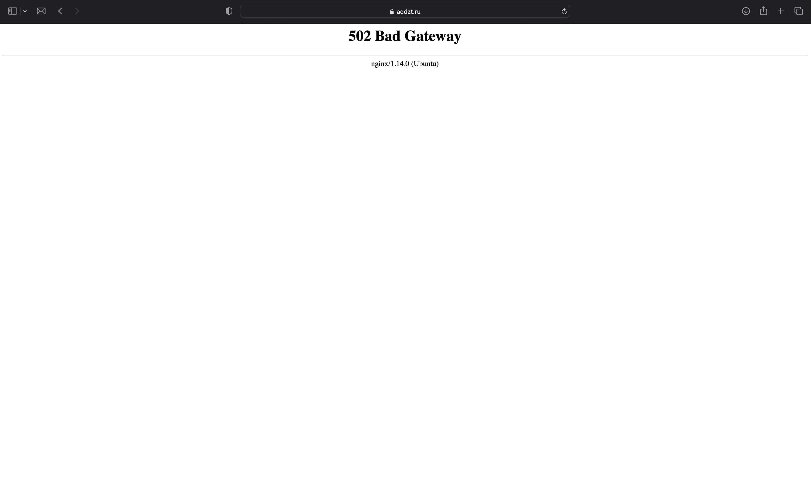

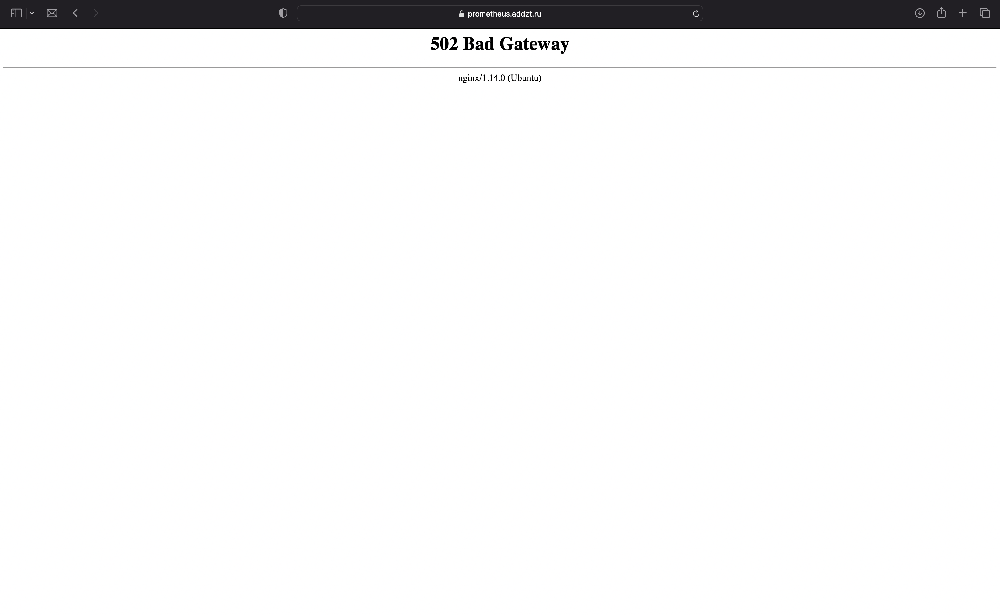
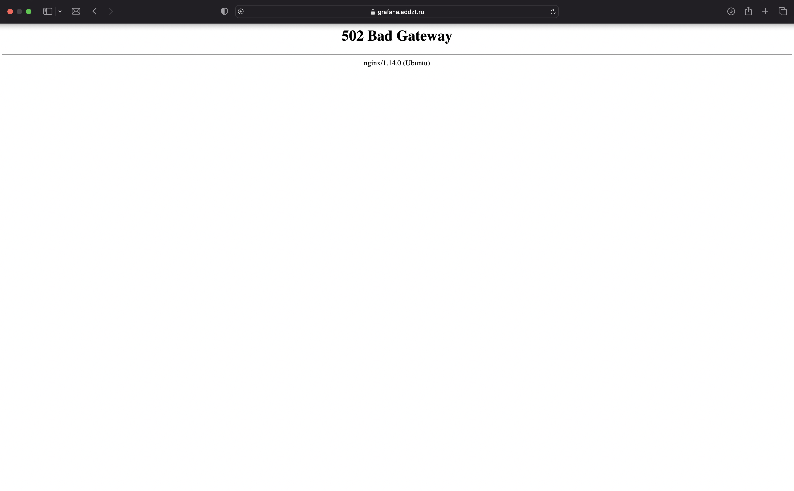
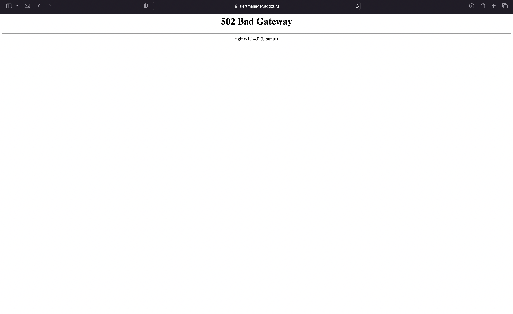

**Сертификат**

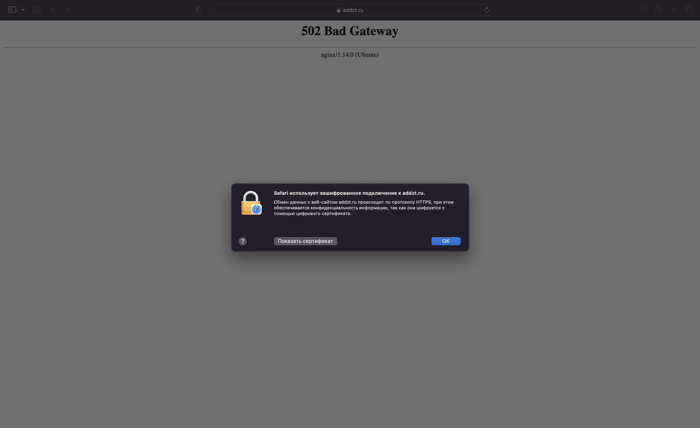
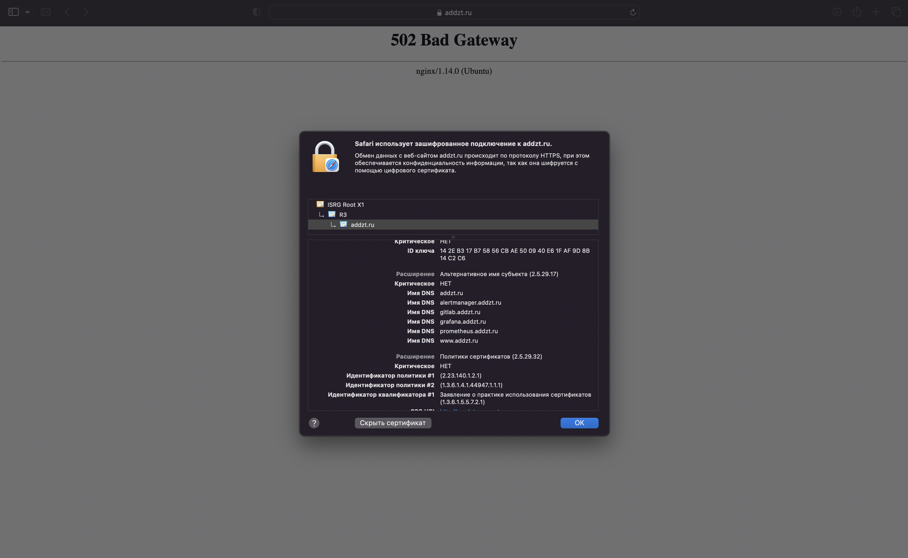
___

### Установка кластера MySQL

Необходимо разработать Ansible роль для установки кластера MySQL.

Рекомендации:
  - Имена серверов: `db01.you.domain` и `db02.you.domain`
  - Характеристики: 4vCPU, 4 RAM, Internal address.

Цель:

1. Получить отказоустойчивый кластер баз данных MySQL.

Ожидаемые результаты:

1. MySQL работает в режиме репликации Master/Slave.
2. В кластере автоматически создаётся база данных c именем `wordpress`.
3. В кластере автоматически создаётся пользователь `wordpress` с полными правами на базу `wordpress` и паролем `wordpress`.

**Вы должны понимать, что в рамках обучения это допустимые значения, но в боевой среде использование подобных значений не приемлимо! Считается хорошей практикой использовать логины и пароли повышенного уровня сложности. В которых будут содержаться буквы верхнего и нижнего регистров, цифры, а также специальные символы!**

<details>
<summary><strong>Отработка роли db</strong></summary>

```bash
PLAY [Install MySQL] ********************************************************************************************************************************************************************************************************************************

TASK [Gathering Facts] ******************************************************************************************************************************************************************************************************************************
ok: [db01.addzt.ru]
ok: [db02.addzt.ru]

TASK [db : Update system] ***************************************************************************************************************************************************************************************************************************
changed: [db01.addzt.ru]
changed: [db02.addzt.ru]

TASK [db : Install MySQL] ***************************************************************************************************************************************************************************************************************************
changed: [db02.addzt.ru] => (item=mysql-server)
changed: [db01.addzt.ru] => (item=mysql-server)
changed: [db02.addzt.ru] => (item=mysql-client)
changed: [db01.addzt.ru] => (item=mysql-client)
changed: [db02.addzt.ru] => (item=python3-mysqldb)
changed: [db01.addzt.ru] => (item=python3-mysqldb)
changed: [db02.addzt.ru] => (item=libmysqlclient-dev)
changed: [db01.addzt.ru] => (item=libmysqlclient-dev)

TASK [db : Start MySQL service] *********************************************************************************************************************************************************************************************************************
ok: [db01.addzt.ru]
ok: [db02.addzt.ru]

TASK [db : Delete MySQL default database] ***********************************************************************************************************************************************************************************************************
ok: [db01.addzt.ru]
ok: [db02.addzt.ru]

TASK [db : Create new database] *********************************************************************************************************************************************************************************************************************
changed: [db01.addzt.ru]
changed: [db02.addzt.ru]

TASK [db : Create MySQL user] ***********************************************************************************************************************************************************************************************************************
changed: [db01.addzt.ru]
changed: [db02.addzt.ru]

TASK [db : Enable remote login to mysql] ************************************************************************************************************************************************************************************************************
changed: [db01.addzt.ru]
changed: [db02.addzt.ru]

TASK [db : Copy master.cnf] *************************************************************************************************************************************************************************************************************************
skipping: [db02.addzt.ru]
changed: [db01.addzt.ru]

TASK [db : Copy slave.cnf] **************************************************************************************************************************************************************************************************************************
skipping: [db01.addzt.ru]
changed: [db02.addzt.ru]

TASK [db : Ensure replication user exists on master.] ***********************************************************************************************************************************************************************************************
skipping: [db02.addzt.ru]
changed: [db01.addzt.ru]

TASK [db : check slave replication status] **********************************************************************************************************************************************************************************************************
skipping: [db01.addzt.ru]
ok: [db02.addzt.ru]

TASK [db : Check master replication status] *********************************************************************************************************************************************************************************************************
skipping: [db01.addzt.ru]
ok: [db02.addzt.ru -> db01.addzt.ru(192.168.15.11)]

TASK [db : configure replication on the slave] ******************************************************************************************************************************************************************************************************
skipping: [db01.addzt.ru]
changed: [db02.addzt.ru]

TASK [db : start replication] ***********************************************************************************************************************************************************************************************************************
skipping: [db01.addzt.ru]
changed: [db02.addzt.ru]

RUNNING HANDLER [db : Restart MySQL] ****************************************************************************************************************************************************************************************************************
changed: [db01.addzt.ru]
changed: [db02.addzt.ru]

PLAY RECAP ******************************************************************************************************************************************************************************************************************************************
db01.addzt.ru              : ok=11   changed=8    unreachable=0    failed=0    skipped=5    rescued=0    ignored=0   
db02.addzt.ru              : ok=14   changed=9    unreachable=0    failed=0    skipped=2    rescued=0    ignored=0   

```

</details>

**Результат**

```mysql
mysql> show databases;
+--------------------+
| Database           |
+--------------------+
| information_schema |
| mysql              |
| performance_schema |
| sys                |
| wordpress          |
+--------------------+
5 rows in set (0.00 sec)
```

```mysql
mysql> SHOW SLAVE STATUS\G
*************************** 1. row ***************************
               Slave_IO_State: 
                  Master_Host: db01.addzt.ru
                  Master_User: replication_user
                  Master_Port: 3306
                Connect_Retry: 60
              Master_Log_File: binlog.000003
          Read_Master_Log_Pos: 1418
               Relay_Log_File: fhmgg1shsl3tesv10jqp-relay-bin.000001
                Relay_Log_Pos: 4
        Relay_Master_Log_File: binlog.000003
             Slave_IO_Running: No
            Slave_SQL_Running: No
              Replicate_Do_DB: 
          Replicate_Ignore_DB: 
           Replicate_Do_Table: 
       Replicate_Ignore_Table: 
      Replicate_Wild_Do_Table: 
  Replicate_Wild_Ignore_Table: 
                   Last_Errno: 0
                   Last_Error: 
                 Skip_Counter: 0
          Exec_Master_Log_Pos: 1418
              Relay_Log_Space: 0
              Until_Condition: None
               Until_Log_File: 
                Until_Log_Pos: 0
           Master_SSL_Allowed: No
           Master_SSL_CA_File: 
           Master_SSL_CA_Path: 
              Master_SSL_Cert: 
            Master_SSL_Cipher: 
               Master_SSL_Key: 
        Seconds_Behind_Master: NULL
Master_SSL_Verify_Server_Cert: No
                Last_IO_Errno: 0
                Last_IO_Error: 
               Last_SQL_Errno: 0
               Last_SQL_Error: 
  Replicate_Ignore_Server_Ids: 
             Master_Server_Id: 0
                  Master_UUID: 
             Master_Info_File: mysql.slave_master_info
                    SQL_Delay: 0
          SQL_Remaining_Delay: NULL
      Slave_SQL_Running_State: 
           Master_Retry_Count: 86400
                  Master_Bind: 
      Last_IO_Error_Timestamp: 
     Last_SQL_Error_Timestamp: 
               Master_SSL_Crl: 
           Master_SSL_Crlpath: 
           Retrieved_Gtid_Set: 
            Executed_Gtid_Set: 
                Auto_Position: 0
         Replicate_Rewrite_DB: 
                 Channel_Name: 
           Master_TLS_Version: 
       Master_public_key_path: 
        Get_master_public_key: 0
            Network_Namespace: 
1 row in set, 1 warning (0.00 sec)
```

___

### Установка WordPress

Необходимо разработать Ansible роль для установки WordPress.

Рекомендации:
  - Имя сервера: `app.you.domain`
  - Характеристики: 4vCPU, 4 RAM, Internal address.

Цель:

1. Установить [WordPress](https://wordpress.org/download/). Это система управления содержимым сайта ([CMS](https://ru.wikipedia.org/wiki/Система_управления_содержимым)) с открытым исходным кодом.


По данным W3techs, WordPress используют 64,7% всех веб-сайтов, которые сделаны на CMS. Это 41,1% всех существующих в мире сайтов. Эту платформу для своих блогов используют The New York Times и Forbes. Такую популярность WordPress получил за удобство интерфейса и большие возможности.

Ожидаемые результаты:

1. Виртуальная машина на которой установлен WordPress и Nginx/Apache (на ваше усмотрение).
2. В вашей доменной зоне настроена A-запись на внешний адрес reverse proxy:
    - `https://www.you.domain` (WordPress)
3. На сервере `you.domain` отредактирован upstream для выше указанного URL и он смотрит на виртуальную машину на которой установлен WordPress.
4. В браузере можно открыть URL `https://www.you.domain` и увидеть главную страницу WordPress.

<details>
<summary><strong>Отработка роли wordpress</strong></summary>

```bash
PLAY [Install Wordpress] ****************************************************************************************************************************************************************************************************************************

TASK [Gathering Facts] ******************************************************************************************************************************************************************************************************************************
ok: [app.addzt.ru]

TASK [wordpress : Install PHP] **********************************************************************************************************************************************************************************************************************
ok: [app.addzt.ru]

TASK [wordpress : Install nginx] ********************************************************************************************************************************************************************************************************************
ok: [app.addzt.ru]

TASK [wordpress : Remove elements from /var/www/html/] **********************************************************************************************************************************************************************************************
ok: [app.addzt.ru]

TASK [wordpress : Create directory] *****************************************************************************************************************************************************************************************************************
ok: [app.addzt.ru]

TASK [wordpress : Extract archive in /var/www/html] *************************************************************************************************************************************************************************************************
changed: [app.addzt.ru]

TASK [wordpress : Move files from /var/www/html/wordpress to /var/www/html] *************************************************************************************************************************************************************************
changed: [app.addzt.ru]

TASK [wordpress : Remove wordpress dir] *************************************************************************************************************************************************************************************************************
changed: [app.addzt.ru]

TASK [wordpress : Fetch random salts for wp-config.php] *********************************************************************************************************************************************************************************************
ok: [app.addzt.ru]

TASK [wordpress : Set wp_salt fact] *****************************************************************************************************************************************************************************************************************
ok: [app.addzt.ru]

TASK [wordpress : Copy wp-config.php file] **********************************************************************************************************************************************************************************************************
changed: [app.addzt.ru]

TASK [wordpress : Change ownership of installation directory] ***************************************************************************************************************************************************************************************
changed: [app.addzt.ru]

TASK [wordpress : Figure out PHP FPM socket location] ***********************************************************************************************************************************************************************************************
changed: [app.addzt.ru]

TASK [wordpress : Start service php7.4] *************************************************************************************************************************************************************************************************************
ok: [app.addzt.ru]

TASK [wordpress : Start service nginx] **************************************************************************************************************************************************************************************************************
ok: [app.addzt.ru]

TASK [wordpress : Copy virtual host configuration file] *********************************************************************************************************************************************************************************************
changed: [app.addzt.ru]

TASK [wordpress : Symlink virtual host configuration file from sites-available to sites-enabled] ****************************************************************************************************************************************************
changed: [app.addzt.ru]

TASK [wordpress : Remove default site] **************************************************************************************************************************************************************************************************************
changed: [app.addzt.ru]

RUNNING HANDLER [wordpress : restart nginx] *********************************************************************************************************************************************************************************************************
changed: [app.addzt.ru]

PLAY RECAP ******************************************************************************************************************************************************************************************************************************************
app.addzt.ru               : ok=19   changed=10   unreachable=0    failed=0    skipped=0    rescued=0    ignored=0  
```

</details>

**Результат**

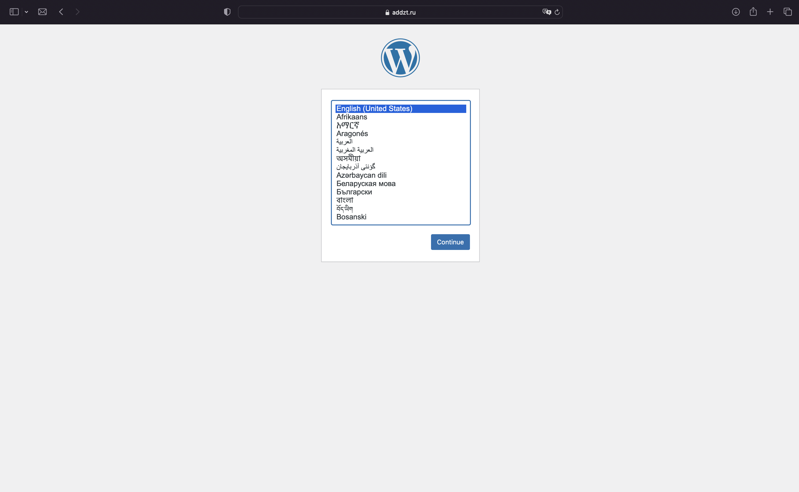
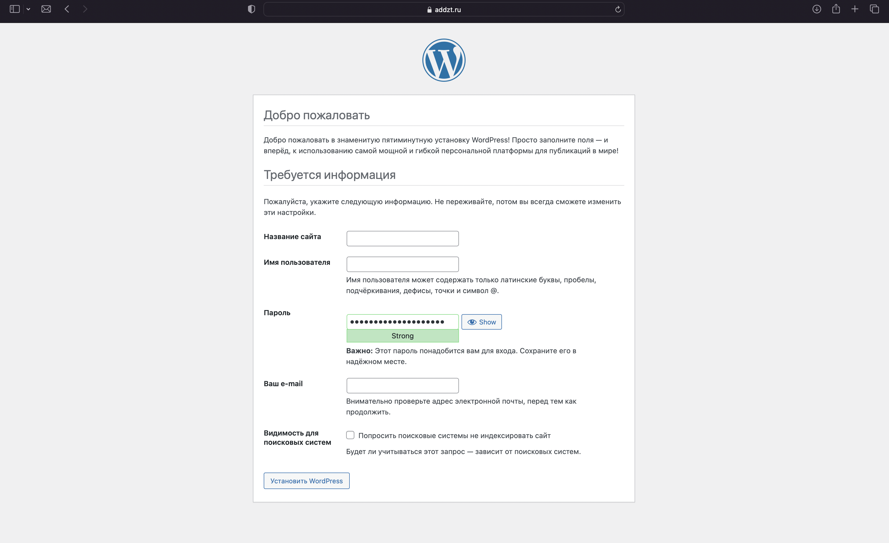
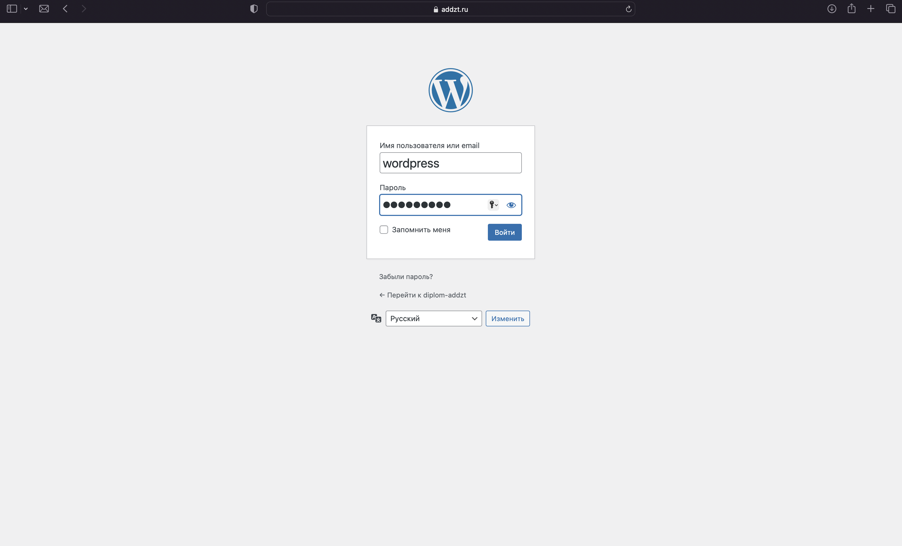

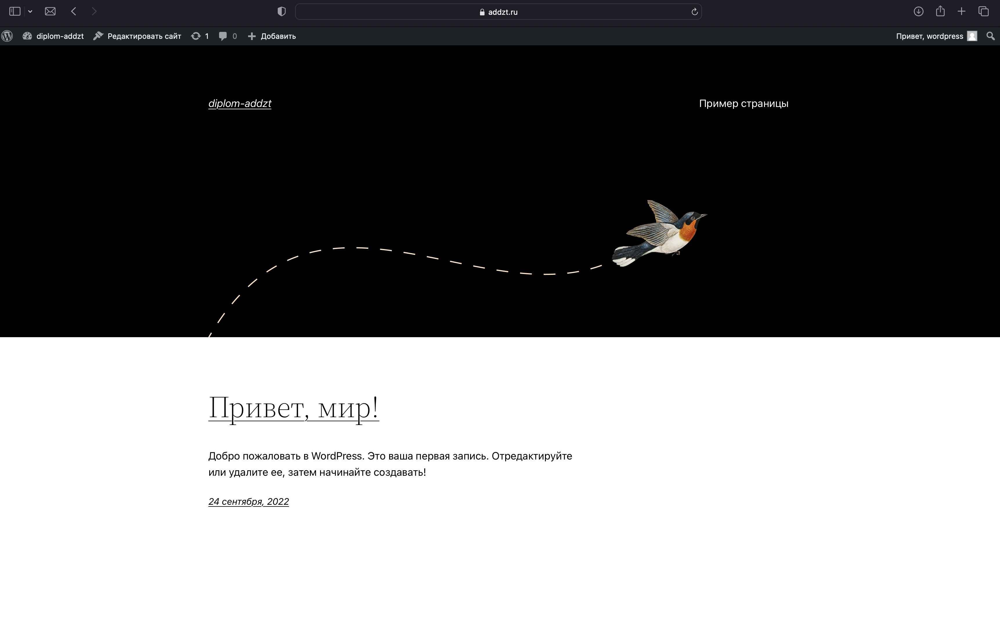

---

### Установка Gitlab CE и Gitlab Runner

Необходимо настроить CI/CD систему для автоматического развертывания приложения при изменении кода.

Рекомендации:
  - Имена серверов: `gitlab.you.domain` и `runner.you.domain`
  - Характеристики: 4vCPU, 4 RAM, Internal address.

Цель:
1. Построить pipeline доставки кода в среду эксплуатации, то есть настроить автоматический деплой на сервер `app.you.domain` при коммите в репозиторий с WordPress.

Подробнее об [Gitlab CI](https://about.gitlab.com/stages-devops-lifecycle/continuous-integration/)

Ожидаемый результат:

1. Интерфейс Gitlab доступен по https.
2. В вашей доменной зоне настроена A-запись на внешний адрес reverse proxy:
    - `https://gitlab.you.domain` (Gitlab)
3. На сервере `you.domain` отредактирован upstream для выше указанного URL и он смотрит на виртуальную машину на которой установлен Gitlab.
3. При любом коммите в репозиторий с WordPress и создании тега (например, v1.0.0) происходит деплой на виртуальную машину.

<details>
<summary><strong>Отработка роли gitlab</strong></summary>

```bash
PLAY [Install Gitlab] *******************************************************************************************************************************************************************************************************************************

TASK [Gathering Facts] ******************************************************************************************************************************************************************************************************************************
ok: [gitlab.addzt.ru]

TASK [gitlab : Check if GitLab configuration file already exists] ***********************************************************************************************************************************************************************************
ok: [gitlab.addzt.ru]

TASK [gitlab : Check if GitLab is already installed] ************************************************************************************************************************************************************************************************
ok: [gitlab.addzt.ru]

TASK [gitlab : Install GitLab dependencies] *********************************************************************************************************************************************************************************************************
changed: [gitlab.addzt.ru]

TASK [gitlab : Install GitLab dependencies (Debian)] ************************************************************************************************************************************************************************************************
changed: [gitlab.addzt.ru]

TASK [gitlab : Download GitLab repository installation script] **************************************************************************************************************************************************************************************
changed: [gitlab.addzt.ru]

TASK [gitlab : Install GitLab repository] ***********************************************************************************************************************************************************************************************************
changed: [gitlab.addzt.ru]

TASK [gitlab : Define the Gitlab package name] ******************************************************************************************************************************************************************************************************
skipping: [gitlab.addzt.ru]

TASK [gitlab : Install GitLab] **********************************************************************************************************************************************************************************************************************
changed: [gitlab.addzt.ru]

TASK [gitlab : Reconfigure GitLab (first run)] ******************************************************************************************************************************************************************************************************
changed: [gitlab.addzt.ru]

TASK [gitlab : Create GitLab SSL configuration folder] **********************************************************************************************************************************************************************************************
skipping: [gitlab.addzt.ru]

TASK [gitlab : Create self-signed certificate] ******************************************************************************************************************************************************************************************************
skipping: [gitlab.addzt.ru]

TASK [gitlab : Copy GitLab configuration file] ******************************************************************************************************************************************************************************************************
changed: [gitlab.addzt.ru]

RUNNING HANDLER [gitlab : restart gitlab] ***********************************************************************************************************************************************************************************************************
changed: [gitlab.addzt.ru]

PLAY RECAP ******************************************************************************************************************************************************************************************************************************************
gitlab.addzt.ru            : ok=11   changed=8    unreachable=0    failed=0    skipped=3    rescued=0    ignored=0   
```

</details>

<details>
<summary><strong>Отработка роли runner</strong></summary>

```bash
PLAY [Install Gitlab runner] ************************************************************************************************************************************************************************************************************************

TASK [Gathering Facts] ******************************************************************************************************************************************************************************************************************************
ok: [runner.addzt.ru]

TASK [runner : Load platform-specific variables] ****************************************************************************************************************************************************************************************************
ok: [runner.addzt.ru]

TASK [runner : (Container) Pull Image from Registry] ************************************************************************************************************************************************************************************************
skipping: [runner.addzt.ru]

TASK [runner : (Container) Define Container volume Path] ********************************************************************************************************************************************************************************************
skipping: [runner.addzt.ru]

TASK [runner : (Container) List configured runners] *************************************************************************************************************************************************************************************************
skipping: [runner.addzt.ru]

TASK [runner : (Container) Check runner is registered] **********************************************************************************************************************************************************************************************
skipping: [runner.addzt.ru]

TASK [runner : configured_runners?] *****************************************************************************************************************************************************************************************************************
skipping: [runner.addzt.ru]

TASK [runner : verified_runners?] *******************************************************************************************************************************************************************************************************************
skipping: [runner.addzt.ru]

TASK [runner : (Container) Register GitLab Runner] **************************************************************************************************************************************************************************************************
skipping: [runner.addzt.ru] => (item={'name': 'fhm87ci5dkscf1ru3s0s', 'state': 'present', 'executor': 'shell', 'output_limit': 4096, 'concurrent_specific': '0', 'docker_image': '', 'tags': [], 'run_untagged': True, 'protected': False, 'docker_privileged': False, 'locked': 'false', 'docker_network_mode': 'bridge', 'env_vars': []}) 

TASK [runner : Create .gitlab-runner dir] ***********************************************************************************************************************************************************************************************************
skipping: [runner.addzt.ru]

TASK [runner : Ensure config.toml exists] ***********************************************************************************************************************************************************************************************************
skipping: [runner.addzt.ru]

TASK [runner : Set concurrent option] ***************************************************************************************************************************************************************************************************************
skipping: [runner.addzt.ru]

TASK [runner : Add listen_address to config] ********************************************************************************************************************************************************************************************************
skipping: [runner.addzt.ru]

TASK [runner : Add log_format to config] ************************************************************************************************************************************************************************************************************
skipping: [runner.addzt.ru]

TASK [runner : Add sentry dsn to config] ************************************************************************************************************************************************************************************************************
skipping: [runner.addzt.ru]

TASK [runner : Add session server listen_address to config] *****************************************************************************************************************************************************************************************
skipping: [runner.addzt.ru]

TASK [runner : Add session server advertise_address to config] **************************************************************************************************************************************************************************************
skipping: [runner.addzt.ru]

TASK [runner : Add session server session_timeout to config] ****************************************************************************************************************************************************************************************
skipping: [runner.addzt.ru]

TASK [runner : Get existing config.toml] ************************************************************************************************************************************************************************************************************
skipping: [runner.addzt.ru]

TASK [runner : Get pre-existing runner configs] *****************************************************************************************************************************************************************************************************
skipping: [runner.addzt.ru]

TASK [runner : Create temporary directory] **********************************************************************************************************************************************************************************************************
skipping: [runner.addzt.ru]

TASK [runner : Write config section for each runner] ************************************************************************************************************************************************************************************************
skipping: [runner.addzt.ru]

TASK [runner : Assemble new config.toml] ************************************************************************************************************************************************************************************************************
skipping: [runner.addzt.ru]

TASK [runner : (Container) Start the container] *****************************************************************************************************************************************************************************************************
skipping: [runner.addzt.ru]

TASK [runner : (Debian) Get Gitlab repository installation script] **********************************************************************************************************************************************************************************
changed: [runner.addzt.ru]

TASK [runner : (Debian) Install Gitlab repository] **************************************************************************************************************************************************************************************************
changed: [runner.addzt.ru]

TASK [runner : (Debian) Update gitlab_runner_package_name] ******************************************************************************************************************************************************************************************
skipping: [runner.addzt.ru]

TASK [runner : (Debian) Set gitlab_runner_package_name] *********************************************************************************************************************************************************************************************
ok: [runner.addzt.ru]

TASK [runner : (Debian) Install GitLab Runner] ******************************************************************************************************************************************************************************************************
changed: [runner.addzt.ru]

TASK [runner : (Debian) Install GitLab Runner] ******************************************************************************************************************************************************************************************************
skipping: [runner.addzt.ru]

TASK [runner : (Debian) Remove ~/gitlab-runner/.bash_logout on debian buster and ubuntu focal] ******************************************************************************************************************************************************
ok: [runner.addzt.ru]

TASK [runner : Ensure /etc/systemd/system/gitlab-runner.service.d/ exists] **************************************************************************************************************************************************************************
changed: [runner.addzt.ru]

TASK [runner : Add reload command to GitLab Runner system service] **********************************************************************************************************************************************************************************
changed: [runner.addzt.ru]

TASK [runner : Configure graceful stop for GitLab Runner system service] ****************************************************************************************************************************************************************************
changed: [runner.addzt.ru]

TASK [runner : Force systemd to reread configs] *****************************************************************************************************************************************************************************************************
ok: [runner.addzt.ru]

TASK [runner : (RedHat) Get Gitlab repository installation script] **********************************************************************************************************************************************************************************
skipping: [runner.addzt.ru]

TASK [runner : (RedHat) Install Gitlab repository] **************************************************************************************************************************************************************************************************
skipping: [runner.addzt.ru]

TASK [runner : (RedHat) Update gitlab_runner_package_name] ******************************************************************************************************************************************************************************************
skipping: [runner.addzt.ru]

TASK [runner : (RedHat) Set gitlab_runner_package_name] *********************************************************************************************************************************************************************************************
skipping: [runner.addzt.ru]

TASK [runner : (RedHat) Install GitLab Runner] ******************************************************************************************************************************************************************************************************
skipping: [runner.addzt.ru]

TASK [runner : Ensure /etc/systemd/system/gitlab-runner.service.d/ exists] **************************************************************************************************************************************************************************
skipping: [runner.addzt.ru]

TASK [runner : Add reload command to GitLab Runner system service] **********************************************************************************************************************************************************************************
skipping: [runner.addzt.ru]

TASK [runner : Configure graceful stop for GitLab Runner system service] ****************************************************************************************************************************************************************************
skipping: [runner.addzt.ru]

TASK [runner : Force systemd to reread configs] *****************************************************************************************************************************************************************************************************
skipping: [runner.addzt.ru]

TASK [runner : (MacOS) Check gitlab-runner executable exists] ***************************************************************************************************************************************************************************************
skipping: [runner.addzt.ru]

TASK [runner : (MacOS) Set fact -> gitlab_runner_exists] ********************************************************************************************************************************************************************************************
skipping: [runner.addzt.ru]

TASK [runner : (MacOS) Get existing version] ********************************************************************************************************************************************************************************************************
skipping: [runner.addzt.ru]

TASK [runner : (MacOS) Set fact -> gitlab_runner_existing_version] **********************************************************************************************************************************************************************************
skipping: [runner.addzt.ru]

TASK [runner : (MacOS) Precreate gitlab-runner log directory] ***************************************************************************************************************************************************************************************
skipping: [runner.addzt.ru]

TASK [runner : (MacOS) Download GitLab Runner] ******************************************************************************************************************************************************************************************************
skipping: [runner.addzt.ru]

TASK [runner : (MacOS) Setting Permissions for gitlab-runner executable] ****************************************************************************************************************************************************************************
skipping: [runner.addzt.ru]

TASK [runner : (MacOS) Install GitLab Runner] *******************************************************************************************************************************************************************************************************
skipping: [runner.addzt.ru]

TASK [runner : (MacOS) Start GitLab Runner] *********************************************************************************************************************************************************************************************************
skipping: [runner.addzt.ru]

TASK [runner : (MacOS) Stop GitLab Runner] **********************************************************************************************************************************************************************************************************
skipping: [runner.addzt.ru]

TASK [runner : (MacOS) Download GitLab Runner] ******************************************************************************************************************************************************************************************************
skipping: [runner.addzt.ru]

TASK [runner : (MacOS) Setting Permissions for gitlab-runner executable] ****************************************************************************************************************************************************************************
skipping: [runner.addzt.ru]

TASK [runner : (MacOS) Start GitLab Runner] *********************************************************************************************************************************************************************************************************
skipping: [runner.addzt.ru]

TASK [runner : (Arch) Set gitlab_runner_package_name] ***********************************************************************************************************************************************************************************************
skipping: [runner.addzt.ru]

TASK [runner : (Arch) Install GitLab Runner] ********************************************************************************************************************************************************************************************************
skipping: [runner.addzt.ru]

TASK [runner : Ensure /etc/systemd/system/gitlab-runner.service.d/ exists] **************************************************************************************************************************************************************************
skipping: [runner.addzt.ru]

TASK [runner : Add reload command to GitLab Runner system service] **********************************************************************************************************************************************************************************
skipping: [runner.addzt.ru]

TASK [runner : Configure graceful stop for GitLab Runner system service] ****************************************************************************************************************************************************************************
skipping: [runner.addzt.ru]

TASK [runner : Force systemd to reread configs] *****************************************************************************************************************************************************************************************************
skipping: [runner.addzt.ru]

TASK [runner : (Unix) List configured runners] ******************************************************************************************************************************************************************************************************
ok: [runner.addzt.ru]

TASK [runner : (Unix) Check runner is registered] ***************************************************************************************************************************************************************************************************
ok: [runner.addzt.ru]

TASK [runner : (Unix) Register GitLab Runner] *******************************************************************************************************************************************************************************************************
included: /Users/addzt/PycharmProjects/devops_homeworks/diplom/ansible/runner/roles/runner/tasks/register-runner.yml for runner.addzt.ru => (item={'name': 'fhm87ci5dkscf1ru3s0s', 'state': 'present', 'executor': 'shell', 'output_limit': 4096, 'concurrent_specific': '0', 'docker_image': '', 'tags': [], 'run_untagged': True, 'protected': False, 'docker_privileged': False, 'locked': 'false', 'docker_network_mode': 'bridge', 'env_vars': []})

TASK [runner : remove config.toml file] *************************************************************************************************************************************************************************************************************
skipping: [runner.addzt.ru]

TASK [runner : Create .gitlab-runner dir] ***********************************************************************************************************************************************************************************************************
skipping: [runner.addzt.ru]

TASK [runner : Ensure config.toml exists] ***********************************************************************************************************************************************************************************************************
skipping: [runner.addzt.ru]

TASK [runner : Construct the runner command without secrets] ****************************************************************************************************************************************************************************************
ok: [runner.addzt.ru]

TASK [runner : add hosts] ***************************************************************************************************************************************************************************************************************************
[WARNING]: The regular expression is an empty string, which will match every line in the file. This may have unintended consequences, such as replacing the last line in the file rather than appending. If this is desired, use '^' to match every
line in the file and avoid this warning.
changed: [runner.addzt.ru]

TASK [runner : Register runner to GitLab] ***********************************************************************************************************************************************************************************************************
changed: [runner.addzt.ru]

TASK [runner : Create .gitlab-runner dir] ***********************************************************************************************************************************************************************************************************
ok: [runner.addzt.ru]

TASK [runner : Ensure config.toml exists] ***********************************************************************************************************************************************************************************************************
ok: [runner.addzt.ru]

TASK [runner : Set concurrent option] ***************************************************************************************************************************************************************************************************************
changed: [runner.addzt.ru]

TASK [runner : Add listen_address to config] ********************************************************************************************************************************************************************************************************
skipping: [runner.addzt.ru]

TASK [runner : Add log_format to config] ************************************************************************************************************************************************************************************************************
skipping: [runner.addzt.ru]

TASK [runner : Add sentry dsn to config] ************************************************************************************************************************************************************************************************************
skipping: [runner.addzt.ru]

TASK [runner : Add session server listen_address to config] *****************************************************************************************************************************************************************************************
ok: [runner.addzt.ru]

TASK [runner : Add session server advertise_address to config] **************************************************************************************************************************************************************************************
ok: [runner.addzt.ru]

TASK [runner : Add session server session_timeout to config] ****************************************************************************************************************************************************************************************
ok: [runner.addzt.ru]

TASK [runner : Get existing config.toml] ************************************************************************************************************************************************************************************************************
ok: [runner.addzt.ru]

TASK [runner : Get pre-existing runner configs] *****************************************************************************************************************************************************************************************************
ok: [runner.addzt.ru]

TASK [runner : Create temporary directory] **********************************************************************************************************************************************************************************************************
ok: [runner.addzt.ru]

TASK [runner : Write config section for each runner] ************************************************************************************************************************************************************************************************
included: /Users/addzt/PycharmProjects/devops_homeworks/diplom/ansible/runner/roles/runner/tasks/config-runner.yml for runner.addzt.ru => (item=concurrent = 4
check_interval = 0

[session_server]
  session_timeout = 1800

)
included: /Users/addzt/PycharmProjects/devops_homeworks/diplom/ansible/runner/roles/runner/tasks/config-runner.yml for runner.addzt.ru => (item=  name = "fhm87ci5dkscf1ru3s0s"
  output_limit = 4096
  url = "http://gitlab.addzt.ru"
  id = 1
  token = "bqr6ARcqPkyXH4rUXsAs"
  token_obtained_at = 2022-09-24T11:14:20Z
  token_expires_at = 0001-01-01T00:00:00Z
  executor = "shell"
  [runners.custom_build_dir]
  [runners.cache]
    [runners.cache.s3]
    [runners.cache.gcs]
    [runners.cache.azure]
)

TASK [runner : conf[1/2]: Create temporary file] ****************************************************************************************************************************************************************************************************
ok: [runner.addzt.ru]

TASK [runner : conf[1/2]: Isolate runner configuration] *********************************************************************************************************************************************************************************************
ok: [runner.addzt.ru]

TASK [runner : include_tasks] ***********************************************************************************************************************************************************************************************************************
skipping: [runner.addzt.ru] => (item={'name': 'fhm87ci5dkscf1ru3s0s', 'state': 'present', 'executor': 'shell', 'output_limit': 4096, 'concurrent_specific': '0', 'docker_image': '', 'tags': [], 'run_untagged': True, 'protected': False, 'docker_privileged': False, 'locked': 'false', 'docker_network_mode': 'bridge', 'env_vars': []}) 

TASK [runner : conf[1/2]: Remove runner config] *****************************************************************************************************************************************************************************************************
skipping: [runner.addzt.ru] => (item={'name': 'fhm87ci5dkscf1ru3s0s', 'state': 'present', 'executor': 'shell', 'output_limit': 4096, 'concurrent_specific': '0', 'docker_image': '', 'tags': [], 'run_untagged': True, 'protected': False, 'docker_privileged': False, 'locked': 'false', 'docker_network_mode': 'bridge', 'env_vars': []}) 

TASK [runner : conf[2/2]: Create temporary file] ****************************************************************************************************************************************************************************************************
ok: [runner.addzt.ru]

TASK [runner : conf[2/2]: Isolate runner configuration] *********************************************************************************************************************************************************************************************
ok: [runner.addzt.ru]

TASK [runner : include_tasks] ***********************************************************************************************************************************************************************************************************************
included: /Users/addzt/PycharmProjects/devops_homeworks/diplom/ansible/runner/roles/runner/tasks/update-config-runner.yml for runner.addzt.ru => (item={'name': 'fhm87ci5dkscf1ru3s0s', 'state': 'present', 'executor': 'shell', 'output_limit': 4096, 'concurrent_specific': '0', 'docker_image': '', 'tags': [], 'run_untagged': True, 'protected': False, 'docker_privileged': False, 'locked': 'false', 'docker_network_mode': 'bridge', 'env_vars': []})

TASK [runner : conf[2/2]: runner[1/1]: Set concurrent limit option] *********************************************************************************************************************************************************************************
changed: [runner.addzt.ru]

TASK [runner : conf[2/2]: runner[1/1]: Set coordinator URL] *****************************************************************************************************************************************************************************************
ok: [runner.addzt.ru]

TASK [runner : conf[2/2]: runner[1/1]: Set clone URL] ***********************************************************************************************************************************************************************************************
skipping: [runner.addzt.ru]

TASK [runner : conf[2/2]: runner[1/1]: Set environment option] **************************************************************************************************************************************************************************************
changed: [runner.addzt.ru]

TASK [runner : conf[2/2]: runner[1/1]: Set pre_clone_script] ****************************************************************************************************************************************************************************************
skipping: [runner.addzt.ru]

TASK [runner : conf[2/2]: runner[1/1]: Set pre_build_script] ****************************************************************************************************************************************************************************************
skipping: [runner.addzt.ru]

TASK [runner : conf[2/2]: runner[1/1]: Set tls_ca_file] *********************************************************************************************************************************************************************************************
skipping: [runner.addzt.ru]

TASK [runner : conf[2/2]: runner[1/1]: Set post_build_script] ***************************************************************************************************************************************************************************************
skipping: [runner.addzt.ru]

TASK [runner : conf[2/2]: runner[1/1]: Set runner executor option] **********************************************************************************************************************************************************************************
ok: [runner.addzt.ru]

TASK [runner : conf[2/2]: runner[1/1]: Set runner shell option] *************************************************************************************************************************************************************************************
ok: [runner.addzt.ru]

TASK [runner : conf[2/2]: runner[1/1]: Set runner executor section] *********************************************************************************************************************************************************************************
ok: [runner.addzt.ru]

TASK [runner : conf[2/2]: runner[1/1]: Set output_limit option] *************************************************************************************************************************************************************************************
ok: [runner.addzt.ru]

TASK [runner : conf[2/2]: runner[1/1]: Set runner docker image option] ******************************************************************************************************************************************************************************
changed: [runner.addzt.ru]

TASK [runner : conf[2/2]: runner[1/1]: Set docker helper image option] ******************************************************************************************************************************************************************************
ok: [runner.addzt.ru]

TASK [runner : conf[2/2]: runner[1/1]: Set docker privileged option] ********************************************************************************************************************************************************************************
changed: [runner.addzt.ru]

TASK [runner : conf[2/2]: runner[1/1]: Set docker wait_for_services_timeout option] *****************************************************************************************************************************************************************
ok: [runner.addzt.ru]

TASK [runner : conf[2/2]: runner[1/1]: Set docker tlsverify option] *********************************************************************************************************************************************************************************
ok: [runner.addzt.ru]

TASK [runner : conf[2/2]: runner[1/1]: Set docker shm_size option] **********************************************************************************************************************************************************************************
ok: [runner.addzt.ru]

TASK [runner : conf[2/2]: runner[1/1]: Set docker disable_cache option] *****************************************************************************************************************************************************************************
ok: [runner.addzt.ru]

TASK [runner : conf[2/2]: runner[1/1]: Set docker DNS option] ***************************************************************************************************************************************************************************************
ok: [runner.addzt.ru]

TASK [runner : conf[2/2]: runner[1/1]: Set docker DNS search option] ********************************************************************************************************************************************************************************
ok: [runner.addzt.ru]

TASK [runner : conf[2/2]: runner[1/1]: Set docker pull_policy option] *******************************************************************************************************************************************************************************
ok: [runner.addzt.ru]

TASK [runner : conf[2/2]: runner[1/1]: Set docker volumes option] ***********************************************************************************************************************************************************************************
ok: [runner.addzt.ru]

TASK [runner : conf[2/2]: runner[1/1]: Set docker devices option] ***********************************************************************************************************************************************************************************
ok: [runner.addzt.ru]

TASK [runner : conf[2/2]: runner[1/1]: Set runner docker network option] ****************************************************************************************************************************************************************************
changed: [runner.addzt.ru]

TASK [runner : conf[2/2]: runner[1/1]: Set custom_build_dir section] ********************************************************************************************************************************************************************************
changed: [runner.addzt.ru]

TASK [runner : conf[2/2]: runner[1/1]: Set docker custom_build_dir-enabled option] ******************************************************************************************************************************************************************
ok: [runner.addzt.ru]

TASK [runner : conf[2/2]: runner[1/1]: Set cache section] *******************************************************************************************************************************************************************************************
ok: [runner.addzt.ru]

TASK [runner : conf[2/2]: runner[1/1]: Set cache s3 section] ****************************************************************************************************************************************************************************************
changed: [runner.addzt.ru]

TASK [runner : conf[2/2]: runner[1/1]: Set cache gcs section] ***************************************************************************************************************************************************************************************
changed: [runner.addzt.ru]

TASK [runner : conf[2/2]: runner[1/1]: Set cache azure section] *************************************************************************************************************************************************************************************
changed: [runner.addzt.ru]

TASK [runner : conf[2/2]: runner[1/1]: Set cache type option] ***************************************************************************************************************************************************************************************
ok: [runner.addzt.ru]

TASK [runner : conf[2/2]: runner[1/1]: Set cache path option] ***************************************************************************************************************************************************************************************
ok: [runner.addzt.ru]

TASK [runner : conf[2/2]: runner[1/1]: Set cache shared option] *************************************************************************************************************************************************************************************
ok: [runner.addzt.ru]

TASK [runner : conf[2/2]: runner[1/1]: Set cache s3 server addresss] ********************************************************************************************************************************************************************************
ok: [runner.addzt.ru]

TASK [runner : conf[2/2]: runner[1/1]: Set cache s3 access key] *************************************************************************************************************************************************************************************
ok: [runner.addzt.ru]

TASK [runner : conf[2/2]: runner[1/1]: Set cache s3 secret key] *************************************************************************************************************************************************************************************
ok: [runner.addzt.ru]

TASK [runner : conf[2/2]: runner[1/1]: Set cache s3 bucket name option] *****************************************************************************************************************************************************************************
skipping: [runner.addzt.ru]

TASK [runner : conf[2/2]: runner[1/1]: Set cache s3 bucket location option] *************************************************************************************************************************************************************************
ok: [runner.addzt.ru]

TASK [runner : conf[2/2]: runner[1/1]: Set cache s3 insecure option] ********************************************************************************************************************************************************************************
ok: [runner.addzt.ru]

TASK [runner : conf[2/2]: runner[1/1]: Set cache gcs bucket name] ***********************************************************************************************************************************************************************************
skipping: [runner.addzt.ru]

TASK [runner : conf[2/2]: runner[1/1]: Set cache gcs credentials file] ******************************************************************************************************************************************************************************
ok: [runner.addzt.ru]

TASK [runner : conf[2/2]: runner[1/1]: Set cache gcs access id] *************************************************************************************************************************************************************************************
ok: [runner.addzt.ru]

TASK [runner : conf[2/2]: runner[1/1]: Set cache gcs private key] ***********************************************************************************************************************************************************************************
ok: [runner.addzt.ru]

TASK [runner : conf[2/2]: runner[1/1]: Set cache azure account name] ********************************************************************************************************************************************************************************
ok: [runner.addzt.ru]

TASK [runner : conf[2/2]: runner[1/1]: Set cache azure account key] *********************************************************************************************************************************************************************************
ok: [runner.addzt.ru]

TASK [runner : conf[2/2]: runner[1/1]: Set cache azure container name] ******************************************************************************************************************************************************************************
ok: [runner.addzt.ru]

TASK [runner : conf[2/2]: runner[1/1]: Set cache azure storage domain] ******************************************************************************************************************************************************************************
ok: [runner.addzt.ru]

TASK [runner : conf[2/2]: runner[1/1]: Set ssh user option] *****************************************************************************************************************************************************************************************
ok: [runner.addzt.ru]

TASK [runner : conf[2/2]: runner[1/1]: Set ssh host option] *****************************************************************************************************************************************************************************************
ok: [runner.addzt.ru]

TASK [runner : conf[2/2]: runner[1/1]: Set ssh port option] *****************************************************************************************************************************************************************************************
ok: [runner.addzt.ru]

TASK [runner : conf[2/2]: runner[1/1]: Set ssh password option] *************************************************************************************************************************************************************************************
ok: [runner.addzt.ru]

TASK [runner : conf[2/2]: runner[1/1]: Set ssh identity file option] ********************************************************************************************************************************************************************************
ok: [runner.addzt.ru]

TASK [runner : conf[2/2]: runner[1/1]: Set virtualbox base name option] *****************************************************************************************************************************************************************************
skipping: [runner.addzt.ru]

TASK [runner : conf[2/2]: runner[1/1]: Set virtualbox base snapshot option] *************************************************************************************************************************************************************************
skipping: [runner.addzt.ru]

TASK [runner : conf[2/2]: runner[1/1]: Set virtualbox base folder option] ***************************************************************************************************************************************************************************
skipping: [runner.addzt.ru]

TASK [runner : conf[2/2]: runner[1/1]: Set virtualbox disable snapshots option] *********************************************************************************************************************************************************************
skipping: [runner.addzt.ru]

TASK [runner : conf[2/2]: runner[1/1]: Set builds dir file option] **********************************************************************************************************************************************************************************
ok: [runner.addzt.ru]

TASK [runner : conf[2/2]: runner[1/1]: Set cache dir file option] ***********************************************************************************************************************************************************************************
ok: [runner.addzt.ru]

TASK [runner : conf[2/2]: runner[1/1]: Ensure directory permissions] ********************************************************************************************************************************************************************************
skipping: [runner.addzt.ru] => (item=) 
skipping: [runner.addzt.ru] => (item=) 

TASK [runner : conf[2/2]: runner[1/1]: Ensure directory access test] ********************************************************************************************************************************************************************************
skipping: [runner.addzt.ru] => (item=) 
skipping: [runner.addzt.ru] => (item=) 

TASK [runner : conf[2/2]: runner[1/1]: Ensure directory access fail on error] ***********************************************************************************************************************************************************************
skipping: [runner.addzt.ru] => (item={'changed': False, 'skipped': True, 'skip_reason': 'Conditional result was False', 'item': '', 'ansible_loop_var': 'item'}) 
skipping: [runner.addzt.ru] => (item={'changed': False, 'skipped': True, 'skip_reason': 'Conditional result was False', 'item': '', 'ansible_loop_var': 'item'}) 

TASK [runner : include_tasks] ***********************************************************************************************************************************************************************************************************************
skipping: [runner.addzt.ru]

TASK [runner : conf[2/2]: Remove runner config] *****************************************************************************************************************************************************************************************************
skipping: [runner.addzt.ru] => (item={'name': 'fhm87ci5dkscf1ru3s0s', 'state': 'present', 'executor': 'shell', 'output_limit': 4096, 'concurrent_specific': '0', 'docker_image': '', 'tags': [], 'run_untagged': True, 'protected': False, 'docker_privileged': False, 'locked': 'false', 'docker_network_mode': 'bridge', 'env_vars': []}) 

TASK [runner : Assemble new config.toml] ************************************************************************************************************************************************************************************************************
changed: [runner.addzt.ru]

TASK [runner : (Windows) Check gitlab-runner executable exists] *************************************************************************************************************************************************************************************
skipping: [runner.addzt.ru]

TASK [runner : (Windows) Set fact -> gitlab_runner_exists] ******************************************************************************************************************************************************************************************
skipping: [runner.addzt.ru]

TASK [runner : (Windows) Get existing version] ******************************************************************************************************************************************************************************************************
skipping: [runner.addzt.ru]

TASK [runner : (Windows) Set fact -> gitlab_runner_existing_version] ********************************************************************************************************************************************************************************
skipping: [runner.addzt.ru]

TASK [runner : (Windows) Ensure install directory exists] *******************************************************************************************************************************************************************************************
skipping: [runner.addzt.ru]

TASK [runner : (Windows) Download GitLab Runner] ****************************************************************************************************************************************************************************************************
skipping: [runner.addzt.ru]

TASK [runner : (Windows) Install GitLab Runner] *****************************************************************************************************************************************************************************************************
skipping: [runner.addzt.ru]

TASK [runner : (Windows) Install GitLab Runner] *****************************************************************************************************************************************************************************************************
skipping: [runner.addzt.ru]

TASK [runner : (Windows) Make sure runner is stopped] ***********************************************************************************************************************************************************************************************
skipping: [runner.addzt.ru]

TASK [runner : (Windows) Download GitLab Runner] ****************************************************************************************************************************************************************************************************
skipping: [runner.addzt.ru]

TASK [runner : (Windows) List configured runners] ***************************************************************************************************************************************************************************************************
skipping: [runner.addzt.ru]

TASK [runner : (Windows) Check runner is registered] ************************************************************************************************************************************************************************************************
skipping: [runner.addzt.ru]

TASK [runner : (Windows) Register GitLab Runner] ****************************************************************************************************************************************************************************************************
skipping: [runner.addzt.ru] => (item={'name': 'fhm87ci5dkscf1ru3s0s', 'state': 'present', 'executor': 'shell', 'output_limit': 4096, 'concurrent_specific': '0', 'docker_image': '', 'tags': [], 'run_untagged': True, 'protected': False, 'docker_privileged': False, 'locked': 'false', 'docker_network_mode': 'bridge', 'env_vars': []}) 

TASK [runner : (Windows) Create .gitlab-runner dir] *************************************************************************************************************************************************************************************************
skipping: [runner.addzt.ru]

TASK [runner : (Windows) Ensure config.toml exists] *************************************************************************************************************************************************************************************************
skipping: [runner.addzt.ru]

TASK [runner : (Windows) Set concurrent option] *****************************************************************************************************************************************************************************************************
skipping: [runner.addzt.ru]

TASK [runner : (Windows) Add listen_address to config] **********************************************************************************************************************************************************************************************
skipping: [runner.addzt.ru]

TASK [runner : (Windows) Add sentry dsn to config] **************************************************************************************************************************************************************************************************
skipping: [runner.addzt.ru]

TASK [runner : (Windows) Add session server listen_address to config] *******************************************************************************************************************************************************************************
skipping: [runner.addzt.ru]

TASK [runner : (Windows) Add session server advertise_address to config] ****************************************************************************************************************************************************************************
skipping: [runner.addzt.ru]

TASK [runner : (Windows) Add session server session_timeout to config] ******************************************************************************************************************************************************************************
skipping: [runner.addzt.ru]

TASK [runner : (Windows) Get existing config.toml] **************************************************************************************************************************************************************************************************
skipping: [runner.addzt.ru]

TASK [runner : (Windows) Get pre-existing global config] ********************************************************************************************************************************************************************************************
skipping: [runner.addzt.ru]

TASK [runner : (Windows) Get pre-existing runner configs] *******************************************************************************************************************************************************************************************
skipping: [runner.addzt.ru]

TASK [runner : (Windows) Create temporary directory] ************************************************************************************************************************************************************************************************
skipping: [runner.addzt.ru]

TASK [runner : (Windows) Write config section for each runner] **************************************************************************************************************************************************************************************
skipping: [runner.addzt.ru] => (item=concurrent = 4
check_interval = 0

[session_server]
  session_timeout = 1800

) 
skipping: [runner.addzt.ru] => (item=  name = "fhm87ci5dkscf1ru3s0s"
  output_limit = 4096
  url = "http://gitlab.addzt.ru"
  id = 1
  token = "bqr6ARcqPkyXH4rUXsAs"
  token_obtained_at = 2022-09-24T11:14:20Z
  token_expires_at = 0001-01-01T00:00:00Z
  executor = "shell"
  [runners.custom_build_dir]
  [runners.cache]
    [runners.cache.s3]
    [runners.cache.gcs]
    [runners.cache.azure]
) 

TASK [runner : (Windows) Create temporary file config.toml] *****************************************************************************************************************************************************************************************
skipping: [runner.addzt.ru]

TASK [runner : (Windows) Write global config to file] ***********************************************************************************************************************************************************************************************
skipping: [runner.addzt.ru]

TASK [runner : (Windows) Create temporary file runners-config.toml] *********************************************************************************************************************************************************************************
skipping: [runner.addzt.ru]

TASK [runner : (Windows) Assemble runners files in config dir] **************************************************************************************************************************************************************************************
skipping: [runner.addzt.ru]

TASK [runner : (Windows) Assemble new config.toml] **************************************************************************************************************************************************************************************************
skipping: [runner.addzt.ru]

TASK [runner : (Windows) Verify config] *************************************************************************************************************************************************************************************************************
skipping: [runner.addzt.ru]

TASK [runner : (Windows) Start GitLab Runner] *******************************************************************************************************************************************************************************************************
skipping: [runner.addzt.ru]

RUNNING HANDLER [runner : restart_gitlab_runner] ****************************************************************************************************************************************************************************************************
changed: [runner.addzt.ru]

RUNNING HANDLER [runner : restart_gitlab_runner_macos] **********************************************************************************************************************************************************************************************
skipping: [runner.addzt.ru]

PLAY RECAP ******************************************************************************************************************************************************************************************************************************************
runner.addzt.ru            : ok=83   changed=20   unreachable=0    failed=0    skipped=110  rescued=0    ignored=0 
```

</details>

**Результат**

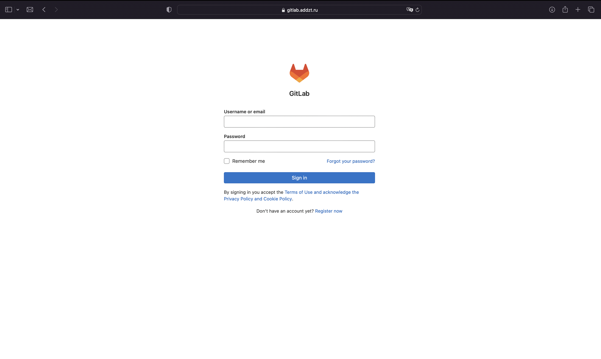
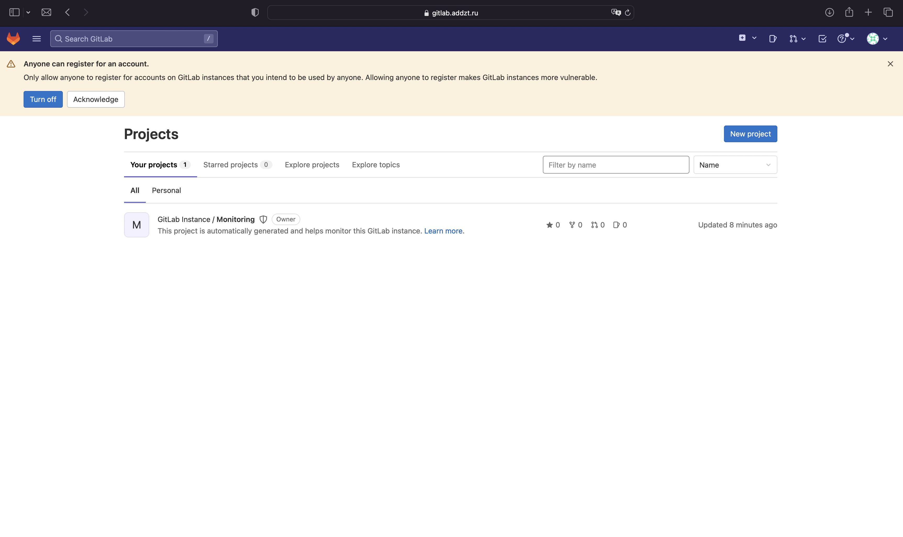

Проверим подключение ранера

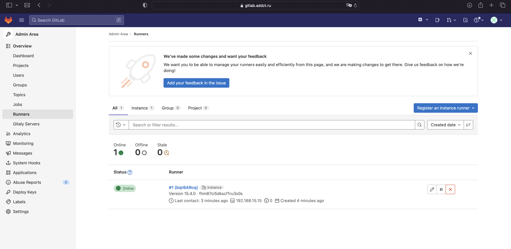

Создадим проект `wordpress`

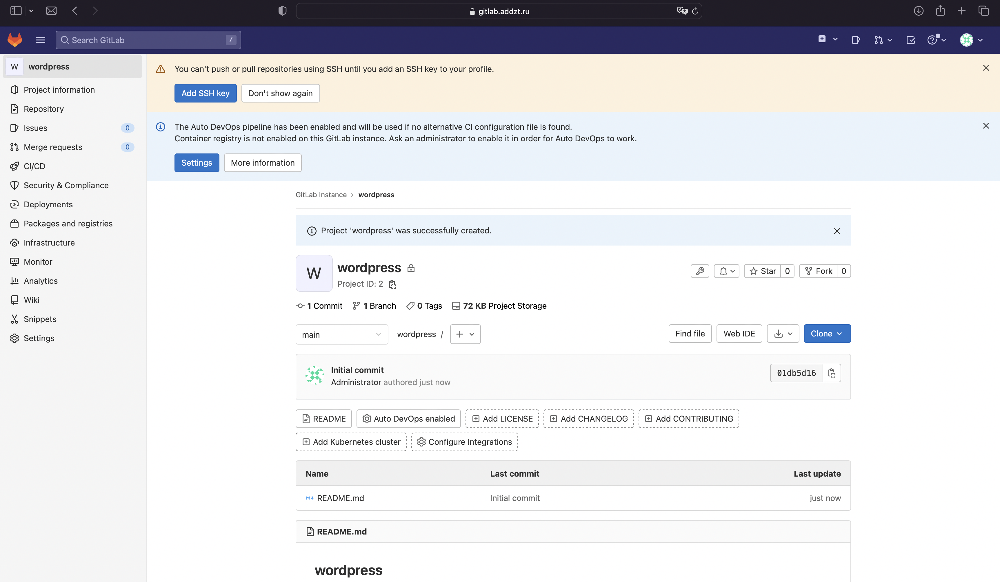

Зайдем на wordpress и запушим `/var/www/html` на `gitlab`

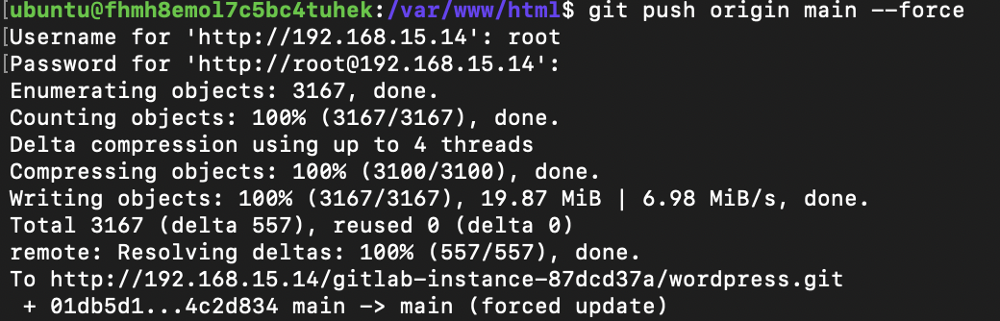
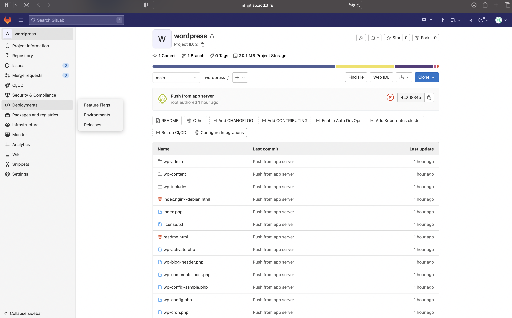

Добавляем закрытый ключ и парольную фразу в `ci/cd settings`

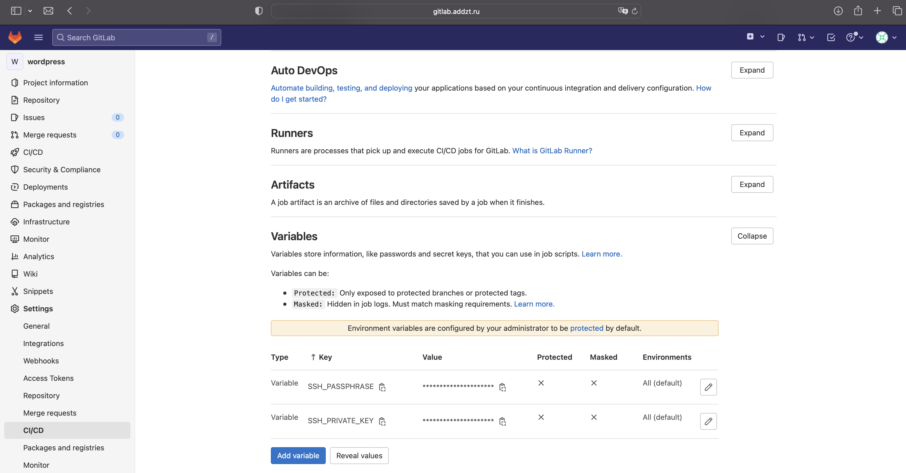

Переходим в `ci/cd -> editor` и добавляем

```bash
before_script:
  - 'which ssh-agent || ( apt-get update -y && apt-get install openssh-client git -y )'
  - eval $(ssh-agent -s)
  - mkdir -p ~/.ssh
  - chmod 700 ~/.ssh
  - echo 'echo "$SSH_PASSPHRASE"' > ~/.ssh/.print_ssh_password
  - chmod 700 ~/.ssh/.print_ssh_password
  - chmod +x ~/.ssh/.print_ssh_password
  - echo "$SSH_PRIVATE_KEY" | tr -d '\r' | DISPLAY=":0.0" SSH_ASKPASS=~/.ssh/.print_ssh_password setsid ssh-add - > /dev/null

stages:
  - deploy

deploy-job:
  stage: deploy
  script:
    - echo "Deploying files..."
    - ssh -o StrictHostKeyChecking=no ubuntu@192.168.15.13 sudo chown ubuntu /var/www/html/ -R
    - rsync -arvzc -e "ssh -o StrictHostKeyChecking=no" ./* ubuntu@192.168.15.13:/var/www/html/
    - ssh -o StrictHostKeyChecking=no ubuntu@192.168.15.13 sudo chown www-data /var/www/html/ -R 
```

Проверяем

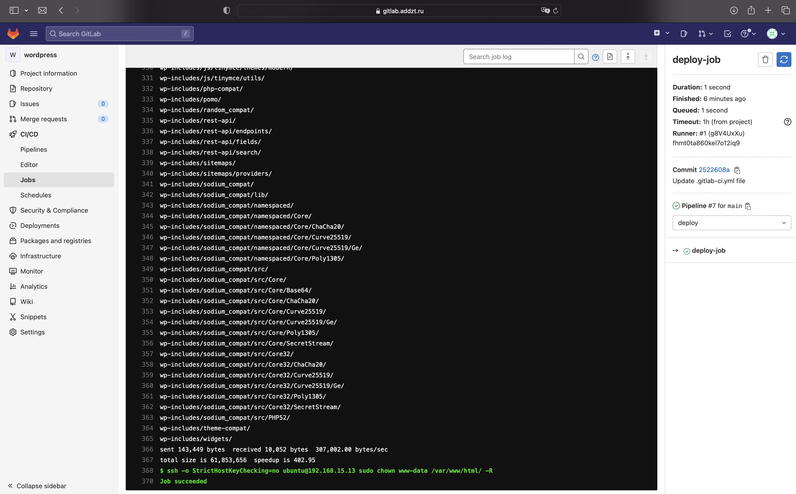
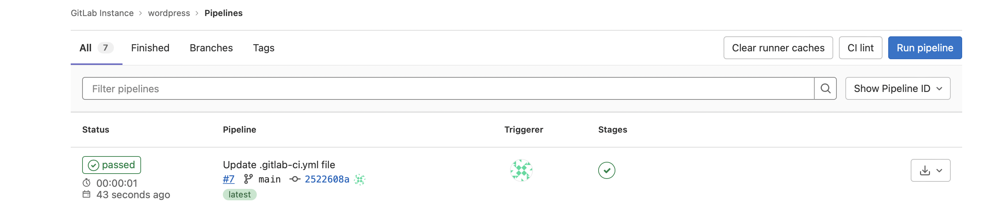

Теперь добавим файл для проверки работы пайплайна

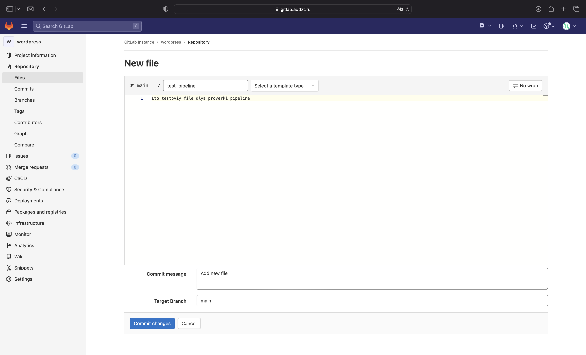
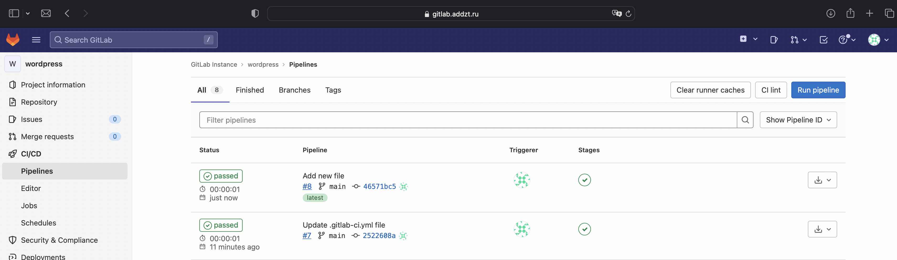

Переходим на `addzt.ru/test_pipeline`

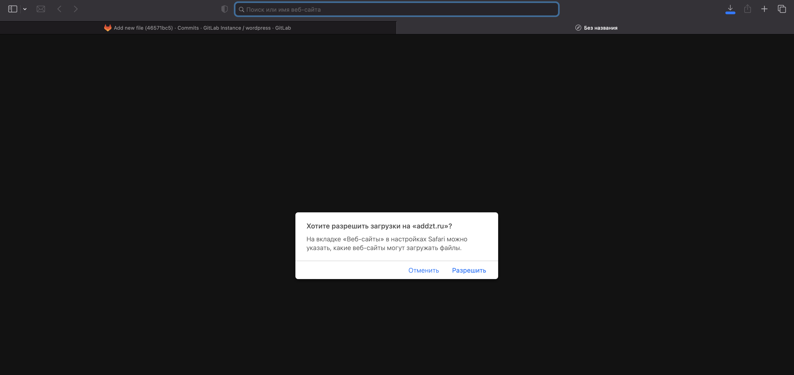
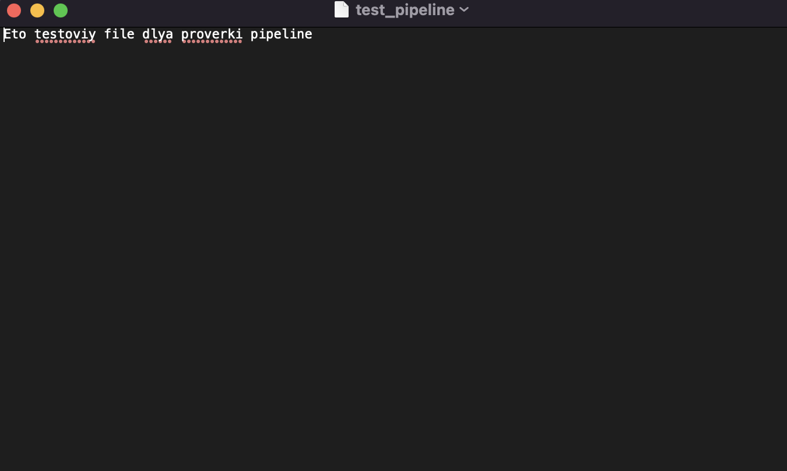

___

### Установка Prometheus, Alert Manager, Node Exporter и Grafana

Необходимо разработать Ansible роль для установки Prometheus, Alert Manager и Grafana.

Рекомендации:
  - Имя сервера: `monitoring.you.domain`
  - Характеристики: 4vCPU, 4 RAM, Internal address.

Цель:

1. Получение метрик со всей инфраструктуры.

Ожидаемые результаты:

1. Интерфейсы Prometheus, Alert Manager и Grafana доступены по https.
2. В вашей доменной зоне настроены A-записи на внешний адрес reverse proxy:
  - `https://grafana.you.domain` (Grafana)
  - `https://prometheus.you.domain` (Prometheus)
  - `https://alertmanager.you.domain` (Alert Manager)
3. На сервере `you.domain` отредактированы upstreams для выше указанных URL и они смотрят на виртуальную машину на которой установлены Prometheus, Alert Manager и Grafana.
4. На всех серверах установлен Node Exporter и его метрики доступны Prometheus.
5. У Alert Manager есть необходимый [набор правил](https://awesome-prometheus-alerts.grep.to/rules.html) для создания алертов.
2. В Grafana есть дашборд отображающий метрики из Node Exporter по всем серверам.
3. В Grafana есть дашборд отображающий метрики из MySQL (*).
4. В Grafana есть дашборд отображающий метрики из WordPress (*).

*Примечание: дашборды со звёздочкой являются опциональными заданиями повышенной сложности их выполнение желательно, но не обязательно.*

<details>
<summary><strong>Отработка роли node exporter</strong></summary>

```bash
PLAY [Install Node exporter] ************************************************************************************************************************************************************************************************************************

TASK [Gathering Facts] ******************************************************************************************************************************************************************************************************************************
ok: [addzt.ru]
ok: [db01.addzt.ru]
ok: [app.addzt.ru]
ok: [runner.addzt.ru]
ok: [db02.addzt.ru]
ok: [monitoring.addzt.ru]

TASK [node_exporter : Check current node_exporter version.] *****************************************************************************************************************************************************************************************
ok: [addzt.ru]
ok: [db01.addzt.ru]
ok: [runner.addzt.ru]
ok: [app.addzt.ru]
ok: [db02.addzt.ru]
ok: [monitoring.addzt.ru]

TASK [node_exporter : Download and unarchive node_exporter into temporary location.] ****************************************************************************************************************************************************************
skipping: [addzt.ru]
changed: [db01.addzt.ru]
changed: [app.addzt.ru]
changed: [monitoring.addzt.ru]
changed: [db02.addzt.ru]
changed: [runner.addzt.ru]

TASK [node_exporter : Move node_exporter binary into place.] ****************************************************************************************************************************************************************************************
skipping: [addzt.ru]
changed: [app.addzt.ru]
changed: [monitoring.addzt.ru]
changed: [db01.addzt.ru]
changed: [db02.addzt.ru]
changed: [runner.addzt.ru]

TASK [node_exporter : Create node_exporter user.] ***************************************************************************************************************************************************************************************************
ok: [addzt.ru]
changed: [app.addzt.ru]
changed: [db01.addzt.ru]
changed: [runner.addzt.ru]
changed: [db02.addzt.ru]
changed: [monitoring.addzt.ru]

TASK [node_exporter : Copy the node_exporter systemd unit file.] ************************************************************************************************************************************************************************************
ok: [addzt.ru]
changed: [app.addzt.ru]
changed: [db01.addzt.ru]
changed: [runner.addzt.ru]
changed: [db02.addzt.ru]
changed: [monitoring.addzt.ru]

TASK [node_exporter : Reload systemd daemon if unit file is changed.] *******************************************************************************************************************************************************************************
skipping: [addzt.ru]
ok: [app.addzt.ru]
ok: [monitoring.addzt.ru]
ok: [runner.addzt.ru]
ok: [db01.addzt.ru]
ok: [db02.addzt.ru]

TASK [node_exporter : Ensure node_exporter is running and enabled at boot.] *************************************************************************************************************************************************************************
changed: [addzt.ru]
changed: [runner.addzt.ru]
changed: [db01.addzt.ru]
changed: [monitoring.addzt.ru]
changed: [db02.addzt.ru]
changed: [app.addzt.ru]

RUNNING HANDLER [node_exporter : restart node_exporter] *********************************************************************************************************************************************************************************************
changed: [monitoring.addzt.ru]
changed: [db01.addzt.ru]
changed: [app.addzt.ru]
changed: [runner.addzt.ru]
changed: [db02.addzt.ru]

PLAY RECAP ******************************************************************************************************************************************************************************************************************************************
addzt.ru                   : ok=5    changed=1    unreachable=0    failed=0    skipped=3    rescued=0    ignored=0   
app.addzt.ru               : ok=9    changed=6    unreachable=0    failed=0    skipped=0    rescued=0    ignored=0   
db01.addzt.ru              : ok=9    changed=6    unreachable=0    failed=0    skipped=0    rescued=0    ignored=0   
db02.addzt.ru              : ok=9    changed=6    unreachable=0    failed=0    skipped=0    rescued=0    ignored=0   
monitoring.addzt.ru        : ok=9    changed=6    unreachable=0    failed=0    skipped=0    rescued=0    ignored=0   
runner.addzt.ru            : ok=9    changed=6    unreachable=0    failed=0    skipped=0    rescued=0    ignored=0   
```

</details>

<details>
<summary><strong>Отработка роли node prometheus</strong></summary>

```bash
PLAY [Install Monitoring] ***************************************************************************************************************************************************************************************************************************

TASK [Gathering Facts] ******************************************************************************************************************************************************************************************************************************
ok: [monitoring.addzt.ru]

TASK [monitoring : create prometheus system group] **************************************************************************************************************************************************************************************************
ok: [monitoring.addzt.ru]

TASK [monitoring : create prometheus system user] ***************************************************************************************************************************************************************************************************
ok: [monitoring.addzt.ru]

TASK [monitoring : create prometheus data directory] ************************************************************************************************************************************************************************************************
ok: [monitoring.addzt.ru]

TASK [monitoring : create prometheus configuration directories] *************************************************************************************************************************************************************************************
ok: [monitoring.addzt.ru] => (item=/etc/prometheus)
ok: [monitoring.addzt.ru] => (item=/etc/prometheus/rules)
ok: [monitoring.addzt.ru] => (item=/etc/prometheus/file_sd)

TASK [monitoring : Set prometheus external metrics path] ********************************************************************************************************************************************************************************************
ok: [monitoring.addzt.ru]

TASK [monitoring : download prometheus binary to local folder] **************************************************************************************************************************************************************************************
ok: [monitoring.addzt.ru -> localhost]

TASK [monitoring : unpack prometheus binaries] ******************************************************************************************************************************************************************************************************
skipping: [monitoring.addzt.ru]

TASK [monitoring : propagate official prometheus and promtool binaries] *****************************************************************************************************************************************************************************
ok: [monitoring.addzt.ru] => (item=prometheus)
ok: [monitoring.addzt.ru] => (item=promtool)

TASK [monitoring : propagate official console templates] ********************************************************************************************************************************************************************************************
ok: [monitoring.addzt.ru] => (item=console_libraries)
ok: [monitoring.addzt.ru] => (item=consoles)

TASK [monitoring : propagate locally distributed prometheus and promtool binaries] ******************************************************************************************************************************************************************
skipping: [monitoring.addzt.ru] => (item=prometheus) 
skipping: [monitoring.addzt.ru] => (item=promtool) 

TASK [monitoring : create systemd service unit] *****************************************************************************************************************************************************************************************************
ok: [monitoring.addzt.ru]

TASK [monitoring : alerting rules file] *************************************************************************************************************************************************************************************************************
ok: [monitoring.addzt.ru]

TASK [monitoring : configure prometheus] ************************************************************************************************************************************************************************************************************
ok: [monitoring.addzt.ru]

TASK [monitoring : service always started] **********************************************************************************************************************************************************************************************************
ok: [monitoring.addzt.ru]

```

</details>

<details>
<summary><strong>Отработка роли grafana</strong></summary>

```bash
TASK [monitoring : install gpg] *********************************************************************************************************************************************************************************************************************
ok: [monitoring.addzt.ru]

TASK [monitoring : add Grafana gpg key] *************************************************************************************************************************************************************************************************************
ok: [monitoring.addzt.ru]

TASK [monitoring : add Grafana repository] **********************************************************************************************************************************************************************************************************
ok: [monitoring.addzt.ru]

TASK [monitoring : install Grafana] *****************************************************************************************************************************************************************************************************************
ok: [monitoring.addzt.ru]

TASK [monitoring : start service grafana-server] ****************************************************************************************************************************************************************************************************
ok: [monitoring.addzt.ru]

TASK [monitoring : wait for service up] *************************************************************************************************************************************************************************************************************
ok: [monitoring.addzt.ru]

TASK [monitoring : Create/Update datasources file (provisioning)] ***********************************************************************************************************************************************************************************
ok: [monitoring.addzt.ru]

TASK [monitoring : Create local grafana dashboard directory] ****************************************************************************************************************************************************************************************
ok: [monitoring.addzt.ru]

TASK [monitoring : create grafana dashboards data directory] ****************************************************************************************************************************************************************************************
ok: [monitoring.addzt.ru]

TASK [monitoring : download grafana dashboard from grafana.net to local directory] ******************************************************************************************************************************************************************
ok: [monitoring.addzt.ru] => (item={'dashboard_id': '3662', 'revision_id': '2', 'datasource': 'Prometheus'})
ok: [monitoring.addzt.ru] => (item={'dashboard_id': '1860', 'revision_id': '27', 'datasource': 'Prometheus'})
ok: [monitoring.addzt.ru] => (item={'dashboard_id': '9578', 'revision_id': '4', 'datasource': 'Prometheus'})
ok: [monitoring.addzt.ru] => (item={'dashboard_id': '9628', 'revision_id': '7', 'datasource': 'Prometheus'})

TASK [monitoring : Set the correct data source name in the dashboard] *******************************************************************************************************************************************************************************
ok: [monitoring.addzt.ru] => (item={'dashboard_id': '3662', 'revision_id': '2', 'datasource': 'Prometheus'})
ok: [monitoring.addzt.ru] => (item={'dashboard_id': '1860', 'revision_id': '27', 'datasource': 'Prometheus'})
ok: [monitoring.addzt.ru] => (item={'dashboard_id': '9578', 'revision_id': '4', 'datasource': 'Prometheus'})
ok: [monitoring.addzt.ru] => (item={'dashboard_id': '9628', 'revision_id': '7', 'datasource': 'Prometheus'})

TASK [monitoring : Create/Update dashboards file (provisioning)] ************************************************************************************************************************************************************************************
changed: [monitoring.addzt.ru]

TASK [monitoring : Register previously copied dashboards] *******************************************************************************************************************************************************************************************
skipping: [monitoring.addzt.ru]

TASK [monitoring : Register dashboards to copy] *****************************************************************************************************************************************************************************************************
ok: [monitoring.addzt.ru]

TASK [monitoring : Import grafana dashboards] *******************************************************************************************************************************************************************************************************
changed: [monitoring.addzt.ru] => (item={'path': '/tmp/ansible.bpqcq48g/9628.json', 'mode': '0644', 'isdir': False, 'ischr': False, 'isblk': False, 'isreg': True, 'isfifo': False, 'islnk': False, 'issock': False, 'uid': 0, 'gid': 0, 'size': 71832, 'inode': 272361, 'dev': 64514, 'nlink': 1, 'atime': 1664050024.1207178, 'mtime': 1664050024.1207178, 'ctime': 1664050024.1207178, 'gr_name': 'root', 'pw_name': 'root', 'wusr': True, 'rusr': True, 'xusr': False, 'wgrp': False, 'rgrp': True, 'xgrp': False, 'woth': False, 'roth': True, 'xoth': False, 'isuid': False, 'isgid': False})
changed: [monitoring.addzt.ru] => (item={'path': '/tmp/ansible.bpqcq48g/9578.json', 'mode': '0644', 'isdir': False, 'ischr': False, 'isblk': False, 'isreg': True, 'isfifo': False, 'islnk': False, 'issock': False, 'uid': 0, 'gid': 0, 'size': 307942, 'inode': 272362, 'dev': 64514, 'nlink': 1, 'atime': 1664050023.4527152, 'mtime': 1664050020.1287024, 'ctime': 1664050020.1287024, 'gr_name': 'root', 'pw_name': 'root', 'wusr': True, 'rusr': True, 'xusr': False, 'wgrp': False, 'rgrp': True, 'xgrp': False, 'woth': False, 'roth': True, 'xoth': False, 'isuid': False, 'isgid': False})
changed: [monitoring.addzt.ru] => (item={'path': '/tmp/ansible.bpqcq48g/1860.json', 'mode': '0644', 'isdir': False, 'ischr': False, 'isblk': False, 'isreg': True, 'isfifo': False, 'islnk': False, 'issock': False, 'uid': 0, 'gid': 0, 'size': 387756, 'inode': 272360, 'dev': 64514, 'nlink': 1, 'atime': 1664050022.7127123, 'mtime': 1664050022.7127123, 'ctime': 1664050022.7127123, 'gr_name': 'root', 'pw_name': 'root', 'wusr': True, 'rusr': True, 'xusr': False, 'wgrp': False, 'rgrp': True, 'xgrp': False, 'woth': False, 'roth': True, 'xoth': False, 'isuid': False, 'isgid': False})
changed: [monitoring.addzt.ru] => (item={'path': '/tmp/ansible.bpqcq48g/3662.json', 'mode': '0644', 'isdir': False, 'ischr': False, 'isblk': False, 'isreg': True, 'isfifo': False, 'islnk': False, 'issock': False, 'uid': 0, 'gid': 0, 'size': 85558, 'inode': 272364, 'dev': 64514, 'nlink': 1, 'atime': 1664050022.0327096, 'mtime': 1664050022.0327096, 'ctime': 1664050022.0327096, 'gr_name': 'root', 'pw_name': 'root', 'wusr': True, 'rusr': True, 'xusr': False, 'wgrp': False, 'rgrp': True, 'xgrp': False, 'woth': False, 'roth': True, 'xoth': False, 'isuid': False, 'isgid': False})

TASK [monitoring : Get dashboard lists] *************************************************************************************************************************************************************************************************************
skipping: [monitoring.addzt.ru]

TASK [monitoring : Remove dashboards not present on deployer machine (synchronize)] *****************************************************************************************************************************************************************
skipping: [monitoring.addzt.ru]
```

</details>

<details>
<summary><strong>Отработка роли alertmanager</strong></summary>

```bash
TASK [monitoring : Create the Alertmanager group] ***************************************************************************************************************************************************************************************************
ok: [monitoring.addzt.ru]

TASK [monitoring : Create the Alertmanager user] ****************************************************************************************************************************************************************************************************
ok: [monitoring.addzt.ru]

TASK [monitoring : Make sure the Alertmanager install directory exists] *****************************************************************************************************************************************************************************
changed: [monitoring.addzt.ru]

TASK [monitoring : Download Alertmanager] ***********************************************************************************************************************************************************************************************************
changed: [monitoring.addzt.ru]

TASK [monitoring : Symlink the Alertmanager binaries] ***********************************************************************************************************************************************************************************************
changed: [monitoring.addzt.ru] => (item=alertmanager)
changed: [monitoring.addzt.ru] => (item=amtool)

TASK [monitoring : Create the Alertmanager Storage directory] ***************************************************************************************************************************************************************************************
changed: [monitoring.addzt.ru]

TASK [monitoring : Create the Alertmanager configuration directory] *********************************************************************************************************************************************************************************
changed: [monitoring.addzt.ru]

TASK [monitoring : Create the Alertmanager templates directory] *************************************************************************************************************************************************************************************
changed: [monitoring.addzt.ru]

TASK [monitoring : Create the Alertmanager configuration file] **************************************************************************************************************************************************************************************
changed: [monitoring.addzt.ru]

TASK [monitoring : Create the Systemd Unit file for the Alertmanager service] ***********************************************************************************************************************************************************************
changed: [monitoring.addzt.ru]

TASK [monitoring : service always started] **********************************************************************************************************************************************************************************************************
changed: [monitoring.addzt.ru]

RUNNING HANDLER [monitoring : restart alertmanager] *************************************************************************************************************************************************************************************************
changed: [monitoring.addzt.ru]

RUNNING HANDLER [monitoring : reload alertmanager] **************************************************************************************************************************************************************************************************
changed: [monitoring.addzt.ru]

RUNNING HANDLER [monitoring : restart grafana] ******************************************************************************************************************************************************************************************************
changed: [monitoring.addzt.ru]

RUNNING HANDLER [monitoring : Set privileges on provisioned dashboards] *****************************************************************************************************************************************************************************
changed: [monitoring.addzt.ru]

RUNNING HANDLER [monitoring : Set privileges on provisioned dashboards directory] *******************************************************************************************************************************************************************
changed: [monitoring.addzt.ru]

PLAY RECAP ******************************************************************************************************************************************************************************************************************************************
monitoring.addzt.ru        : ok=43   changed=16   unreachable=0    failed=0    skipped=5    rescued=0    ignored=0 
```

</details>

**Результат** 

Хост лежит для примера работы alertmanager'a

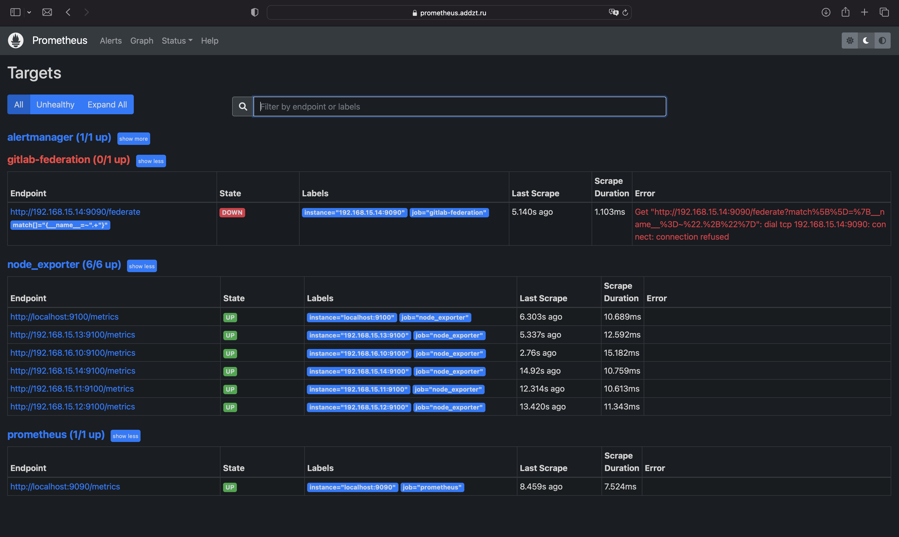

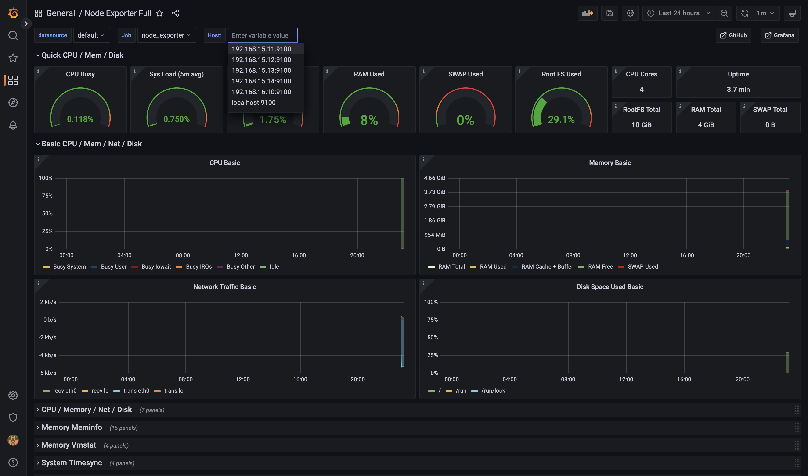
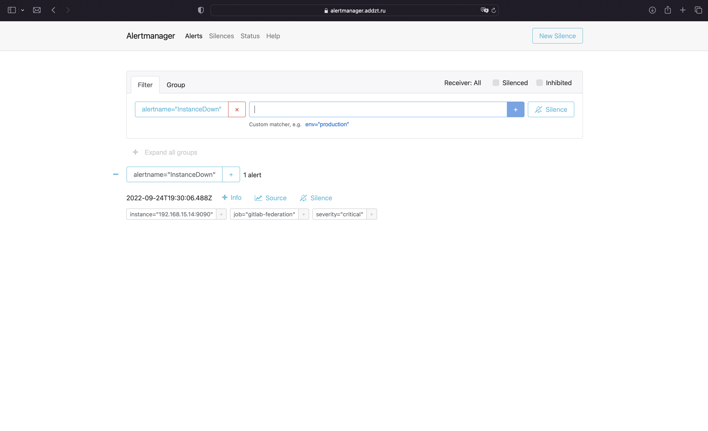

---

**Yandex-cloud**

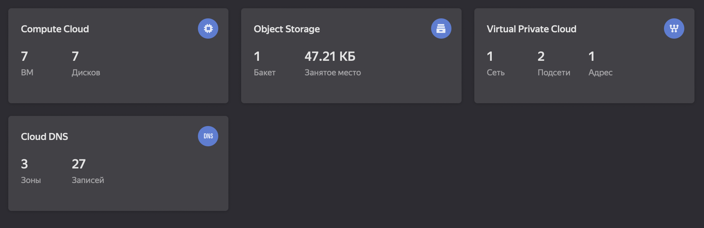
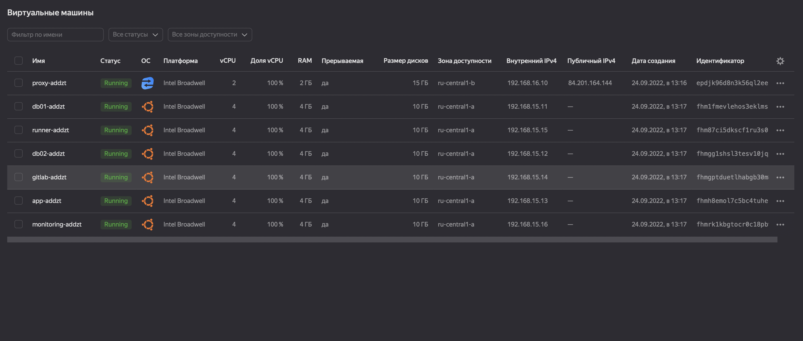
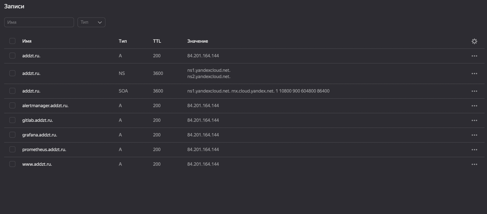
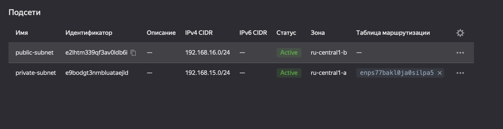

---