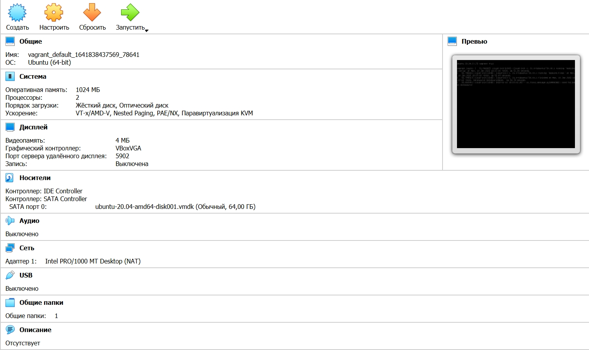
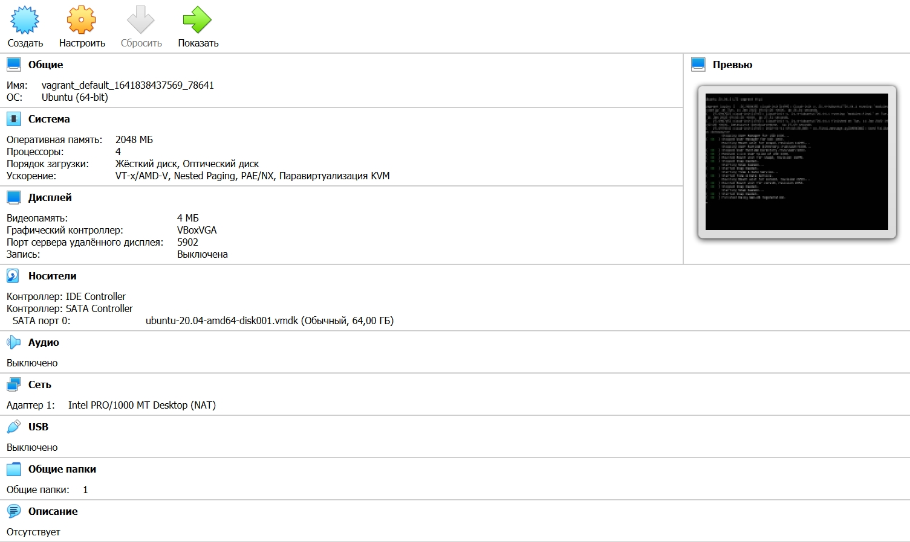

# Домашнее задание к занятию "3.1. Работа в терминале, лекция 1" 
### 1. Установите средство виртуализации Oracle VirtualBox.

Установил.

### 2. Установите средство автоматизации Hashicorp Vagrant.

Установил.

### 3. В вашем основном окружении подготовьте удобный для дальнейшей работы терминал.

Установил Windows Terminal при помощи winget.
```bash
winget install --id=Microsoft.WindowsTerminal -e
```

### 4. С помощью базового файла конфигурации запустите Ubuntu 20.04 в VirtualBox посредством Vagrant:
#### Создайте директорию, в которой будут храниться конфигурационные файлы Vagrant.
```bash
cd C:/
mkdir vagrant
```
#### В ней выполните `vagrant init`.
```bash
vagrant init
```
#### Замените содержимое Vagrantfile по умолчанию.
```bash
notepad vagrandfile 
```
```bash
Vagrant.configure("2") do |config|
 	config.vm.box = "bento/ubuntu-20.04"
 end
```
#### Выполнение в этой директории `vagrant up` установит провайдер VirtualBox для Vagrant, скачает необходимый образ и запустит виртуальную машину.
```bash
PS C:\vagrant> vagrant up
Bringing machine 'default' up with 'virtualbox' provider...
==> default: Checking if box 'bento/ubuntu-20.04' version '202112.19.0' is up to date...
==> default: Clearing any previously set forwarded ports...
==> default: Clearing any previously set network interfaces...
==> default: Preparing network interfaces based on configuration...
    default: Adapter 1: nat
    default: 22 (guest) => 2222 (host) (adapter 1)
==> default: Booting VM...
==> default: Waiting for machine to boot. This may take a few minutes...
    default: SSH address: 127.0.0.1:2222
    default: SSH username: vagrant
    default: SSH auth method: private key
    default: Warning: Connection reset. Retrying...
    default: Warning: Connection aborted. Retrying...
==> default: Machine booted and ready!
==> default: Checking for guest additions in VM...
==> default: Mounting shared folders...
    default: /vagrant => C:/vagrant
```
#### `vagrant suspend` выключит виртуальную машину с сохранением ее состояния (т.е., при следующем `vagrant up` будут запущены все процессы внутри, которые работали на момент вызова suspend), `vagrant halt` выключит виртуальную машину штатным образом.
```bash
PS C:\vagrant> vagrant suspend
==> default: Saving VM state and suspending execution...
```

### 5. Ознакомьтесь с графическим интерфейсом VirtualBox, посмотрите как выглядит виртуальная машина, которую создал для вас Vagrant, какие аппаратные ресурсы ей выделены. Какие ресурсы выделены по-умолчанию?

**Выделенные ресурсы:**
* Оперативная память: 1024 МБ
* Процессоры: 2
* Видеопамять: 4 МБ
* Графический контроллер: VBoxVGA

### 6. Ознакомьтесь с возможностями конфигурации VirtualBox через Vagrantfile: [документация](https://www.vagrantup.com/docs/providers/virtualbox/configuration). Как добавить оперативной памяти или ресурсов процессора виртуальной машине?

Для изменения ресурсов в конфиг необходимо добавить `config.vm.provider`.

```bash
notepad vagrandfile
```
```bash
Vagrant.configure("2") do |config|
    config.vm.box = "bento/ubuntu-20.04"
    config.vm.provider "virtualbox" do |v|
      v.memory = 2048
      v.cpus = 4
    end
end
```
Выключим виртуальную машину `vagrant halt` и перезапустим Vagrant `vagrant up`.  

**Результат**


### 7. Команда `vagrant ssh` из директории, в которой содержится Vagrantfile, позволит вам оказаться внутри виртуальной машины без каких-либо дополнительных настроек. Попрактикуйтесь в выполнении обсуждаемых команд в терминале Ubuntu.
```bash
PS C:\vagrant> vagrant ssh
Welcome to Ubuntu 20.04.3 LTS (GNU/Linux 5.4.0-91-generic x86_64)

 * Documentation:  https://help.ubuntu.com
 * Management:     https://landscape.canonical.com
 * Support:        https://ubuntu.com/advantage

  System information as of Tue 11 Jan 2022 09:09:58 AM UTC

  System load:  0.0                Processes:             132
  Usage of /:   11.1% of 30.88GB   Users logged in:       0
  Memory usage: 11%                IPv4 address for eth0: 10.0.2.15
  Swap usage:   0%


This system is built by the Bento project by Chef Software
More information can be found at https://github.com/chef/bento
```
### 8. Ознакомиться с разделами `man bash`, почитать о настройках самого bash:
#### какой переменной можно задать длину журнала history, и на какой строчке manual это описывается?
* Поищем упоминание history `man bash | grep -n history`.
```bash
798:              The  maximum  number  of  lines contained in the history file.  When this variable is assigned a value, the histor
800:              history  file  is  also truncated to this size after writing it when a shell exits. 
```
* Используем `man bash | cat -n | sed -n '795,805'p`.
```bash
   795                The name of the file in which command history is saved (see HISTORY below).  The default value is  ~/.bash_history.
   796                If unset, the command history is not saved when a shell exits.
   797         HISTFILESIZE
   798                The  maximum  number  of  lines contained in the history file.  When this variable is assigned a value, the history
   799                file is truncated, if necessary, to contain no more than that number of lines by removing the oldest entries.   The
   800                history  file  is  also truncated to this size after writing it when a shell exits.  If the value is 0, the history
   801                file is truncated to zero size.  Non-numeric values and numeric values less  than  zero  inhibit  truncation.   The
   802                shell sets the default value to the value of HISTSIZE after reading any startup files.
   803         HISTIGNORE
   804                A  colon-separated  list  of patterns used to decide which command lines should be saved on the history list.  Each
   805                pattern is anchored at the beginning of the line and must match the complete line (no implicit  `*'  is  appended).
```
Переменной `HISTFILESIZE` можно задать длину журнала `history`. Описывается на строчках 797-802.

#### что делает директива `ignoreboth` в bash?
* `man bash | grep -in -C 3 ignoreboth`
```bash 
785-       HISTCONTROL
786-              A colon-separated list of values controlling how commands are saved on the history list.  If the list of values in‐
787-              cludes ignorespace, lines which begin with a space character are not saved in the history list.   A  value  of  ig‐
788:              noredups  causes lines matching the previous history entry to not be saved.  A value of ignoreboth is shorthand for
789-              ignorespace and ignoredups.  A value of erasedups causes all previous lines matching the current line to be removed
790-              from  the  history  list before that line is saved.  Any value not in the above list is ignored.  If HISTCONTROL is
791-              unset, or does not include a valid value, all lines read by the shell parser are saved on the history list, subject
```
Опция `HISTCONTROL` контролирует каким образом список команд сохраняется в истории.  
`ignorespace` — не сохранять строки начинающиеся с символа <пробел>.  
`ignoredups` — не сохранять строки, совпадающие с последней выполненной командой.  
Значение `ignoreboth` является сокращением для `ignorespace` и `ignoredups`. 

### 9. В каких сценариях использования применимы скобки `{}` и на какой строчке `man bash` это описано?
```bash
man bash | grep -n {
```
```bash
man bash | sed -n '240,260'p
```
```bash
        { list; }
              list is simply executed in the current shell environment.  list must be terminated with  a  newline  or  semicolon.
              This  is known as a group command.  The return status is the exit status of list.  Note that unlike the metacharac‐
              ters ( and ), { and } are reserved words and must occur where a reserved word is permitted to be recognized.  Since
              they do not cause a word break, they must be separated from list by whitespace or another shell metacharacter.

```
Фигурные скобки используются для вызова списка. Описывается на строке 247.

### 10. С учётом ответа на предыдущий вопрос, как создать однократным вызовом touch 100000 файлов? Получится ли аналогичным образом создать 300000? Если нет, то почему?
```bash
touch {1..100000}
```
100000 файлов успешно создалось, на 300000 получил: 
```bash
-bash: /usr/bin/touch: Argument list too long
```
Посмотрим на ограничение количества аргументов:
```bash
getconf ARG_MAX
2097152
```

### 11. В man bash поищите по `/\[\[`. 
```bash
man bash | grep "\[\["
```
```bash
       ! case  coproc  do done elif else esac fi for function if in select then until while { } time [[ ]]
       [[ expression ]]
              not performed on the words between the [[ and ]]; tilde expansion, parameter and variable expansion, arithmetic ex‐
              When used with [[, the < and > operators sort lexicographically using the current locale.
              An array variable whose members are assigned by the =~ binary operator to the [[ conditional command.  The  element
              the [, test, and [[ commands.  Full pathnames in the command hash table are not subject to  EXECIGNORE.   Use  this
       Conditional expressions are used by the [[ compound command and the test and [ builtin commands to  test  file  attributes
       When  used  with  [[, the < and > operators sort lexicographically using the current locale.  The test command sorts using
              [[ command, this performs pattern matching as described above (Compound Commands).
              and arg2 may be positive or negative integers.  When used with the [[ command,  Arg1  and  Arg2  are  evaluated  as
                      If  set, bash changes its behavior to that of version 3.1 with respect to quoted arguments to the [[ condi‐
                      tional command's =~ operator and locale-specific string comparison when using the [[ conditional  command's
                      when  using the [[ conditional command's < and > operators (see previous item) and the effect of interrupt‐
                      when using the [[ conditional command's < and > operators (see description of compat31) and the  effect  of
                      or [[ conditional commands, when performing pattern substitution word expansions, or when filtering  possi‐
       trap [-lp] [[arg] sigspec ...] 
```      
#### Что делает конструкция `[[ -d /tmp ]]`?
-d это оператор для проверки, существует ли данный каталог или нет.
```bash
[[ -d /tmp ]] && echo true
true
```

### 12. Основываясь на знаниях о просмотре текущих (например, PATH) и установке новых переменных; командах, которые мы рассматривали, добейтесь в выводе type -a bash в виртуальной машине наличия первым пунктом в списке:
```bash
bash is /tmp/new_path_directory/bash
bash is /usr/local/bin/bash
bash is /bin/bash
```
Посмотрим на `type -a bash`
```bash
type -a bash
bash is /usr/bin/bash
bash is /bin/bash
```
Создадим новую директорию, переместим в нее bash и установим переменную.
```bash
mkdir /tmp/new_path_directory
cp /bin/bash /tmp/new_path_directory/bash
export PATH="/tmp/new_path_directory:$PATH"
```
```bash
type -a bash
bash is /tmp/new_path_directory/bash
bash is /usr/bin/bash
bash is /bin/bash
```
### 13. Чем отличается планирование команд с помощью batch и at?
Команда `at` используется для планирования выполнения задач и команд на определенное время в будущем, а `batch` указывает системе запускать задание только в указанное время, если загрузка системы находится на определенном уровне.

### 14. Завершите работу виртуальной машины чтобы не расходовать ресурсы компьютера и/или батарею ноутбука.

```bash
 exit
logout
Connection to 127.0.0.1 closed.
PS C:\vagrant> vagrant halt
==> default: Attempting graceful shutdown of VM...
```