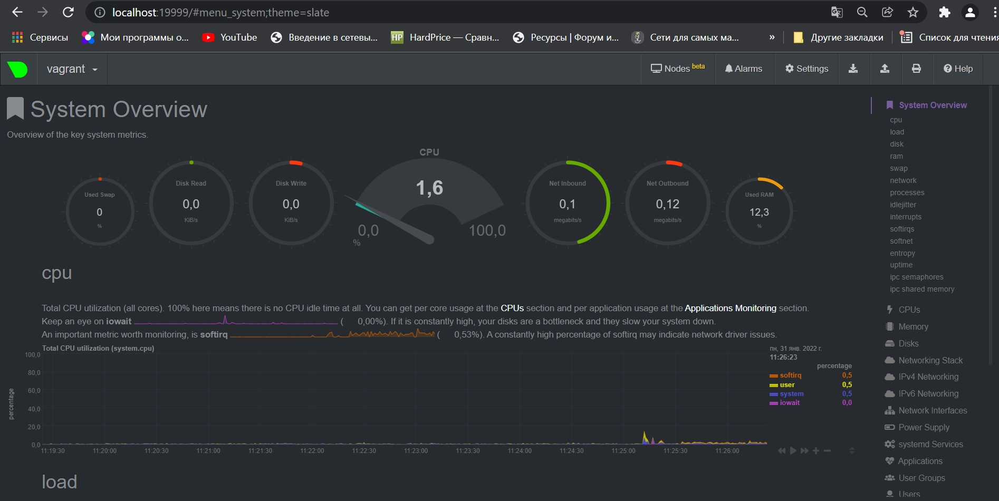

#  Домашнее задание к занятию "3.4. Операционные системы, лекция 2"

### 1. На лекции мы познакомились с [node_exporter](https://github.com/prometheus/node_exporter/releases). В демонстрации его исполняемый файл запускался в background. Этого достаточно для демо, но не для настоящей production-системы, где процессы должны находиться под внешним управлением. Используя знания из лекции по systemd, создайте самостоятельно простой [unit-файл](https://www.freedesktop.org/software/systemd/man/systemd.service.html) для node_exporter:
    
* поместите его в автозагрузку,
* предусмотрите возможность добавления опций к запускаемому процессу через внешний файл (посмотрите, например, на `systemctl cat cron`),
* удостоверьтесь, что с помощью systemctl процесс корректно стартует, завершается, а после перезагрузки автоматически поднимается.

Скачиваем `node_exporter` и распаковываем его.
```bash
vagrant@vagrant:/tmp$ wget https://github.com/prometheus/node_exporter/releases/download/v1.3.1/node_exporter-1.3.1.linux-amd64.tar.g
z
```

```bash
vagrant@vagrant:/tmp$ tar -xvf node_exporter-1.3.1.linux-amd64.tar.gz
node_exporter-1.3.1.linux-amd64/
node_exporter-1.3.1.linux-amd64/LICENSE
node_exporter-1.3.1.linux-amd64/NOTICE
node_exporter-1.3.1.linux-amd64/node_exporter
```

Переместим бинарный файл в `usr/local/bin`.

```bash
vagrant@vagrant:/tmp$ sudo mv node_exporter-1.3.1.linux-amd64/node_exporter /usr/local/bin/
```

Создадим системного пользователя `node_exporter`.

```bash
vagrant@vagrant:/usr/local/bin$ sudo useradd -rs /bin/false node_exporter
```

Создадим unit-файл и настроим его для пользователя `node_exporter`.

```bash
vagrant@vagrant:/usr/local/bin$ sudo nano /etc/systemd/system/node_exporter.service
```

```bash
[Unit]
Description=Node Exporter
After=network.target

[Service]
User=node_exporter
Group=node_exporter
Type=simple
ExecStart=/usr/local/bin/node_exporter

[Install]
WantedBy=multi-user.target
```
Перезагрузим демон и включим автозапуск.

```bash
sudo systemctl daemon-reload 
vagrant@vagrant:/usr/local/bin$ sudo systemctl enable --now node_exporter.service
Created symlink /etc/systemd/system/multi-user.target.wants/node_exporter.service → /etc/systemd/system/node_exporter.service.
```

Проверим статус `node_exporter`

```bash
sudo systemctl status node_exporter
● node_exporter.service - Node Exporter
     Loaded: loaded (/etc/systemd/system/node_exporter.service; enabled; vendor preset: enabled)
     Active: active (running) since Sun 2022-01-30 18:21:38 UTC; 1min 28s ago
   Main PID: 1692 (node_exporter)
      Tasks: 5 (limit: 2278)
     Memory: 2.6M
     CGroup: /system.slice/node_exporter.service
             └─1692 /usr/local/bin/node_exporter

Jan 30 18:21:38 vagrant node_exporter[1692]: ts=2022-01-30T18:21:38.779Z caller=node_exporter.go:115 level=info collector=thermal_zo>
Jan 30 18:21:38 vagrant node_exporter[1692]: ts=2022-01-30T18:21:38.779Z caller=node_exporter.go:115 level=info collector=time
Jan 30 18:21:38 vagrant node_exporter[1692]: ts=2022-01-30T18:21:38.779Z caller=node_exporter.go:115 level=info collector=timex
Jan 30 18:21:38 vagrant node_exporter[1692]: ts=2022-01-30T18:21:38.779Z caller=node_exporter.go:115 level=info collector=udp_queues
Jan 30 18:21:38 vagrant node_exporter[1692]: ts=2022-01-30T18:21:38.779Z caller=node_exporter.go:115 level=info collector=uname
Jan 30 18:21:38 vagrant node_exporter[1692]: ts=2022-01-30T18:21:38.779Z caller=node_exporter.go:115 level=info collector=vmstat
Jan 30 18:21:38 vagrant node_exporter[1692]: ts=2022-01-30T18:21:38.779Z caller=node_exporter.go:115 level=info collector=xfs
Jan 30 18:21:38 vagrant node_exporter[1692]: ts=2022-01-30T18:21:38.779Z caller=node_exporter.go:115 level=info collector=zfs
Jan 30 18:21:38 vagrant node_exporter[1692]: ts=2022-01-30T18:21:38.779Z caller=node_exporter.go:199 level=info msg="Listening on" a>
Jan 30 18:21:38 vagrant node_exporter[1692]: ts=2022-01-30T18:21:38.780Z caller=tls_config.go:195 level=info msg="TLS is disabled." >
```

Перезагрузим машину для проверки автозапуска.

```bash
vagrant@vagrant:/usr/local/bin$ sudo reboot
Connection to 127.0.0.1 closed by remote host.
Connection to 127.0.0.1 closed.

vagrant@vagrant:~$ sudo systemctl status node_exporter
Active: active (running) since Sun 2022-01-30 18:30:00 UTC; 1min 4s ago
```

2. Ознакомьтесь с опциями node_exporter и выводом `/metrics` по-умолчанию. Приведите несколько опций, которые вы бы выбрали для базового мониторинга хоста по CPU, памяти, диску и сети.

```bash
vagrant@vagrant:~$ curl http://localhost:9100/metrics
```

Много всего, поэтому:

`CPU`

```bash
vagrant@vagrant:~$ curl http://localhost:9100/metrics | grep cpu
```
* node_cpu_seconds_total{cpu="0",mode="idle"} 1111.71
* node_cpu_seconds_total{cpu="0",mode="iowait"} 12.17
* node_cpu_seconds_total{cpu="0",mode="system"} 8.44
* node_cpu_seconds_total{cpu="0",mode="user"} 2.03
* process_cpu_seconds_total 8.64


`Memory`

```bash
curl http://localhost:9100/metrics | grep memory
```

* node_memory_MemAvailable_bytes 1.76101376e+09
* node_memory_MemFree_bytes 1.30914304e+09
* node_memory_MemTotal_bytes 2.083627008e+09
* node_memory_Mlocked_bytes 1.8972672e+07

`Disk`

```bash
curl http://localhost:9100/metrics | grep disk
```

* node_disk_io_time_seconds_total{device="sda"} 49.788000000000004
* node_disk_read_bytes_total{device="sda"} 4.6875648e+08
* node_disk_read_time_seconds_total{device="sda"} 132.02100000000002
* node_disk_write_time_seconds_total{device="sda"} 18.415
* node_disk_written_bytes_total{device="sda"} 2.115584e+07

`Network`

```bash
curl http://localhost:9100/metrics | grep network
```

* node_network_receive_bytes_total{device="eth0"} 1.039698e+06
* node_network_receive_drop_total{device="eth0"} 0
* node_network_receive_errs_total{device="eth0"} 0
* node_network_speed_bytes{device="eth0"} 1.25e+08
* node_network_transmit_bytes_total{device="eth0"} 220456
* node_network_transmit_drop_total{device="eth0"} 0
* node_network_transmit_errs_total{device="eth0"} 0

### 3. Установите в свою виртуальную машину [Netdata](https://github.com/netdata/netdata). Воспользуйтесь [готовыми пакетами](https://packagecloud.io/netdata/netdata/install) для установки (`sudo apt install -y netdata`). После успешной установки:

* в конфигурационном файле `/etc/netdata/netdata.conf` в секции [web] замените значение с localhost на `bind to = 0.0.0.0`,
* добавьте в Vagrantfile проброс порта Netdata на свой локальный компьютер и сделайте `vagrant reload`:

```bash
config.vm.network "forwarded_port", guest: 19999, host: 19999
```

После успешной перезагрузки в браузере *на своем ПК* (не в виртуальной машине) вы должны суметь зайти на `localhost:19999`. Ознакомьтесь с метриками, которые по умолчанию собираются Netdata и с комментариями, которые даны к этим метрикам.

Установим `Netdata`.

```bash
sudo apt install -y netdata
```

Внесем изменения в конфиг `/etc/netdata/netdata.conf`.

```bash
bind socket to IP = 0.0.0.0
```

Пробросим порт 19999. Внесем изменения в `Vagrantfile`.

```bash
config.vm.network "forwarded_port", guest: 19999, host: 19999
```

Перезапустим машину.

```bash
vagrant reload
```

Перейдем в браузере на `http://localhost:19999/`.



### 4. Можно ли по выводу `dmesg` понять, осознает ли ОС, что загружена не на настоящем оборудовании, а на системе виртуализации?

Да, осознает.

```bash
vagrant@vagrant:~$ dmesg | grep virtual
[    0.005310] CPU MTRRs all blank - virtualized system.
[    0.046812] Booting paravirtualized kernel on KVM
[   19.494935] systemd[1]: Detected virtualization oracle.
```

### 5. Как настроен sysctl `fs.nr_open` на системе по-умолчанию? Узнайте, что означает этот параметр. Какой другой существующий лимит не позволит достичь такого числа (`ulimit --help`)?

Верхний предел на количество файлов дескрипторов.

```bash
vagrant@vagrant:~$ sysctl -n fs.nr_open
1048576
```

Общесистемное ограничение на количество открытых файлов для всех процессов.

```bash
vagrant@vagrant:~$ cat /proc/sys/fs/file-max
9223372036854775807
```

Программные значения `ulimit`.

```bash
vagrant@vagrant:~$ ulimit -aS
core file size          (blocks, -c) 0
data seg size           (kbytes, -d) unlimited
scheduling priority             (-e) 0
file size               (blocks, -f) unlimited
pending signals                 (-i) 7595
max locked memory       (kbytes, -l) 65536
max memory size         (kbytes, -m) unlimited
open files                      (-n) 1024
pipe size            (512 bytes, -p) 8
POSIX message queues     (bytes, -q) 819200
real-time priority              (-r) 0
stack size              (kbytes, -s) 8192
cpu time               (seconds, -t) unlimited
max user processes              (-u) 7595
virtual memory          (kbytes, -v) unlimited
file locks                      (-x) unlimited
```

Аппаратные значения `ulimit`.

```bash
vagrant@vagrant:~$ ulimit -aH
core file size          (blocks, -c) unlimited
data seg size           (kbytes, -d) unlimited
scheduling priority             (-e) 0
file size               (blocks, -f) unlimited
pending signals                 (-i) 7595
max locked memory       (kbytes, -l) 65536
max memory size         (kbytes, -m) unlimited
open files                      (-n) 1048576
pipe size            (512 bytes, -p) 8
POSIX message queues     (bytes, -q) 819200
real-time priority              (-r) 0
stack size              (kbytes, -s) unlimited
cpu time               (seconds, -t) unlimited
max user processes              (-u) 7595
virtual memory          (kbytes, -v) unlimited
file locks                      (-x) unlimited
```

### 6. Запустите любой долгоживущий процесс (не `ls`, который отработает мгновенно, а, например, `sleep 1h`) в отдельном неймспейсе процессов; покажите, что ваш процесс работает под PID 1 через `nsenter`. Для простоты работайте в данном задании под root (`sudo -i`). Под обычным пользователем требуются дополнительные опции (`--map-root-user`) и т.д.

```bash
root@vagrant:~# unshare -f --pid --mount-proc sleep 1h &
[2] 2529
root@vagrant:~# ps -e | grep sleep
   2229 pts/1    00:00:00 sleep
   2398 pts/1    00:00:00 sleep
   2523 pts/2    00:00:00 sleep
   2530 pts/2    00:00:00 sleep
root@vagrant:~# nsenter --target 2530 --pid --mount
root@vagrant:/# ps aux
USER         PID %CPU %MEM    VSZ   RSS TTY      STAT START   TIME COMMAND
root           1  0.0  0.0   5476   592 pts/2    S    13:30   0:00 sleep 1h
root           2  0.2  0.2   7236  4188 pts/2    S    13:31   0:00 -bash
root          13  0.0  0.1   8892  3376 pts/2    R+   13:31   0:00 ps aux
root@vagrant:/#
```

### 7. Найдите информацию о том, что такое `:(){ :|:& };:`. Запустите эту команду в своей виртуальной машине Vagrant с Ubuntu 20.04 (**это важно, поведение в других ОС не проверялось**). Некоторое время все будет "плохо", после чего (минуты) – ОС должна стабилизироваться. Вызов `dmesg` расскажет, какой механизм помог автоматической стабилизации. Как настроен этот механизм по-умолчанию, и как изменить число процессов, которое можно создать в сессии?

`:(){ :|:& };:` - это функция, которая параллельно пускает два своих экземпляра. Каждый пускает ещё по два и т.д. (fork-бомба).  
Fork-бомба — вредоносная или ошибочно написанная программа, бесконечно создающая свои копии (системным вызовом fork()), которые обычно также начинают создавать свои копии и т. д.  
Выполнение такой программы может вызывать большую нагрузку вычислительной системы или даже отказ в обслуживании вследствие нехватки системных ресурсов (дескрипторов процессов, памяти, процессорного времени), что и является целью.

```bash
vagrant@vagrant:~$ dmesg | grep fork
[11801.192772] cgroup: fork rejected by pids controller in /user.slice/user-1000.slice/session-5.scope
```

Изменить число процессов можно с помощью `ulimit -u N`, где N - количество процессов.