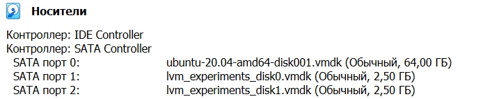

# Домашнее задание к занятию "3.5. Файловые системы"

### 1. Узнайте о [sparse](https://ru.wikipedia.org/wiki/%D0%A0%D0%B0%D0%B7%D1%80%D0%B5%D0%B6%D1%91%D0%BD%D0%BD%D1%8B%D0%B9_%D1%84%D0%B0%D0%B9%D0%BB) (разряженных) файлах.

Разреженные файлы являются специальным форматом представления, в котором часть цифровой последовательности заменена сведениями о ней (сформирован перечень дыр), что в свою очередь позволяет гораздо эффективнее задействовать возможности файловой системы. Информация об отсутствующих последовательностях располагается напрямую в метаданных файловой системы, а не занятый высвободившийся объем запоминающего устройства будет использоваться для записи по мере надобности. Такой подход значительно сокращает объем исходного файла и экономит пространство накопителя.

### 2. Могут ли файлы, являющиеся жесткой ссылкой на один объект, иметь разные права доступа и владельца? Почему?

Создадим новый файл и жесткую ссылку к нему.

```bash
vagrant@vagrant:~$ touch file_1
vagrant@vagrant:~$ ln file_1 file_2
```

Посмотрим inode файлов.

```bash
vagrant@vagrant:~$ stat file_1
  File: file_1
  Size: 0               Blocks: 0          IO Block: 4096   regular empty file
Device: fd00h/64768d    Inode: 1151676     Links: 2
Access: (0664/-rw-rw-r--)  Uid: ( 1000/ vagrant)   Gid: ( 1000/ vagrant)
Access: 2022-02-03 14:36:59.478679590 +0000
Modify: 2022-02-03 14:36:59.478679590 +0000
Change: 2022-02-03 14:37:17.563717592 +0000
 Birth: -
vagrant@vagrant:~$ stat file_2
  File: file_2
  Size: 0               Blocks: 0          IO Block: 4096   regular empty file
Device: fd00h/64768d    Inode: 1151676     Links: 2
Access: (0664/-rw-rw-r--)  Uid: ( 1000/ vagrant)   Gid: ( 1000/ vagrant)
Access: 2022-02-03 14:36:59.478679590 +0000
Modify: 2022-02-03 14:36:59.478679590 +0000
Change: 2022-02-03 14:37:17.563717592 +0000
 Birth: -
```

Inode и права у файлов одинаковые. Изменим права у `file_1` (разрешим выполнение для владельца файла).

```bash
vagrant@vagrant:~$ chmod u+x file_1
```

Снова проверим права.

```bash
vagrant@vagrant:~$ ls -l
-rwxrw-r-- 2 vagrant vagrant     0 Feb  3 14:36 file_1
-rwxrw-r-- 2 vagrant vagrant     0 Feb  3 14:36 file_2
```

Право на выполнение появилось в двух файлах.

### 3. Сделайте `vagrant destroy` на имеющийся инстанс Ubuntu. Замените содержимое Vagrantfile следующим:

```bash
Vagrant.configure("2") do |config|
      config.vm.box = "bento/ubuntu-20.04"
      config.vm.provider :virtualbox do |vb|
        lvm_experiments_disk0_path = "/tmp/lvm_experiments_disk0.vmdk"
        lvm_experiments_disk1_path = "/tmp/lvm_experiments_disk1.vmdk"
        vb.customize ['createmedium', '--filename', lvm_experiments_disk0_path, '--size', 2560]
        vb.customize ['createmedium', '--filename', lvm_experiments_disk1_path, '--size', 2560]
        vb.customize ['storageattach', :id, '--storagectl', 'SATA Controller', '--port', 1, '--device', 0, '--type', 'hdd', '--medium', lvm_experiments_disk0_path]
        vb.customize ['storageattach', :id, '--storagectl', 'SATA Controller', '--port', 2, '--device', 0, '--type', 'hdd', '--medium', lvm_experiments_disk1_path]
      end
    end
```

Данная конфигурация создаст новую виртуальную машину с двумя дополнительными неразмеченными дисками по 2.5 Гб.



### 4. Используя `fdisk`, разбейте первый диск на 2 раздела: 2 Гб, оставшееся пространство.

```bash
vagrant@vagrant:~$ sudo fdisk -l
vagrant@vagrant:~$ sudo fdisk /dev/sdb

Welcome to fdisk (util-linux 2.34).
Changes will remain in memory only, until you decide to write them.
Be careful before using the write command.

Device does not contain a recognized partition table.
Created a new DOS disklabel with disk identifier 0xbad3fdf8.

Command (m for help):
```

```bash
Command (m for help): g
Created a new GPT disklabel (GUID: EA6ACBD4-CA7E-684C-8697-E65330EBCACF).
```

Через `n` добавляем две новые партиции. На выходе:

```bash
Command (m for help): p
Disk /dev/sdb: 2.51 GiB, 2684354560 bytes, 5242880 sectors
Disk model: VBOX HARDDISK
Units: sectors of 1 * 512 = 512 bytes
Sector size (logical/physical): 512 bytes / 512 bytes
I/O size (minimum/optimal): 512 bytes / 512 bytes
Disklabel type: gpt
Disk identifier: EA6ACBD4-CA7E-684C-8697-E65330EBCACF

Device       Start     End Sectors  Size Type
/dev/sdb1     2048 4196351 4194304    2G Linux filesystem
/dev/sdb2  4196352 5242846 1046495  511M Linux filesystem

Command (m for help): w
The partition table has been altered.
Calling ioctl() to re-read partition table.
Syncing disks.
```

### 5. Используя `sfdisk`, перенесите данную таблицу разделов на второй диск.

```bash
vagrant@vagrant:~$ sudo -i
root@vagrant:~# sfdisk -d /dev/sdb | sfdisk /dev/sdc
...
Device       Start     End Sectors  Size Type
/dev/sdc1     2048 4196351 4194304    2G Linux filesystem
/dev/sdc2  4196352 5242846 1046495  511M Linux filesystem

The partition table has been altered.
Calling ioctl() to re-read partition table.
Syncing disks.
```

### 6. Соберите `mdadm` RAID1 на паре разделов 2 Гб.

```bash
root@vagrant:~# mdadm --create --verbose /dev/md0 -l 1 -n 2 /dev/sdb1 /dev/sdc1
mdadm: Note: this array has metadata at the start and
    may not be suitable as a boot device.  If you plan to
    store '/boot' on this device please ensure that
    your boot-loader understands md/v1.x metadata, or use
    --metadata=0.90
mdadm: size set to 2094080K
Continue creating array? y
mdadm: Defaulting to version 1.2 metadata
mdadm: array /dev/md0 started.
```

Проверяем.

```bash
root@vagrant:~# lsblk
NAME                      MAJ:MIN RM  SIZE RO TYPE  MOUNTPOINT
loop0                       7:0    0 55.4M  1 loop  /snap/core18/2128
loop1                       7:1    0 70.3M  1 loop  /snap/lxd/21029
loop2                       7:2    0 32.3M  1 loop  /snap/snapd/12704
sda                         8:0    0   64G  0 disk
├─sda1                      8:1    0    1M  0 part
├─sda2                      8:2    0    1G  0 part  /boot
└─sda3                      8:3    0   63G  0 part
  └─ubuntu--vg-ubuntu--lv 253:0    0 31.5G  0 lvm   /
sdb                         8:16   0  2.5G  0 disk
├─sdb1                      8:17   0    2G  0 part
│ └─md0                     9:0    0    2G  0 raid1
└─sdb2                      8:18   0  511M  0 part
sdc                         8:32   0  2.5G  0 disk
├─sdc1                      8:33   0    2G  0 part
│ └─md0                     9:0    0    2G  0 raid1
└─sdc2                      8:34   0  511M  0 part
```

### 7. Соберите `mdadm` RAID0 на второй паре маленьких разделов.

```bash
root@vagrant:~# mdadm --create --verbose /dev/md1 -l 0 -n 2 /dev/sdb2 /dev/sdc2
mdadm: chunk size defaults to 512K
mdadm: Defaulting to version 1.2 metadata
mdadm: array /dev/md1 started.
```

Проверяем.

```bash
root@vagrant:~# lsblk
NAME                      MAJ:MIN RM  SIZE RO TYPE  MOUNTPOINT
loop0                       7:0    0 55.4M  1 loop  /snap/core18/2128
loop1                       7:1    0 70.3M  1 loop  /snap/lxd/21029
loop2                       7:2    0 32.3M  1 loop  /snap/snapd/12704
sda                         8:0    0   64G  0 disk
├─sda1                      8:1    0    1M  0 part
├─sda2                      8:2    0    1G  0 part  /boot
└─sda3                      8:3    0   63G  0 part
  └─ubuntu--vg-ubuntu--lv 253:0    0 31.5G  0 lvm   /
sdb                         8:16   0  2.5G  0 disk
├─sdb1                      8:17   0    2G  0 part
│ └─md0                     9:0    0    2G  0 raid1
└─sdb2                      8:18   0  511M  0 part
  └─md1                     9:1    0 1017M  0 raid0
sdc                         8:32   0  2.5G  0 disk
├─sdc1                      8:33   0    2G  0 part
│ └─md0                     9:0    0    2G  0 raid1
└─sdc2                      8:34   0  511M  0 part
  └─md1                     9:1    0 1017M  0 raid0
```

### 8. Создайте 2 независимых PV на получившихся md-устройствах.

```bash
root@vagrant:~# pvcreate /dev/md0
  Physical volume "/dev/md0" successfully created.
root@vagrant:~# pvcreate /dev/md1
  Physical volume "/dev/md1" successfully created.
```

### 9. Создайте общую volume-group на этих двух PV.

```bash
root@vagrant:~# vgcreate vgroup /dev/md0 /dev/md1
  Volume group "vgroup" successfully created
```

### 10. Создайте LV размером 100 Мб, указав его расположение на PV с RAID0.

```bash
root@vagrant:~# lvcreate -L 100M vgroup /dev/md1
  Logical volume "lvol0" created.
```

### 11. Создайте `mkfs.ext4` ФС на получившемся LV.

```bash
root@vagrant:~# mkfs.ext4 /dev/vgroup/lvl0
mke2fs 1.45.5 (07-Jan-2020)
The file /dev/vgroup/lvl0 does not exist and no size was specified.
root@vagrant:~# mkfs.ext4 /dev/vgroup/lvol0
mke2fs 1.45.5 (07-Jan-2020)
Creating filesystem with 25600 4k blocks and 25600 inodes

Allocating group tables: done
Writing inode tables: done
Creating journal (1024 blocks): done
Writing superblocks and filesystem accounting information: done
```

### 12. Смонтируйте этот раздел в любую директорию, например, `/tmp/new`.

```bash
root@vagrant:~# mkdir /tmp/new
root@vagrant:~# mount /dev/vgroup/lvol0 /tmp/new
```

### 13. Поместите туда тестовый файл, например `wget https://mirror.yandex.ru/ubuntu/ls-lR.gz -O /tmp/new/test.gz`.

```bash
root@vagrant:~# wget https://mirror.yandex.ru/ubuntu/ls-lR.gz -O /tmp/new/test.gz
--2022-02-09 10:21:17--  https://mirror.yandex.ru/ubuntu/ls-lR.gz
Resolving mirror.yandex.ru (mirror.yandex.ru)... 213.180.204.183, 2a02:6b8::183
Connecting to mirror.yandex.ru (mirror.yandex.ru)|213.180.204.183|:443... connected.
HTTP request sent, awaiting response... 200 OK
Length: 22281089 (21M) [application/octet-stream]
Saving to: ‘/tmp/new/test.gz’

/tmp/new/test.gz                  100%[==========================================================>]  21.25M  7.34MB/s    in 2.9s

2022-02-09 10:21:20 (7.34 MB/s) - ‘/tmp/new/test.gz’ saved [22281089/22281089]
```

### 14. Прикрепите вывод `lsblk`.

```bash
root@vagrant:~# lsblk
NAME                      MAJ:MIN RM  SIZE RO TYPE  MOUNTPOINT
loop0                       7:0    0 55.4M  1 loop  /snap/core18/2128
loop1                       7:1    0 70.3M  1 loop  /snap/lxd/21029
loop2                       7:2    0 32.3M  1 loop  /snap/snapd/12704
sda                         8:0    0   64G  0 disk
├─sda1                      8:1    0    1M  0 part
├─sda2                      8:2    0    1G  0 part  /boot
└─sda3                      8:3    0   63G  0 part
  └─ubuntu--vg-ubuntu--lv 253:0    0 31.5G  0 lvm   /
sdb                         8:16   0  2.5G  0 disk
├─sdb1                      8:17   0    2G  0 part
│ └─md0                     9:0    0    2G  0 raid1
└─sdb2                      8:18   0  511M  0 part
  └─md1                     9:1    0 1017M  0 raid0
    └─vgroup-lvol0        253:1    0  100M  0 lvm   /tmp/new
sdc                         8:32   0  2.5G  0 disk
├─sdc1                      8:33   0    2G  0 part
│ └─md0                     9:0    0    2G  0 raid1
└─sdc2                      8:34   0  511M  0 part
  └─md1                     9:1    0 1017M  0 raid0
    └─vgroup-lvol0        253:1    0  100M  0 lvm   /tmp/new
```

### 15. Протестируйте целостность файла:

```bash
root@vagrant:~# gzip -t /tmp/new/test.gz
root@vagrant:~# echo $?
0
```

```bash
root@vagrant:~# gzip -t /tmp/new/test.gz
root@vagrant:~# echo $?
0
```

### 16. Используя pvmove, переместите содержимое PV с RAID0 на RAID1.

```bash
root@vagrant:~# pvmove /dev/md1 /dev/md0
/dev/md1: Moved: 92.00%
```

### 17. Сделайте `--fail` на устройство в вашем RAID1 md.

```bash
root@vagrant:~# mdadm /dev/md0 --fail /dev/sdb1
mdadm: set /dev/sdb1 faulty in /dev/md0
```

### 18. Подтвердите выводом `dmesg`, что RAID1 работает в деградированном состоянии.

```bash
root@vagrant:~# dmesg
[10902.568277] md/raid1:md0: Disk failure on sdb1, disabling device.
               md/raid1:md0: Operation continuing on 1 devices.
```

### 19. Протестируйте целостность файла, несмотря на "сбойный" диск он должен продолжать быть доступен:
```bash
root@vagrant:~# gzip -t /tmp/new/test.gz
root@vagrant:~# echo $?
0
```

```bash
root@vagrant:~# gzip -t /tmp/new/test.gz
root@vagrant:~# echo $?
0
```

### 20. Погасите тестовый хост, `vagrant destroy`.

```bash
PS C:\vagrant> vagrant destroy
```

