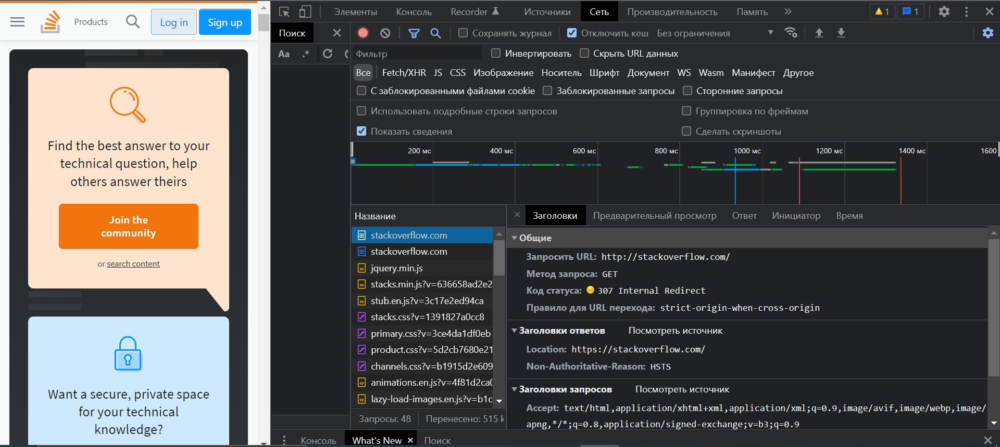
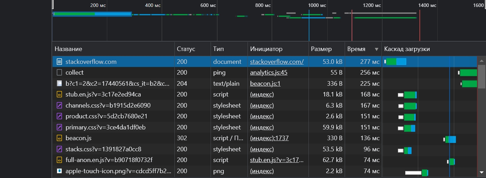

# Домашнее задание к занятию "3.6. Компьютерные сети, лекция 1"

### 1. Работа c HTTP через телнет.
- Подключитесь утилитой телнет к сайту stackoverflow.com
`telnet stackoverflow.com 80`
- отправьте HTTP запрос
```bash
GET /questions HTTP/1.0
HOST: stackoverflow.com
[press enter]
[press enter]
```
- В ответе укажите полученный HTTP код, что он означает?

```bash
HTTP/1.1 301 Moved Permanently
cache-control: no-cache, no-store, must-revalidate
location: https://stackoverflow.com/questions
x-request-guid: 20c412a7-6369-4440-b9c9-0395fa13bafb
feature-policy: microphone 'none'; speaker 'none'
content-security-policy: upgrade-insecure-requests; frame-ancestors 'self' https://stackexchange.com
Accept-Ranges: bytes
Date: Mon, 14 Feb 2022 07:04:20 GMT
Via: 1.1 varnish
Connection: close
X-Served-By: cache-hel1410034-HEL
X-Cache: MISS
X-Cache-Hits: 0
X-Timer: S1644822260.391476,VS0,VE110
Vary: Fastly-SSL
X-DNS-Prefetch-Control: off
Set-Cookie: prov=029c34c7-0714-7286-2d08-7312ec23b464; domain=.stackoverflow.com; expires=Fri, 01-Jan-2055 00:00:00 GMT; path=/; HttpOnly
```

`HTTP/1.1 301 Moved Permanently` - стандартный код ответа HTTP, получаемый в ответ от сервера в ситуации, когда запрошенный ресурс был на постоянной основе перемещён в новое месторасположение, и указывающий на то, что текущие ссылки, использующие данный URL, должны быть обновлены. Адрес нового месторасположения ресурса указывается в поле Location. В данном случае `location: https://stackoverflow.com/questions`

### 2. Повторите задание 1 в браузере, используя консоль разработчика F12.
- откройте вкладку `Network`
- отправьте запрос http://stackoverflow.com
- найдите первый ответ HTTP сервера, откройте вкладку `Headers`
- укажите в ответе полученный HTTP код.
- проверьте время загрузки страницы, какой запрос обрабатывался дольше всего?
- приложите скриншот консоли браузера в ответ.

Полученный ответ:


Дольше всего обрабатывался запрос к `https://stackoverflow.com/`


### 3. Какой IP адрес у вас в интернете?

Статический IPv4

### 4. Какому провайдеру принадлежит ваш IP адрес? Какой автономной системе AS? Воспользуйтесь утилитой `whois`

```bash
netname:        DOMOLAN-NET
descr:          Dynamic block of IP-addresses for PPP-client connections
country:        RU
admin-c:        DNO
tech-c:         DNO
status:         ASSIGNED PA
mnt-by:         MNT-DML
created:        2009-07-23T07:51:20Z
last-modified:  2009-07-23T07:51:20Z
source:         RIPE
```

### 5. Через какие сети проходит пакет, отправленный с вашего компьютера на адрес 8.8.8.8? Через какие AS? Воспользуйтесь утилитой `traceroute`

```bash
vagrant@vagrant:~$ traceroute --icmp -An 8.8.8.8
traceroute to 8.8.8.8 (8.8.8.8), 30 hops max, 60 byte packets
 1  10.0.2.2 [*]  1.610 ms  1.311 ms  0.911 ms
 2  192.168.2.1 [*]  2.822 ms  3.909 ms  3.782 ms
 3  192.168.1.1 [*]  3.646 ms  3.525 ms  3.401 ms
 4  10.8.1.207 [*]  4.026 ms  4.664 ms  3.789 ms
 5  10.1.7.10 [*]  4.419 ms  5.012 ms  4.160 ms
 6  142.250.167.232 [AS15169]  5.371 ms  11.273 ms  11.008 ms
 7  108.170.250.33 [AS15169]  10.734 ms  6.580 ms  7.867 ms
 8  * * *
 9  * * *
10  216.239.57.222 [AS15169]  27.974 ms  27.671 ms  27.400 ms
11  142.250.210.47 [AS15169]  29.703 ms  21.796 ms  19.283 ms
12  * * *
13  * * *
14  * * *
15  * * *
16  * * *
17  * * *
18  * * *
19  * 8.8.8.8 [AS15169]  20.414 ms *
```

### 6. Повторите задание 5 в утилите `mtr`. На каком участке наибольшая задержка - delay?

```bash
                                                                               Packets               Pings
 Host                                                                        Loss%   Snt   Last   Avg  Best  Wrst StDev
 1. 10.0.2.2                                                                  0.0%    31    2.4   4.1   1.8   6.2   1.0
 2. 192.168.2.1                                                               0.0%    31    7.1   7.5   2.9  14.2   2.3
 3. 192.168.1.1                                                               0.0%    31    5.9   6.6   4.4  11.9   1.7
 4. 10.8.1.207                                                                0.0%    31    7.1   9.8   3.5  40.7   7.4
 5. 10.1.7.10                                                                 0.0%    31    9.0   9.1   5.0  24.5   4.3
 6. 142.250.167.232                                                           0.0%    31    7.7   8.8   5.8  16.3   2.5
 7. 108.170.250.33                                                            0.0%    30    8.9   9.8   6.9  16.7   2.8
 8. 108.170.250.51                                                           89.7%    30    4.9  13.9   4.9  27.3  11.8
 9. 142.251.49.158                                                           55.2%    30   18.6  21.4  16.4  29.9   3.9
10. 216.239.57.222                                                            0.0%    30   24.8  24.3  20.4  37.6   3.6
11. 142.250.210.47                                                            0.0%    30   22.7  24.9  20.9  43.5   3.9
12. (waiting for reply)
13. (waiting for reply)
14. (waiting for reply)
15. (waiting for reply)
16. (waiting for reply)
17. (waiting for reply)
18. dns.google                                                               70.0%    30   21.8  23.5  19.5  29.3   3.3
```

Наибольшая задержка на 142.250.210.47 

### 7. Какие DNS сервера отвечают за доменное имя dns.google? Какие A записи? воспользуйтесь утилитой `dig`

```bash
vagrant@vagrant:~$ dig ns dns.google

; <<>> DiG 9.16.1-Ubuntu <<>> ns dns.google
;; global options: +cmd
;; Got answer:
;; ->>HEADER<<- opcode: QUERY, status: NOERROR, id: 8468
;; flags: qr rd ra ad; QUERY: 1, ANSWER: 4, AUTHORITY: 0, ADDITIONAL: 1

;; OPT PSEUDOSECTION:
; EDNS: version: 0, flags:; udp: 512
;; QUESTION SECTION:
;dns.google.                    IN      NS

;; ANSWER SECTION:
dns.google.             21600   IN      NS      ns2.zdns.google.
dns.google.             21600   IN      NS      ns1.zdns.google.
dns.google.             21600   IN      NS      ns4.zdns.google.
dns.google.             21600   IN      NS      ns3.zdns.google.

;; Query time: 24 msec
;; SERVER: 8.8.8.8#53(8.8.8.8)
;; WHEN: Thu Feb 10 11:07:35 UTC 2022
;; MSG SIZE  rcvd: 116
```

DNS сервера:
- ns2.zdns.google.
- ns1.zdns.google.
- ns4.zdns.google.
- ns3.zdns.google.

```bash
vagrant@vagrant:~$ dig dns.google

; <<>> DiG 9.16.1-Ubuntu <<>> dns.google
;; global options: +cmd
;; Got answer:
;; ->>HEADER<<- opcode: QUERY, status: NOERROR, id: 22788
;; flags: qr rd ra ad; QUERY: 1, ANSWER: 2, AUTHORITY: 0, ADDITIONAL: 1

;; OPT PSEUDOSECTION:
; EDNS: version: 0, flags:; udp: 512
;; QUESTION SECTION:
;dns.google.                    IN      A

;; ANSWER SECTION:
dns.google.             759     IN      A       8.8.4.4
dns.google.             759     IN      A       8.8.8.8

;; Query time: 24 msec
;; SERVER: 8.8.8.8#53(8.8.8.8)
;; WHEN: Thu Feb 10 11:13:11 UTC 2022
;; MSG SIZE  rcvd: 71 
```

A-записи:

- 8.8.8.8
- 8.8.4.4

### 8. Проверьте PTR записи для IP адресов из задания 7. Какое доменное имя привязано к IP? воспользуйтесь утилитой `dig`

```bash
vagrant@vagrant:~$ nslookup ns1.zdns.google.
Server:         8.8.8.8
Address:        8.8.8.8#53

Non-authoritative answer:
Name:   ns1.zdns.google
Address: 216.239.32.114
Name:   ns1.zdns.google
Address: 2001:4860:4802:32::72
```

```bash
vagrant@vagrant:~$ dig -x 216.239.32.114 +short
ns1.zdns.google. 
```