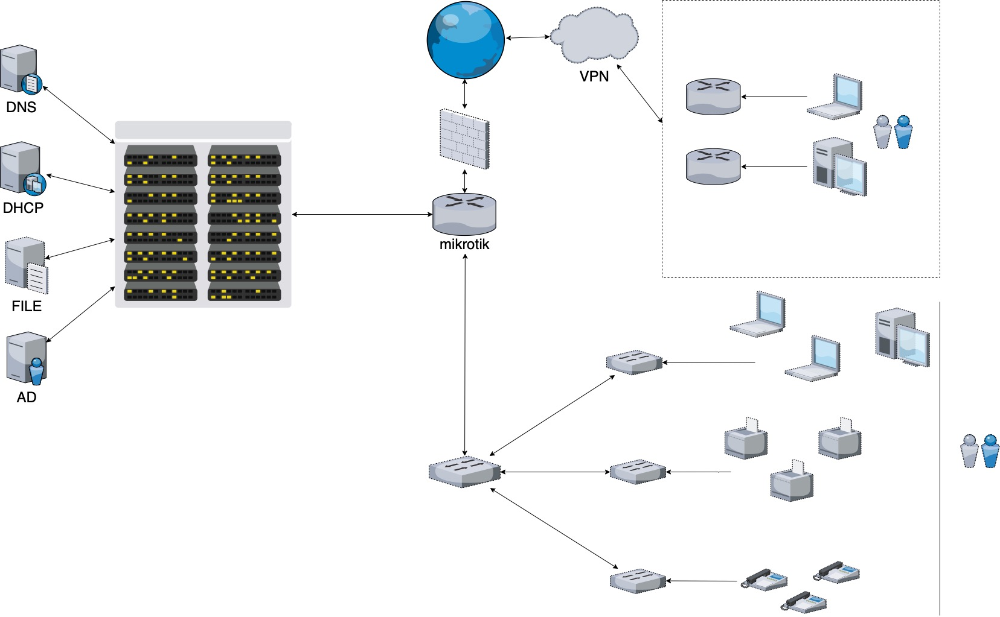

# Домашнее задание к занятию "3.8. Компьютерные сети, лекция 3"

### 1. Подключитесь к публичному маршрутизатору в интернет. Найдите маршрут к вашему публичному IP
```
telnet route-views.routeviews.org
Username: rviews
show ip route x.x.x.x/32
show bgp x.x.x.x/32
```

```bash
root@vagrant:~# telnet route-views.routeviews.org
Trying 128.223.51.103...
Connected to route-views.routeviews.org.
Escape character is '^]'.
C
**********************************************************************

                    RouteViews BGP Route Viewer
                    route-views.routeviews.org

 route views data is archived on http://archive.routeviews.org

 This hardware is part of a grant by the NSF.
 Please contact help@routeviews.org if you have questions, or
 if you wish to contribute your view.

 This router has views of full routing tables from several ASes.
 The list of peers is located at http://www.routeviews.org/peers
 in route-views.oregon-ix.net.txt

 NOTE: The hardware was upgraded in August 2014.  If you are seeing
 the error message, "no default Kerberos realm", you may want to
 in Mac OS X add "default unset autologin" to your ~/.telnetrc

 To login, use the username "rviews".

 **********************************************************************


User Access Verification

Username: rviews
route-views>show ip route 188.126.*.*
Routing entry for 188.126.*.*/20
  Known via "bgp 6447", distance 20, metric 0
  Tag 3303, type external
  Last update from 217.192.89.50 3d00h ago
  Routing Descriptor Blocks:
  * 217.192.89.50, from 217.192.89.50, 3d00h ago
      Route metric is 0, traffic share count is 1
      AS Hops 5
      Route tag 3303
      MPLS label: none
      
route-views>show bgp 188.126.*.*
BGP routing table entry for 188.126.*.*/20, version 328619653
Paths: (22 available, best #2, table default)
  Not advertised to any peer
  Refresh Epoch 1
  3333 31500 49368 49368 49368 49368
    193.0.0.56 from 193.0.0.56 (193.0.0.56)
      Origin IGP, localpref 100, valid, external
      path 7FE116291F70 RPKI State not found
      rx pathid: 0, tx pathid: 0
  Refresh Epoch 1
  3303 49368 49368 49368 49368
    217.192.89.50 from 217.192.89.50 (138.187.128.158)
      Origin IGP, localpref 100, valid, external, best
      Community: 3303:1004 3303:1006 3303:1030 3303:3056 35598:100
      path 7FE0D7BDBFF8 RPKI State not found
      rx pathid: 0, tx pathid: 0x0
  Refresh Epoch 1
  101 6939 35598 49368 49368 49368 49368
    209.124.176.223 from 209.124.176.223 (209.124.176.223)
      Origin IGP, localpref 100, valid, external
      Community: 101:20300 101:22100
      path 7FE0C8382548 RPKI State not found
      rx pathid: 0, tx pathid: 0
```

### 2. Создайте dummy0 интерфейс в Ubuntu. Добавьте несколько статических маршрутов. Проверьте таблицу маршрутизации.

```bash
root@vagrant:~# sudo modprobe -v dummy numdummies=2
insmod /lib/modules/5.4.0-89-generic/kernel/drivers/net/dummy.ko numdummies=0 numdummies=2
root@vagrant:~# lsmod | grep dummy
dummy                  16384  0
root@vagrant:~# ifconfig -a | grep dummy
dummy0: flags=130<BROADCAST,NOARP>  mtu 1500
dummy1: flags=130<BROADCAST,NOARP>  mtu 1500
root@vagrant:~# sudo ip addr add 192.168.1.150/24 dev dummy0
root@vagrant:~# sudo ip link set dummy0 address 00:00:00:11:11:11
root@vagrant:~# ip a
1: lo: <LOOPBACK,UP,LOWER_UP> mtu 65536 qdisc noqueue state UNKNOWN group default qlen 1000
    link/loopback 00:00:00:00:00:00 brd 00:00:00:00:00:00
    inet 127.0.0.1/8 scope host lo
       valid_lft forever preferred_lft forever
    inet6 ::1/128 scope host 
       valid_lft forever preferred_lft forever
2: eth0: <BROADCAST,MULTICAST,UP,LOWER_UP> mtu 1500 qdisc fq_codel state UP group default qlen 1000
    link/ether 00:0c:29:e7:22:b9 brd ff:ff:ff:ff:ff:ff
    inet 192.168.16.128/24 brd 192.168.16.255 scope global dynamic eth0
       valid_lft 1727sec preferred_lft 1727sec
    inet6 fe80::20c:29ff:fee7:22b9/64 scope link 
       valid_lft forever preferred_lft forever
3: dummy0: <BROADCAST,NOARP> mtu 1500 qdisc noop state DOWN group default qlen 1000
    link/ether 00:00:00:11:11:11 brd ff:ff:ff:ff:ff:ff
    inet 192.168.1.150/24 scope global dummy0
       valid_lft forever preferred_lft forever
4: dummy1: <BROADCAST,NOARP> mtu 1500 qdisc noop state DOWN group default qlen 1000
    link/ether 0a:93:ef:43:04:be brd ff:ff:ff:ff:ff:ff
```

Добавим статические маршруты и проверим таблицу маршрутизации.

Проверим таблицу маршрутизации.

```bash
default via 192.168.16.2 dev eth0 proto dhcp src 192.168.16.128 metric 100 
192.168.1.0/24 dev dummy0 proto kernel scope link src 192.168.1.150 
192.168.16.0/24 dev eth0 proto kernel scope link src 192.168.16.128 
192.168.16.2 dev eth0 proto dhcp scope link src 192.168.16.128 metric 100 
```

Добавим статические маршруты.

```bash
root@vagrant:~# ip route add 172.16.16.0/24 via 192.168.1.150
root@vagrant:~# ip route add 10.120.0.0/26 via 192.168.16.128
```

Еще раз проверим таблицу маршрутизации.

```bash
default via 192.168.16.2 dev eth0 proto dhcp src 192.168.16.128 metric 100 
10.120.0.0/26 via 192.168.16.128 dev eth0 
172.16.16.0/24 via 192.168.1.150 dev dummy0 
192.168.1.0/24 dev dummy0 proto kernel scope link src 192.168.1.150 
192.168.16.0/24 dev eth0 proto kernel scope link src 192.168.16.128 
192.168.16.2 dev eth0 proto dhcp scope link src 192.168.16.128 metric 100 
```

### 3. Проверьте открытые TCP порты в Ubuntu, какие протоколы и приложения используют эти порты? Приведите несколько примеров.

```bash
root@vagrant:~# ss -ltpn
State     Recv-Q    Send-Q       Local Address:Port       Peer Address:Port   Process                                         
LISTEN    0         4096         127.0.0.53%lo:53              0.0.0.0:*       users:(("systemd-resolve",pid=27829,fd=13))    
LISTEN    0         128                0.0.0.0:22              0.0.0.0:*       users:(("sshd",pid=84915,fd=3))                
LISTEN    0         128                   [::]:22                 [::]:*       users:(("sshd",pid=84915,fd=4)) 
```

`53 - DNS`   
`22 - SSH`

### 4. Проверьте используемые UDP сокеты в Ubuntu, какие протоколы и приложения используют эти порты?

```bash
root@vagrant:~# ss -lupn
State    Recv-Q   Send-Q           Local Address:Port      Peer Address:Port   Process                                        
UNCONN   0        0                127.0.0.53%lo:53             0.0.0.0:*       users:(("systemd-resolve",pid=27829,fd=12))   
UNCONN   0        0          192.168.16.128%eth0:68             0.0.0.0:*       users:(("systemd-network",pid=27815,fd=17))   
UNCONN   0        0                    127.0.0.1:161            0.0.0.0:*       users:(("snmpd",pid=107896,fd=6))             
UNCONN   0        0                        [::1]:161               [::]:*       users:(("snmpd",pid=107896,fd=7)) 
```

`68 - BOOTPS/DHCP`  
`161 - SNMP`

### 5. Используя diagrams.net, создайте L3 диаграмму вашей домашней сети или любой другой сети, с которой вы работали. 


 ---
Задание для самостоятельной отработки (необязательно к выполнению)

6*. Установите Nginx, настройте в режиме балансировщика TCP или UDP.

7*. Установите bird2, настройте динамический протокол маршрутизации RIP.

8*. Установите Netbox, создайте несколько IP префиксов, используя curl проверьте работу API.
