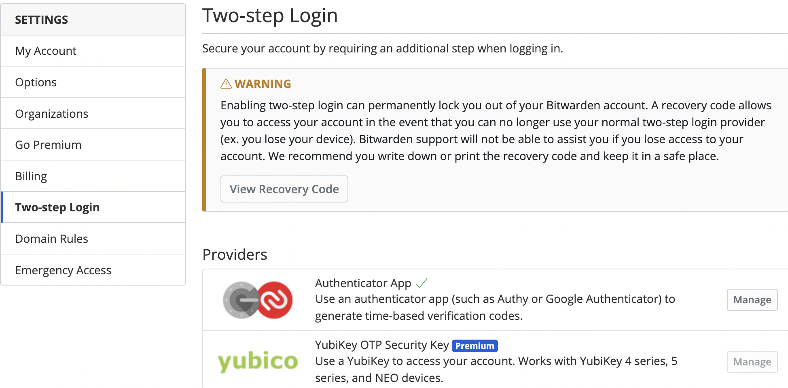
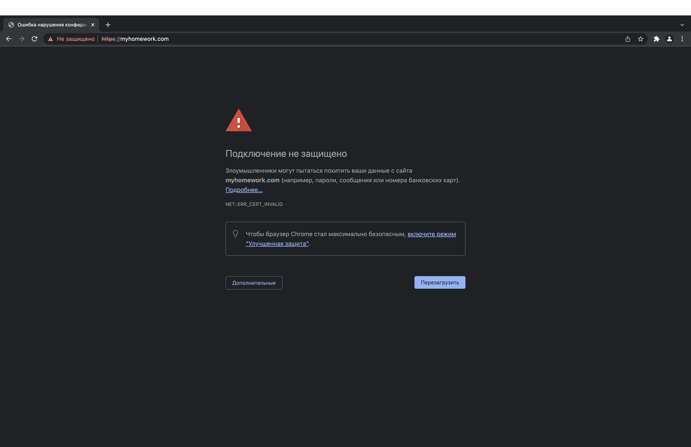
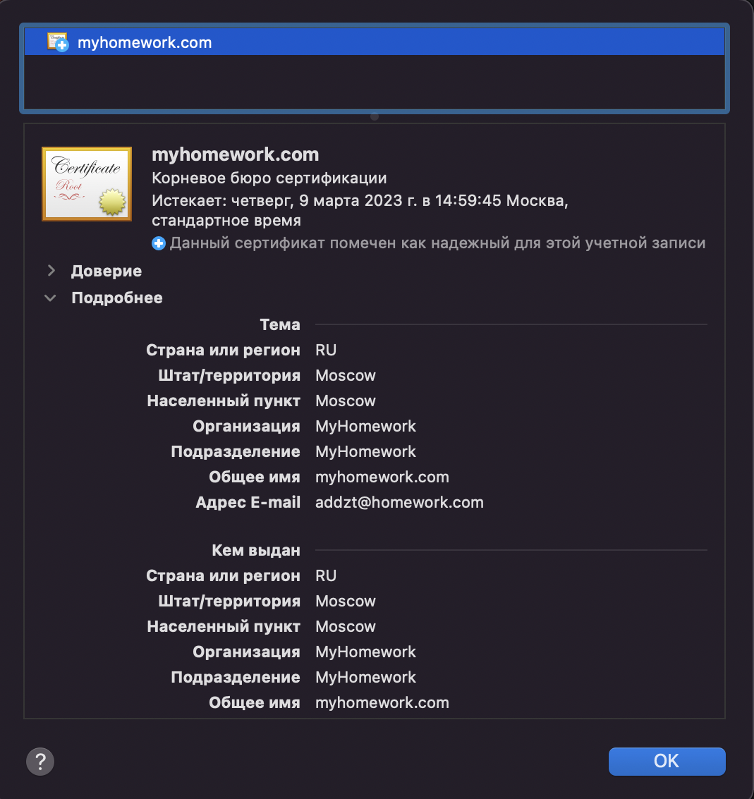
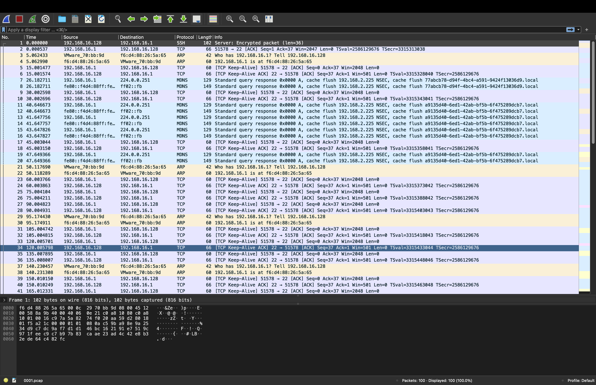

# Домашнее задание к занятию "3.9. Элементы безопасности информационных систем"

### 1. Установите Bitwarden плагин для браузера. Зарегестрируйтесь и сохраните несколько паролей.


### 2. Установите Google authenticator на мобильный телефон. Настройте вход в Bitwarden акаунт через Google authenticator OTP.



### 3. Установите apache2, сгенерируйте самоподписанный сертификат, настройте тестовый сайт для работы по HTTPS.

```bash
root@vagrant:~# apt install apache2
```

```bash 
vagrant@vagrant:~$ sudo openssl req -x509 -nodes -days 365 -newkey rsa:2048 -keyout /etc/ssl/private/apache-selfsigned.key -out /etc/ssl/certs/apache-selfsigned.crt
```

- `openssl`: это базовый инструмент командной строки для создания и управления сертификатами OpenSSL, ключами и другими файлами.
- `req`: данная субкоманда указывает, что мы хотим использовать управление запросами подписи сертификатов X.509 (CSR). X.509 — это стандарт инфраструктуры открытых ключей, используемый SSL и TLS для управления ключами и сертификатами. Мы хотим создать новый сертификат X.509, и поэтому используем эту субкоманду.
- `x509`: это дополнительно изменяет предыдущую субкоманду, сообщая утилите, что мы хотим создать самоподписанный сертификат, а не сгенерировать запрос на подпись сертификата, как обычно происходит.
- `nodes`: этот параметр указывает OpenSSL пропустить опцию защиты сертификата с помощью пароля. Для чтения этого файла при запуске сервера без вмешательства пользователя нам потребуется Apache. Кодовая фраза может предотвратить это, поскольку нам придется вводить ее после каждого перезапуска.
- `days 365`: данный параметр устанавливает срок, в течение которого сертификат будет считаться действительным. Здесь мы устанавливаем срок действия в один год.
- `newkey rsa:2048`: указывает, что мы хотим генерировать новый сертификат и новый ключ одновременно. Мы не создали требуемый ключ для подписи сертификата на предыдущем шаге, и поэтому нам нужно создать его вместе с сертификатом. Часть rsa:2048 указывает, что мы создаем ключ RSA длиной 2048 бит.
- `keyout`: эта строка указывает OpenSSL, где мы разместим создаваемый закрытый ключ.
- `out`: данный параметр указывает OpenSSL, куда поместить создаваемый сертификат.

Отвечаем на вопросы:

```bash
Country Name (2 letter code) [AU]:RU
State or Province Name (full name) [Some-State]:Moscow
Locality Name (eg, city) []:Moscow
Organization Name (eg, company) [Internet Widgits Pty Ltd]:MyHomework
Organizational Unit Name (eg, section) []:MyHomework
Common Name (e.g. server FQDN or YOUR name) []:myhomework.com
Email Address []:addzt@homework.com
```

Проверим наличие сгенерированных сертификатов.

```bash
vagrant@vagrant:~$ sudo ls /etc/ssl/certs | grep "self"
apache-selfsigned.crt
vagrant@vagrant:~$ sudo ls /etc/ssl/private | grep "self"
apache-selfsigned.key
```

Перейдем к настройке Apache. Создайте новый сниппет в каталоге `/etc/apache2/conf-available`.

```bash
sudo nano /etc/apache2/conf-available/ssl-params.conf
```

Вставляем туда конфиг:

```bash
SSLCipherSuite EECDH+AESGCM:EDH+AESGCM:AES256+EECDH:AES256+EDH
SSLProtocol All -SSLv2 -SSLv3 -TLSv1 -TLSv1.1
SSLHonorCipherOrder On
# Disable preloading HSTS for now.  You can use the commented out header line that includes
# the "preload" directive if you understand the implications.
# Header always set Strict-Transport-Security "max-age=63072000; includeSubDomains; preload"
Header always set X-Frame-Options DENY
Header always set X-Content-Type-Options nosniff
# Requires Apache >= 2.4
SSLCompression off
SSLUseStapling on
SSLStaplingCache "shmcb:logs/stapling-cache(150000)"
# Requires Apache >= 2.4.11
SSLSessionTickets Off
```

Теперь изменим файл виртуального хоста Apache SSL по умолчанию. Перед этим создадим копию первоначального файла виртуального хоста.

```bash
sudo cp /etc/apache2/sites-available/default-ssl.conf /etc/apache2/sites-available/default-ssl.conf.bak
```

Внесенные изменения:

```bash
ServerAdmin addzt@myhomework.com
ServerName myhomework.com
...
SSLCertificateFile      /etc/ssl/certs/apache-selfsigned.crt
SSLCertificateKeyFile /etc/ssl/private/apache-selfsigned.key
```

Чтобы изменить файл нешифрованного виртуального хоста для перенаправления всего трафика для шифрования SSL, мы можем открыть файл `/etc/apache2/sites-available/000-default.conf`:

```bash
sudo nano /etc/apache2/sites-available/000-default.conf
```

Добавим строчку:

```bash
Redirect "/" "https://myhomework.com/"
```

Настроим брандмауэр.

```bash
vagrant@vagrant:~$ sudo ufw app list
Available applications:
  Apache
  Apache Full
  Apache Secure
  OpenSSH
```
Как показал вывод, есть три профиля, доступных для Apache:

- `Apache`: этот профиль открывает только порт 80 (нормальный веб-трафик без шифрования)
- `Apache Full`: этот профиль открывает порт 80 (нормальный веб-трафик без шифрования) и порт 443 (трафик с шифрованием TLS/SSL)
- `Apache Secure`: этот профиль открывает только порт 443 (трафик с шифрованием TLS/SSL)

Включим и настроим фаервол.

```bash
vagrant@vagrant:~$ sudo ufw enable
Command may disrupt existing ssh connections. Proceed with operation (y|n)? y
Firewall is active and enabled on system startup
vagrant@vagrant:~$ sudo ufw status
Status: active
vagrant@vagrant:~$ sudo ufw allow 'Apache full'
Rule added
Rule added (v6)
vagrant@vagrant:~$ sudo ufw status
Status: active

To                         Action      From
--                         ------      ----
Apache Full                ALLOW       Anywhere                  
Apache Full (v6)           ALLOW       Anywhere (v6) 
```

Мы внесли изменения и настроили брандмауэр и теперь можем включить в Apache модули SSL и заголовков, активировать наш виртуальный хост SSL и перезапустить Apache.

```bash
sudo a2enmod ssl
sudo a2enmod headers
```

Теперь мы можем активировать виртуальный хост SSL.

```bash
sudo a2ensite default-ssl
```

Также нам нужно будет активировать файл ssl-params.conf для считывания заданных значений:

```bash
sudo a2enconf ssl-params
```

Теперь нам нужно проверить наши файлы на наличие ошибок в синтаксисе. Для этого можно ввести следующую команду:

```bash
vagrant@vagrant:~$ sudo apache2ctl configtest
AH00558: apache2: Could not reliably determine the server's fully qualified domain name, using 127.0.1.1. Set the 'ServerName' directive globally to suppress this message
Syntax OK
```

Перезапустим Apache.

```bash
sudo systemctl restart apache2
```

```bash
Vagrant.configure("2") do |config|
  config.vm.box = "spox/ubuntu-arm"
  config.vm.box_version = "1.0.0"
  config.vm.network "forwarded_port", guest: 443, host: 1668
end
```

Разрешаем имя и заходим на `https://myhomework.com`. Так как сертификат не подписан доверенным центром сертификации, увидим предупреждение:



Проверим сертификат.



### 4. Проверьте на TLS уязвимости произвольный сайт в интернете (кроме сайтов МВД, ФСБ, МинОбр, НацБанк, РосКосмос, РосАтом, РосНАНО и любых госкомпаний, объектов КИИ, ВПК ... и тому подобное).

```bash
vagrant@vagrant:~$ sudo apt install testssl.sh
```

```bash
vagrant@vagrant:~$ testssl -U https://habr.com/

No engine or GOST support via engine with your /usr/bin/openssl

###########################################################
    testssl       3.0 from https://testssl.sh/

      This program is free software. Distribution and
             modification under GPLv2 permitted.
      USAGE w/o ANY WARRANTY. USE IT AT YOUR OWN RISK!

       Please file bugs @ https://testssl.sh/bugs/

###########################################################

 Using "OpenSSL 1.1.1f  31 Mar 2020" [~79 ciphers]
 on vagrant:/usr/bin/openssl
 (built: "Aug 23 17:02:39 2021", platform: "debian-arm64")


 Start 2022-03-10 19:13:24        -->> 178.248.237.68:443 (habr.com) <<--

 rDNS (178.248.237.68):  --
 Service detected:       HTTP


 Testing vulnerabilities 

 Heartbleed (CVE-2014-0160)                not vulnerable (OK), no heartbeat extension
 CCS (CVE-2014-0224)                       not vulnerable (OK)
 Ticketbleed (CVE-2016-9244), experiment.  not vulnerable (OK), no session tickets
 ROBOT                                     not vulnerable (OK)
 Secure Renegotiation (RFC 5746)           supported (OK)
 Secure Client-Initiated Renegotiation     not vulnerable (OK)
 CRIME, TLS (CVE-2012-4929)                not vulnerable (OK)
 BREACH (CVE-2013-3587)                    no HTTP compression (OK)  - only supplied "/" tested
 POODLE, SSL (CVE-2014-3566)               not vulnerable (OK)
 TLS_FALLBACK_SCSV (RFC 7507)              No fallback possible (OK), no protocol below TLS 1.2 offered
 SWEET32 (CVE-2016-2183, CVE-2016-6329)    VULNERABLE, uses 64 bit block ciphers
 FREAK (CVE-2015-0204)                     not vulnerable (OK)
 DROWN (CVE-2016-0800, CVE-2016-0703)      not vulnerable on this host and port (OK)
                                           make sure you don't use this certificate elsewhere with SSLv2 enabled services
                                           https://censys.io/ipv4?q=23C599AB56B3C8DD6984AFE74F7BE26C88B8EDFD9C47F3B97808D9CFF159C8C4 could help you to find out
 LOGJAM (CVE-2015-4000), experimental      not vulnerable (OK): no DH EXPORT ciphers, no DH key detected with <= TLS 1.2
 BEAST (CVE-2011-3389)                     not vulnerable (OK), no SSL3 or TLS1 LUCKY13 (CVE-2013-0169), experimental     potentially VULNERABLE, uses cipher block chaining (CBC) ciphers with TLS. Check patches
 RC4 (CVE-2013-2566, CVE-2015-2808)        no RC4 ciphers detected (OK)


 Done 2022-03-10 19:13:50 [  27s] -->> 178.248.237.68:443 (habr.com) <<--
```

### 5. Установите на Ubuntu ssh сервер, сгенерируйте новый приватный ключ. Скопируйте свой публичный ключ на другой сервер. Подключитесь к серверу по SSH-ключу.

```bash
sudo apt install openssh-server
vagrant@vagrant:~$ ssh localhost
The authenticity of host 'localhost (127.0.0.1)' can't be established.
```
```bash
vagrant@node1:~$ ssh-keygen
Generating public/private rsa key pair.
Enter file in which to save the key (/home/vagrant/.ssh/id_rsa): 
Enter passphrase (empty for no passphrase): 
Enter same passphrase again: 
Your identification has been saved in /home/vagrant/.ssh/id_rsa
Your public key has been saved in /home/vagrant/.ssh/id_rsa.pub
The key fingerprint is:
SHA256:K4XcWrx+M6XeThVa6U9kLfHjCBrIhG698CSyHjISc18 vagrant@node1
The key's randomart image is:
+---[RSA 3072]----+
|      ..      .  |
|     .o .      +.|
|    . .o . .  =.=|
|o .. *E*  o .+o=.|
| + .+.B S.  ..o..|
|.o o.  * o  .. o |
|. + . o o  o.   .|
|   .   o  =o     |
|        .o.+o    |
+----[SHA256]-----+
```

Самый быстрый способ скопировать открытый ключ на хост Ubuntu — использовать утилиту `ssh-copy-id`. Вторая машина имеет адрес `192.168.16.130`.

```bash
vagrant@node1:~$ ssh-copy-id vagrant@192.168.16.130
/usr/bin/ssh-copy-id: INFO: Source of key(s) to be installed: "/home/vagrant/.ssh/id_rsa.pub"
The authenticity of host '192.168.16.130 (192.168.16.130)' can't be established.
ECDSA key fingerprint is SHA256:lrQMTJFx3psJBkXBUIxU7yRULT7+48Mixhdc+kceBPA.
Are you sure you want to continue connecting (yes/no/[fingerprint])? yes
/usr/bin/ssh-copy-id: INFO: attempting to log in with the new key(s), to filter out any that are already installed
/usr/bin/ssh-copy-id: INFO: 1 key(s) remain to be installed -- if you are prompted now it is to install the new keys
vagrant@192.168.16.130's password: 

Number of key(s) added: 1

Now try logging into the machine, with:   "ssh 'vagrant@192.168.16.130'"
and check to make sure that only the key(s) you wanted were added.
```

```bash
vagrant@node1:~$ ssh 'vagrant@192.168.16.130'
Enter passphrase for key '/home/vagrant/.ssh/id_rsa': 
Welcome to Ubuntu 20.04.3 LTS (GNU/Linux 5.4.0-89-generic aarch64)

 * Documentation:  https://help.ubuntu.com
 * Management:     https://landscape.canonical.com
 * Support:        https://ubuntu.com/advantage

  System information as of Fri 11 Mar 2022 10:09:21 AM UTC

  System load:  0.31               Processes:             205
  Usage of /:   19.5% of 19.56GB   Users logged in:       0
  Memory usage: 32%                IPv4 address for eth0: 192.168.16.130
  Swap usage:   0%


0 updates can be applied immediately.


The list of available updates is more than a week old.
To check for new updates run: sudo apt update

Last login: Fri Mar 11 10:07:46 2022 from 192.168.16.1
```

### 6. Переименуйте файлы ключей из задания 5. Настройте файл конфигурации SSH клиента, так чтобы вход на удаленный сервер осуществлялся по имени сервера.

```bash
vagrant@node1:~$ cd .ssh
vagrant@node1:~/.ssh$ touch config
vagrant@node1:~/.ssh$ ls
authorized_keys  config  id_rsa  id_rsa.pub  known_hosts
vagrant@node1:~/.ssh$ nano config
```

Добавляем конфиг:

```bash
Host servachok
HostName 192.168.16.130
IdentityFile ~/.ssh/renamedkey
User vagrant
#Port 2222
##StrictHostKeyChecking no
```

```bash
vagrant@node1:~/.ssh$ mv id_rsa renamedkey
vagrant@node1:~/.ssh$ mv id_rsa.pub renamedkey.pub
vagrant@node1:~/.ssh$ ls
authorized_keys  config  known_hosts  renamedkey  renamedkey.pub
vagrant@node1:~/.ssh$ ssh servachok
Enter passphrase for key '/home/vagrant/.ssh/renamedkey': 
Welcome to Ubuntu 20.04.3 LTS (GNU/Linux 5.4.0-89-generic aarch64)

 * Documentation:  https://help.ubuntu.com
 * Management:     https://landscape.canonical.com
 * Support:        https://ubuntu.com/advantage

  System information as of Fri 11 Mar 2022 10:35:10 AM UTC

  System load:  0.0                Processes:             204
  Usage of /:   19.5% of 19.56GB   Users logged in:       0
  Memory usage: 32%                IPv4 address for eth0: 192.168.16.130
  Swap usage:   0%


0 updates can be applied immediately.


The list of available updates is more than a week old.
To check for new updates run: sudo apt update

Last login: Fri Mar 11 10:09:21 2022 from 192.168.16.128
```

### 7. Соберите дамп трафика утилитой tcpdump в формате pcap, 100 пакетов. Откройте файл pcap в Wireshark.

```bash
vagrant@node1:~$ sudo apt install tcpdump
```

```bash
root@node1:~# tcpdump -w 0001.pcap -c 100
tcpdump: listening on eth0, link-type EN10MB (Ethernet), capture size 262144 bytes
100 packets captured
102 packets received by filter
0 packets dropped by kernel
```

Через приложение [cyberduck](https://cyberduck.io/download/) вытащим дамп и поместим в Wireshark.

Откроем `0001.pcap` в Wireshark.



 ---
## Задание для самостоятельной отработки (необязательно к выполнению)

### 8*. Просканируйте хост scanme.nmap.org. Какие сервисы запущены?

```bash
sudo apt install nmap
```

```bash
vagrant@node1:~$ sudo nmap -A scanme.nmap.org
Starting Nmap 7.80 ( https://nmap.org ) at 2022-03-11 14:00 UTC
Nmap scan report for scanme.nmap.org (45.33.32.156)
Host is up (0.046s latency).
Other addresses for scanme.nmap.org (not scanned): 2600:3c01::f03c:91ff:fe18:bb2f
Not shown: 996 closed ports
PORT      STATE SERVICE    VERSION
22/tcp    open  ssh        OpenSSH 6.6.1p1 Ubuntu 2ubuntu2.13 (Ubuntu Linux; protocol 2.0)
| ssh-hostkey: 
|   1024 ac:00:a0:1a:82:ff:cc:55:99:dc:67:2b:34:97:6b:75 (DSA)
|   2048 20:3d:2d:44:62:2a:b0:5a:9d:b5:b3:05:14:c2:a6:b2 (RSA)
|   256 96:02:bb:5e:57:54:1c:4e:45:2f:56:4c:4a:24:b2:57 (ECDSA)
|_  256 33:fa:91:0f:e0:e1:7b:1f:6d:05:a2:b0:f1:54:41:56 (ED25519)
80/tcp    open  http       Apache httpd 2.4.7 ((Ubuntu))
|_http-server-header: Apache/2.4.7 (Ubuntu)
|_http-title: Go ahead and ScanMe!
9929/tcp  open  nping-echo Nping echo
31337/tcp open  tcpwrapped
Aggressive OS guesses: Linux 3.2 (94%), Linux 4.4 (94%), Actiontec MI424WR-GEN3I WAP (93%), DD-WRT v24-sp2 (Linux 2.4.37) (92%), Microsoft Windows XP SP3 (90%), Microsoft Windows XP SP3 or Windows 7 or Windows Server 2012 (90%), BlueArc Titan 2100 NAS device (87%), TiVo series 1 (Sony SVR-2000 or Philips HDR112) (Linux 2.1.24-TiVo-2.5, PowerPC) (87%), TiVo series 1 (Linux 2.1.24-TiVo-2.5) (85%)
No exact OS matches for host (test conditions non-ideal).
Network Distance: 2 hops
Service Info: OS: Linux; CPE: cpe:/o:linux:linux_kernel

TRACEROUTE (using port 80/tcp)
HOP RTT     ADDRESS
1   0.25 ms _gateway (192.168.16.2)
2   0.23 ms scanme.nmap.org (45.33.32.156)

OS and Service detection performed. Please report any incorrect results at https://nmap.org/submit/ .
Nmap done: 1 IP address (1 host up) scanned in 37.63 seconds
```

`22` - SSH (Secure SHell) — криптографический сетевой протокол для безопасной передачи данных;  
`80` - HTTP (HyperText Transfer Protocol);  
`9929` - --ep <порт>, --echo-port <порт> (Установить номер эхо-порта TCP)
Этот параметр просит Nping использовать указанный номер порта TCP для подключения к стороннему каналу Echo. Если эта опция используется с --echo-server, она указывает порт, на котором сервер прослушивает подключения. Если он используется с --echo-client, он указывает порт для подключения на удаленном хосте. По умолчанию используется номер порта 9929.  
`31337` - Back Orifice — средство для удаленного администрирования.

### 9*. Установите и настройте фаервол ufw на web-сервер из задания 3. Откройте доступ снаружи только к портам 22,80,443