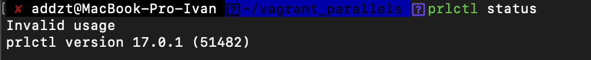
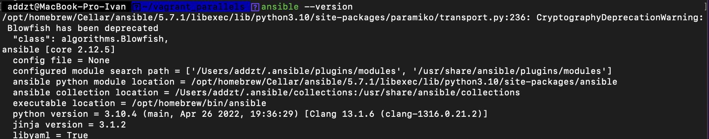

# Домашнее задание к занятию "5.2. Применение принципов IaaC в работе с виртуальными машинами"

## Задача 1

- Опишите своими словами основные преимущества применения на практике IaaC паттернов.

`Непрерывная интеграция (Continuous Integration)` — когда продукт регулярно (несколько раз в день) собирается из исходного кода и для него запускается существенная часть автоматических тестов, например все модульные тесты. Если автоматические тесты работают долго, то их можно запускать реже, например раз в сутки. Стандартный подход для организации непрерывной интеграции — это запустить TeamCity или Jenkins, которые будут загружать исходный код из системы контроля версий, собирать его и запускать тесты. Другие известные решения: Travis CI, GitLab, Space, GitHub, BitBucket. 

`Непрерывная доставка (Continuous Delivery)` — продукт всегда находится в «собранном» состоянии и готов к передаче в промышленную эксплуатацию, даже с учетом последних изменений, внесенных разработчиками в код.

`Непрерывное развертывание (Continuous Deployment)` — когда обновления продукта регулярно (например, после каждого изменения, внесенного разработчиками) вводятся в промышленную эксплуатацию, и при этом все процессы предметной области продолжают работать без сбоя. В некотором роде непрерывное развертывание — это хорошо автоматизированная и часто выполняющаяся непрерывная доставка.

- Какой из принципов IaaC является основополагающим?

`Идемпотентность` является основополагающим принципом IaaC. Идемпотентность — это свойство, которое команда развертывания всегда задает целевую среду в той же конфигурации независимо от состояния запуска среды. Идемпотентность достигается либо автоматической настройкой существующего целевого объекта, либо путем удаления существующей цели и повторного создания новой среды.

## Задача 2

- Чем Ansible выгодно отличается от других систем управление конфигурациями?

`Ansible`  — инструмент с открытым исходным кодом, имеющий низкий порог вхождения. У него много модулей. Можно управлять облаками, сетями, файлами, установкой программ, деплоем — абсолютно всем. Если нет модулей, можно написать свой собственный. Имеет полную документацию и массу примеров конфигов развертывания.


- Какой, на ваш взгляд, метод работы систем конфигурации более надёжный push или pull?

При наличии большой инфраструктуры надежднее будет `pull`, так как при `push`  для контроля ответа серверов требуется огромный вычислительный ресурс.

## Задача 3

Установить на личный компьютер:

- VirtualBox

Использую `Parallels` на m1



- Vagrant


- Ansible



*Приложить вывод команд установленных версий каждой из программ, оформленный в markdown.*

## Задача 4 (*)

Воспроизвести практическую часть лекции самостоятельно.

- Создать виртуальную машину.
- Зайти внутрь ВМ, убедиться, что Docker установлен с помощью команды
```
docker ps
```

Заменил в Vagrantfile `ISO = "bento/ubuntu-20.04-arm64"`

```bash
 addzt@MacBook-Pro-Ivan  ~/PycharmProjects/devops_homeworks/homework_5.2/src/vagrant   main ±✚  vagrant up --provider=parallels
Bringing machine 'server1.netology' up with 'parallels' provider...
==> server1.netology: Box 'bento/ubuntu-20.04-arm64' could not be found. Attempting to find and install...
    server1.netology: Box Provider: parallels
    server1.netology: Box Version: >= 0
==> server1.netology: Loading metadata for box 'bento/ubuntu-20.04-arm64'
    server1.netology: URL: https://vagrantcloud.com/bento/ubuntu-20.04-arm64
==> server1.netology: Adding box 'bento/ubuntu-20.04-arm64' (v202112.19.0) for provider: parallels
    server1.netology: Downloading: https://vagrantcloud.com/bento/boxes/ubuntu-20.04-arm64/versions/202112.19.0/providers/parallels.box
==> server1.netology: Successfully added box 'bento/ubuntu-20.04-arm64' (v202112.19.0) for 'parallels'!
==> server1.netology: Registering VM image from the base box 'bento/ubuntu-20.04-arm64'...
==> server1.netology: Creating new virtual machine as a linked clone of the box image...
==> server1.netology: Unregistering the box VM image...
==> server1.netology: Setting the default configuration for VM...
==> server1.netology: Checking if box 'bento/ubuntu-20.04-arm64' version '202112.19.0' is up to date...
==> server1.netology: Setting the name of the VM: vagrant_server1netology_1652474792094_50526
==> server1.netology: Preparing network interfaces based on configuration...
    server1.netology: Adapter 0: shared
    server1.netology: Adapter 1: hostonly
==> server1.netology: Clearing any previously set network interfaces...
==> server1.netology: Forwarding ports...
    server1.netology: 22 => 20011
==> server1.netology: Booting VM...
==> server1.netology: Waiting for machine to boot. This may take a few minutes...
    server1.netology: SSH address: :22
    server1.netology: SSH username: vagrant
    server1.netology: SSH auth method: private key
    server1.netology: Warning: Connection refused. Retrying...
    server1.netology: 
    server1.netology: Vagrant insecure key detected. Vagrant will automatically replace
    server1.netology: this with a newly generated keypair for better security.
    server1.netology: 
    server1.netology: Inserting generated public key within guest...
    server1.netology: Removing insecure key from the guest if it's present...
    server1.netology: Key inserted! Disconnecting and reconnecting using new SSH key...
==> server1.netology: Machine booted and ready!
==> server1.netology: Checking for Parallels Tools installed on the VM...
==> server1.netology: Parallels Tools installed on this VM are outdated! In most cases
==> server1.netology: this is fine but in rare cases it can cause things such as shared
==> server1.netology: folders to not work properly. If you see shared folder errors,
==> server1.netology: please update Parallels Tools within the virtual machine and
==> server1.netology: reload your VM.
==> server1.netology: Setting hostname...
==> server1.netology: Configuring and enabling network interfaces...
==> server1.netology: Mounting shared folders...
    server1.netology: /vagrant => /Users/addzt/PycharmProjects/devops_homeworks/homework_5.2/src/vagrant
==> server1.netology: Running provisioner: ansible...
    server1.netology: Running ansible-playbook...
/opt/homebrew/Cellar/ansible/5.7.1/libexec/lib/python3.10/site-packages/paramiko/transport.py:236: CryptographyDeprecationWarning: Blowfish has been deprecated
  "class": algorithms.Blowfish,

PLAY [nodes] *******************************************************************

TASK [Gathering Facts] *********************************************************
ok: [server1.netology]

TASK [Create directory for ssh-keys] *******************************************
ok: [server1.netology]

TASK [Adding rsa-key in /root/.ssh/authorized_keys] ****************************
changed: [server1.netology]

TASK [Checking DNS] ************************************************************
changed: [server1.netology]

TASK [Installing tools] ********************************************************
ok: [server1.netology] => (item=git)
ok: [server1.netology] => (item=curl)

TASK [Installing docker] *******************************************************
changed: [server1.netology]

TASK [Add the current user to docker group] ************************************
changed: [server1.netology]

PLAY RECAP *********************************************************************
server1.netology           : ok=7    changed=4    unreachable=0    failed=0    skipped=0    rescued=0    ignored=0   
```
```bash
addzt@MacBook-Pro-Ivan  ~/PycharmProjects/devops_homeworks/homework_5.2/src/vagrant   main ±✚  vagrant ssh                     
Welcome to Ubuntu 20.04.3 LTS (GNU/Linux 5.4.0-91-generic aarch64)

 * Documentation:  https://help.ubuntu.com
 * Management:     https://landscape.canonical.com
 * Support:        https://ubuntu.com/advantage

  System information as of Fri 13 May 2022 01:49:06 PM PDT

  System load:              0.42
  Usage of /:               13.4% of 30.63GB
  Memory usage:             27%
  Swap usage:               0%
  Processes:                138
  Users logged in:          0
  IPv4 address for docker0: 172.17.0.1
  IPv4 address for eth0:    10.211.55.6
  IPv6 address for eth0:    fdb2:2c26:f4e4:0:21c:42ff:fe6a:9f3e
  IPv4 address for eth1:    192.168.192.11
  IPv6 address for eth1:    fdb2:2c26:f4e4:2:21c:42ff:fed2:1fbd


This system is built by the Bento project by Chef Software
More information can be found at https://github.com/chef/bento
Last login: Fri May 13 13:48:00 2022 from 10.211.55.1
```
```bash
vagrant@server1:~$ docker ps
CONTAINER ID   IMAGE     COMMAND   CREATED   STATUS    PORTS     NAMES
```