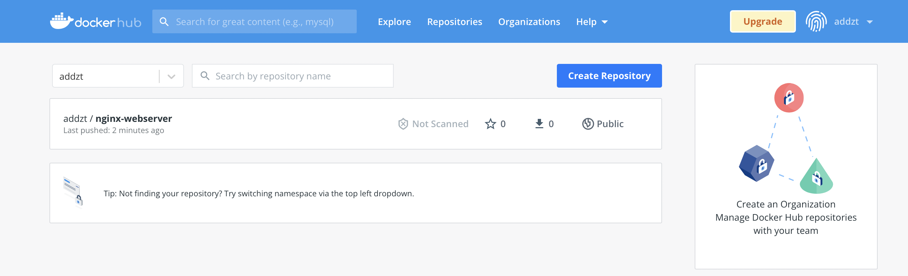
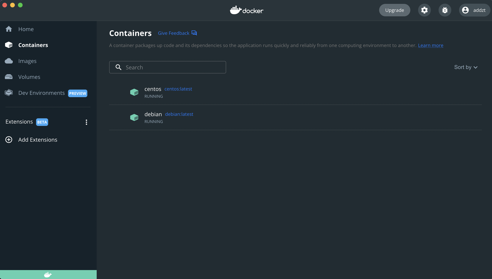

# Домашнее задание к занятию "5.3. Введение. Экосистема. Архитектура. Жизненный цикл Docker контейнера"

## Как сдавать задания

Обязательными к выполнению являются задачи без указания звездочки. Их выполнение необходимо для получения зачета и диплома о профессиональной переподготовке.

Задачи со звездочкой (*) являются дополнительными задачами и/или задачами повышенной сложности. Они не являются обязательными к выполнению, но помогут вам глубже понять тему.

Домашнее задание выполните в файле readme.md в github репозитории. В личном кабинете отправьте на проверку ссылку на .md-файл в вашем репозитории.

Любые вопросы по решению задач задавайте в чате Slack.

---

## Задача 1

Сценарий выполения задачи:

- создайте свой репозиторий на https://hub.docker.com;
- выберете любой образ, который содержит веб-сервер Nginx;
- создайте свой fork образа;
- реализуйте функциональность:
запуск веб-сервера в фоне с индекс-страницей, содержащей HTML-код ниже:
```
<html>
<head>
Hey, Netology
</head>
<body>
<h1>I’m DevOps Engineer!</h1>
</body>
</html>
```
Опубликуйте созданный форк в своем репозитории и предоставьте ответ в виде ссылки на https://hub.docker.com/username_repo.

Создаем `index.html` и `dockerfile`.

Собираем:

```bash
 addzt@MacBook-Pro-Ivan  ~/PycharmProjects/devops_homeworks/homework_5.3/task_1   main ±✚  docker build -t  addzt/nginx-webserver .
[+] Building 5.6s (8/8) FINISHED                                                                                                                                                                                                                     
 => [internal] load build definition from Dockerfile                                                                                                                                                                                            0.0s
 => => transferring dockerfile: 110B                                                                                                                                                                                                            0.0s
 => [internal] load .dockerignore                                                                                                                                                                                                               0.0s
 => => transferring context: 2B                                                                                                                                                                                                                 0.0s
 => [internal] load metadata for docker.io/library/nginx:latest                                                                                                                                                                                 2.4s
 => [auth] library/nginx:pull token for registry-1.docker.io                                                                                                                                                                                    0.0s
 => [internal] load build context                                                                                                                                                                                                               0.0s
 => => transferring context: 31B                                                                                                                                                                                                                0.0s
 => [1/2] FROM docker.io/library/nginx:latest@sha256:2d17cc4981bf1e22a87ef3b3dd20fbb72c3868738e3f307662eb40e2630d4320                                                                                                                           3.0s
 => => resolve docker.io/library/nginx:latest@sha256:2d17cc4981bf1e22a87ef3b3dd20fbb72c3868738e3f307662eb40e2630d4320                                                                                                                           0.0s
 => => sha256:5ecb861a25c6560331fa80cd6a4cc55db3c99742ee5ef98e04ddf82b42fc6111 1.57kB / 1.57kB                                                                                                                                                  0.0s
 => => sha256:e949f9f9fb279917ad4f6b99f9cc7a746fae1c88b2d9e3c79dc8eaabf02f0de4 25.29MB / 25.29MB                                                                                                                                                1.7s
 => => sha256:f66a0d1ef731ab0ad729803b7f8d4c52584ede1712d86264e9a11e182ef47e96 603B / 603B                                                                                                                                                      0.7s
 => => sha256:2d17cc4981bf1e22a87ef3b3dd20fbb72c3868738e3f307662eb40e2630d4320 1.86kB / 1.86kB                                                                                                                                                  0.0s
 => => sha256:dfdd5ffb257742b891ccad9400a77dad2a6260b2451e0f5e48a9ade1d17a87ec 30.07MB / 30.07MB                                                                                                                                                1.3s
 => => sha256:cff5958236461811db2f826f3fe3d89b188b1905f8105c799f4f7ed4727b1406 7.67kB / 7.67kB                                                                                                                                                  0.0s
 => => sha256:e37c7f0f60c57ca9457ac6e938e213aff7fd9f8992876de8f369a13b79a62a37 894B / 894B                                                                                                                                                      1.1s
 => => sha256:bc1f8d6065f355b6944ea4e4a2434c863d9724fe603873f2aa3ba2618432ac96 664B / 664B                                                                                                                                                      1.3s
 => => sha256:a280460af38f3180622239d249d016e61d2bc9c45a694ba937b3278217cea927 1.39kB / 1.39kB                                                                                                                                                  1.5s
 => => extracting sha256:dfdd5ffb257742b891ccad9400a77dad2a6260b2451e0f5e48a9ade1d17a87ec                                                                                                                                                       0.9s
 => => extracting sha256:e949f9f9fb279917ad4f6b99f9cc7a746fae1c88b2d9e3c79dc8eaabf02f0de4                                                                                                                                                       0.6s
 => => extracting sha256:f66a0d1ef731ab0ad729803b7f8d4c52584ede1712d86264e9a11e182ef47e96                                                                                                                                                       0.0s
 => => extracting sha256:e37c7f0f60c57ca9457ac6e938e213aff7fd9f8992876de8f369a13b79a62a37                                                                                                                                                       0.0s
 => => extracting sha256:bc1f8d6065f355b6944ea4e4a2434c863d9724fe603873f2aa3ba2618432ac96                                                                                                                                                       0.0s
 => => extracting sha256:a280460af38f3180622239d249d016e61d2bc9c45a694ba937b3278217cea927                                                                                                                                                       0.0s
 => [2/2] COPY ./index.html /usr/share/nginx/html/index.html                                                                                                                                                                                    0.1s
 => exporting to image                                                                                                                                                                                                                          0.0s
 => => exporting layers                                                                                                                                                                                                                         0.0s
 => => writing image sha256:f704099453ce9749276ee9aeb92aee558d72ebc9fdfecfda663354385b4c1962                                                                                                                                                    0.0s
 => => naming to docker.io/addzt/nginx-webserver                                               
```

Запускаем и заходим на `localhost:8080` для проверки.

```bash
 addzt@MacBook-Pro-Ivan  ~/PycharmProjects/devops_homeworks/homework_5.3/task_1   main ±✚  docker run --rm  -d --name webserver -e TZ=UTC -p 8080:80 addzt/nginx-webserver

81c5a59a7b617c0d34e9b87f0d71680d91e2608a1d75429cdba6651a151d9650
```


Остановим контейнер и запушим его в репозиторий.

```bash
 addzt@MacBook-Pro-Ivan  ~/PycharmProjects/devops_homeworks/homework_5.3/task_1   main ±✚  docker stop webserver                                                          
webserver

 addzt@MacBook-Pro-Ivan  ~/PycharmProjects/devops_homeworks/homework_5.3/task_1   main ±✚  docker push addzt/nginx-webserver
Using default tag: latest
The push refers to repository [docker.io/addzt/nginx-webserver]
debf9c8eec26: Pushed 
c775eb259077: Mounted from library/nginx 
df0854c47989: Mounted from library/nginx 
556c4cc42993: Mounted from library/nginx 
c5ddee085135: Mounted from library/nginx 
87628248381f: Mounted from library/nginx 
62ed8ed20fdb: Mounted from library/nginx 
latest: digest: sha256:d650fe17f31920f0eeaf33cfdf38fffd83fa0451ba94f068deb682b4531f9a1d size: 1777
```



[ссылка на репозиторий](https://hub.docker.com/repository/docker/addzt/nginx-webserver)

## Задача 2

Посмотрите на сценарий ниже и ответьте на вопрос:
"Подходит ли в этом сценарии использование Docker контейнеров или лучше подойдет виртуальная машина, физическая машина? Может быть возможны разные варианты?"

Детально опишите и обоснуйте свой выбор.

--

Сценарий:

> - Высоконагруженное монолитное java веб-приложение;

Высокая нагрузка не мешает контейнеризации. Может.

> - Nodejs веб-приложение;

Очень удобно развернуть в докер контейнере.

> - Мобильное приложение c версиями для Android и iOS;

Под андройд можно развернуть. Под ios тоже, но там могут возникнуть некоторые трудности.

> - Шина данных на базе Apache Kafka;

Можно, нет никаких ограничений.

> - Elasticsearch кластер для реализации логирования продуктивного веб-приложения - три ноды elasticsearch, два logstash и две ноды kibana;

Можно легко развернуть в контейнере, т.к. все образы есть на хабе докера.

> - Мониторинг-стек на базе Prometheus и Grafana;

Можно развернуть веб-приложения.

> - MongoDB, как основное хранилище данных для java-приложения;

Можно, нет никаких ограничений.

> - Gitlab сервер для реализации CI/CD процессов и приватный (закрытый) Docker Registry.

Можно, есть образ на хабе докера.

## Задача 3

- Запустите первый контейнер из образа ***centos*** c любым тэгом в фоновом режиме, подключив папку ```/data``` из текущей рабочей директории на хостовой машине в ```/data``` контейнера;
- Запустите второй контейнер из образа ***debian*** в фоновом режиме, подключив папку ```/data``` из текущей рабочей директории на хостовой машине в ```/data``` контейнера;
- Подключитесь к первому контейнеру с помощью ```docker exec``` и создайте текстовый файл любого содержания в ```/data```;
- Добавьте еще один файл в папку ```/data``` на хостовой машине;
- Подключитесь во второй контейнер и отобразите листинг и содержание файлов в ```/data``` контейнера.

Сделаем `pull` образов `centos` и `debian`.

```bash
 addzt@MacBook-Pro-Ivan  ~/PycharmProjects/devops_homeworks/homework_5.3/ansible   main ±✚  docker pull centos       
Using default tag: latest
latest: Pulling from library/centos
52f9ef134af7: Pull complete 
Digest: sha256:a27fd8080b517143cbbbab9dfb7c8571c40d67d534bbdee55bd6c473f432b177
Status: Downloaded newer image for centos:latest
docker.io/library/centos:latest
 addzt@MacBook-Pro-Ivan  ~/PycharmProjects/devops_homeworks/homework_5.3/ansible   main ±✚  docker pull debian
Using default tag: latest
latest: Pulling from library/debian
3a36574378e6: Pull complete 
Digest: sha256:6137c67e2009e881526386c42ba99b3657e4f92f546814a33d35b14e60579777
Status: Downloaded newer image for debian:latest
docker.io/library/debian:latest
```

Запустим контейнеры, подключив папку `/data` из хостовой машины к контейнерам.

```bash
 addzt@MacBook-Pro-Ivan  ~/PycharmProjects/devops_homeworks/homework_5.3/ansible   main ±✚  docker run --rm -v /Users/addzt/PycharmProjects/devops_homeworks/homework_5.3/data:/data -it -d --name centos centos:latest
cd1842bae6b1b4524d6727e8c5089de8642bdfc0eeab6f641defa78aca5bd4ad
 addzt@MacBook-Pro-Ivan  ~/PycharmProjects/devops_homeworks/homework_5.3/ansible   main ±✚  docker run --rm -v /Users/addzt/PycharmProjects/devops_homeworks/homework_5.3/data:/data -it -d --name debian debian:latest
b6a5223ea20b698d0b77eb334c5cbb2fae7d1a4acc93c5895cff5d376edcaaf4
```

Проверим что образы развернуты.



Подключимся к первому контейнеру и создадим текстовый документ.

```bash
 addzt@MacBook-Pro-Ivan  ~/PycharmProjects/devops_homeworks/homework_5.3/ansible   main ±✚  docker exec -it centos /bin/bash                                                                                           
[root@cd1842bae6b1 /]# ls
bin  data  dev	etc  home  lib	lib64  lost+found  media  mnt  opt  proc  root	run  sbin  srv	sys  tmp  usr  var
[root@cd1842bae6b1 data]# echo "I'm devops engineer" > hello_world
[root@cd1842bae6b1 data]# ls
hello_world
[root@cd1842bae6b1 data]# cat hello_world
I'm devops engineer
```

Создадим еще один текстовый файл.

```bash
[root@cd1842bae6b1 data]# echo "Hello, World!" > hello_world_2
[root@cd1842bae6b1 data]# cat hello_world_2
Hello, World!
```

Подключимся ко второму контейнеру, зайдем в общую папку и отобразим содержимое текстовых файлов.

```bash
 addzt@MacBook-Pro-Ivan  ~/PycharmProjects/devops_homeworks/homework_5.3/ansible   main ±✚  docker exec -it debian /bin/bash                                                                                   
root@b6a5223ea20b:/# ls
bin  boot  data  dev  etc  home  lib  media  mnt  opt  proc  root  run	sbin  srv  sys	tmp  usr  var
root@b6a5223ea20b:/# cd data 
root@b6a5223ea20b:/data# ls
hello_world  hello_world_2
root@b6a5223ea20b:/data# cat hello_world
I'm devops engineer
root@b6a5223ea20b:/data# cat hello_world_2
Hello, World!
```


## Задача 4 (*)

Воспроизвести практическую часть лекции самостоятельно.

Соберите Docker образ с Ansible, загрузите на Docker Hub и пришлите ссылку вместе с остальными ответами к задачам.

Соберем образ из `Dockerfile`.

```bash
 addzt@MacBook-Pro-Ivan  ~/PycharmProjects/devops_homeworks/homework_5.3/ansible   main ±✚  docker build -t  addzt/ansible .        
[+] Building 110.3s (9/9) FINISHED                                                                                                                                                                                                                   
 => [internal] load build definition from Dockerfile                                                                                                                                                                                            0.0s
 => => transferring dockerfile: 1.17kB                                                                                                                                                                                                          0.0s
 => [internal] load .dockerignore                                                                                                                                                                                                               0.0s
 => => transferring context: 2B                                                                                                                                                                                                                 0.0s
 => [internal] load metadata for docker.io/library/alpine:3.14                                                                                                                                                                                  2.8s
 => [auth] library/alpine:pull token for registry-1.docker.io                                                                                                                                                                                   0.0s
 => [1/4] FROM docker.io/library/alpine:3.14@sha256:06b5d462c92fc39303e6363c65e074559f8d6b1363250027ed5053557e3398c5                                                                                                                            0.4s
 => => resolve docker.io/library/alpine:3.14@sha256:06b5d462c92fc39303e6363c65e074559f8d6b1363250027ed5053557e3398c5                                                                                                                            0.0s
 => => sha256:06b5d462c92fc39303e6363c65e074559f8d6b1363250027ed5053557e3398c5 1.64kB / 1.64kB                                                                                                                                                  0.0s
 => => sha256:7bb52b4c2182c42732e518f044adc1c38959d374311d23961a6273dd01bc4499 528B / 528B                                                                                                                                                      0.0s
 => => sha256:ac73e934f31119e38da975b98988cbd346af74f94455e6d465b9ce6c975762e7 1.49kB / 1.49kB                                                                                                                                                  0.0s
 => => sha256:455c02918c4592a9beeeae47df541266f3ea53ed573feb767e5e8ab8dcee146e 2.72MB / 2.72MB                                                                                                                                                  0.3s
 => => extracting sha256:455c02918c4592a9beeeae47df541266f3ea53ed573feb767e5e8ab8dcee146e                                                                                                                                                       0.1s
 => [2/4] RUN CARGO_NET_GIT_FETCH_WITH_CLI=1 &&     apk --no-cache add         sudo         python3        py3-pip         openssl         ca-certificates         sshpass         openssh-client         rsync         git &&     apk --no-  103.8s
 => [3/4] RUN mkdir /ansible &&     mkdir -p /etc/ansible &&     echo 'localhost' > /etc/ansible/hosts                                                                                                                                          0.3s
 => [4/4] WORKDIR /ansible                                                                                                                                                                                                                      0.0s 
 => exporting to image                                                                                                                                                                                                                          2.9s 
 => => exporting layers                                                                                                                                                                                                                         2.9s 
 => => writing image sha256:5b5dec13b3d22276b70a65efccaa468f6f61b22dad951e471c116689afdba70b                                                                                                                                                    0.0s 
 => => naming to docker.io/addzt/ansible    
```

```bash
 addzt@MacBook-Pro-Ivan  ~/PycharmProjects/devops_homeworks/homework_5.3/ansible   main ±✚  docker run --rm  -it --name ansible addzt/ansible                              
ansible-playbook 2.10.17
  config file = None
  configured module search path = ['/root/.ansible/plugins/modules', '/usr/share/ansible/plugins/modules']
  ansible python module location = /usr/lib/python3.9/site-packages/ansible
  executable location = /usr/bin/ansible-playbook
  python version = 3.9.5 (default, Nov 24 2021, 21:19:13) [GCC 10.3.1 20210424]
```

Запушим.

```bash
 addzt@MacBook-Pro-Ivan  ~/PycharmProjects/devops_homeworks/homework_5.3/ansible   main ±✚  docker push addzt/ansible        
Using default tag: latest
The push refers to repository [docker.io/addzt/ansible]
5f70bf18a086: Pushed 
b62ff2d45c32: Pushed 
7f5da0c4147d: Pushed 
f73e7dbfee58: Mounted from library/alpine 
latest: digest: sha256:a60f26abcb6c26549800f9ee1eac5272c57e253da644c511298693f3a891e946 size: 1153
```

[ссылка на репозиторий](https://hub.docker.com/repository/docker/addzt/ansible)