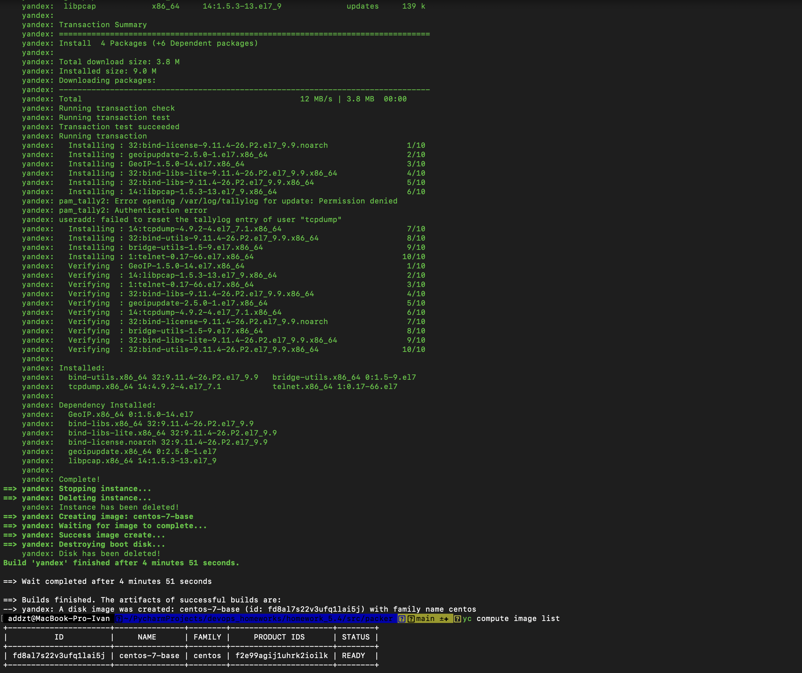
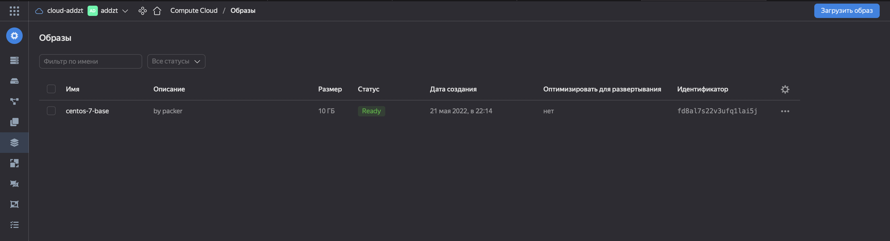
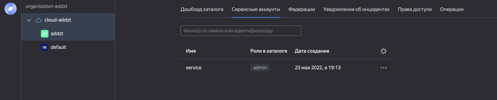
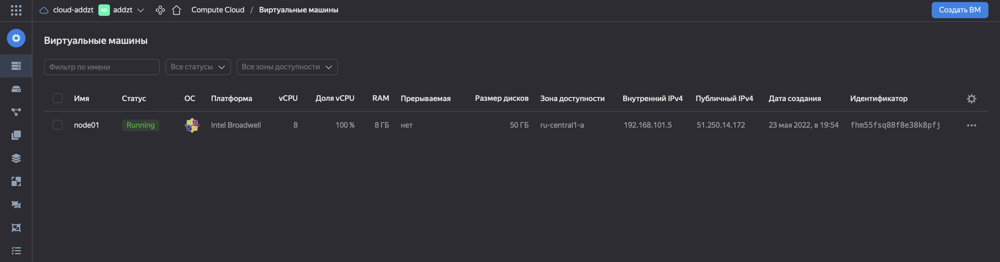
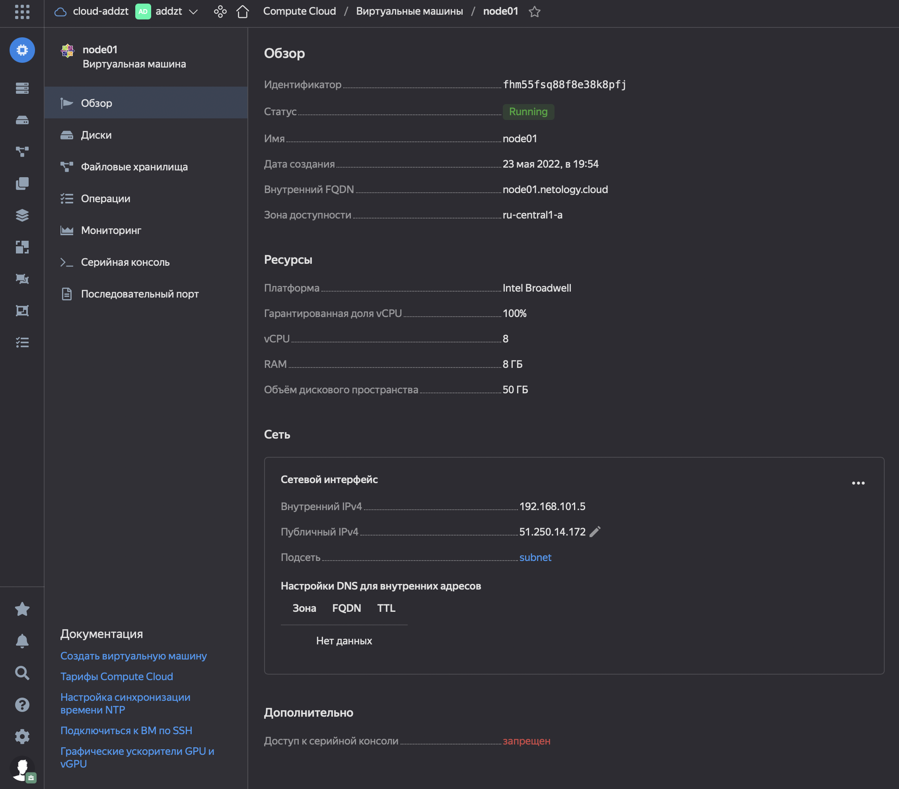
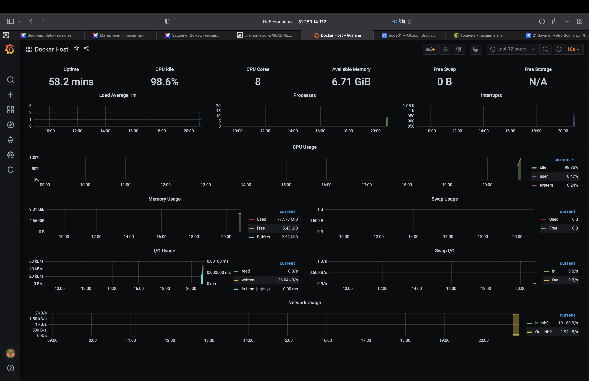

# Домашнее задание к занятию "5.4. Оркестрация группой Docker контейнеров на примере Docker Compose"

## Задача 1

Создать собственный образ операционной системы с помощью Packer.

Для получения зачета, вам необходимо предоставить:
- Скриншот страницы, как на слайде из презентации (слайд 37).

Инициализируем профиль в Yandex.Cloud.

```bash
 addzt@MacBook-Pro-Ivan  ~  yc init                                                                       
Welcome! This command will take you through the configuration process.
Please enter OAuth token: ***********
You have one cloud available: 'cloud-addzt' (id = b1gek2j9tqusmio646ds). It is going to be used by default.
Please choose folder to use:
 [1] default (id = b1ghaqlk147s1dnkes0r)
 [2] Create a new folder
Please enter your numeric choice: 2
Please enter a folder name: addzt
Your current folder has been set to 'addzt' (id = b1g8j1jdqckic2tr4rhv).
Do you want to configure a default Compute zone? [Y/n] y
Which zone do you want to use as a profile default?
 [1] ru-central1-a
 [2] ru-central1-b
 [3] ru-central1-c
 [4] Don't set default zone
Please enter your numeric choice: 1
Your profile default Compute zone has been set to 'ru-central1-a'.
```

Создаем сеть и подсеть.

```bash
 ✘ addzt@MacBook-Pro-Ivan  ~  yc vpc network create --name net --labels my-label=netology --description "my first network via yc"
id: enp0cpcf3dgri18r1foa
folder_id: b1g8j1jdqckic2tr4rhv
created_at: "2022-05-21T18:42:45Z"
name: net
description: my first network via yc
labels:
  my-label: netology
```

```bash
 addzt@MacBook-Pro-Ivan  ~  yc vpc subnet create --name my-subnet-a --zone ru-central1-a --range 10.1.2.0/24 --network-name net --description "my first subnet via yc"
id: e9bqboml949j4v6fqnu6
folder_id: b1g8j1jdqckic2tr4rhv
created_at: "2022-05-21T18:47:27Z"
name: my-subnet-a
description: my first subnet via yc
network_id: enp0cpcf3dgri18r1foa
zone_id: ru-central1-a
v4_cidr_blocks:
- 10.1.2.0/24
```

Установим `packer`.

```bash
 ✘ addzt@MacBook-Pro-Ivan  ~  brew tap hashicorp/tap

Running `brew update --preinstall`...
==> Auto-updated Homebrew!
Updated 2 taps (homebrew/core and homebrew/cask).
==> Updated Formulae
Updated 4 formulae.
==> Updated Casks
Updated 3 casks.

==> Tapping hashicorp/tap
Cloning into '/opt/homebrew/Library/Taps/hashicorp/homebrew-tap'...
remote: Enumerating objects: 2093, done.
remote: Counting objects: 100% (167/167), done.
remote: Compressing objects: 100% (59/59), done.
remote: Total 2093 (delta 116), reused 133 (delta 107), pack-reused 1926
Receiving objects: 100% (2093/2093), 369.67 KiB | 2.48 MiB/s, done.
Resolving deltas: 100% (1279/1279), done.
Tapped 1 cask and 17 formulae (50 files, 518.6KB).
brew tap hashicorp/tap
 ✘ addzt@MacBook-Pro-Ivan  ~  brew install hashicorp/tap/packer

==> Downloading https://releases.hashicorp.com/packer/1.8.0/packer_1.8.0_darwin_arm64.zip
######################################################################## 100.0%
==> Installing packer from hashicorp/tap
🍺  /opt/homebrew/Cellar/packer/1.8.0: 3 files, 175.0MB, built in 2 seconds
==> Running `brew cleanup packer`...
Disable this behaviour by setting HOMEBREW_NO_INSTALL_CLEANUP.
Hide these hints with HOMEBREW_NO_ENV_HINTS (see `man brew`).
 addzt@MacBook-Pro-Ivan  ~  packer --version
1.8.0
```

Меняем `json` и проверяем валидность.

```bash
 addzt@MacBook-Pro-Ivan  ~/PycharmProjects/devops_homeworks/homework_5.4/src/packer   main ±✚  packer validate centos-7-base.json
The configuration is valid.
```

Создаем образ операционной системы в Yandex.Cloud.

```bash
 addzt@MacBook-Pro-Ivan  ~/PycharmProjects/devops_homeworks/homework_5.4/src/packer   main ±✚  packer build centos-7-base.json   
yandex: output will be in this color.

==> yandex: Creating temporary RSA SSH key for instance...
==> yandex: Using as source image: fd8rdcd74jho9ssh779e (name: "centos-7-v20220519", family: "centos-7")
==> yandex: Use provided subnet id e9bqboml949j4v6fqnu6
==> yandex: Creating disk...
==> yandex: Creating instance...
==> yandex: Waiting for instance with id fhm7r82r497idql5fkf5 to become active...
    yandex: Detected instance IP: 51.250.72.142
==> yandex: Using SSH communicator to connect: 51.250.72.142
==> yandex: Waiting for SSH to become available...
==> yandex: Connected to SSH!
==> yandex: Provisioning with shell script: /var/folders/nt/fjblrt2x787512wfl2r88b4m0000gn/T/packer-shell15022218
    yandex: Loaded plugins: fastestmirror
    yandex: Loading mirror speeds from cached hostfile
    yandex:  * base: mirror.yandex.ru
    yandex:  * extras: mirror.yandex.ru
    yandex:  * updates: mirror.yandex.ru
    yandex: Resolving Dependencies
    yandex: --> Running transaction check
    yandex: ---> Package glibc.x86_64 0:2.17-325.el7_9 will be updated
    yandex: ---> Package glibc.x86_64 0:2.17-326.el7_9 will be an update
    yandex: ---> Package glibc-common.x86_64 0:2.17-325.el7_9 will be updated
    yandex: ---> Package glibc-common.x86_64 0:2.17-326.el7_9 will be an update
    yandex: ---> Package grub2.x86_64 1:2.02-0.87.el7.centos.7 will be updated
    yandex: ---> Package grub2.x86_64 1:2.02-0.87.0.1.el7.centos.9 will be an update
    yandex: ---> Package grub2-common.noarch 1:2.02-0.87.el7.centos.7 will be updated
    yandex: ---> Package grub2-common.noarch 1:2.02-0.87.0.1.el7.centos.9 will be an update
    yandex: ---> Package grub2-pc.x86_64 1:2.02-0.87.el7.centos.7 will be updated
    yandex: ---> Package grub2-pc.x86_64 1:2.02-0.87.0.1.el7.centos.9 will be an update
    yandex: ---> Package grub2-pc-modules.noarch 1:2.02-0.87.el7.centos.7 will be updated
    yandex: ---> Package grub2-pc-modules.noarch 1:2.02-0.87.0.1.el7.centos.9 will be an update
    yandex: ---> Package grub2-tools.x86_64 1:2.02-0.87.el7.centos.7 will be updated
    yandex: ---> Package grub2-tools.x86_64 1:2.02-0.87.0.1.el7.centos.9 will be an update
    yandex: ---> Package grub2-tools-extra.x86_64 1:2.02-0.87.el7.centos.7 will be updated
    yandex: ---> Package grub2-tools-extra.x86_64 1:2.02-0.87.0.1.el7.centos.9 will be an update
    yandex: ---> Package grub2-tools-minimal.x86_64 1:2.02-0.87.el7.centos.7 will be updated
    yandex: ---> Package grub2-tools-minimal.x86_64 1:2.02-0.87.0.1.el7.centos.9 will be an update
    yandex: ---> Package kernel.x86_64 0:3.10.0-1160.66.1.el7 will be installed
    yandex: ---> Package kernel-tools.x86_64 0:3.10.0-1160.62.1.el7 will be updated
    yandex: ---> Package kernel-tools.x86_64 0:3.10.0-1160.66.1.el7 will be an update
    yandex: ---> Package kernel-tools-libs.x86_64 0:3.10.0-1160.62.1.el7 will be updated
    yandex: ---> Package kernel-tools-libs.x86_64 0:3.10.0-1160.66.1.el7 will be an update
    yandex: ---> Package python-perf.x86_64 0:3.10.0-1160.62.1.el7 will be updated
    yandex: ---> Package python-perf.x86_64 0:3.10.0-1160.66.1.el7 will be an update
    yandex: --> Finished Dependency Resolution
    yandex:
    yandex: Dependencies Resolved
    yandex:
    yandex: ================================================================================
    yandex:  Package               Arch     Version                         Repository
    yandex:                                                                            Size
    yandex: ================================================================================
    yandex: Installing:
    yandex:  kernel                x86_64   3.10.0-1160.66.1.el7            updates    50 M
    yandex: Updating:
    yandex:  glibc                 x86_64   2.17-326.el7_9                  updates   3.6 M
    yandex:  glibc-common          x86_64   2.17-326.el7_9                  updates    12 M
    yandex:  grub2                 x86_64   1:2.02-0.87.0.1.el7.centos.9    updates    34 k
    yandex:  grub2-common          noarch   1:2.02-0.87.0.1.el7.centos.9    updates   732 k
    yandex:  grub2-pc              x86_64   1:2.02-0.87.0.1.el7.centos.9    updates    34 k
    yandex:  grub2-pc-modules      noarch   1:2.02-0.87.0.1.el7.centos.9    updates   858 k
    yandex:  grub2-tools           x86_64   1:2.02-0.87.0.1.el7.centos.9    updates   1.8 M
    yandex:  grub2-tools-extra     x86_64   1:2.02-0.87.0.1.el7.centos.9    updates   1.0 M
    yandex:  grub2-tools-minimal   x86_64   1:2.02-0.87.0.1.el7.centos.9    updates   177 k
    yandex:  kernel-tools          x86_64   3.10.0-1160.66.1.el7            updates   8.2 M
    yandex:  kernel-tools-libs     x86_64   3.10.0-1160.66.1.el7            updates   8.1 M
    yandex:  python-perf           x86_64   3.10.0-1160.66.1.el7            updates   8.2 M
    yandex:
    yandex: Transaction Summary
    yandex: ================================================================================
    yandex: Install   1 Package
    yandex: Upgrade  12 Packages
    yandex:
    yandex: Total download size: 94 M
    yandex: Downloading packages:
    yandex: Delta RPMs disabled because /usr/bin/applydeltarpm not installed.
    yandex: --------------------------------------------------------------------------------
    yandex: Total                                               84 MB/s |  94 MB  00:01
    yandex: Running transaction check
    yandex: Running transaction test
    yandex: Transaction test succeeded
    yandex: Running transaction
    yandex:   Updating   : glibc-common-2.17-326.el7_9.x86_64                          1/25
    yandex:   Updating   : glibc-2.17-326.el7_9.x86_64                                 2/25
    yandex:   Updating   : 1:grub2-common-2.02-0.87.0.1.el7.centos.9.noarch            3/25
    yandex:   Updating   : 1:grub2-tools-minimal-2.02-0.87.0.1.el7.centos.9.x86_64     4/25
    yandex:   Updating   : 1:grub2-tools-2.02-0.87.0.1.el7.centos.9.x86_64             5/25
    yandex:   Updating   : 1:grub2-tools-extra-2.02-0.87.0.1.el7.centos.9.x86_64       6/25
    yandex:   Updating   : 1:grub2-pc-modules-2.02-0.87.0.1.el7.centos.9.noarch        7/25
    yandex:   Updating   : 1:grub2-pc-2.02-0.87.0.1.el7.centos.9.x86_64                8/25
    yandex:   Updating   : kernel-tools-libs-3.10.0-1160.66.1.el7.x86_64               9/25
    yandex:   Updating   : kernel-tools-3.10.0-1160.66.1.el7.x86_64                   10/25
    yandex:   Updating   : 1:grub2-2.02-0.87.0.1.el7.centos.9.x86_64                  11/25
    yandex:   Updating   : python-perf-3.10.0-1160.66.1.el7.x86_64                    12/25
    yandex:   Installing : kernel-3.10.0-1160.66.1.el7.x86_64                         13/25
    yandex:   Cleanup    : kernel-tools-3.10.0-1160.62.1.el7.x86_64                   14/25
    yandex:   Cleanup    : 1:grub2-2.02-0.87.el7.centos.7.x86_64                      15/25
    yandex:   Cleanup    : 1:grub2-pc-2.02-0.87.el7.centos.7.x86_64                   16/25
    yandex:   Cleanup    : 1:grub2-tools-extra-2.02-0.87.el7.centos.7.x86_64          17/25
    yandex:   Cleanup    : 1:grub2-pc-modules-2.02-0.87.el7.centos.7.noarch           18/25
    yandex:   Cleanup    : 1:grub2-tools-2.02-0.87.el7.centos.7.x86_64                19/25
    yandex:   Cleanup    : 1:grub2-tools-minimal-2.02-0.87.el7.centos.7.x86_64        20/25
    yandex:   Cleanup    : kernel-tools-libs-3.10.0-1160.62.1.el7.x86_64              21/25
    yandex:   Cleanup    : python-perf-3.10.0-1160.62.1.el7.x86_64                    22/25
    yandex:   Cleanup    : 1:grub2-common-2.02-0.87.el7.centos.7.noarch               23/25
    yandex:   Cleanup    : glibc-common-2.17-325.el7_9.x86_64                         24/25
    yandex:   Cleanup    : glibc-2.17-325.el7_9.x86_64                                25/25
    yandex:   Verifying  : kernel-tools-3.10.0-1160.66.1.el7.x86_64                    1/25
    yandex:   Verifying  : glibc-2.17-326.el7_9.x86_64                                 2/25
    yandex:   Verifying  : 1:grub2-pc-2.02-0.87.0.1.el7.centos.9.x86_64                3/25
    yandex:   Verifying  : 1:grub2-tools-extra-2.02-0.87.0.1.el7.centos.9.x86_64       4/25
    yandex:   Verifying  : 1:grub2-tools-minimal-2.02-0.87.0.1.el7.centos.9.x86_64     5/25
    yandex:   Verifying  : 1:grub2-tools-2.02-0.87.0.1.el7.centos.9.x86_64             6/25
    yandex:   Verifying  : kernel-3.10.0-1160.66.1.el7.x86_64                          7/25
    yandex:   Verifying  : 1:grub2-pc-modules-2.02-0.87.0.1.el7.centos.9.noarch        8/25
    yandex:   Verifying  : kernel-tools-libs-3.10.0-1160.66.1.el7.x86_64               9/25
    yandex:   Verifying  : 1:grub2-2.02-0.87.0.1.el7.centos.9.x86_64                  10/25
    yandex:   Verifying  : glibc-common-2.17-326.el7_9.x86_64                         11/25
    yandex:   Verifying  : 1:grub2-common-2.02-0.87.0.1.el7.centos.9.noarch           12/25
    yandex:   Verifying  : python-perf-3.10.0-1160.66.1.el7.x86_64                    13/25
    yandex:   Verifying  : 1:grub2-pc-modules-2.02-0.87.el7.centos.7.noarch           14/25
    yandex:   Verifying  : kernel-tools-libs-3.10.0-1160.62.1.el7.x86_64              15/25
    yandex:   Verifying  : 1:grub2-tools-2.02-0.87.el7.centos.7.x86_64                16/25
    yandex:   Verifying  : 1:grub2-tools-minimal-2.02-0.87.el7.centos.7.x86_64        17/25
    yandex:   Verifying  : 1:grub2-tools-extra-2.02-0.87.el7.centos.7.x86_64          18/25
    yandex:   Verifying  : kernel-tools-3.10.0-1160.62.1.el7.x86_64                   19/25
    yandex:   Verifying  : 1:grub2-pc-2.02-0.87.el7.centos.7.x86_64                   20/25
    yandex:   Verifying  : python-perf-3.10.0-1160.62.1.el7.x86_64                    21/25
    yandex:   Verifying  : glibc-common-2.17-325.el7_9.x86_64                         22/25
    yandex:   Verifying  : glibc-2.17-325.el7_9.x86_64                                23/25
    yandex:   Verifying  : 1:grub2-2.02-0.87.el7.centos.7.x86_64                      24/25
    yandex:   Verifying  : 1:grub2-common-2.02-0.87.el7.centos.7.noarch               25/25
    yandex:
    yandex: Installed:
    yandex:   kernel.x86_64 0:3.10.0-1160.66.1.el7
    yandex:
    yandex: Updated:
    yandex:   glibc.x86_64 0:2.17-326.el7_9
    yandex:   glibc-common.x86_64 0:2.17-326.el7_9
    yandex:   grub2.x86_64 1:2.02-0.87.0.1.el7.centos.9
    yandex:   grub2-common.noarch 1:2.02-0.87.0.1.el7.centos.9
    yandex:   grub2-pc.x86_64 1:2.02-0.87.0.1.el7.centos.9
    yandex:   grub2-pc-modules.noarch 1:2.02-0.87.0.1.el7.centos.9
    yandex:   grub2-tools.x86_64 1:2.02-0.87.0.1.el7.centos.9
    yandex:   grub2-tools-extra.x86_64 1:2.02-0.87.0.1.el7.centos.9
    yandex:   grub2-tools-minimal.x86_64 1:2.02-0.87.0.1.el7.centos.9
    yandex:   kernel-tools.x86_64 0:3.10.0-1160.66.1.el7
    yandex:   kernel-tools-libs.x86_64 0:3.10.0-1160.66.1.el7
    yandex:   python-perf.x86_64 0:3.10.0-1160.66.1.el7
    yandex:
    yandex: Complete!
    yandex: Loaded plugins: fastestmirror
    yandex: Loading mirror speeds from cached hostfile
    yandex:  * base: mirror.yandex.ru
    yandex:  * extras: mirrors.datahouse.ru
    yandex:  * updates: mirrors.datahouse.ru
    yandex: Package iptables-1.4.21-35.el7.x86_64 already installed and latest version
    yandex: Package curl-7.29.0-59.el7_9.1.x86_64 already installed and latest version
    yandex: Package net-tools-2.0-0.25.20131004git.el7.x86_64 already installed and latest version
    yandex: Package rsync-3.1.2-10.el7.x86_64 already installed and latest version
    yandex: Package openssh-server-7.4p1-22.el7_9.x86_64 already installed and latest version
    yandex: Resolving Dependencies
    yandex: --> Running transaction check
    yandex: ---> Package bind-utils.x86_64 32:9.11.4-26.P2.el7_9.9 will be installed
    yandex: --> Processing Dependency: bind-libs-lite(x86-64) = 32:9.11.4-26.P2.el7_9.9 for package: 32:bind-utils-9.11.4-26.P2.el7_9.9.x86_64
    yandex: --> Processing Dependency: bind-libs(x86-64) = 32:9.11.4-26.P2.el7_9.9 for package: 32:bind-utils-9.11.4-26.P2.el7_9.9.x86_64
    yandex: --> Processing Dependency: liblwres.so.160()(64bit) for package: 32:bind-utils-9.11.4-26.P2.el7_9.9.x86_64
    yandex: --> Processing Dependency: libisccfg.so.160()(64bit) for package: 32:bind-utils-9.11.4-26.P2.el7_9.9.x86_64
    yandex: --> Processing Dependency: libisc.so.169()(64bit) for package: 32:bind-utils-9.11.4-26.P2.el7_9.9.x86_64
    yandex: --> Processing Dependency: libirs.so.160()(64bit) for package: 32:bind-utils-9.11.4-26.P2.el7_9.9.x86_64
    yandex: --> Processing Dependency: libdns.so.1102()(64bit) for package: 32:bind-utils-9.11.4-26.P2.el7_9.9.x86_64
    yandex: --> Processing Dependency: libbind9.so.160()(64bit) for package: 32:bind-utils-9.11.4-26.P2.el7_9.9.x86_64
    yandex: --> Processing Dependency: libGeoIP.so.1()(64bit) for package: 32:bind-utils-9.11.4-26.P2.el7_9.9.x86_64
    yandex: ---> Package bridge-utils.x86_64 0:1.5-9.el7 will be installed
    yandex: ---> Package tcpdump.x86_64 14:4.9.2-4.el7_7.1 will be installed
    yandex: --> Processing Dependency: libpcap >= 14:1.5.3-10 for package: 14:tcpdump-4.9.2-4.el7_7.1.x86_64
    yandex: --> Processing Dependency: libpcap.so.1()(64bit) for package: 14:tcpdump-4.9.2-4.el7_7.1.x86_64
    yandex: ---> Package telnet.x86_64 1:0.17-66.el7 will be installed
    yandex: --> Running transaction check
    yandex: ---> Package GeoIP.x86_64 0:1.5.0-14.el7 will be installed
    yandex: --> Processing Dependency: geoipupdate for package: GeoIP-1.5.0-14.el7.x86_64
    yandex: ---> Package bind-libs.x86_64 32:9.11.4-26.P2.el7_9.9 will be installed
    yandex: --> Processing Dependency: bind-license = 32:9.11.4-26.P2.el7_9.9 for package: 32:bind-libs-9.11.4-26.P2.el7_9.9.x86_64
    yandex: ---> Package bind-libs-lite.x86_64 32:9.11.4-26.P2.el7_9.9 will be installed
    yandex: ---> Package libpcap.x86_64 14:1.5.3-13.el7_9 will be installed
    yandex: --> Running transaction check
    yandex: ---> Package bind-license.noarch 32:9.11.4-26.P2.el7_9.9 will be installed
    yandex: ---> Package geoipupdate.x86_64 0:2.5.0-1.el7 will be installed
    yandex: --> Finished Dependency Resolution
    yandex:
    yandex: Dependencies Resolved
    yandex:
    yandex: ================================================================================
    yandex:  Package            Arch       Version                        Repository   Size
    yandex: ================================================================================
    yandex: Installing:
    yandex:  bind-utils         x86_64     32:9.11.4-26.P2.el7_9.9        updates     261 k
    yandex:  bridge-utils       x86_64     1.5-9.el7                      base         32 k
    yandex:  tcpdump            x86_64     14:4.9.2-4.el7_7.1             base        422 k
    yandex:  telnet             x86_64     1:0.17-66.el7                  updates      64 k
    yandex: Installing for dependencies:
    yandex:  GeoIP              x86_64     1.5.0-14.el7                   base        1.5 M
    yandex:  bind-libs          x86_64     32:9.11.4-26.P2.el7_9.9        updates     157 k
    yandex:  bind-libs-lite     x86_64     32:9.11.4-26.P2.el7_9.9        updates     1.1 M
    yandex:  bind-license       noarch     32:9.11.4-26.P2.el7_9.9        updates      91 k
    yandex:  geoipupdate        x86_64     2.5.0-1.el7                    base         35 k
    yandex:  libpcap            x86_64     14:1.5.3-13.el7_9              updates     139 k
    yandex:
    yandex: Transaction Summary
    yandex: ================================================================================
    yandex: Install  4 Packages (+6 Dependent packages)
    yandex:
    yandex: Total download size: 3.8 M
    yandex: Installed size: 9.0 M
    yandex: Downloading packages:
    yandex: --------------------------------------------------------------------------------
    yandex: Total                                               12 MB/s | 3.8 MB  00:00
    yandex: Running transaction check
    yandex: Running transaction test
    yandex: Transaction test succeeded
    yandex: Running transaction
    yandex:   Installing : 32:bind-license-9.11.4-26.P2.el7_9.9.noarch                 1/10
    yandex:   Installing : geoipupdate-2.5.0-1.el7.x86_64                              2/10
    yandex:   Installing : GeoIP-1.5.0-14.el7.x86_64                                   3/10
    yandex:   Installing : 32:bind-libs-lite-9.11.4-26.P2.el7_9.9.x86_64               4/10
    yandex:   Installing : 32:bind-libs-9.11.4-26.P2.el7_9.9.x86_64                    5/10
    yandex:   Installing : 14:libpcap-1.5.3-13.el7_9.x86_64                            6/10
    yandex: pam_tally2: Error opening /var/log/tallylog for update: Permission denied
    yandex: pam_tally2: Authentication error
    yandex: useradd: failed to reset the tallylog entry of user "tcpdump"
    yandex:   Installing : 14:tcpdump-4.9.2-4.el7_7.1.x86_64                           7/10
    yandex:   Installing : 32:bind-utils-9.11.4-26.P2.el7_9.9.x86_64                   8/10
    yandex:   Installing : bridge-utils-1.5-9.el7.x86_64                               9/10
    yandex:   Installing : 1:telnet-0.17-66.el7.x86_64                                10/10
    yandex:   Verifying  : GeoIP-1.5.0-14.el7.x86_64                                   1/10
    yandex:   Verifying  : 14:libpcap-1.5.3-13.el7_9.x86_64                            2/10
    yandex:   Verifying  : 1:telnet-0.17-66.el7.x86_64                                 3/10
    yandex:   Verifying  : 32:bind-libs-9.11.4-26.P2.el7_9.9.x86_64                    4/10
    yandex:   Verifying  : geoipupdate-2.5.0-1.el7.x86_64                              5/10
    yandex:   Verifying  : 14:tcpdump-4.9.2-4.el7_7.1.x86_64                           6/10
    yandex:   Verifying  : 32:bind-license-9.11.4-26.P2.el7_9.9.noarch                 7/10
    yandex:   Verifying  : bridge-utils-1.5-9.el7.x86_64                               8/10
    yandex:   Verifying  : 32:bind-libs-lite-9.11.4-26.P2.el7_9.9.x86_64               9/10
    yandex:   Verifying  : 32:bind-utils-9.11.4-26.P2.el7_9.9.x86_64                  10/10
    yandex:
    yandex: Installed:
    yandex:   bind-utils.x86_64 32:9.11.4-26.P2.el7_9.9   bridge-utils.x86_64 0:1.5-9.el7
    yandex:   tcpdump.x86_64 14:4.9.2-4.el7_7.1           telnet.x86_64 1:0.17-66.el7
    yandex:
    yandex: Dependency Installed:
    yandex:   GeoIP.x86_64 0:1.5.0-14.el7
    yandex:   bind-libs.x86_64 32:9.11.4-26.P2.el7_9.9
    yandex:   bind-libs-lite.x86_64 32:9.11.4-26.P2.el7_9.9
    yandex:   bind-license.noarch 32:9.11.4-26.P2.el7_9.9
    yandex:   geoipupdate.x86_64 0:2.5.0-1.el7
    yandex:   libpcap.x86_64 14:1.5.3-13.el7_9
    yandex:
    yandex: Complete!
==> yandex: Stopping instance...
==> yandex: Deleting instance...
    yandex: Instance has been deleted!
==> yandex: Creating image: centos-7-base
==> yandex: Waiting for image to complete...
==> yandex: Success image create...
==> yandex: Destroying boot disk...
    yandex: Disk has been deleted!
Build 'yandex' finished after 4 minutes 51 seconds.

==> Wait completed after 4 minutes 51 seconds

==> Builds finished. The artifacts of successful builds are:
--> yandex: A disk image was created: centos-7-base (id: fd8al7s22v3ufq1lai5j) with family name centos
```

Проверяем.

```bash
 addzt@MacBook-Pro-Ivan  ~/PycharmProjects/devops_homeworks/homework_5.4/src/packer   main ±✚  yc compute image list
+----------------------+---------------+--------+----------------------+--------+
|          ID          |     NAME      | FAMILY |     PRODUCT IDS      | STATUS |
+----------------------+---------------+--------+----------------------+--------+
| fd8al7s22v3ufq1lai5j | centos-7-base | centos | f2e99agij1uhrk2ioilk | READY  |
+----------------------+---------------+--------+----------------------+--------+
```




Удаляем подсеть и сеть.

```bash
 ✘ addzt@MacBook-Pro-Ivan  ~/PycharmProjects/devops_homeworks/homework_5.4/src/packer   main ±✚  yc vpc subnet delete --name my-subnet-a && yc vpc network delete --name net
done (6s)
```

## Задача 2

Создать вашу первую виртуальную машину в Яндекс.Облаке.

Для получения зачета, вам необходимо предоставить:
- Скриншот страницы свойств созданной ВМ.

Устанавливаем `Terraform`.

```bash
brew install hashicorp/tap/terraform
Running `brew update --preinstall`...
==> Auto-updated Homebrew!
Updated 3 taps (hashicorp/tap, homebrew/core and homebrew/cask).
==> Updated Formulae
Updated 59 formulae.
==> New Casks
bilibili-official                        cardpresso                               contour                                  hdfview                                  input-source-pro                         oso-cloud
==> Updated Casks
Updated 30 casks.

==> Downloading https://releases.hashicorp.com/terraform/1.2.0/terraform_1.2.0_darwin_arm64.zip
######################################################################## 100.0%
==> Installing terraform from hashicorp/tap
🍺  /opt/homebrew/Cellar/terraform/1.2.0: 3 files, 66.1MB, built in 1 second
==> Running `brew cleanup terraform`...
Disable this behaviour by setting HOMEBREW_NO_INSTALL_CLEANUP.
Hide these hints with HOMEBREW_NO_ENV_HINTS (see `man brew`).
```

Проверяем:

```bash
 addzt@MacBook-Pro-Ivan  ~/PycharmProjects/devops_homeworks/homework_5.4/src/packer   main ±✚  terraform --version
Terraform v1.2.0
on darwin_arm64
```

Инициализируем конфигурацию.

```bash
 ✘ addzt@MacBook-Pro-Ivan  ~/PycharmProjects/devops_homeworks/homework_5.4/src/terraform   main ±✚  terraform init

Initializing the backend...

Initializing provider plugins...
- Finding latest version of yandex-cloud/yandex...
- Installing yandex-cloud/yandex v0.74.0...
- Installed yandex-cloud/yandex v0.74.0 (self-signed, key ID E40F590B50BB8E40)

Partner and community providers are signed by their developers.
If you'd like to know more about provider signing, you can read about it here:
https://www.terraform.io/docs/cli/plugins/signing.html

Terraform has created a lock file .terraform.lock.hcl to record the provider
selections it made above. Include this file in your version control repository
so that Terraform can guarantee to make the same selections by default when
you run "terraform init" in the future.

Terraform has been successfully initialized!

You may now begin working with Terraform. Try running "terraform plan" to see
any changes that are required for your infrastructure. All Terraform commands
should now work.

If you ever set or change modules or backend configuration for Terraform,
rerun this command to reinitialize your working directory. If you forget, other
commands will detect it and remind you to do so if necessary.
```

Проверяем план `terraform`.

```bash
 addzt@MacBook-Pro-Ivan  ~/PycharmProjects/devops_homeworks/homework_5.4/src/terraform   main ±✚  terraform plan
╷
│ Error: JSON in "key.json" are not valid: invalid character 'k' looking for beginning of value
│ 
│   with provider["registry.terraform.io/yandex-cloud/yandex"],
│   on provider.tf line 11, in provider "yandex":
│   11:   service_account_key_file = "key.json"
│ 
╵
```

Создаем сервисный аккаунт, настроим права и аутентифицируемся от его имени.

Приложу скрин, не скопировал вывод.



Команды:

```bash
yc iam service-account create --name service \
  --description "service account"
  
yc resource-manager folder add-access-binding my-folder \
  --role admin \
  --subject serviceAccount: ajet0nb9u6tqld7ca7dh
```

```bash
 addzt@MacBook-Pro-Ivan  ~/PycharmProjects/devops_homeworks/homework_5.4/src/terraform   main ±✚  yc iam key create --folder-name addzt --service-account-name service --output key.json

id: aje78uqs05vhs7odvrcp
service_account_id: ajet0nb9u6tqld7ca7dh
created_at: "2022-05-23T16:37:52.760661460Z"
key_algorithm: RSA_2048

 addzt@MacBook-Pro-Ivan  ~/PycharmProjects/devops_homeworks/homework_5.4/src/terraform   main ±✚  yc config profile create service-profile 

Profile 'service-profile' created and activated
 addzt@MacBook-Pro-Ivan  ~/PycharmProjects/devops_homeworks/homework_5.4/src/terraform   main ±✚  yc config set service-account-key key.json
```

Внесем изменения в `variables.tf`.

Проверяем план еще раз.

```bash
 addzt@MacBook-Pro-Ivan  ~/PycharmProjects/devops_homeworks/homework_5.4/src/terraform   main ±✚  terraform plan                                                                        

Terraform used the selected providers to generate the following execution plan. Resource actions are indicated with the following symbols:
  + create

Terraform will perform the following actions:

  # yandex_compute_instance.node01 will be created
  + resource "yandex_compute_instance" "node01" {
      + allow_stopping_for_update = true
      + created_at                = (known after apply)
      + folder_id                 = (known after apply)
      + fqdn                      = (known after apply)
      + hostname                  = "node01.netology.cloud"
      + id                        = (known after apply)
      + metadata                  = {
          + "ssh-keys" = <<-EOT
                centos:ssh-rsa AAAAB3NzaC1yc2EAAAADAQABAAACAQC8pKZZNxBvGeRKvKzcxMGtXbJiJZ98dsQaDCrEg2i1O7ACQpg4H+XNReTFji7dP0DVfsd3vPSKY1cnQXF8NRXTAJagMFXJzlofAwKfr8CaAGBz1lRkPIdPl3iTWd4nXR/2G/2uJt3jsK7G0IijbrIBRjPuimOAO82RToRlbjHhUyWiApFseoxpWne5jyd4FYOl62f2lU5BXp/c0zPnouGACUytrwCxniG4IoGjrKZHdzCHv9VS/wWVBBgySUnYgT3M2vTZyiBQct9oMy61n0Oxr084Dl0pyWXxZ89pFhjGtzw6nWXLpgCuKnUOnDDIcAQg9jZdd1YaIvFRYwxo54mOs1XhSHaTkVfl59c3nNkpLQVIG3nUbR+iI/kk6QGrvedmW45ovf25TlXE9LsHk42imVHvgZ2LJoW2fbuiiOHJuZgx0y1vKFFUsRtSGplgz63ajK4NPk27Z1hdfMxKFzlJdUnIq/1NsXUMRCFN4FWOpFwmGQ4S7ZtBrmqlsRIx0m7o3fXUegn6gNoE5fpjY+O7goYMzvWh4zVTgrsaegQ5RmDyeSESrUnTWbAlMtNhKQbAMVdeQpG11oEITA6SbpuLZfPQpkoXnJpQ1Dc3gIbE590BRxqGaQwv+Vs4kpHOq/OYpsmgciF4AQDeTQgaBr0cX0n0s2jHKE31O17RVVnGtQ== addzt@yandex.ru
            EOT
        }
      + name                      = "node01"
      + network_acceleration_type = "standard"
      + platform_id               = "standard-v1"
      + service_account_id        = (known after apply)
      + status                    = (known after apply)
      + zone                      = "ru-central1-a"

      + boot_disk {
          + auto_delete = true
          + device_name = (known after apply)
          + disk_id     = (known after apply)
          + mode        = (known after apply)

          + initialize_params {
              + block_size  = (known after apply)
              + description = (known after apply)
              + image_id    = "fd8ft6norj68lo29qlpi"
              + name        = "root-node01"
              + size        = 50
              + snapshot_id = (known after apply)
              + type        = "network-nvme"
            }
        }

      + network_interface {
          + index              = (known after apply)
          + ip_address         = (known after apply)
          + ipv4               = true
          + ipv6               = (known after apply)
          + ipv6_address       = (known after apply)
          + mac_address        = (known after apply)
          + nat                = true
          + nat_ip_address     = (known after apply)
          + nat_ip_version     = (known after apply)
          + security_group_ids = (known after apply)
          + subnet_id          = (known after apply)
        }

      + placement_policy {
          + host_affinity_rules = (known after apply)
          + placement_group_id  = (known after apply)
        }

      + resources {
          + core_fraction = 100
          + cores         = 8
          + memory        = 8
        }

      + scheduling_policy {
          + preemptible = (known after apply)
        }
    }

  # yandex_vpc_network.default will be created
  + resource "yandex_vpc_network" "default" {
      + created_at                = (known after apply)
      + default_security_group_id = (known after apply)
      + folder_id                 = (known after apply)
      + id                        = (known after apply)
      + labels                    = (known after apply)
      + name                      = "net"
      + subnet_ids                = (known after apply)
    }

  # yandex_vpc_subnet.default will be created
  + resource "yandex_vpc_subnet" "default" {
      + created_at     = (known after apply)
      + folder_id      = (known after apply)
      + id             = (known after apply)
      + labels         = (known after apply)
      + name           = "subnet"
      + network_id     = (known after apply)
      + v4_cidr_blocks = [
          + "192.168.101.0/24",
        ]
      + v6_cidr_blocks = (known after apply)
      + zone           = "ru-central1-a"
    }

Plan: 3 to add, 0 to change, 0 to destroy.

Changes to Outputs:
  + external_ip_address_node01_yandex_cloud = (known after apply)
  + internal_ip_address_node01_yandex_cloud = (known after apply)

────────────────────────────────────────────────────────────────────────────────────────────────────────────────────────────────────────────────────────────────────────────────────────────────────────────────────────────────────────────────────

Note: You didn't use the -out option to save this plan, so Terraform can't guarantee to take exactly these actions if you run "terraform apply" now.
```

Применяем план.

```bash
 addzt@MacBook-Pro-Ivan  ~/PycharmProjects/devops_homeworks/homework_5.4/src/terraform   main ±✚  terraform apply -auto-approve 

Terraform used the selected providers to generate the following execution plan. Resource actions are indicated with the following symbols:
  + create

Terraform will perform the following actions:

  # yandex_compute_instance.node01 will be created
  + resource "yandex_compute_instance" "node01" {
      + allow_stopping_for_update = true
      + created_at                = (known after apply)
      + folder_id                 = (known after apply)
      + fqdn                      = (known after apply)
      + hostname                  = "node01.netology.cloud"
      + id                        = (known after apply)
      + metadata                  = {
          + "ssh-keys" = <<-EOT
                centos:ssh-rsa AAAAB3NzaC1yc2EAAAADAQABAAACAQC8pKZZNxBvGeRKvKzcxMGtXbJiJZ98dsQaDCrEg2i1O7ACQpg4H+XNReTFji7dP0DVfsd3vPSKY1cnQXF8NRXTAJagMFXJzlofAwKfr8CaAGBz1lRkPIdPl3iTWd4nXR/2G/2uJt3jsK7G0IijbrIBRjPuimOAO82RToRlbjHhUyWiApFseoxpWne5jyd4FYOl62f2lU5BXp/c0zPnouGACUytrwCxniG4IoGjrKZHdzCHv9VS/wWVBBgySUnYgT3M2vTZyiBQct9oMy61n0Oxr084Dl0pyWXxZ89pFhjGtzw6nWXLpgCuKnUOnDDIcAQg9jZdd1YaIvFRYwxo54mOs1XhSHaTkVfl59c3nNkpLQVIG3nUbR+iI/kk6QGrvedmW45ovf25TlXE9LsHk42imVHvgZ2LJoW2fbuiiOHJuZgx0y1vKFFUsRtSGplgz63ajK4NPk27Z1hdfMxKFzlJdUnIq/1NsXUMRCFN4FWOpFwmGQ4S7ZtBrmqlsRIx0m7o3fXUegn6gNoE5fpjY+O7goYMzvWh4zVTgrsaegQ5RmDyeSESrUnTWbAlMtNhKQbAMVdeQpG11oEITA6SbpuLZfPQpkoXnJpQ1Dc3gIbE590BRxqGaQwv+Vs4kpHOq/OYpsmgciF4AQDeTQgaBr0cX0n0s2jHKE31O17RVVnGtQ== addzt@yandex.ru
            EOT
        }
      + name                      = "node01"
      + network_acceleration_type = "standard"
      + platform_id               = "standard-v1"
      + service_account_id        = (known after apply)
      + status                    = (known after apply)
      + zone                      = "ru-central1-a"

      + boot_disk {
          + auto_delete = true
          + device_name = (known after apply)
          + disk_id     = (known after apply)
          + mode        = (known after apply)

          + initialize_params {
              + block_size  = (known after apply)
              + description = (known after apply)
              + image_id    = "fd8al7s22v3ufq1lai5j"
              + name        = "root-node01"
              + size        = 50
              + snapshot_id = (known after apply)
              + type        = "network-nvme"
            }
        }

      + network_interface {
          + index              = (known after apply)
          + ip_address         = (known after apply)
          + ipv4               = true
          + ipv6               = (known after apply)
          + ipv6_address       = (known after apply)
          + mac_address        = (known after apply)
          + nat                = true
          + nat_ip_address     = (known after apply)
          + nat_ip_version     = (known after apply)
          + security_group_ids = (known after apply)
          + subnet_id          = (known after apply)
        }

      + placement_policy {
          + host_affinity_rules = (known after apply)
          + placement_group_id  = (known after apply)
        }

      + resources {
          + core_fraction = 100
          + cores         = 8
          + memory        = 8
        }

      + scheduling_policy {
          + preemptible = (known after apply)
        }
    }

  # yandex_vpc_network.default will be created
  + resource "yandex_vpc_network" "default" {
      + created_at                = (known after apply)
      + default_security_group_id = (known after apply)
      + folder_id                 = (known after apply)
      + id                        = (known after apply)
      + labels                    = (known after apply)
      + name                      = "net"
      + subnet_ids                = (known after apply)
    }

  # yandex_vpc_subnet.default will be created
  + resource "yandex_vpc_subnet" "default" {
      + created_at     = (known after apply)
      + folder_id      = (known after apply)
      + id             = (known after apply)
      + labels         = (known after apply)
      + name           = "subnet"
      + network_id     = (known after apply)
      + v4_cidr_blocks = [
          + "192.168.101.0/24",
        ]
      + v6_cidr_blocks = (known after apply)
      + zone           = "ru-central1-a"
    }

Plan: 3 to add, 0 to change, 0 to destroy.

Changes to Outputs:
  + external_ip_address_node01_yandex_cloud = (known after apply)
  + internal_ip_address_node01_yandex_cloud = (known after apply)
yandex_vpc_network.default: Creating...
yandex_vpc_network.default: Creation complete after 4s [id=enpov34k4mrqc510ehcg]
yandex_vpc_subnet.default: Creating...
yandex_vpc_subnet.default: Creation complete after 1s [id=e9bdpq9oropma71i0ifu]
yandex_compute_instance.node01: Creating...
yandex_compute_instance.node01: Still creating... [10s elapsed]
yandex_compute_instance.node01: Still creating... [20s elapsed]
yandex_compute_instance.node01: Still creating... [30s elapsed]
yandex_compute_instance.node01: Still creating... [40s elapsed]
yandex_compute_instance.node01: Creation complete after 48s [id=fhm55fsq88f8e38k8pfj]

Apply complete! Resources: 3 added, 0 changed, 0 destroyed.

Outputs:

external_ip_address_node01_yandex_cloud = "51.250.14.172"
internal_ip_address_node01_yandex_cloud = "192.168.101.5"
```

Результат:

 



## Задача 3

Создать ваш первый готовый к боевой эксплуатации компонент мониторинга, состоящий из стека микросервисов.

Для получения зачета, вам необходимо предоставить:
- Скриншот работающего веб-интерфейса Grafana с текущими метриками.

Отредактируем `inventory.yml`.

```yaml
[nodes:children]
manager

[manager]
node01.netology.cloud ansible_host=51.250.14.172
```

Запустим стек микросервисов.

```bash
 addzt@MacBook-Pro-Ivan  ~/PycharmProjects/devops_homeworks/homework_5.4/src/ansible   main ±✚  ansible-playbook provision.yml
/opt/homebrew/Cellar/ansible/5.7.1/libexec/lib/python3.10/site-packages/paramiko/transport.py:236: CryptographyDeprecationWarning: Blowfish has been deprecated
  "class": algorithms.Blowfish,

PLAY [nodes] ****************************************************************************************************************************************************************************************************************************************

TASK [Gathering Facts] ******************************************************************************************************************************************************************************************************************************
Enter passphrase for key '/Users/addzt/.ssh/id_rsa': 
Enter passphrase for key '/Users/addzt/.ssh/id_rsa': 
ok: [node01.netology.cloud]

TASK [Create directory for ssh-keys] ****************************************************************************************************************************************************************************************************************
ok: [node01.netology.cloud]

TASK [Adding rsa-key in /root/.ssh/authorized_keys] *************************************************************************************************************************************************************************************************
changed: [node01.netology.cloud]

TASK [Checking DNS] *********************************************************************************************************************************************************************************************************************************
changed: [node01.netology.cloud]

TASK [Installing tools] *****************************************************************************************************************************************************************************************************************************
changed: [node01.netology.cloud] => (item=git)
ok: [node01.netology.cloud] => (item=curl)

TASK [Add docker repository] ************************************************************************************************************************************************************************************************************************
changed: [node01.netology.cloud]

TASK [Installing docker package] ********************************************************************************************************************************************************************************************************************
changed: [node01.netology.cloud] => (item=docker-ce)
ok: [node01.netology.cloud] => (item=docker-ce-cli)
ok: [node01.netology.cloud] => (item=containerd.io)

TASK [Enable docker daemon] *************************************************************************************************************************************************************************************************************************
changed: [node01.netology.cloud]

TASK [Install docker-compose] ***********************************************************************************************************************************************************************************************************************
changed: [node01.netology.cloud]

TASK [Synchronization] ******************************************************************************************************************************************************************************************************************************
changed: [node01.netology.cloud]

TASK [Pull all images in compose] *******************************************************************************************************************************************************************************************************************
changed: [node01.netology.cloud]

TASK [Up all services in compose] *******************************************************************************************************************************************************************************************************************
changed: [node01.netology.cloud]

PLAY RECAP ******************************************************************************************************************************************************************************************************************************************
node01.netology.cloud      : ok=12   changed=10   unreachable=0    failed=0    skipped=0    rescued=0    ignored=0   
```

Зайдем на ВМ по ssh и проверим наличие контейнеров:

```bash
 addzt@MacBook-Pro-Ivan  ~/PycharmProjects/devops_homeworks/homework_5.4/src/ansible   main ±✚  ssh centos@51.250.14.172          
[centos@node01 ~]$ ls
[centos@node01 ~]$ docker ps
Got permission denied while trying to connect to the Docker daemon socket at unix:///var/run/docker.sock: Get "http://%2Fvar%2Frun%2Fdocker.sock/v1.24/containers/json": dial unix /var/run/docker.sock: connect: permission denied
[centos@node01 ~]$ sudo -i
[root@node01 ~]# docker ps
CONTAINER ID   IMAGE                                       COMMAND                  CREATED         STATUS                   PORTS                                                                              NAMES
db79a56e0f3a   prom/pushgateway:v1.2.0                     "/bin/pushgateway"       3 minutes ago   Up 3 minutes             9091/tcp                                                                           pushgateway
caeaa9907634   gcr.io/google-containers/cadvisor:v0.34.0   "/usr/bin/cadvisor -…"   3 minutes ago   Up 3 minutes (healthy)   8080/tcp                                                                           cadvisor
47b7f58675cb   prom/prometheus:v2.17.1                     "/bin/prometheus --c…"   3 minutes ago   Up 3 minutes             9090/tcp                                                                           prometheus
819840c07c15   stefanprodan/caddy                          "/sbin/tini -- caddy…"   3 minutes ago   Up 3 minutes             0.0.0.0:3000->3000/tcp, 0.0.0.0:9090-9091->9090-9091/tcp, 0.0.0.0:9093->9093/tcp   caddy
605ff02fcaad   prom/node-exporter:v0.18.1                  "/bin/node_exporter …"   3 minutes ago   Up 3 minutes             9100/tcp                                                                           nodeexporter
39c2b3bf445d   prom/alertmanager:v0.20.0                   "/bin/alertmanager -…"   3 minutes ago   Up 3 minutes             9093/tcp                                                                           alertmanager
e1f9af8e0a60   grafana/grafana:7.4.2                       "/run.sh"                3 minutes ago   Up 3 minutes             3000/tcp                                                                           grafana
```

Зайдем на веб-интерфейс графаны.

  

Удаляем все.

```bash
 addzt@MacBook-Pro-Ivan  ~/PycharmProjects/devops_homeworks/homework_5.4/src/terraform   main ±✚  terraform destroy -auto-approve
yandex_vpc_network.default: Refreshing state... [id=enpov34k4mrqc510ehcg]
yandex_vpc_subnet.default: Refreshing state... [id=e9bdpq9oropma71i0ifu]
yandex_compute_instance.node01: Refreshing state... [id=fhm55fsq88f8e38k8pfj]

Terraform used the selected providers to generate the following execution plan. Resource actions are indicated with the following symbols:
  - destroy

Terraform will perform the following actions:

  # yandex_compute_instance.node01 will be destroyed
  - resource "yandex_compute_instance" "node01" {
      - allow_stopping_for_update = true -> null
      - created_at                = "2022-05-23T16:54:55Z" -> null
      - folder_id                 = "b1g8j1jdqckic2tr4rhv" -> null
      - fqdn                      = "node01.netology.cloud" -> null
      - hostname                  = "node01" -> null
      - id                        = "fhm55fsq88f8e38k8pfj" -> null
      - labels                    = {} -> null
      - metadata                  = {
          - "ssh-keys" = <<-EOT
                centos:ssh-rsa AAAAB3NzaC1yc2EAAAADAQABAAACAQC8pKZZNxBvGeRKvKzcxMGtXbJiJZ98dsQaDCrEg2i1O7ACQpg4H+XNReTFji7dP0DVfsd3vPSKY1cnQXF8NRXTAJagMFXJzlofAwKfr8CaAGBz1lRkPIdPl3iTWd4nXR/2G/2uJt3jsK7G0IijbrIBRjPuimOAO82RToRlbjHhUyWiApFseoxpWne5jyd4FYOl62f2lU5BXp/c0zPnouGACUytrwCxniG4IoGjrKZHdzCHv9VS/wWVBBgySUnYgT3M2vTZyiBQct9oMy61n0Oxr084Dl0pyWXxZ89pFhjGtzw6nWXLpgCuKnUOnDDIcAQg9jZdd1YaIvFRYwxo54mOs1XhSHaTkVfl59c3nNkpLQVIG3nUbR+iI/kk6QGrvedmW45ovf25TlXE9LsHk42imVHvgZ2LJoW2fbuiiOHJuZgx0y1vKFFUsRtSGplgz63ajK4NPk27Z1hdfMxKFzlJdUnIq/1NsXUMRCFN4FWOpFwmGQ4S7ZtBrmqlsRIx0m7o3fXUegn6gNoE5fpjY+O7goYMzvWh4zVTgrsaegQ5RmDyeSESrUnTWbAlMtNhKQbAMVdeQpG11oEITA6SbpuLZfPQpkoXnJpQ1Dc3gIbE590BRxqGaQwv+Vs4kpHOq/OYpsmgciF4AQDeTQgaBr0cX0n0s2jHKE31O17RVVnGtQ== addzt@yandex.ru
            EOT
        } -> null
      - name                      = "node01" -> null
      - network_acceleration_type = "standard" -> null
      - platform_id               = "standard-v1" -> null
      - status                    = "running" -> null
      - zone                      = "ru-central1-a" -> null

      - boot_disk {
          - auto_delete = true -> null
          - device_name = "fhmakqhhsi9idue0rpjh" -> null
          - disk_id     = "fhmakqhhsi9idue0rpjh" -> null
          - mode        = "READ_WRITE" -> null

          - initialize_params {
              - block_size = 4096 -> null
              - image_id   = "fd8al7s22v3ufq1lai5j" -> null
              - name       = "root-node01" -> null
              - size       = 50 -> null
              - type       = "network-ssd" -> null
            }
        }

      - network_interface {
          - index              = 0 -> null
          - ip_address         = "192.168.101.5" -> null
          - ipv4               = true -> null
          - ipv6               = false -> null
          - mac_address        = "d0:0d:52:bf:9a:42" -> null
          - nat                = true -> null
          - nat_ip_address     = "51.250.14.172" -> null
          - nat_ip_version     = "IPV4" -> null
          - security_group_ids = [] -> null
          - subnet_id          = "e9bdpq9oropma71i0ifu" -> null
        }

      - placement_policy {
          - host_affinity_rules = [] -> null
        }

      - resources {
          - core_fraction = 100 -> null
          - cores         = 8 -> null
          - gpus          = 0 -> null
          - memory        = 8 -> null
        }

      - scheduling_policy {
          - preemptible = false -> null
        }
    }

  # yandex_vpc_network.default will be destroyed
  - resource "yandex_vpc_network" "default" {
      - created_at = "2022-05-23T16:54:51Z" -> null
      - folder_id  = "b1g8j1jdqckic2tr4rhv" -> null
      - id         = "enpov34k4mrqc510ehcg" -> null
      - labels     = {} -> null
      - name       = "net" -> null
      - subnet_ids = [
          - "e9bdpq9oropma71i0ifu",
        ] -> null
    }

  # yandex_vpc_subnet.default will be destroyed
  - resource "yandex_vpc_subnet" "default" {
      - created_at     = "2022-05-23T16:54:53Z" -> null
      - folder_id      = "b1g8j1jdqckic2tr4rhv" -> null
      - id             = "e9bdpq9oropma71i0ifu" -> null
      - labels         = {} -> null
      - name           = "subnet" -> null
      - network_id     = "enpov34k4mrqc510ehcg" -> null
      - v4_cidr_blocks = [
          - "192.168.101.0/24",
        ] -> null
      - v6_cidr_blocks = [] -> null
      - zone           = "ru-central1-a" -> null
    }

Plan: 0 to add, 0 to change, 3 to destroy.

Changes to Outputs:
  - external_ip_address_node01_yandex_cloud = "51.250.14.172" -> null
  - internal_ip_address_node01_yandex_cloud = "192.168.101.5" -> null
yandex_compute_instance.node01: Destroying... [id=fhm55fsq88f8e38k8pfj]
yandex_compute_instance.node01: Still destroying... [id=fhm55fsq88f8e38k8pfj, 10s elapsed]
yandex_compute_instance.node01: Destruction complete after 13s
yandex_vpc_subnet.default: Destroying... [id=e9bdpq9oropma71i0ifu]
yandex_vpc_subnet.default: Still destroying... [id=e9bdpq9oropma71i0ifu, 10s elapsed]
yandex_vpc_subnet.default: Still destroying... [id=e9bdpq9oropma71i0ifu, 20s elapsed]
yandex_vpc_subnet.default: Destruction complete after 25s
yandex_vpc_network.default: Destroying... [id=enpov34k4mrqc510ehcg]
yandex_vpc_network.default: Destruction complete after 1s

Destroy complete! Resources: 3 destroyed.

addzt@MacBook-Pro-Ivan  ~/PycharmProjects/devops_homeworks/homework_5.4/src/terraform   main ±✚  yc compute image delete --id fd8al7s22v3ufq1lai5j
done (7s)
```

## Задача 4 (*)

Создать вторую ВМ и подключить её к мониторингу развёрнутому на первом сервере.

Для получения зачета, вам необходимо предоставить:
- Скриншот из Grafana, на котором будут отображаться метрики добавленного вами сервера.