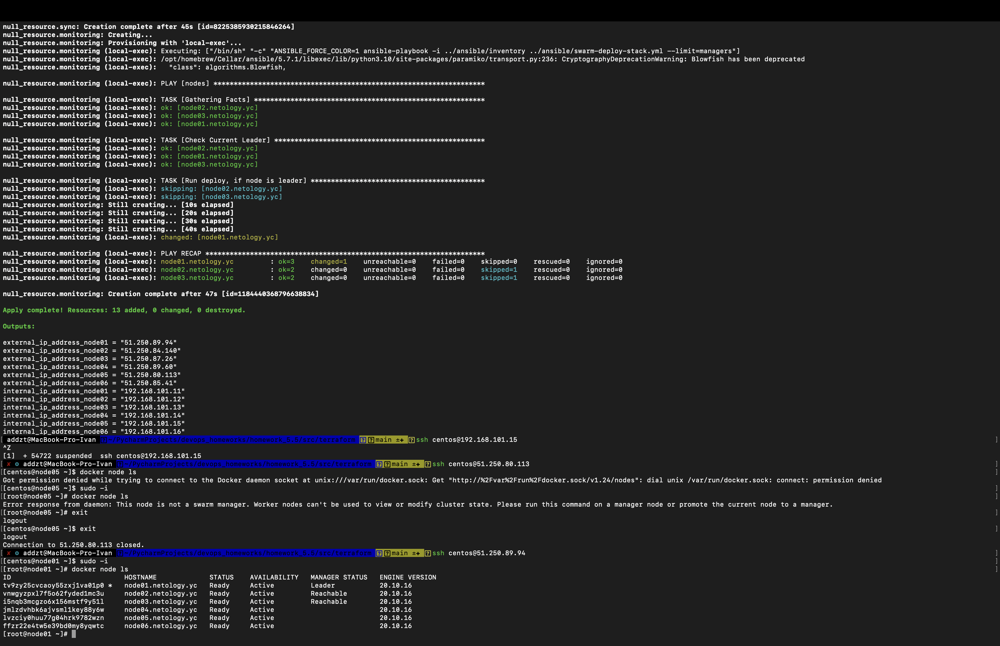
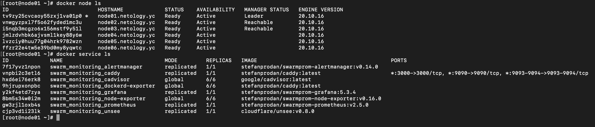

# Домашнее задание к занятию "5.5. Оркестрация кластером Docker контейнеров на примере Docker Swarm"

## Задача 1

Дайте письменые ответы на следующие вопросы:

- В чём отличие режимов работы сервисов в Docker Swarm кластере: replication и global?

`Replicated services`  - Вы можете указать количество одинаковых задач. Например, вы решаете развернуть три копии экземпляров HTTP, каждый из которых предоставляет один и тот же контент.  
`Global services`- Запустите одну и ту же задачу на каждом узле. Нет необходимости указывать количество заданий заранее. Каждый раз, когда узел добавляется в `Swarm`, оркестратор создает задачу, а планировщик назначает задачу новому узлу.

- Какой алгоритм выбора лидера используется в Docker Swarm кластере?

Алгоритм `Raft`. 

`Raft` строится поверх кластера, на каждом из узлов которого работает некая машина состояний. Raft обеспечивает надёжную доставку сигналов на все узлы в заданном порядке. Таким образом обеспечивается переход всех машин состояний по одним и тем же последовательностям состояний. Таким образом, каждый узел гарантированно приходит в согласие с другими узлами.  
Важным обстоятельством является то, что Raft строго нумерует все записи в протоколе работы. Записи должны идти строго последовательно. Эти номера играют важную роль в работе алгоритма. По ним определяется степень актуальности состояния узла. При выборе лидера всегда лидером становится самый актуальный узел. Эти же номера используются для нумерации сессий голосования. На каждый запрос на голосование узел может проголосовать лишь единожды.

- Что такое Overlay Network?

`Overlay-network` используются в контексте кластеров, где виртуальная сеть, которую используют контейнеры, связывает несколько физических хостов, на которых запущен Docker. Когда вы запускаете контейнер на swarm-кластере (как часть сервиса), множество сетей присоединяется по умолчанию, и каждая из них соответствует разным требованиям связи.

## Задача 2

Создать ваш первый Docker Swarm кластер в Яндекс.Облаке

Для получения зачета, вам необходимо предоставить скриншот из терминала (консоли), с выводом команды:
```
docker node ls
```

```bash
 addzt@MacBook-Pro-Ivan  ~/PycharmProjects/devops_homeworks/homework_5.5   main ±✚  yc config list
token: A****************B
cloud-id: b1gek2j9tqusmio646ds
folder-id: b1g8j1jdqckic2tr4rhv
compute-default-zone: ru-central1-a
 addzt@MacBook-Pro-Ivan  ~/PycharmProjects/devops_homeworks/homework_5.5   main ±✚  yc vpc network create --name net --labels my-label=netology --description "my first network via yc"
id: enpje3nbqgtton0m40im
folder_id: b1g8j1jdqckic2tr4rhv
created_at: "2022-05-27T18:36:37Z"
name: net
description: my first network via yc
labels:
  my-label: netology
 addzt@MacBook-Pro-Ivan  ~/PycharmProjects/devops_homeworks/homework_5.5   main ±✚  yc vpc subnet create --name my-subnet-a --zone ru-central1-a --range 10.1.2.0/24 --network-name net --description "my first subnet via yc"
id: e9b10b2fbbj5so67nj3j
folder_id: b1g8j1jdqckic2tr4rhv
created_at: "2022-05-27T18:37:31Z"
name: my-subnet-a
description: my first subnet via yc
network_id: enpje3nbqgtton0m40im
zone_id: ru-central1-a
v4_cidr_blocks:
- 10.1.2.0/24
```

```bash
 ✘ addzt@MacBook-Pro-Ivan  ~/PycharmProjects/devops_homeworks/homework_5.5/src/packer   main ±✚  packer validate centos-7-base.json
The configuration is valid.
 ✘ addzt@MacBook-Pro-Ivan  ~/PycharmProjects/devops_homeworks/homework_5.5/src/packer   main ±✚  packer build centos-7-base.json
yandex: output will be in this color.

==> yandex: Creating temporary RSA SSH key for instance...
==> yandex: Using as source image: fd8rdcd74jho9ssh779e (name: "centos-7-v20220519", family: "centos-7")
==> yandex: Use provided subnet id e9b10b2fbbj5so67nj3j
==> yandex: Creating disk...
.....
Build 'yandex' finished after 4 minutes 14 seconds.

==> Wait completed after 4 minutes 14 seconds

==> Builds finished. The artifacts of successful builds are:

--> yandex: A disk image was created: centos-7-base (id: fd8e6vdruvmbu8nciikp) with family name centos

 addzt@MacBook-Pro-Ivan  ~/PycharmProjects/devops_homeworks/homework_5.5/src/packer   main ±✚  yc vpc subnet delete --name my-subnet-a && yc vpc network delete --name net                                                               
done (2s)
```

```bash
 ✘ addzt@MacBook-Pro-Ivan  ~/PycharmProjects/devops_homeworks/homework_5.5/src/terraform   main ±✚  terraform init

Initializing the backend...

Initializing provider plugins...
- Finding latest version of hashicorp/local...
- Finding latest version of yandex-cloud/yandex...
- Finding latest version of hashicorp/null...
- Installing hashicorp/local v2.2.3...
- Installed hashicorp/local v2.2.3 (signed by HashiCorp)
- Installing yandex-cloud/yandex v0.74.0...
- Installed yandex-cloud/yandex v0.74.0 (self-signed, key ID E40F590B50BB8E40)
- Installing hashicorp/null v3.1.1...
- Installed hashicorp/null v3.1.1 (signed by HashiCorp)

Partner and community providers are signed by their developers.
If you'd like to know more about provider signing, you can read about it here:
https://www.terraform.io/docs/cli/plugins/signing.html

Terraform has created a lock file .terraform.lock.hcl to record the provider
selections it made above. Include this file in your version control repository
so that Terraform can guarantee to make the same selections by default when
you run "terraform init" in the future.

Terraform has been successfully initialized!

You may now begin working with Terraform. Try running "terraform plan" to see
any changes that are required for your infrastructure. All Terraform commands
should now work.

If you ever set or change modules or backend configuration for Terraform,
rerun this command to reinitialize your working directory. If you forget, other
commands will detect it and remind you to do so if necessary.

 ✘ addzt@MacBook-Pro-Ivan  ~/PycharmProjects/devops_homeworks/homework_5.5/src/terraform   main ±✚  yc iam service-account create --name service \
  --description "service account"
id: ajeu4j6cgrnii8ocgq5o
folder_id: b1g8j1jdqckic2tr4rhv
created_at: "2022-05-27T18:58:56.115083113Z"
name: service
description: service account

 addzt@MacBook-Pro-Ivan  ~/PycharmProjects/devops_homeworks/homework_5.5/src/terraform   main ±✚  yc iam key create --folder-name addzt --service-account-name service --output key.json
  
id: ajernm8ncfdrurhk2f1l
service_account_id: ajeu4j6cgrnii8ocgq5o
created_at: "2022-05-27T18:59:24.390943071Z"
key_algorithm: RSA_2048

 addzt@MacBook-Pro-Ivan  ~/PycharmProjects/devops_homeworks/homework_5.5/src/terraform   main ±✚  yc config set service-account-key key.json                                            

 addzt@MacBook-Pro-Ivan  ~/PycharmProjects/devops_homeworks/homework_5.5/src/terraform   main ±✚  terraform validate                                                            
Success! The configuration is valid.

 addzt@MacBook-Pro-Ivan  ~/PycharmProjects/devops_homeworks/homework_5.5/src/terraform   main ±✚  terraform plan    

Terraform used the selected providers to generate the following execution plan. Resource actions are indicated with the following symbols:
  + create

Terraform will perform the following actions:
.....
Changes to Outputs:
  + external_ip_address_node01 = (known after apply)
  + external_ip_address_node02 = (known after apply)
  + external_ip_address_node03 = (known after apply)
  + external_ip_address_node04 = (known after apply)
  + external_ip_address_node05 = (known after apply)
  + external_ip_address_node06 = (known after apply)
  + internal_ip_address_node01 = "192.168.101.11"
  + internal_ip_address_node02 = "192.168.101.12"
  + internal_ip_address_node03 = "192.168.101.13"
  + internal_ip_address_node04 = "192.168.101.14"
  + internal_ip_address_node05 = "192.168.101.15"
  + internal_ip_address_node06 = "192.168.101.16"

────────────────────────────────────────────────────────────────────────────────────────────────────────────────────────────────────────────────────────────────────────────────────────────────────────────────────────────────────────────────────

Note: You didn't use the -out option to save this plan, so Terraform can't guarantee to take exactly these actions if you run "terraform apply" now.
```

```bash
 addzt@MacBook-Pro-Ivan  ~/PycharmProjects/devops_homeworks/homework_5.5/src/terraform   main ±✚  terraform apply -auto-approve                             

Terraform used the selected providers to generate the following execution plan. Resource actions are indicated with the following symbols:
  + create
.....
Apply complete! Resources: 13 added, 0 changed, 0 destroyed.

Outputs:

external_ip_address_node01 = "51.250.89.94"
external_ip_address_node02 = "51.250.84.140"
external_ip_address_node03 = "51.250.87.26"
external_ip_address_node04 = "51.250.89.60"
external_ip_address_node05 = "51.250.80.113"
external_ip_address_node06 = "51.250.85.41"
internal_ip_address_node01 = "192.168.101.11"
internal_ip_address_node02 = "192.168.101.12"
internal_ip_address_node03 = "192.168.101.13"
internal_ip_address_node04 = "192.168.101.14"
internal_ip_address_node05 = "192.168.101.15"
internal_ip_address_node06 = "192.168.101.16"
```



## Задача 3

Создать ваш первый, готовый к боевой эксплуатации кластер мониторинга, состоящий из стека микросервисов.

Для получения зачета, вам необходимо предоставить скриншот из терминала (консоли), с выводом команды:
```
docker service ls
```

```bash
[root@node01 ~]# docker service ls
ID             NAME                                MODE         REPLICAS   IMAGE                                          PORTS
7f17yvz1npon   swarm_monitoring_alertmanager       replicated   1/1        stefanprodan/swarmprom-alertmanager:v0.14.0    
vnpbi2c3etl6   swarm_monitoring_caddy              replicated   1/1        stefanprodan/caddy:latest                      *:3000->3000/tcp, *:9090->9090/tcp, *:9093-9094->9093-9094/tcp
hxd6ei76erk8   swarm_monitoring_cadvisor           global       6/6        google/cadvisor:latest                         
9hjrupxonpbc   swarm_monitoring_dockerd-exporter   global       6/6        stefanprodan/caddy:latest                      
y2kf4etd7zya   swarm_monitoring_grafana            replicated   1/1        stefanprodan/swarmprom-grafana:5.3.4           
8bm5s34w0i2m   swarm_monitoring_node-exporter      global       6/6        stefanprodan/swarmprom-node-exporter:v0.16.0   
gw3zjl1oxb4s   swarm_monitoring_prometheus         replicated   1/1        stefanprodan/swarmprom-prometheus:v2.5.0       
cjp3vd1i23lk   swarm_monitoring_unsee              replicated   1/1        cloudflare/unsee:v0.8.0     
```



## Задача 4 (*)

Выполнить на лидере Docker Swarm кластера команду (указанную ниже) и дать письменное описание её функционала, что она делает и зачем она нужна:
```
# см.документацию: https://docs.docker.com/engine/swarm/swarm_manager_locking/
docker swarm update --autolock=true
```

```bash
[root@node01 ~]# docker swarm update --autolock=true
Swarm updated.
To unlock a swarm manager after it restarts, run the `docker swarm unlock`
command and provide the following key:

    SWMKEY-1-qgkkHKI5fJO0OVER9WEDAiTl3DwseAM85SGHOUS7SEk

Please remember to store this key in a password manager, since without it you
will not be able to restart the manager.
```

Команда включает автоматическую блокировку `Raft` логов.

Удаляем все:

```bash
 ⚙ addzt@MacBook-Pro-Ivan  ~/PycharmProjects/devops_homeworks/homework_5.5/src/terraform   main ±✚  terraform destroy -auto-approve
yandex_vpc_network.default: Refreshing state... [id=enp8cngej7gj29v9t7sf]
yandex_vpc_subnet.default: Refreshing state... [id=e9b7p44meghhtf79p0uf]
yandex_compute_instance.node04: Refreshing state... [id=fhm686rtb0sqi19gto1h]
yandex_compute_instance.node02: Refreshing state... [id=fhm1jufqhivshnk5pbol]
yandex_compute_instance.node06: Refreshing state... [id=fhmhidfl62qabjmbm27n]
yandex_compute_instance.node03: Refreshing state... [id=fhmq211qcbha2l728bvn]
yandex_compute_instance.node05: Refreshing state... [id=fhm8rk3j771h54m4d382]
yandex_compute_instance.node01: Refreshing state... [id=fhm828t91lk1ngqopm7d]
local_file.inventory: Refreshing state... [id=67e7ec87c2493e1ab8309565e65f169b38e549ed]
null_resource.wait: Refreshing state... [id=3353402310210909663]
null_resource.cluster: Refreshing state... [id=6847236296011554825]
null_resource.sync: Refreshing state... [id=8225385930215846264]
null_resource.monitoring: Refreshing state... [id=1184440368796638834]
.....
Destroy complete! Resources: 13 destroyed.
 ⚙ addzt@MacBook-Pro-Ivan  ~/PycharmProjects/devops_homeworks/homework_5.5/src/terraform   main ±✚  yc compute image list                     
+----------------------+---------------+--------+----------------------+--------+
|          ID          |     NAME      | FAMILY |     PRODUCT IDS      | STATUS |
+----------------------+---------------+--------+----------------------+--------+
| fd8e6vdruvmbu8nciikp | centos-7-base | centos | f2e99agij1uhrk2ioilk | READY  |
+----------------------+---------------+--------+----------------------+--------+
 ✘ ⚙ addzt@MacBook-Pro-Ivan  ~/PycharmProjects/devops_homeworks/homework_5.5/src/terraform   main ±✚  yc compute image delete --id fd8e6vdruvmbu8nciikp                    
done (7s)
```