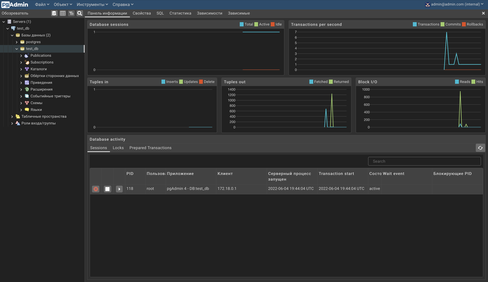
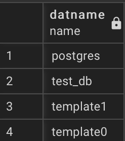
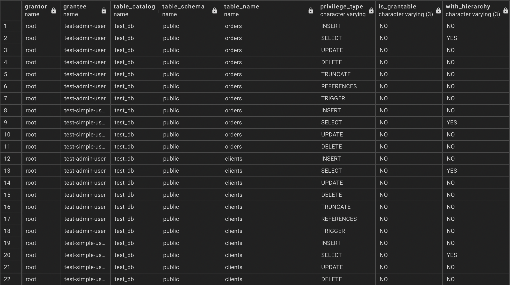
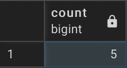
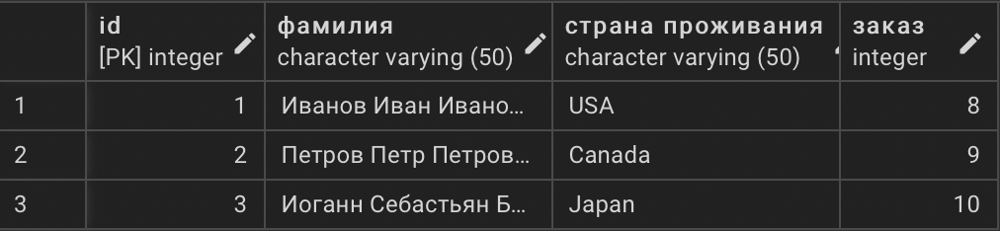
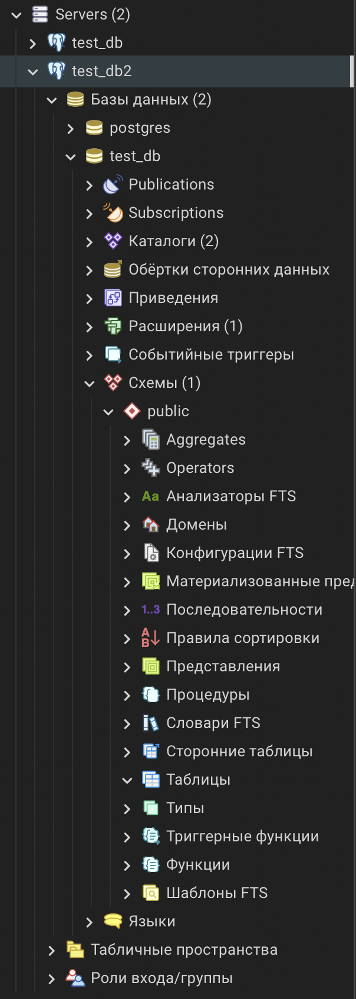
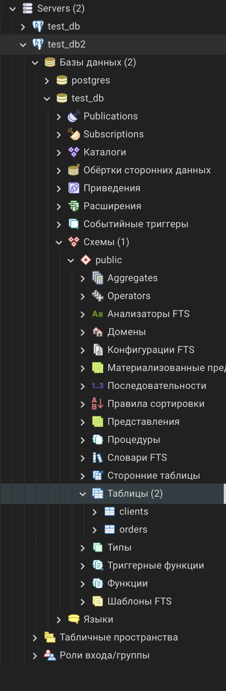

# Домашнее задание к занятию "6.2. SQL"

## Введение

Перед выполнением задания вы можете ознакомиться с 
[дополнительными материалами](https://github.com/netology-code/virt-homeworks/tree/master/additional/README.md).

## Задача 1

Используя docker поднимите инстанс PostgreSQL (версию 12) c 2 volume, 
в который будут складываться данные БД и бэкапы.

Приведите получившуюся команду или docker-compose манифест.

```dockerfile
version: "3.9"
services:
  db:
    container_name: pg_container
    image: postgres
    restart: always
    environment:
      POSTGRES_USER: root
      POSTGRES_PASSWORD: root
      POSTGRES_DB: test_db
    volumes:
    - ./db-data:/var/lib/postgresql/data
    - ./db-backup:/var/lib/postgresql/backup
    ports:
      - "5432:5432"

  pgadmin:
    container_name: pgadmin4_container
    image: dpage/pgadmin4
    restart: always
    environment:
      PGADMIN_DEFAULT_EMAIL: admin@admin.com
      PGADMIN_DEFAULT_PASSWORD: root
    ports:
      - "5050:80"
```



## Задача 2

В БД из задачи 1: 
- создайте пользователя test-admin-user и БД test_db
- в БД test_db создайте таблицу orders и clients (спeцификация таблиц ниже)
- предоставьте привилегии на все операции пользователю test-admin-user на таблицы БД test_db
- создайте пользователя test-simple-user  
- предоставьте пользователю test-simple-user права на SELECT/INSERT/UPDATE/DELETE данных таблиц БД test_db

Таблица orders:
- id (serial primary key)
- наименование (string)
- цена (integer)

Таблица clients:
- id (serial primary key)
- фамилия (string)
- страна проживания (string, index)
- заказ (foreign key orders)

Приведите:
- итоговый список БД после выполнения пунктов выше,
- описание таблиц (describe)
- SQL-запрос для выдачи списка пользователей с правами над таблицами test_db
- список пользователей с правами над таблицами test_db

Создадим пользователя.

```postgresql
CREATE USER "test-admin-user" WITH PASSWORD 'root';
```

Создадим таблицы `orders` и `clients`. 

```postgresql
CREATE TABLE orders (
    id SERIAL PRIMARY KEY,
    наименование VARCHAR(50),
    цена INT
);

CREATE TABLE clients (
    id SERIAL PRIMARY KEY,
    фамилия VARCHAR(50),
    "страна проживания" VARCHAR(50),
    заказ INT,
    FOREIGN KEY (заказ) REFERENCES orders(id)
);

CREATE INDEX index ON clients("страна проживания");
```

Предоставим привилегии на все операции для пользователя `test-admin-user`.

```postgresql
GRANT ALL PRIVILEGES ON ALL TABLES IN SCHEMA public to "test-admin-user"
```

Создадим пользователя `test-simple-user`.

```postgresql
CREATE USER "test-admin-user" WITH PASSWORD 'root';
```

Предоставим пользователю `test-simple-user` права на SELECT/INSERT/UPDATE/DELETE данных таблиц БД. 

```postgresql
GRANT SELECT, INSERT, UPDATE, DELETE ON ALL TABLES IN SCHEMA public to "test-simple-user";
```

- итоговый список БД после выполнения пунктов выше

```postgresql
SELECT datname FROM pg_database;
```



- описание таблиц (describe)

```postgresql
SELECT 
   table_name, 
   column_name, 
   data_type 
FROM 
   information_schema.columns
WHERE 
   (table_name = 'orders' or table_name = 'clients');
```


- SQL-запрос для выдачи списка пользователей с правами над таблицами test_db

```postgresql
SELECT * 
FROM information_schema.table_privileges
WHERE grantee IN ('test-admin-user', 'test-simple-user');
```



- список пользователей с правами над таблицами test_db

```postgresql
SELECT * 
FROM information_schema.table_privileges
WHERE grantee IN ('test-admin-user', 'test-simple-user') AND table_catalog = 'test_db';c4
```

## Задача 3

Используя SQL синтаксис - наполните таблицы следующими тестовыми данными:

Таблица orders

|Наименование|цена|
|------------|----|
|Шоколад| 10 |
|Принтер| 3000 |
|Книга| 500 |
|Монитор| 7000|
|Гитара| 4000|

Таблица clients

|ФИО|Страна проживания|
|------------|----|
|Иванов Иван Иванович| USA |
|Петров Петр Петрович| Canada |
|Иоганн Себастьян Бах| Japan |
|Ронни Джеймс Дио| Russia|
|Ritchie Blackmore| Russia|

Используя SQL синтаксис:
- вычислите количество записей для каждой таблицы 
- приведите в ответе:
    - запросы 
    - результаты их выполнения.

```postgresql
INSERT into orders (наименование, цена) values ('шоколад', 10), ('принтер', 3000), ('книга', 500), ('монитор', 7000), ('гитара', 4000);

INSERT into clients (фамилия, "страна проживания") values ('Иванов Иван Иванович', 'USA'), ('Петров Петр Петрович', 'Canada'), ('Иоганн Себастьян Бах', 'Japan'), ('Ронни Джеймс Дио', 'Russia'), ('Ritchie Blackmore', 'Russia');
```

```postgresql
SELECT COUNT(*) from orders;
SELECT COUNT(*) from clients;
```



## Задача 4

Часть пользователей из таблицы clients решили оформить заказы из таблицы orders.

Используя foreign keys свяжите записи из таблиц, согласно таблице:

|ФИО|Заказ|
|------------|----|
|Иванов Иван Иванович| Книга |
|Петров Петр Петрович| Монитор |
|Иоганн Себастьян Бах| Гитара |

Приведите SQL-запросы для выполнения данных операций.

Приведите SQL-запрос для выдачи всех пользователей, которые совершили заказ, а также вывод данного запроса.
 
Подсказка - используйте директиву `UPDATE`.

```postgresql
UPDATE clients
SET заказ = 8
WHERE фамилия = 'Иванов Иван Иванович';

UPDATE clients
SET заказ = 9
WHERE фамилия = 'Петров Петр Петрович';

UPDATE clients
SET заказ = 10
WHERE фамилия = 'Иоганн Себастьян Бах';
```

```postgresql
SELECT * from clients WHERE заказ is not NULL;
```



## Задача 5

Получите полную информацию по выполнению запроса выдачи всех пользователей из задачи 4 
(используя директиву EXPLAIN).

Приведите получившийся результат и объясните что значат полученные значения.

```postgresql
EXPLAIN SELECT * from clients WHERE заказ is not NULL;
```

```postgresql
"QUERY PLAN"
"Seq Scan on clients  (cost=0.00..13.00 rows=298 width=244)"
"  Filter: (""заказ"" IS NOT NULL)"
```

`Seq Scan` — последовательное, блок за блоком, чтение данных таблицы `clients`.  
`Cost` - оценка затратности операции. Первое значение 0.00 — затраты на получение первой строки. Второе — 13.00 — затраты на получение всех строк.  
`Rows` — приблизительное количество возвращаемых строк при выполнении операции Seq Scan. Это значение возвращает планировщик.  
`Width` — средний размер одной строки в байтах.

## Задача 6

Создайте бэкап БД test_db и поместите его в volume, предназначенный для бэкапов (см. Задачу 1).

Остановите контейнер с PostgreSQL (но не удаляйте volumes).

Поднимите новый пустой контейнер с PostgreSQL.

Восстановите БД test_db в новом контейнере.

Приведите список операций, который вы применяли для бэкапа данных и восстановления. 

```bash
root@3017abd0270d:/# pg_dump -Fc test_db > /var/lib/postgresql/backup/db.dump
```

Добавим еще один сервис в `docker-compose.yml`.

```dockerfile
version: "3.9"
services:
  db:
    container_name: pg_container
    image: postgres
    restart: always
    environment:
      POSTGRES_USER: root
      POSTGRES_PASSWORD: root
      POSTGRES_DB: test_db
    volumes:
    - ./db-data:/var/lib/postgresql/data
    - ./db-backup:/var/lib/postgresql/backup
    ports:
      - "5432:5432"
  db_backup:
    container_name: db_backup
    image: postgres
    restart: always
    environment:
      POSTGRES_USER: root
      POSTGRES_PASSWORD: root
      POSTGRES_DB: test_db
    volumes:
    - ./db-backup:/var/lib/postgresql/backup
    ports:
      - "5442:5432"
  pgadmin:
    container_name: pgadmin4_container
    image: dpage/pgadmin4
    restart: always
    environment:
      PGADMIN_DEFAULT_EMAIL: admin@admin.com
      PGADMIN_DEFAULT_PASSWORD: root
    ports:
      - "5050:80"
```



```bash
pg_restore -C -d test_db /var/lib/postgresql/backup/db.dump
```


