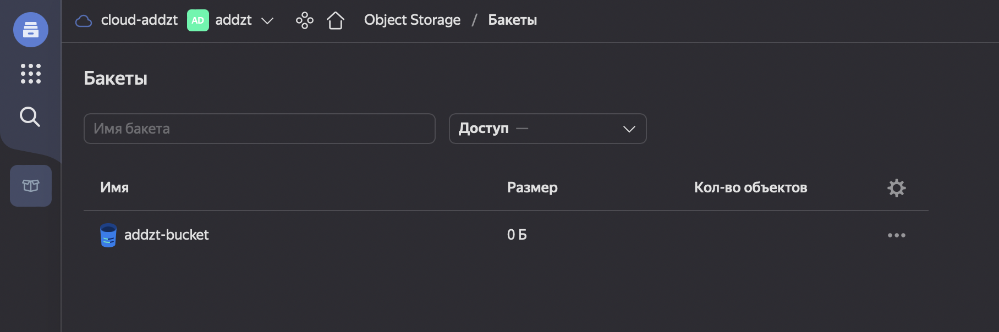
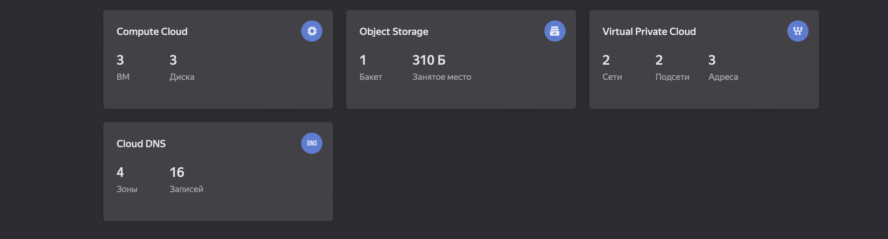
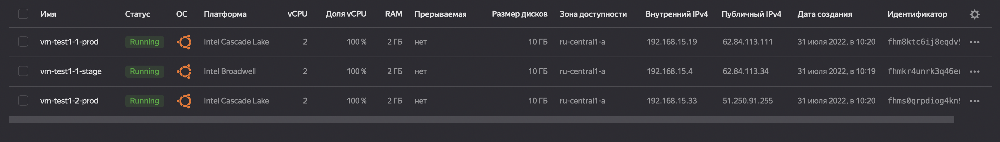
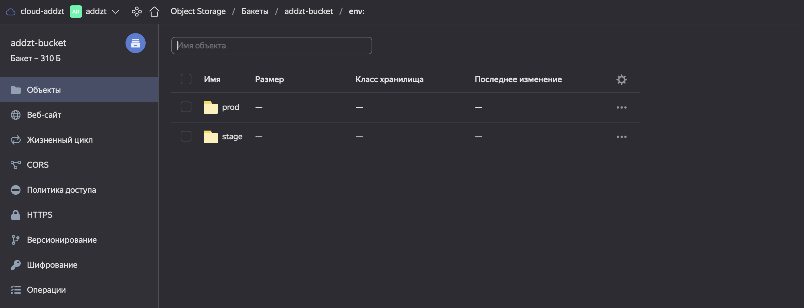
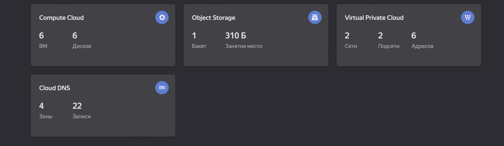
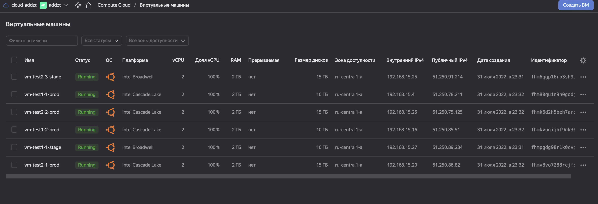
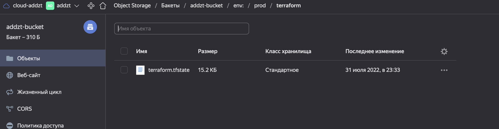
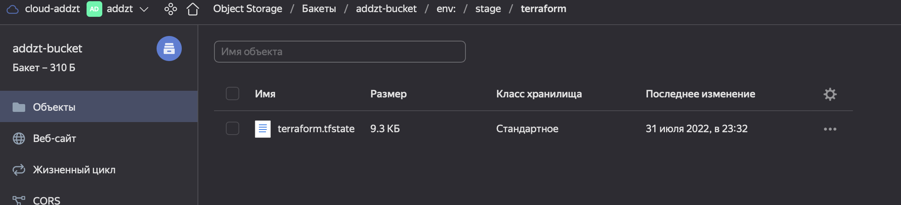

# Домашнее задание к занятию "7.3. Основы и принцип работы Терраформ"

## Задача 1. Создадим бэкэнд в S3 (необязательно, но крайне желательно).

Если в рамках предыдущего задания у вас уже есть аккаунт AWS, то давайте продолжим знакомство со взаимодействием
терраформа и aws. 

1. Создайте s3 бакет, iam роль и пользователя от которого будет работать терраформ. Можно создать отдельного пользователя,
а можно использовать созданного в рамках предыдущего задания, просто добавьте ему необходимы права, как описано 
[здесь](https://www.terraform.io/docs/backends/types/s3.html).
1. Зарегистрируйте бэкэнд в терраформ проекте как описано по ссылке выше. 

Создаем новый сервисный аккаунт, назначаем ему роль `editor` и получаем сервисные ключи.

```bash
 ✘ addzt@MacBook-Pro-Ivan  ~  yc iam service-account create --name bucket 
 ...
  addzt@MacBook-Pro-Ivan  ~  yc resource-manager folder add-access-binding addzt \    
  --role editor \
  --subject serviceAccount:ajeqn*********

done (2s)
 addzt@MacBook-Pro-Ivan  ~  yc iam access-key create --service-account-name bucket
 access_key:
  id: ************
  service_account_id: ************
  created_at: ************
  key_id: ************
secret: ************
```

Создаем бакет в `Yandex Cloud`.



Добавляем конфиг для загрузки состояния `.tfstate` в бакет.

```hcl
terraform {
  backend "s3" {
    endpoint = "storage.yandexcloud.net"
    bucket = "addzt-bucket"
    region = "ru-central1"
    key = "./terraform/terraform.tfstate"
    access_key = "******************"
    secret_key = "***********************"

    skip_region_validation = true
    skip_credentials_validation = true
  }
}
```

## Задача 2. Инициализируем проект и создаем воркспейсы. 

1. Выполните `terraform init`:
    * если был создан бэкэнд в S3, то терраформ создат файл стейтов в S3 и запись в таблице 
dynamodb.
    * иначе будет создан локальный файл со стейтами.  

```bash
 ✘ addzt@MacBook-Pro-Ivan  ~/PycharmProjects/devops_homeworks/homework_7.3/terraform   main ±✚  terraform init             

Initializing the backend...

Initializing provider plugins...
- Reusing previous version of yandex-cloud/yandex from the dependency lock file
- Using previously-installed yandex-cloud/yandex v0.77.0

Terraform has been successfully initialized!

You may now begin working with Terraform. Try running "terraform plan" to see
any changes that are required for your infrastructure. All Terraform commands
should now work.

If you ever set or change modules or backend configuration for Terraform,
rerun this command to reinitialize your working directory. If you forget, other
commands will detect it and remind you to do so if necessary.
```

2. Создайте два воркспейса `stage` и `prod`.

```bash
 addzt@MacBook-Pro-Ivan  ~  terraform workspace new stage
Created and switched to workspace "stage"!

You're now on a new, empty workspace. Workspaces isolate their state,
so if you run "terraform plan" Terraform will not see any existing state
for this configuration.
 addzt@MacBook-Pro-Ivan  ~  terraform workspace new prod 
Created and switched to workspace "prod"!

You're now on a new, empty workspace. Workspaces isolate their state,
so if you run "terraform plan" Terraform will not see any existing state
for this configuration.
 ✘ addzt@MacBook-Pro-Ivan  ~  terraform workspace list     
  default
* prod
  stage
```

3. В уже созданный `aws_instance` добавьте зависимость типа инстанса от вокспейса, что бы в разных воркспейсах 
использовались разные `instance_type`.

```hcl
locals {
  instance_type = {
    stage = "standard-v1"
    prod  = "standard-v2"
  }
}
}
```

4. Добавим `count`. Для `stage` должен создаться один экземпляр `ec2`, а для `prod` два. 

```hcl
locals {
  vm_count = {
    stage  = 1
    prod   = 2
  }
```

Проверим:








5. Создайте рядом еще один `aws_instance`, но теперь определите их количество при помощи `for_each`, а не `count`.

```hcl
for_each              = {for type, vm in local.vm_count2: type => vm
                      if vm.workspace == terraform.workspace}
```

6. Что бы при изменении типа инстанса не возникло ситуации, когда не будет ни одного инстанса добавьте параметр
жизненного цикла `create_before_destroy = true` в один из рессурсов `aws_instance`.

```hcl
`create_before_destroy = true`
```

7. При желании поэкспериментируйте с другими параметрами и ресурсами.

В виде результата работы пришлите:
* Вывод команды `terraform workspace list`.

Вывод выше.

* Вывод команды `terraform plan` для воркспейса `prod`.  

<details>
<summary>Вывод</summary>

```hcl
 addzt@MacBook-Pro-Ivan  ~/PycharmProjects/devops_homeworks/homework_7.3/terraform   main ±✚  terraform plan              
data.yandex_compute_image.ubuntu_image: Reading...
data.yandex_compute_image.ubuntu_image: Read complete after 2s [id=fd8ofg98ci78v262j491]

Terraform used the selected providers to generate the following execution plan. Resource actions are indicated with the following symbols:
  + create

Terraform will perform the following actions:

  # yandex_compute_instance.vm-test1[0] will be created
  + resource "yandex_compute_instance" "vm-test1" {
      + created_at                = (known after apply)
      + folder_id                 = (known after apply)
      + fqdn                      = (known after apply)
      + hostname                  = (known after apply)
      + id                        = (known after apply)
      + name                      = "vm-test1-1-prod"
      + network_acceleration_type = "standard"
      + platform_id               = "standard-v2"
      + service_account_id        = (known after apply)
      + status                    = (known after apply)
      + zone                      = "ru-central1-a"

      + boot_disk {
          + auto_delete = true
          + device_name = (known after apply)
          + disk_id     = (known after apply)
          + mode        = (known after apply)

          + initialize_params {
              + block_size  = (known after apply)
              + description = (known after apply)
              + image_id    = "fd8ofg98ci78v262j491"
              + name        = (known after apply)
              + size        = 10
              + snapshot_id = (known after apply)
              + type        = "network-nvme"
            }
        }

      + network_interface {
          + index              = (known after apply)
          + ip_address         = (known after apply)
          + ipv4               = true
          + ipv6               = (known after apply)
          + ipv6_address       = (known after apply)
          + mac_address        = (known after apply)
          + nat                = true
          + nat_ip_address     = (known after apply)
          + nat_ip_version     = (known after apply)
          + security_group_ids = (known after apply)
          + subnet_id          = (known after apply)
        }

      + placement_policy {
          + host_affinity_rules = (known after apply)
          + placement_group_id  = (known after apply)
        }

      + resources {
          + core_fraction = 100
          + cores         = 2
          + memory        = 2
        }

      + scheduling_policy {
          + preemptible = (known after apply)
        }
    }

  # yandex_compute_instance.vm-test1[1] will be created
  + resource "yandex_compute_instance" "vm-test1" {
      + created_at                = (known after apply)
      + folder_id                 = (known after apply)
      + fqdn                      = (known after apply)
      + hostname                  = (known after apply)
      + id                        = (known after apply)
      + name                      = "vm-test1-2-prod"
      + network_acceleration_type = "standard"
      + platform_id               = "standard-v2"
      + service_account_id        = (known after apply)
      + status                    = (known after apply)
      + zone                      = "ru-central1-a"

      + boot_disk {
          + auto_delete = true
          + device_name = (known after apply)
          + disk_id     = (known after apply)
          + mode        = (known after apply)

          + initialize_params {
              + block_size  = (known after apply)
              + description = (known after apply)
              + image_id    = "fd8ofg98ci78v262j491"
              + name        = (known after apply)
              + size        = 10
              + snapshot_id = (known after apply)
              + type        = "network-nvme"
            }
        }

      + network_interface {
          + index              = (known after apply)
          + ip_address         = (known after apply)
          + ipv4               = true
          + ipv6               = (known after apply)
          + ipv6_address       = (known after apply)
          + mac_address        = (known after apply)
          + nat                = true
          + nat_ip_address     = (known after apply)
          + nat_ip_version     = (known after apply)
          + security_group_ids = (known after apply)
          + subnet_id          = (known after apply)
        }

      + placement_policy {
          + host_affinity_rules = (known after apply)
          + placement_group_id  = (known after apply)
        }

      + resources {
          + core_fraction = 100
          + cores         = 2
          + memory        = 2
        }

      + scheduling_policy {
          + preemptible = (known after apply)
        }
    }

  # yandex_compute_instance.vm-test2["0"] will be created
  + resource "yandex_compute_instance" "vm-test2" {
      + created_at                = (known after apply)
      + folder_id                 = (known after apply)
      + fqdn                      = (known after apply)
      + hostname                  = (known after apply)
      + id                        = (known after apply)
      + name                      = "vm-test2-1-prod"
      + network_acceleration_type = "standard"
      + platform_id               = "standard-v2"
      + service_account_id        = (known after apply)
      + status                    = (known after apply)
      + zone                      = "ru-central1-a"

      + boot_disk {
          + auto_delete = true
          + device_name = (known after apply)
          + disk_id     = (known after apply)
          + mode        = (known after apply)

          + initialize_params {
              + block_size  = (known after apply)
              + description = (known after apply)
              + image_id    = "fd8ofg98ci78v262j491"
              + name        = (known after apply)
              + size        = 15
              + snapshot_id = (known after apply)
              + type        = "network-nvme"
            }
        }

      + network_interface {
          + index              = (known after apply)
          + ip_address         = (known after apply)
          + ipv4               = true
          + ipv6               = (known after apply)
          + ipv6_address       = (known after apply)
          + mac_address        = (known after apply)
          + nat                = true
          + nat_ip_address     = (known after apply)
          + nat_ip_version     = (known after apply)
          + security_group_ids = (known after apply)
          + subnet_id          = (known after apply)
        }

      + placement_policy {
          + host_affinity_rules = (known after apply)
          + placement_group_id  = (known after apply)
        }

      + resources {
          + core_fraction = 100
          + cores         = 2
          + memory        = 2
        }

      + scheduling_policy {
          + preemptible = (known after apply)
        }
    }

  # yandex_compute_instance.vm-test2["1"] will be created
  + resource "yandex_compute_instance" "vm-test2" {
      + created_at                = (known after apply)
      + folder_id                 = (known after apply)
      + fqdn                      = (known after apply)
      + hostname                  = (known after apply)
      + id                        = (known after apply)
      + name                      = "vm-test2-2-prod"
      + network_acceleration_type = "standard"
      + platform_id               = "standard-v2"
      + service_account_id        = (known after apply)
      + status                    = (known after apply)
      + zone                      = "ru-central1-a"

      + boot_disk {
          + auto_delete = true
          + device_name = (known after apply)
          + disk_id     = (known after apply)
          + mode        = (known after apply)

          + initialize_params {
              + block_size  = (known after apply)
              + description = (known after apply)
              + image_id    = "fd8ofg98ci78v262j491"
              + name        = (known after apply)
              + size        = 15
              + snapshot_id = (known after apply)
              + type        = "network-nvme"
            }
        }

      + network_interface {
          + index              = (known after apply)
          + ip_address         = (known after apply)
          + ipv4               = true
          + ipv6               = (known after apply)
          + ipv6_address       = (known after apply)
          + mac_address        = (known after apply)
          + nat                = true
          + nat_ip_address     = (known after apply)
          + nat_ip_version     = (known after apply)
          + security_group_ids = (known after apply)
          + subnet_id          = (known after apply)
        }

      + placement_policy {
          + host_affinity_rules = (known after apply)
          + placement_group_id  = (known after apply)
        }

      + resources {
          + core_fraction = 100
          + cores         = 2
          + memory        = 2
        }

      + scheduling_policy {
          + preemptible = (known after apply)
        }
    }

  # yandex_vpc_network.network_terraform will be created
  + resource "yandex_vpc_network" "network_terraform" {
      + created_at                = (known after apply)
      + default_security_group_id = (known after apply)
      + folder_id                 = (known after apply)
      + id                        = (known after apply)
      + labels                    = (known after apply)
      + name                      = "network-prod"
      + subnet_ids                = (known after apply)
    }

  # yandex_vpc_subnet.subnet_terraform will be created
  + resource "yandex_vpc_subnet" "subnet_terraform" {
      + created_at     = (known after apply)
      + folder_id      = (known after apply)
      + id             = (known after apply)
      + labels         = (known after apply)
      + name           = "subnetwork-prod"
      + network_id     = (known after apply)
      + v4_cidr_blocks = [
          + "192.168.15.0/24",
        ]
      + v6_cidr_blocks = (known after apply)
      + zone           = "ru-central1-a"
    }

Plan: 6 to add, 0 to change, 0 to destroy.

───────────────────────────────────────────────────────────────────────────────────────────────────────────────────────────────────────────────
```
</details>

Результат:










---