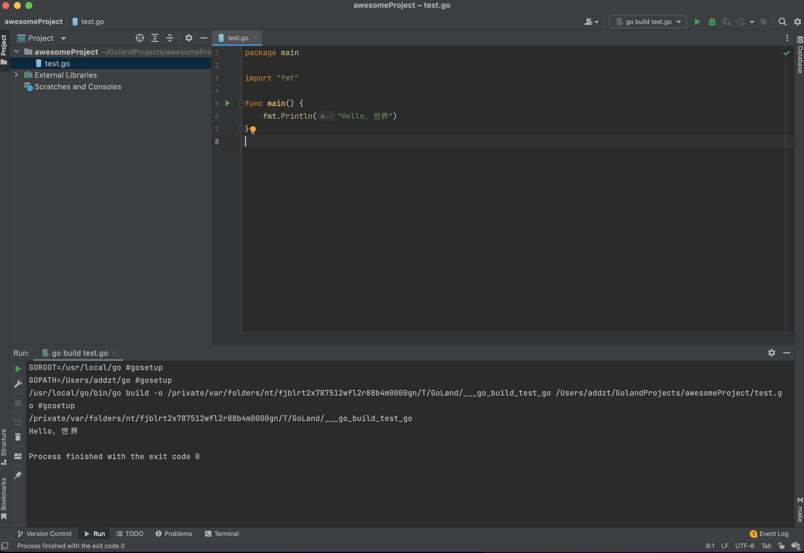
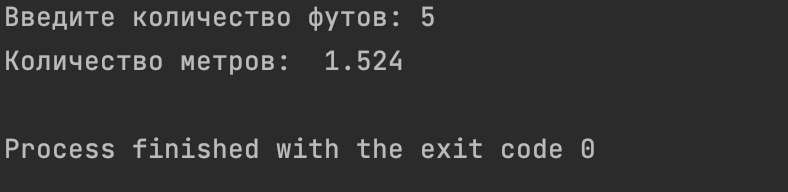
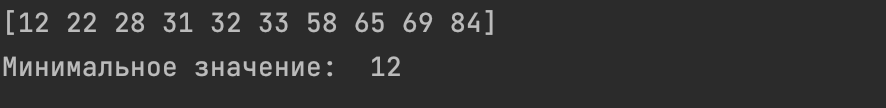
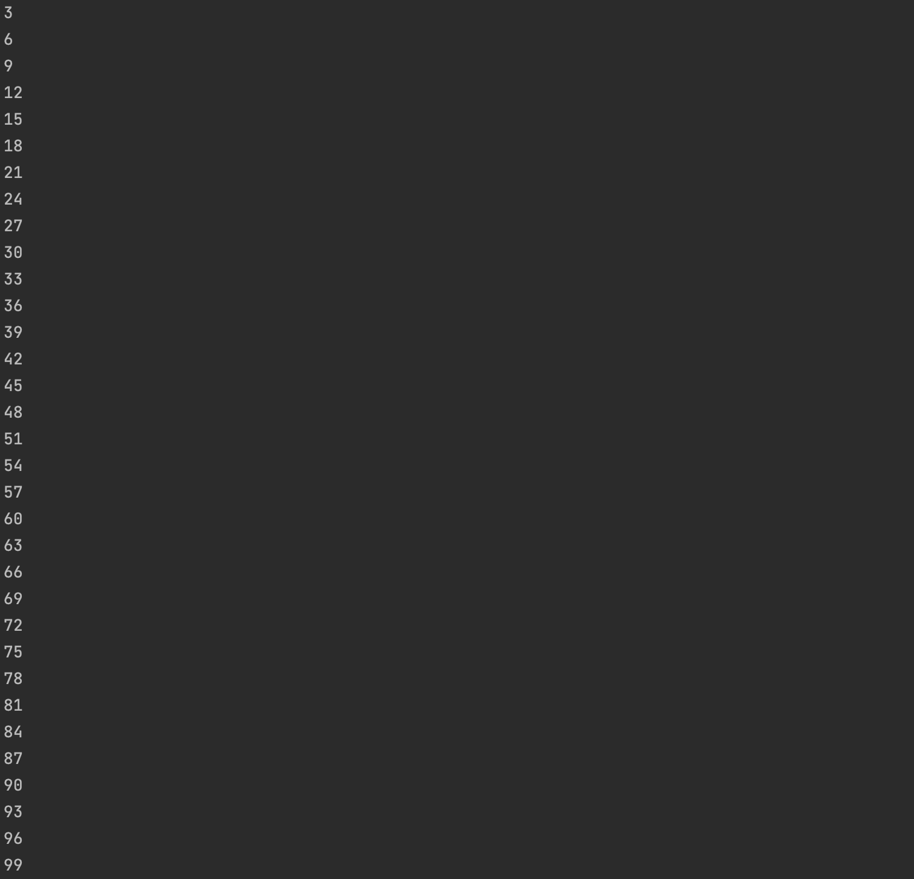

# Домашнее задание к занятию "7.5. Основы golang"

С `golang` в рамках курса, мы будем работать не много, поэтому можно использовать любой IDE. 
Но рекомендуем ознакомиться с [GoLand](https://www.jetbrains.com/ru-ru/go/).  

## Задача 1. Установите golang.
1. Воспользуйтесь инструкций с официального сайта: [https://golang.org/](https://golang.org/).
2. Так же для тестирования кода можно использовать песочницу: [https://play.golang.org/](https://play.golang.org/).

---



## Задача 2. Знакомство с gotour.
У Golang есть обучающая интерактивная консоль [https://tour.golang.org/](https://tour.golang.org/). 
Рекомендуется изучить максимальное количество примеров. В консоли уже написан необходимый код, 
осталось только с ним ознакомиться и поэкспериментировать как написано в инструкции в левой части экрана.  

---

Познакомился

## Задача 3. Написание кода. 
Цель этого задания закрепить знания о базовом синтаксисе языка. Можно использовать редактор кода 
на своем компьютере, либо использовать песочницу: [https://play.golang.org/](https://play.golang.org/).

1. Напишите программу для перевода метров в футы (1 фут = 0.3048 метр). Можно запросить исходные данные 
у пользователя, а можно статически задать в коде.
    Для взаимодействия с пользователем можно использовать функцию `Scanf`:
    ```
    package main
    
    import "fmt"
    
    func main() {
        fmt.Print("Enter a number: ")
        var input float64
        fmt.Scanf("%f", &input)
    
        output := input * 2
    
        fmt.Println(output)    
    }
    ```
 
---

```golang
package main

import "fmt"

func main() {
	fmt.Print("Введите количество футов: ")
	var input float64
	fmt.Scanf("%f", &input)

	output := input * 0.3048

	fmt.Println("Количество метров: ", output)
}
```



1. Напишите программу, которая найдет наименьший элемент в любом заданном списке, например:
    ```
    x := []int{48,96,86,68,57,82,63,70,37,34,83,27,19,97,9,17,}
    ```


---

На вход подавал рандомный массив.

```golang
import (
	"fmt"
	"math/rand"
	"sort"
	"time"
)

func main() {
	rand.Seed(time.Now().UnixNano())
	fmt.Println("Минимальное значение: ", MinValue(randomArray(10)))
}

func randomArray(len int) (a []int) {
	a = make([]int, len)
	for i := 0; i <= len-1; i++ {
		a[i] = rand.Intn(100)
	}
	return a
}

func MinValue(a []int) (min int) {
	sort.Ints(a)
	min = a[0]
	fmt.Println(a)
	return min
}
```



1. Напишите программу, которая выводит числа от 1 до 100, которые делятся на 3. То есть `(3, 6, 9, …)`.

В виде решения ссылку на код или сам код. 

---

```golang
package main

import "fmt"

func main() {
	i := 1
	for i <= 100 {
		if i%3 == 0 {
			fmt.Println(i)
		}
		i += 1
	}
}
```



## Задача 4. Протестировать код (не обязательно).

Создайте тесты для функций из предыдущего задания. 

---