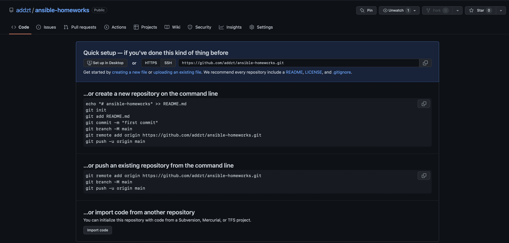

# Домашнее задание к занятию "08.01 Введение в Ansible"

## Подготовка к выполнению
1. Установите ansible версии 2.10 или выше.

```bash
 addzt@MacBook-Pro-Ivan  ~/PycharmProjects/devops_homeworks/homework_9.2/mvn   main ±✚  ansible --version             
/opt/homebrew/Cellar/ansible/5.7.1/libexec/lib/python3.10/site-packages/paramiko/transport.py:236: CryptographyDeprecationWarning: Blowfish has been deprecated
  "class": algorithms.Blowfish,
ansible [core 2.12.5]
  config file = None
  configured module search path = ['/Users/addzt/.ansible/plugins/modules', '/usr/share/ansible/plugins/modules']
  ansible python module location = /opt/homebrew/Cellar/ansible/5.7.1/libexec/lib/python3.10/site-packages/ansible
  ansible collection location = /Users/addzt/.ansible/collections:/usr/share/ansible/collections
  executable location = /opt/homebrew/bin/ansible
  python version = 3.10.4 (main, Apr 26 2022, 19:36:29) [Clang 13.1.6 (clang-1316.0.21.2)]
  jinja version = 3.1.2
  libyaml = True
```

2. Создайте свой собственный публичный репозиторий на github с произвольным именем.



3. Скачайте [playbook](./playbook/) из репозитория с домашним заданием и перенесите его в свой репозиторий.

## Основная часть
1. Попробуйте запустить playbook на окружении из `test.yml`, зафиксируйте какое значение имеет факт `some_fact` для указанного хоста при выполнении playbook'a.

```bash
 addzt@MacBook-Pro-Ivan  ~/PycharmProjects/ansible-homeworks/homework_8.1/playbook   master ✚  ansible-playbook -i inventory/test.yml site.yml
/opt/homebrew/Cellar/ansible/5.7.1/libexec/lib/python3.10/site-packages/paramiko/transport.py:236: CryptographyDeprecationWarning: Blowfish has been deprecated
  "class": algorithms.Blowfish,

PLAY [Print os facts] *******************************************************************************************************************************************************************************************************************************

TASK [Gathering Facts] ******************************************************************************************************************************************************************************************************************************
[WARNING]: Platform darwin on host localhost is using the discovered Python interpreter at /Library/Frameworks/Python.framework/Versions/3.10/bin/python3.10, but future installation of another Python interpreter could change the meaning of that
path. See https://docs.ansible.com/ansible-core/2.12/reference_appendices/interpreter_discovery.html for more information.
ok: [localhost]

TASK [Print OS] *************************************************************************************************************************************************************************************************************************************
ok: [localhost] => {
    "msg": "MacOSX"
}

TASK [Print fact] ***********************************************************************************************************************************************************************************************************************************
ok: [localhost] => {
    "msg": 12
}

PLAY RECAP ******************************************************************************************************************************************************************************************************************************************
localhost                  : ok=3    changed=0    unreachable=0    failed=0    skipped=0    rescued=0    ignored=0  
```

Значение `some_fact`: `"msg": 12`.

2. Найдите файл с переменными (group_vars) в котором задаётся найденное в первом пункте значение и поменяйте его на 'all default fact'.

Заменил в файле `./homework_8.1/playbook/group_vars/all/examp.yml`.

```bash
some_fact: all default fact
```

3. Воспользуйтесь подготовленным (используется `docker`) или создайте собственное окружение для проведения дальнейших испытаний.

```bash
 addzt@MacBook-Pro-Ivan  ~/PycharmProjects/ansible-homeworks/homework_8.1/playbook   master ✚  docker run -d -it --platform=linux/amd64 --name ubuntu ubuntu && docker run -d -it --platform=linux/amd64 --name centos centos                                                          
Unable to find image 'ubuntu:latest' locally
latest: Pulling from library/ubuntu
4a3049d340b7: Pull complete 
Digest: sha256:34fea4f31bf187bc915536831fd0afc9d214755bf700b5cdb1336c82516d154e
Status: Downloaded newer image for ubuntu:latest
851951f2264f3c54b89a1395db963c0a0f25d3cef93f449512071a5efacd5bb7
Unable to find image 'centos:latest' locally
latest: Pulling from library/centos
52f9ef134af7: Pull complete 
Digest: sha256:a27fd8080b517143cbbbab9dfb7c8571c40d67d534bbdee55bd6c473f432b177
Status: Downloaded newer image for centos:latest
08fb055fa60b1aba80e4cae35245a6bdcd23f69c60ccfb7fcb682f8fda72bf6b
```

4. Проведите запуск playbook на окружении из `prod.yml`. Зафиксируйте полученные значения `some_fact` для каждого из `managed host`.

Внутри  `ubuntu` контейнера необходимо было установить `python`.

```bash
 addzt@MacBook-Pro-Ivan  ~/PycharmProjects/ansible-homeworks/homework_8.1/playbook   master ±✚  ansible-playbook -i inventory/prod.yml site.yml -vvv
````
<details>
<summary>Вывод</summary>

```bash
/opt/homebrew/Cellar/ansible/5.7.1/libexec/lib/python3.10/site-packages/paramiko/transport.py:236: CryptographyDeprecationWarning: Blowfish has been deprecated
  "class": algorithms.Blowfish,
ansible-playbook [core 2.12.5]
  config file = None
  configured module search path = ['/Users/addzt/.ansible/plugins/modules', '/usr/share/ansible/plugins/modules']
  ansible python module location = /opt/homebrew/Cellar/ansible/5.7.1/libexec/lib/python3.10/site-packages/ansible
  ansible collection location = /Users/addzt/.ansible/collections:/usr/share/ansible/collections
  executable location = /opt/homebrew/bin/ansible-playbook
  python version = 3.10.4 (main, Apr 26 2022, 19:36:29) [Clang 13.1.6 (clang-1316.0.21.2)]
  jinja version = 3.1.2
  libyaml = True
No config file found; using defaults
host_list declined parsing /Users/addzt/PycharmProjects/ansible-homeworks/homework_8.1/playbook/inventory/prod.yml as it did not pass its verify_file() method
script declined parsing /Users/addzt/PycharmProjects/ansible-homeworks/homework_8.1/playbook/inventory/prod.yml as it did not pass its verify_file() method
Parsed /Users/addzt/PycharmProjects/ansible-homeworks/homework_8.1/playbook/inventory/prod.yml inventory source with yaml plugin
Skipping callback 'default', as we already have a stdout callback.
Skipping callback 'minimal', as we already have a stdout callback.
Skipping callback 'oneline', as we already have a stdout callback.

PLAYBOOK: site.yml **********************************************************************************************************************************************************************************************************************************
1 plays in site.yml

PLAY [Print os facts] *******************************************************************************************************************************************************************************************************************************

TASK [Gathering Facts] ******************************************************************************************************************************************************************************************************************************
task path: /Users/addzt/PycharmProjects/ansible-homeworks/homework_8.1/playbook/site.yml:2
redirecting (type: connection) ansible.builtin.docker to community.docker.docker
redirecting (type: connection) ansible.builtin.docker to community.docker.docker
<ubuntu> ESTABLISH DOCKER CONNECTION FOR USER: root
<ubuntu> EXEC ['/usr/local/bin/docker', b'exec', b'-i', 'ubuntu', '/bin/sh', '-c', "/bin/sh -c 'echo ~ && sleep 0'"]
<centos7> ESTABLISH DOCKER CONNECTION FOR USER: root
<centos7> EXEC ['/usr/local/bin/docker', b'exec', b'-i', 'centos7', '/bin/sh', '-c', "/bin/sh -c 'echo ~ && sleep 0'"]
<ubuntu> EXEC ['/usr/local/bin/docker', b'exec', b'-i', 'ubuntu', '/bin/sh', '-c', '/bin/sh -c \'( umask 77 && mkdir -p "` echo /root/.ansible/tmp `"&& mkdir "` echo /root/.ansible/tmp/ansible-tmp-1659979441.570526-24609-100012038760073 `" && echo ansible-tmp-1659979441.570526-24609-100012038760073="` echo /root/.ansible/tmp/ansible-tmp-1659979441.570526-24609-100012038760073 `" ) && sleep 0\'']
<centos7> EXEC ['/usr/local/bin/docker', b'exec', b'-i', 'centos7', '/bin/sh', '-c', '/bin/sh -c \'( umask 77 && mkdir -p "` echo /root/.ansible/tmp `"&& mkdir "` echo /root/.ansible/tmp/ansible-tmp-1659979441.600783-24608-45616307626549 `" && echo ansible-tmp-1659979441.600783-24608-45616307626549="` echo /root/.ansible/tmp/ansible-tmp-1659979441.600783-24608-45616307626549 `" ) && sleep 0\'']
<ubuntu> Attempting python interpreter discovery
<ubuntu> EXEC ['/usr/local/bin/docker', b'exec', b'-i', 'ubuntu', '/bin/sh', '-c', '/bin/sh -c \'echo PLATFORM; uname; echo FOUND; command -v \'"\'"\'python3.10\'"\'"\'; command -v \'"\'"\'python3.9\'"\'"\'; command -v \'"\'"\'python3.8\'"\'"\'; command -v \'"\'"\'python3.7\'"\'"\'; command -v \'"\'"\'python3.6\'"\'"\'; command -v \'"\'"\'python3.5\'"\'"\'; command -v \'"\'"\'/usr/bin/python3\'"\'"\'; command -v \'"\'"\'/usr/libexec/platform-python\'"\'"\'; command -v \'"\'"\'python2.7\'"\'"\'; command -v \'"\'"\'python2.6\'"\'"\'; command -v \'"\'"\'/usr/bin/python\'"\'"\'; command -v \'"\'"\'python\'"\'"\'; echo ENDFOUND && sleep 0\'']
<centos7> Attempting python interpreter discovery
<centos7> EXEC ['/usr/local/bin/docker', b'exec', b'-i', 'centos7', '/bin/sh', '-c', '/bin/sh -c \'echo PLATFORM; uname; echo FOUND; command -v \'"\'"\'python3.10\'"\'"\'; command -v \'"\'"\'python3.9\'"\'"\'; command -v \'"\'"\'python3.8\'"\'"\'; command -v \'"\'"\'python3.7\'"\'"\'; command -v \'"\'"\'python3.6\'"\'"\'; command -v \'"\'"\'python3.5\'"\'"\'; command -v \'"\'"\'/usr/bin/python3\'"\'"\'; command -v \'"\'"\'/usr/libexec/platform-python\'"\'"\'; command -v \'"\'"\'python2.7\'"\'"\'; command -v \'"\'"\'python2.6\'"\'"\'; command -v \'"\'"\'/usr/bin/python\'"\'"\'; command -v \'"\'"\'python\'"\'"\'; echo ENDFOUND && sleep 0\'']
<ubuntu> EXEC ['/usr/local/bin/docker', b'exec', b'-i', 'ubuntu', '/bin/sh', '-c', "/bin/sh -c '/usr/bin/python3.8 && sleep 0'"]
<centos7> EXEC ['/usr/local/bin/docker', b'exec', b'-i', 'centos7', '/bin/sh', '-c', "/bin/sh -c '/usr/libexec/platform-python && sleep 0'"]
Using module file /opt/homebrew/Cellar/ansible/5.7.1/libexec/lib/python3.10/site-packages/ansible/modules/setup.py
<ubuntu> PUT /Users/addzt/.ansible/tmp/ansible-local-246031bambhhp/tmpv5_d7k7z TO /root/.ansible/tmp/ansible-tmp-1659979441.570526-24609-100012038760073/AnsiballZ_setup.py
Using module file /opt/homebrew/Cellar/ansible/5.7.1/libexec/lib/python3.10/site-packages/ansible/modules/setup.py
<centos7> PUT /Users/addzt/.ansible/tmp/ansible-local-246031bambhhp/tmpgdlp4eh7 TO /root/.ansible/tmp/ansible-tmp-1659979441.600783-24608-45616307626549/AnsiballZ_setup.py
<ubuntu> EXEC ['/usr/local/bin/docker', b'exec', b'-i', 'ubuntu', '/bin/sh', '-c', "/bin/sh -c 'chmod u+x /root/.ansible/tmp/ansible-tmp-1659979441.570526-24609-100012038760073/ /root/.ansible/tmp/ansible-tmp-1659979441.570526-24609-100012038760073/AnsiballZ_setup.py && sleep 0'"]
<centos7> EXEC ['/usr/local/bin/docker', b'exec', b'-i', 'centos7', '/bin/sh', '-c', "/bin/sh -c 'chmod u+x /root/.ansible/tmp/ansible-tmp-1659979441.600783-24608-45616307626549/ /root/.ansible/tmp/ansible-tmp-1659979441.600783-24608-45616307626549/AnsiballZ_setup.py && sleep 0'"]
<ubuntu> EXEC ['/usr/local/bin/docker', b'exec', b'-i', 'ubuntu', '/bin/sh', '-c', "/bin/sh -c '/usr/bin/python3 /root/.ansible/tmp/ansible-tmp-1659979441.570526-24609-100012038760073/AnsiballZ_setup.py && sleep 0'"]
<centos7> EXEC ['/usr/local/bin/docker', b'exec', b'-i', 'centos7', '/bin/sh', '-c', "/bin/sh -c '/usr/libexec/platform-python /root/.ansible/tmp/ansible-tmp-1659979441.600783-24608-45616307626549/AnsiballZ_setup.py && sleep 0'"]
<ubuntu> EXEC ['/usr/local/bin/docker', b'exec', b'-i', 'ubuntu', '/bin/sh', '-c', "/bin/sh -c 'rm -f -r /root/.ansible/tmp/ansible-tmp-1659979441.570526-24609-100012038760073/ > /dev/null 2>&1 && sleep 0'"]
ok: [ubuntu]
<centos7> EXEC ['/usr/local/bin/docker', b'exec', b'-i', 'centos7', '/bin/sh', '-c', "/bin/sh -c 'rm -f -r /root/.ansible/tmp/ansible-tmp-1659979441.600783-24608-45616307626549/ > /dev/null 2>&1 && sleep 0'"]
ok: [centos7]
META: ran handlers

TASK [Print OS] *************************************************************************************************************************************************************************************************************************************
task path: /Users/addzt/PycharmProjects/ansible-homeworks/homework_8.1/playbook/site.yml:5
redirecting (type: connection) ansible.builtin.docker to community.docker.docker
ok: [centos7] => {
    "msg": "CentOS"
}
redirecting (type: connection) ansible.builtin.docker to community.docker.docker
ok: [ubuntu] => {
    "msg": "Ubuntu"
}

TASK [Print fact] ***********************************************************************************************************************************************************************************************************************************
task path: /Users/addzt/PycharmProjects/ansible-homeworks/homework_8.1/playbook/site.yml:8
redirecting (type: connection) ansible.builtin.docker to community.docker.docker
ok: [centos7] => {
    "msg": "el"
}
redirecting (type: connection) ansible.builtin.docker to community.docker.docker
ok: [ubuntu] => {
    "msg": "deb"
}
META: ran handlers
META: ran handlers

PLAY RECAP ******************************************************************************************************************************************************************************************************************************************
centos7                    : ok=3    changed=0    unreachable=0    failed=0    skipped=0    rescued=0    ignored=0   
ubuntu                     : ok=3    changed=0    unreachable=0    failed=0    skipped=0    rescued=0    ignored=0   
```
</details>

5. Добавьте факты в `group_vars` каждой из групп хостов так, чтобы для `some_fact` получились следующие значения: для `deb` - 'deb default fact', для `el` - 'el default fact'.
6. Повторите запуск playbook на окружении `prod.yml`. Убедитесь, что выдаются корректные значения для всех хостов.

```bash
 addzt@MacBook-Pro-Ivan  ~/PycharmProjects/ansible-homeworks/homework_8.1/playbook   master ±✚  ansible-playbook -i inventory/prod.yml site.yml -vvv
```

<details>
<summary>Вывод</summary>

```bash
/opt/homebrew/Cellar/ansible/5.7.1/libexec/lib/python3.10/site-packages/paramiko/transport.py:236: CryptographyDeprecationWarning: Blowfish has been deprecated
  "class": algorithms.Blowfish,
ansible-playbook [core 2.12.5]
  config file = None
  configured module search path = ['/Users/addzt/.ansible/plugins/modules', '/usr/share/ansible/plugins/modules']
  ansible python module location = /opt/homebrew/Cellar/ansible/5.7.1/libexec/lib/python3.10/site-packages/ansible
  ansible collection location = /Users/addzt/.ansible/collections:/usr/share/ansible/collections
  executable location = /opt/homebrew/bin/ansible-playbook
  python version = 3.10.4 (main, Apr 26 2022, 19:36:29) [Clang 13.1.6 (clang-1316.0.21.2)]
  jinja version = 3.1.2
  libyaml = True
No config file found; using defaults
host_list declined parsing /Users/addzt/PycharmProjects/ansible-homeworks/homework_8.1/playbook/inventory/prod.yml as it did not pass its verify_file() method
script declined parsing /Users/addzt/PycharmProjects/ansible-homeworks/homework_8.1/playbook/inventory/prod.yml as it did not pass its verify_file() method
Parsed /Users/addzt/PycharmProjects/ansible-homeworks/homework_8.1/playbook/inventory/prod.yml inventory source with yaml plugin
Skipping callback 'default', as we already have a stdout callback.
Skipping callback 'minimal', as we already have a stdout callback.
Skipping callback 'oneline', as we already have a stdout callback.

PLAYBOOK: site.yml **********************************************************************************************************************************************************************************************************************************
1 plays in site.yml

PLAY [Print os facts] *******************************************************************************************************************************************************************************************************************************

TASK [Gathering Facts] ******************************************************************************************************************************************************************************************************************************
task path: /Users/addzt/PycharmProjects/ansible-homeworks/homework_8.1/playbook/site.yml:2
redirecting (type: connection) ansible.builtin.docker to community.docker.docker
redirecting (type: connection) ansible.builtin.docker to community.docker.docker
<ubuntu> ESTABLISH DOCKER CONNECTION FOR USER: root
<ubuntu> EXEC ['/usr/local/bin/docker', b'exec', b'-i', 'ubuntu', '/bin/sh', '-c', "/bin/sh -c 'echo ~ && sleep 0'"]
<centos7> ESTABLISH DOCKER CONNECTION FOR USER: root
<centos7> EXEC ['/usr/local/bin/docker', b'exec', b'-i', 'centos7', '/bin/sh', '-c', "/bin/sh -c 'echo ~ && sleep 0'"]
<ubuntu> EXEC ['/usr/local/bin/docker', b'exec', b'-i', 'ubuntu', '/bin/sh', '-c', '/bin/sh -c \'( umask 77 && mkdir -p "` echo /root/.ansible/tmp `"&& mkdir "` echo /root/.ansible/tmp/ansible-tmp-1659980715.871443-26105-224706428330119 `" && echo ansible-tmp-1659980715.871443-26105-224706428330119="` echo /root/.ansible/tmp/ansible-tmp-1659980715.871443-26105-224706428330119 `" ) && sleep 0\'']
<centos7> EXEC ['/usr/local/bin/docker', b'exec', b'-i', 'centos7', '/bin/sh', '-c', '/bin/sh -c \'( umask 77 && mkdir -p "` echo /root/.ansible/tmp `"&& mkdir "` echo /root/.ansible/tmp/ansible-tmp-1659980715.898863-26104-244271219179949 `" && echo ansible-tmp-1659980715.898863-26104-244271219179949="` echo /root/.ansible/tmp/ansible-tmp-1659980715.898863-26104-244271219179949 `" ) && sleep 0\'']
<ubuntu> Attempting python interpreter discovery
<ubuntu> EXEC ['/usr/local/bin/docker', b'exec', b'-i', 'ubuntu', '/bin/sh', '-c', '/bin/sh -c \'echo PLATFORM; uname; echo FOUND; command -v \'"\'"\'python3.10\'"\'"\'; command -v \'"\'"\'python3.9\'"\'"\'; command -v \'"\'"\'python3.8\'"\'"\'; command -v \'"\'"\'python3.7\'"\'"\'; command -v \'"\'"\'python3.6\'"\'"\'; command -v \'"\'"\'python3.5\'"\'"\'; command -v \'"\'"\'/usr/bin/python3\'"\'"\'; command -v \'"\'"\'/usr/libexec/platform-python\'"\'"\'; command -v \'"\'"\'python2.7\'"\'"\'; command -v \'"\'"\'python2.6\'"\'"\'; command -v \'"\'"\'/usr/bin/python\'"\'"\'; command -v \'"\'"\'python\'"\'"\'; echo ENDFOUND && sleep 0\'']
<centos7> Attempting python interpreter discovery
<centos7> EXEC ['/usr/local/bin/docker', b'exec', b'-i', 'centos7', '/bin/sh', '-c', '/bin/sh -c \'echo PLATFORM; uname; echo FOUND; command -v \'"\'"\'python3.10\'"\'"\'; command -v \'"\'"\'python3.9\'"\'"\'; command -v \'"\'"\'python3.8\'"\'"\'; command -v \'"\'"\'python3.7\'"\'"\'; command -v \'"\'"\'python3.6\'"\'"\'; command -v \'"\'"\'python3.5\'"\'"\'; command -v \'"\'"\'/usr/bin/python3\'"\'"\'; command -v \'"\'"\'/usr/libexec/platform-python\'"\'"\'; command -v \'"\'"\'python2.7\'"\'"\'; command -v \'"\'"\'python2.6\'"\'"\'; command -v \'"\'"\'/usr/bin/python\'"\'"\'; command -v \'"\'"\'python\'"\'"\'; echo ENDFOUND && sleep 0\'']
<ubuntu> EXEC ['/usr/local/bin/docker', b'exec', b'-i', 'ubuntu', '/bin/sh', '-c', "/bin/sh -c '/usr/bin/python3.8 && sleep 0'"]
<centos7> EXEC ['/usr/local/bin/docker', b'exec', b'-i', 'centos7', '/bin/sh', '-c', "/bin/sh -c '/usr/libexec/platform-python && sleep 0'"]
Using module file /opt/homebrew/Cellar/ansible/5.7.1/libexec/lib/python3.10/site-packages/ansible/modules/setup.py
<ubuntu> PUT /Users/addzt/.ansible/tmp/ansible-local-26100pq_opr51/tmp54e89x8i TO /root/.ansible/tmp/ansible-tmp-1659980715.871443-26105-224706428330119/AnsiballZ_setup.py
Using module file /opt/homebrew/Cellar/ansible/5.7.1/libexec/lib/python3.10/site-packages/ansible/modules/setup.py
<centos7> PUT /Users/addzt/.ansible/tmp/ansible-local-26100pq_opr51/tmp00jchw1b TO /root/.ansible/tmp/ansible-tmp-1659980715.898863-26104-244271219179949/AnsiballZ_setup.py
<ubuntu> EXEC ['/usr/local/bin/docker', b'exec', b'-i', 'ubuntu', '/bin/sh', '-c', "/bin/sh -c 'chmod u+x /root/.ansible/tmp/ansible-tmp-1659980715.871443-26105-224706428330119/ /root/.ansible/tmp/ansible-tmp-1659980715.871443-26105-224706428330119/AnsiballZ_setup.py && sleep 0'"]
<centos7> EXEC ['/usr/local/bin/docker', b'exec', b'-i', 'centos7', '/bin/sh', '-c', "/bin/sh -c 'chmod u+x /root/.ansible/tmp/ansible-tmp-1659980715.898863-26104-244271219179949/ /root/.ansible/tmp/ansible-tmp-1659980715.898863-26104-244271219179949/AnsiballZ_setup.py && sleep 0'"]
<ubuntu> EXEC ['/usr/local/bin/docker', b'exec', b'-i', 'ubuntu', '/bin/sh', '-c', "/bin/sh -c '/usr/bin/python3 /root/.ansible/tmp/ansible-tmp-1659980715.871443-26105-224706428330119/AnsiballZ_setup.py && sleep 0'"]
<centos7> EXEC ['/usr/local/bin/docker', b'exec', b'-i', 'centos7', '/bin/sh', '-c', "/bin/sh -c '/usr/libexec/platform-python /root/.ansible/tmp/ansible-tmp-1659980715.898863-26104-244271219179949/AnsiballZ_setup.py && sleep 0'"]
<ubuntu> EXEC ['/usr/local/bin/docker', b'exec', b'-i', 'ubuntu', '/bin/sh', '-c', "/bin/sh -c 'rm -f -r /root/.ansible/tmp/ansible-tmp-1659980715.871443-26105-224706428330119/ > /dev/null 2>&1 && sleep 0'"]
ok: [ubuntu]
<centos7> EXEC ['/usr/local/bin/docker', b'exec', b'-i', 'centos7', '/bin/sh', '-c', "/bin/sh -c 'rm -f -r /root/.ansible/tmp/ansible-tmp-1659980715.898863-26104-244271219179949/ > /dev/null 2>&1 && sleep 0'"]
ok: [centos7]
META: ran handlers

TASK [Print OS] *************************************************************************************************************************************************************************************************************************************
task path: /Users/addzt/PycharmProjects/ansible-homeworks/homework_8.1/playbook/site.yml:5
redirecting (type: connection) ansible.builtin.docker to community.docker.docker
ok: [centos7] => {
    "msg": "CentOS"
}
redirecting (type: connection) ansible.builtin.docker to community.docker.docker
ok: [ubuntu] => {
    "msg": "Ubuntu"
}

TASK [Print fact] ***********************************************************************************************************************************************************************************************************************************
task path: /Users/addzt/PycharmProjects/ansible-homeworks/homework_8.1/playbook/site.yml:8
redirecting (type: connection) ansible.builtin.docker to community.docker.docker
redirecting (type: connection) ansible.builtin.docker to community.docker.docker
ok: [centos7] => {
    "msg": "el default fact"
}
ok: [ubuntu] => {
    "msg": "deb default fact"
}
META: ran handlers
META: ran handlers

PLAY RECAP ******************************************************************************************************************************************************************************************************************************************
centos7                    : ok=3    changed=0    unreachable=0    failed=0    skipped=0    rescued=0    ignored=0   
ubuntu                     : ok=3    changed=0    unreachable=0    failed=0    skipped=0    rescued=0    ignored=0   
```
</details>

7. При помощи `ansible-vault` зашифруйте факты в `group_vars/deb` и `group_vars/el` с паролем `netology`.

```bash
 addzt@MacBook-Pro-Ivan  ~/PycharmProjects/ansible-homeworks/homework_8.1/playbook/group_vars   master ±✚  ansible-vault encrypt deb/examp.yml && ansible-vault encrypt el/examp.yml 
New Vault password: 
Confirm New Vault password: 
Encryption successful
```

8. Запустите playbook на окружении `prod.yml`. При запуске `ansible` должен запросить у вас пароль. Убедитесь в работоспособности.

```bash
 ✘ addzt@MacBook-Pro-Ivan  ~/PycharmProjects/ansible-homeworks/homework_8.1/playbook   master ±✚  ansible-playbook -i inventory/prod.yml site.yml --ask-vault-pass 
/opt/homebrew/Cellar/ansible/5.7.1/libexec/lib/python3.10/site-packages/paramiko/transport.py:236: CryptographyDeprecationWarning: Blowfish has been deprecated
  "class": algorithms.Blowfish,
Vault password: 

PLAY [Print os facts] *******************************************************************************************************************************************************************************************************************************

TASK [Gathering Facts] ******************************************************************************************************************************************************************************************************************************
ok: [ubuntu]
ok: [centos7]

TASK [Print OS] *************************************************************************************************************************************************************************************************************************************
ok: [centos7] => {
    "msg": "CentOS"
}
ok: [ubuntu] => {
    "msg": "Ubuntu"
}

TASK [Print fact] ***********************************************************************************************************************************************************************************************************************************
ok: [centos7] => {
    "msg": "el default fact"
}
ok: [ubuntu] => {
    "msg": "deb default fact"
}

PLAY RECAP ******************************************************************************************************************************************************************************************************************************************
centos7                    : ok=3    changed=0    unreachable=0    failed=0    skipped=0    rescued=0    ignored=0   
ubuntu                     : ok=3    changed=0    unreachable=0    failed=0    skipped=0    rescued=0    ignored=0   
```

9. Посмотрите при помощи `ansible-doc` список плагинов для подключения. Выберите подходящий для работы на `control node`.

````bash
 addzt@MacBook-Pro-Ivan  ~/PycharmProjects/ansible-homeworks/homework_8.1/playbook   master ±✚  ansible-doc -t connection -l    
````

`local - execute on controller`.

10. В `prod.yml` добавьте новую группу хостов с именем  `local`, в ней разместите localhost с необходимым типом подключения.

```yaml
---
  el:
    hosts:
      centos7:
        ansible_connection: docker
  deb:
    hosts:
      ubuntu:
        ansible_connection: docker

  local:
    hosts:
      localhost:
        ansible_connection: local
```

11. Запустите playbook на окружении `prod.yml`. При запуске `ansible` должен запросить у вас пароль. Убедитесь что факты `some_fact` для каждого из хостов определены из верных `group_vars`.

```bash
 addzt@MacBook-Pro-Ivan  ~/PycharmProjects/ansible-homeworks/homework_8.1/playbook   master ±✚  ansible-playbook -i inventory/prod.yml site.yml --ask-vault-pass
/opt/homebrew/Cellar/ansible/5.7.1/libexec/lib/python3.10/site-packages/paramiko/transport.py:236: CryptographyDeprecationWarning: Blowfish has been deprecated
  "class": algorithms.Blowfish,
Vault password: 

PLAY [Print os facts] *******************************************************************************************************************************************************************************************************************************

TASK [Gathering Facts] ******************************************************************************************************************************************************************************************************************************
[WARNING]: Platform darwin on host localhost is using the discovered Python interpreter at /Library/Frameworks/Python.framework/Versions/3.10/bin/python3.10, but future installation of another Python interpreter could change the meaning of that
path. See https://docs.ansible.com/ansible-core/2.12/reference_appendices/interpreter_discovery.html for more information.
ok: [localhost]
ok: [ubuntu]
ok: [centos7]

TASK [Print OS] *************************************************************************************************************************************************************************************************************************************
ok: [centos7] => {
    "msg": "CentOS"
}
ok: [ubuntu] => {
    "msg": "Ubuntu"
}
ok: [localhost] => {
    "msg": "MacOSX"
}

TASK [Print fact] ***********************************************************************************************************************************************************************************************************************************
ok: [centos7] => {
    "msg": "el default fact"
}
ok: [ubuntu] => {
    "msg": "deb default fact"
}
ok: [localhost] => {
    "msg": "all default fact"
}

PLAY RECAP ******************************************************************************************************************************************************************************************************************************************
centos7                    : ok=3    changed=0    unreachable=0    failed=0    skipped=0    rescued=0    ignored=0   
localhost                  : ok=3    changed=0    unreachable=0    failed=0    skipped=0    rescued=0    ignored=0   
ubuntu                     : ok=3    changed=0    unreachable=0    failed=0    skipped=0    rescued=0    ignored=0   
```

12. Заполните `README.md` ответами на вопросы. Сделайте `git push` в ветку `master`. В ответе отправьте ссылку на ваш открытый репозиторий с изменённым `playbook` и заполненным `README.md`.

[Repository](https://github.com/addzt/ansible-homeworks)

## Необязательная часть

1. При помощи `ansible-vault` расшифруйте все зашифрованные файлы с переменными.

```bash
 addzt@MacBook-Pro-Ivan  ~/PycharmProjects/ansible-homeworks/homework_8.1/playbook   master ±✚  ansible-vault decrypt group_vars/deb/examp.yml &&  ansible-vault decrypt group_vars/el/examp.yml
Vault password: 
Decryption successful
Vault password: 
Decryption successful
```

2. Зашифруйте отдельное значение `PaSSw0rd` для переменной `some_fact` паролем `netology`. Добавьте полученное значение в `group_vars/all/exmp.yml`.

```bash
 addzt@MacBook-Pro-Ivan  ~/PycharmProjects/ansible-homeworks/homework_8.1/playbook   master ±✚  ansible-vault encrypt_string 'PaSSw0rd' --name 'some_fact' > group_vars/all/examp.yml
New Vault password: 
Confirm New Vault password: 
```

3. Запустите `playbook`, убедитесь, что для нужных хостов применился новый `fact`.

```bash
 addzt@MacBook-Pro-Ivan  ~/PycharmProjects/ansible-homeworks/homework_8.1/playbook   master ±✚  ansible-playbook -i inventory/prod.yml site.yml                                                 
/opt/homebrew/Cellar/ansible/5.7.1/libexec/lib/python3.10/site-packages/paramiko/transport.py:236: CryptographyDeprecationWarning: Blowfish has been deprecated
  "class": algorithms.Blowfish,

PLAY [Print os facts] *******************************************************************************************************************************************************************************************************************************

TASK [Gathering Facts] ******************************************************************************************************************************************************************************************************************************
[WARNING]: Platform darwin on host localhost is using the discovered Python interpreter at /Library/Frameworks/Python.framework/Versions/3.10/bin/python3.10, but future installation of another Python interpreter could change the meaning of that
path. See https://docs.ansible.com/ansible-core/2.12/reference_appendices/interpreter_discovery.html for more information.
ok: [localhost]
ok: [ubuntu]
ok: [centos7]

TASK [Print OS] *************************************************************************************************************************************************************************************************************************************
ok: [centos7] => {
    "msg": "CentOS"
}
ok: [ubuntu] => {
    "msg": "Ubuntu"
}
ok: [localhost] => {
    "msg": "MacOSX"
}

TASK [Print fact] ***********************************************************************************************************************************************************************************************************************************
ok: [centos7] => {
    "msg": "el default fact"
}
ok: [ubuntu] => {
    "msg": "deb default fact"
}
fatal: [localhost]: FAILED! => {"msg": "Attempting to decrypt but no vault secrets found"}

PLAY RECAP ******************************************************************************************************************************************************************************************************************************************
centos7                    : ok=3    changed=0    unreachable=0    failed=0    skipped=0    rescued=0    ignored=0   
localhost                  : ok=2    changed=0    unreachable=0    failed=1    skipped=0    rescued=0    ignored=0   
ubuntu                     : ok=3    changed=0    unreachable=0    failed=0    skipped=0    rescued=0    ignored=0   

```

4. Добавьте новую группу хостов `fedora`, самостоятельно придумайте для неё переменную. В качестве образа можно использовать [этот](https://hub.docker.com/r/pycontribs/fedora).

```bash
 ✘ addzt@MacBook-Pro-Ivan  ~/PycharmProjects/ansible-homeworks/homework_8.1/playbook   master ±✚  docker run -d -it --platform=linux/amd64 --name fedora pycontribs/fedora                                                       
Unable to find image 'pycontribs/fedora:latest' locally
latest: Pulling from pycontribs/fedora
588cf1704268: Pull complete 
49425a0e12c7: Pull complete 
Digest: sha256:20eeb45ef6e394947058dc24dc2bd98dfb7a8fecbbe6363d14ab3170f10a27ab
Status: Downloaded newer image for pycontribs/fedora:latest
d3ee5e2222d20539599dd200fb3710ec15a850f4ec2ca0b2d6036841abcad0d9
```

```yaml
---
  el:
    hosts:
      centos7:
        ansible_connection: docker
  deb:
    hosts:
      ubuntu:
        ansible_connection: docker

  local:
    hosts:
      localhost:
        ansible_connection: local

  fedora:
    hosts:
      fedora:
        ansible_connection: docker
```

```bash
 ✘ addzt@MacBook-Pro-Ivan  ~/PycharmProjects/ansible-homeworks/homework_8.1/playbook   master ±✚  ansible-playbook -i inventory/prod.yml site.yml --ask-vault-pass  
/opt/homebrew/Cellar/ansible/5.7.1/libexec/lib/python3.10/site-packages/paramiko/transport.py:236: CryptographyDeprecationWarning: Blowfish has been deprecated
  "class": algorithms.Blowfish,
Vault password: 
[WARNING]: Found both group and host with same name: fedora

PLAY [Print os facts] *******************************************************************************************************************************************************************************************************************************

TASK [Gathering Facts] ******************************************************************************************************************************************************************************************************************************
[WARNING]: Platform darwin on host localhost is using the discovered Python interpreter at /Library/Frameworks/Python.framework/Versions/3.10/bin/python3.10, but future installation of another Python interpreter could change the meaning of that
path. See https://docs.ansible.com/ansible-core/2.12/reference_appendices/interpreter_discovery.html for more information.
ok: [localhost]
ok: [ubuntu]
ok: [fedora]
ok: [centos7]

TASK [Print OS] *************************************************************************************************************************************************************************************************************************************
ok: [centos7] => {
    "msg": "CentOS"
}
ok: [ubuntu] => {
    "msg": "Ubuntu"
}
ok: [localhost] => {
    "msg": "MacOSX"
}
ok: [fedora] => {
    "msg": "Fedora"
}

TASK [Print fact] ***********************************************************************************************************************************************************************************************************************************
ok: [centos7] => {
    "msg": "el default fact"
}
ok: [ubuntu] => {
    "msg": "deb default fact"
}
ok: [localhost] => {
    "msg": "PaSSw0rd"
}
ok: [fedora] => {
    "msg": "PaSSw0rd"
}

PLAY RECAP ******************************************************************************************************************************************************************************************************************************************
centos7                    : ok=3    changed=0    unreachable=0    failed=0    skipped=0    rescued=0    ignored=0   
fedora                     : ok=3    changed=0    unreachable=0    failed=0    skipped=0    rescued=0    ignored=0   
localhost                  : ok=3    changed=0    unreachable=0    failed=0    skipped=0    rescued=0    ignored=0   
ubuntu                     : ok=3    changed=0    unreachable=0    failed=0    skipped=0    rescued=0    ignored=0   
```

5. Напишите скрипт на bash: автоматизируйте поднятие необходимых контейнеров, запуск ansible-playbook и остановку контейнеров.

```shell
#!/bin/bash

docker run -d --name ubuntu pycontribs/ubuntu:latest
docker run -d --name fedora pycontribs/fedora:latest
docker run -d --name centos7 pycontribs/centos:7
ansible-playbook -i ./inventory/prod.yml site.yml --ask-vault-pass
docker stop ubuntu fedora centos7
docker rm ubuntu fedora centos7

```

6. Все изменения должны быть зафиксированы и отправлены в вашей личный репозиторий.
---