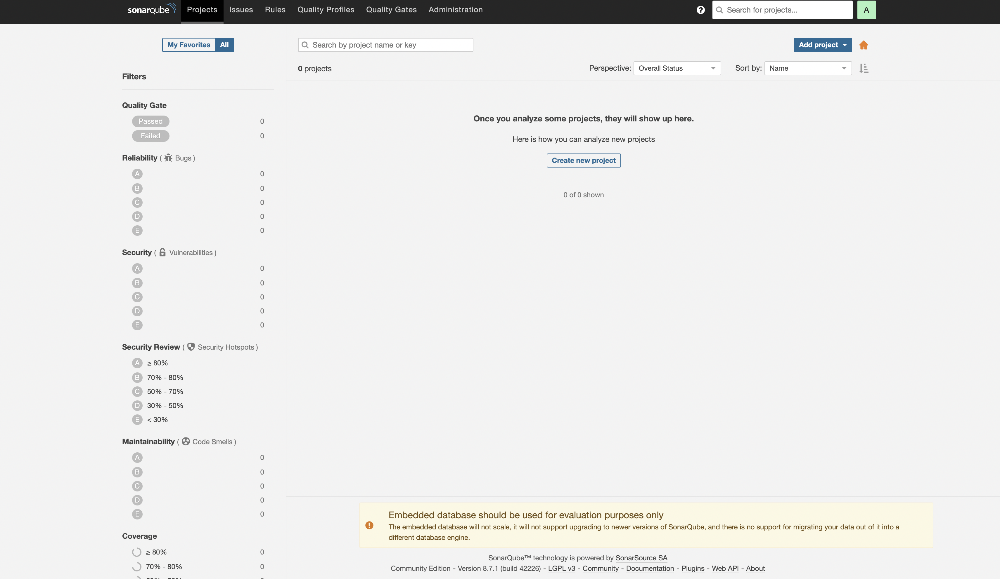
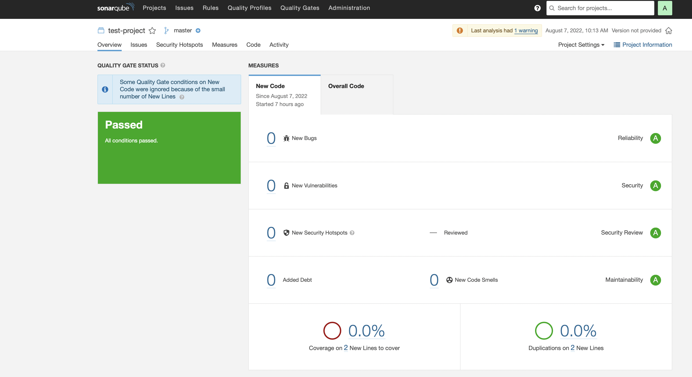
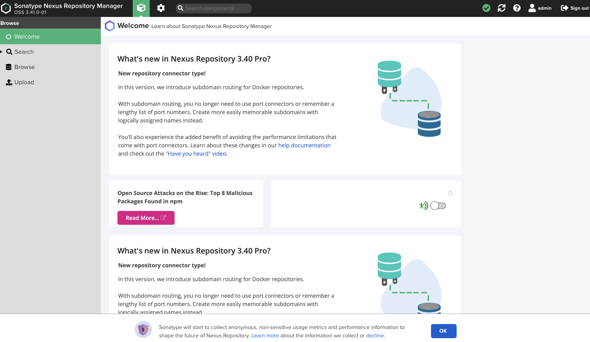
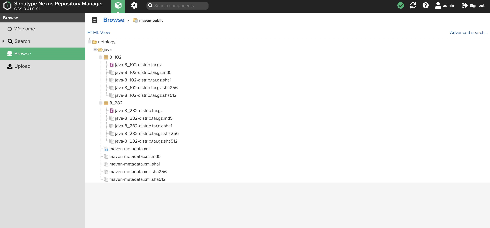

# Домашнее задание к занятию "09.02 CI\CD"

## Знакомоство с SonarQube

### Подготовка к выполнению

1. Выполняем `docker pull sonarqube:8.7-community`
2. Выполняем `docker run -d --name sonarqube -e SONAR_ES_BOOTSTRAP_CHECKS_DISABLE=true -p 9000:9000 sonarqube:8.7-community`
3. Ждём запуск, смотрим логи через `docker logs -f sonarqube`
4. Проверяем готовность сервиса через [браузер](http://localhost:9000)
5. Заходим под admin\admin, меняем пароль на свой

В целом, в [этой статье](https://docs.sonarqube.org/latest/setup/install-server/) описаны все варианты установки, включая и docker, но так как нам он нужен разово, то достаточно того набора действий, который я указал выше.



### Основная часть

1. Создаём новый проект, название произвольное
2. Скачиваем пакет sonar-scanner, который нам предлагает скачать сам sonarqube
3. Делаем так, чтобы binary был доступен через вызов в shell (или меняем переменную PATH или любой другой удобный вам способ)
4. Проверяем `sonar-scanner --version`

 ```bash
addzt@MacBook-Pro-Ivan  ~/PycharmProjects/devops_homeworks/homework_9.2/example   main ±✚  sonar-scanner --version
INFO: Scanner configuration file: /opt/homebrew/Cellar/sonar-scanner/4.7.0.2747/libexec/conf/sonar-scanner.properties
INFO: Project root configuration file: NONE
INFO: SonarScanner 4.7.0.2747
INFO: Java 11.0.16 Homebrew (64-bit)
INFO: Mac OS X 12.4 aarch64
 ```

5. Запускаем анализатор против кода из директории [example](./example) с дополнительным ключом `-Dsonar.coverage.exclusions=fail.py`
6. Смотрим результат в интерфейсе
7. Исправляем ошибки, которые он выявил(включая warnings)
8. Запускаем анализатор повторно - проверяем, что QG пройдены успешно
9. Делаем скриншот успешного прохождения анализа, прикладываем к решению ДЗ



## Знакомство с Nexus

### Подготовка к выполнению

1. Выполняем `docker pull sonatype/nexus3`
2. Выполняем `docker run -d -p 8081:8081 --name nexus sonatype/nexus3`
3. Ждём запуск, смотрим логи через `docker logs -f nexus`
4. Проверяем готовность сервиса через [бразуер](http://localhost:8081)
5. Узнаём пароль от admin через `docker exec -it nexus /bin/bash`
6. Подключаемся под админом, меняем пароль, сохраняем анонимный доступ



### Основная часть

1. В репозиторий `maven-public` загружаем артефакт с GAV параметрами:
   1. groupId: netology
   2. artifactId: java
   3. version: 8_282
   4. classifier: distrib
   5. type: tar.gz
2. В него же загружаем такой же артефакт, но с version: 8_102
3. Проверяем, что все файлы загрузились успешно
4. В ответе присылаем файл `maven-metadata.xml` для этого артефекта



[maven-metadata.xml](mvn/maven-metadata.xml)

### Знакомство с Maven

### Подготовка к выполнению

1. Скачиваем дистрибутив с [maven](https://maven.apache.org/download.cgi)
2. Разархивируем, делаем так, чтобы binary был доступен через вызов в shell (или меняем переменную PATH или любой другой удобный вам способ)
3. Проверяем `mvn --version`

```bash
addzt@MacBook-Pro-Ivan  ~/PycharmProjects/devops_homeworks/homework_9.2/example   main ±✚  mvn --version                  
Apache Maven 3.8.6 (84538c9988a25aec085021c365c560670ad80f63)
Maven home: /opt/homebrew/Cellar/maven/3.8.6/libexec
Java version: 18.0.2, vendor: Homebrew, runtime: /opt/homebrew/Cellar/openjdk/18.0.2/libexec/openjdk.jdk/Contents/Home
Default locale: ru_RU, platform encoding: UTF-8
OS name: "mac os x", version: "12.4", arch: "aarch64", family: "mac"
```

4. Забираем директорию [mvn](./mvn) с pom

### Основная часть

1. Меняем в `pom.xml` блок с зависимостями под наш артефакт из первого пункта задания для Nexus (java с версией 8_282)
2. Запускаем команду `mvn package` в директории с `pom.xml`, ожидаем успешного окончания

```bash
[INFO] Building jar: /Users/addzt/PycharmProjects/devops_homeworks/homework_9.2/mvn/target/simple-app-1.0-SNAPSHOT.jar
[INFO] ------------------------------------------------------------------------
[INFO] BUILD SUCCESS
[INFO] ------------------------------------------------------------------------
[INFO] Total time:  17.679 s
[INFO] Finished at: 2022-08-07T21:19:52+03:00
[INFO] ------------------------------------------------------------------------
```

3. Проверяем директорию `~/.m2/repository/`, находим наш артефакт
4. В ответе присылаем исправленный файл `pom.xml`

[pom.xml](mvn/pom.xml)